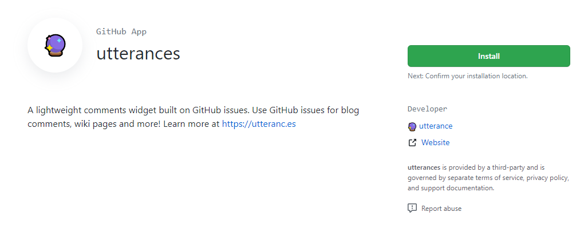
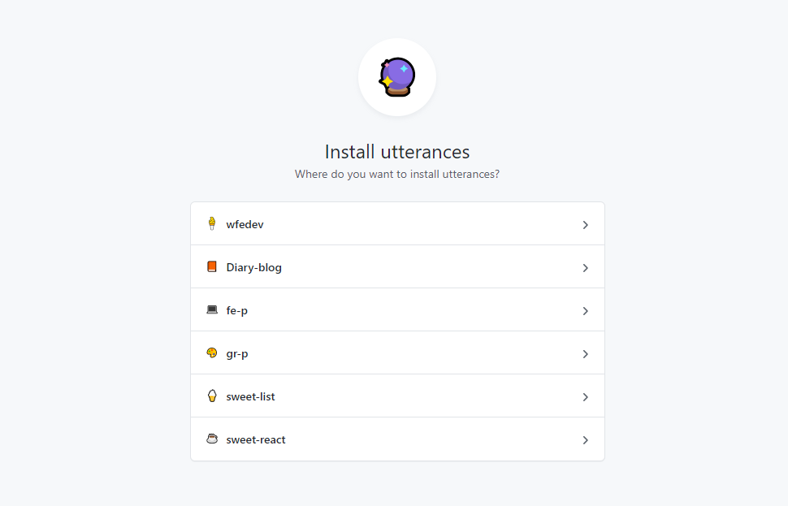
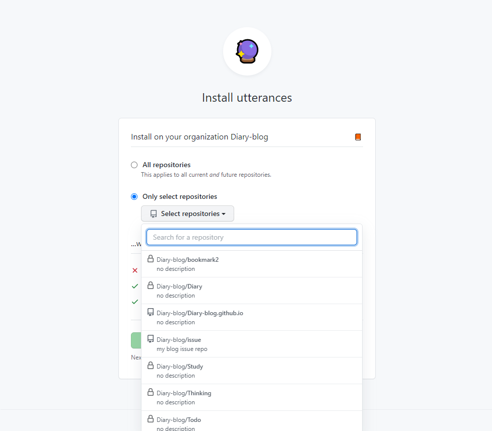
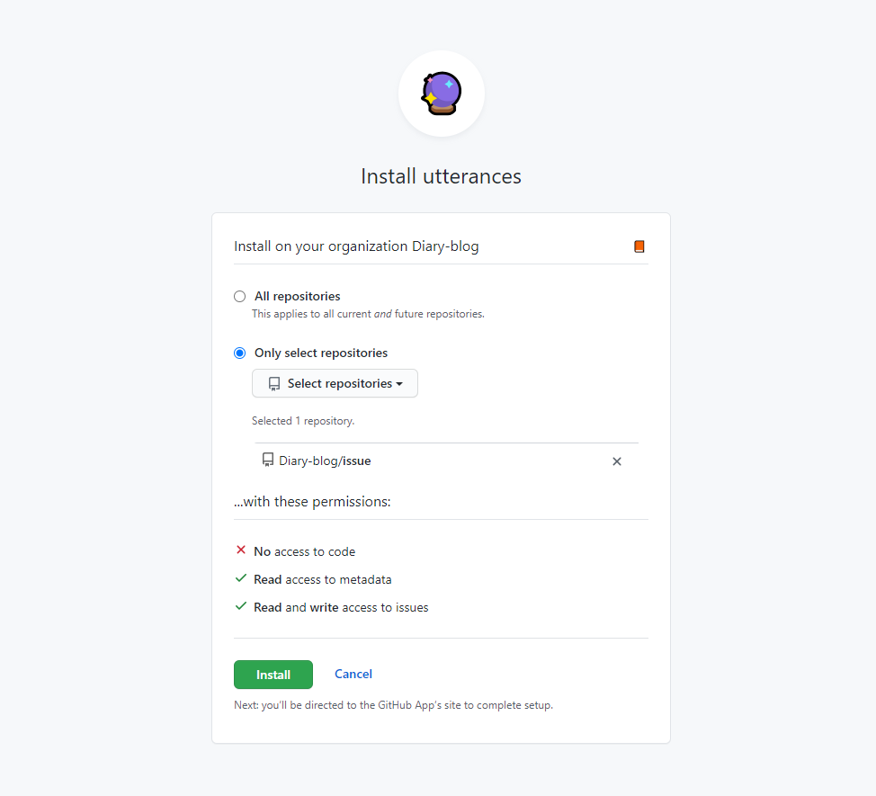
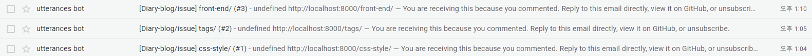

작업 전 참고한 사이트
https://dev.to/creativcoder/how-to-add-comment-support-on-your-gatsby-blog-using-github-utterances-423n

https://github.com/minzoovv/minzoovv.dev/blob/master/src/components/utterances/index.jsx

https://github.com/utterance/utterances/issues/161

https://yangeok.github.io/blog/2019/01/16/jekyll-utterances.html

### 1. 
https://utteranc.es/

https://utteranc.es/#configuration

### 2.
Diary-blog/issue


1. utteranc app 설치
https://github.com/apps/utterances



2. 사용할 조직 선택


3. issue로 사용 할 repo를 지정


4. 선택 후 install


5. 사용할 repo 에 json 추가

`utterances.json`
```HTML
{
  "origins": ["https://diary-blog.github.io/"]
}
```

★ gmail로 issue가 달리면 메일 알림이 옴



