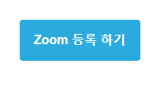
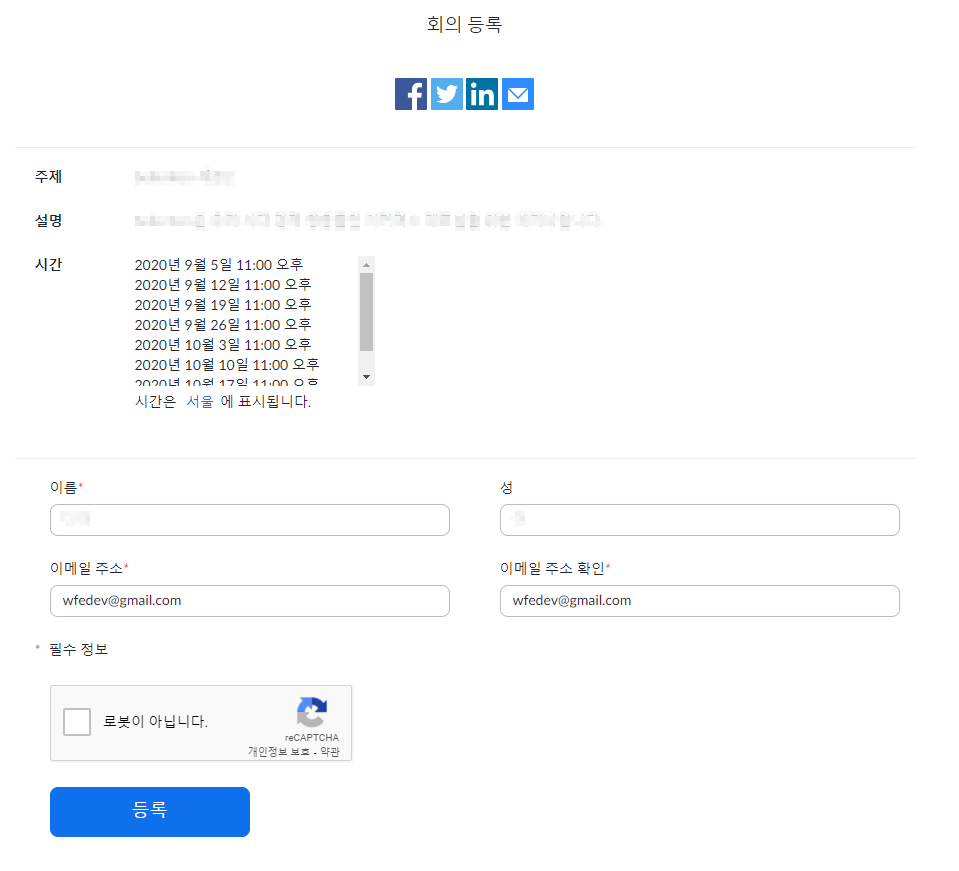
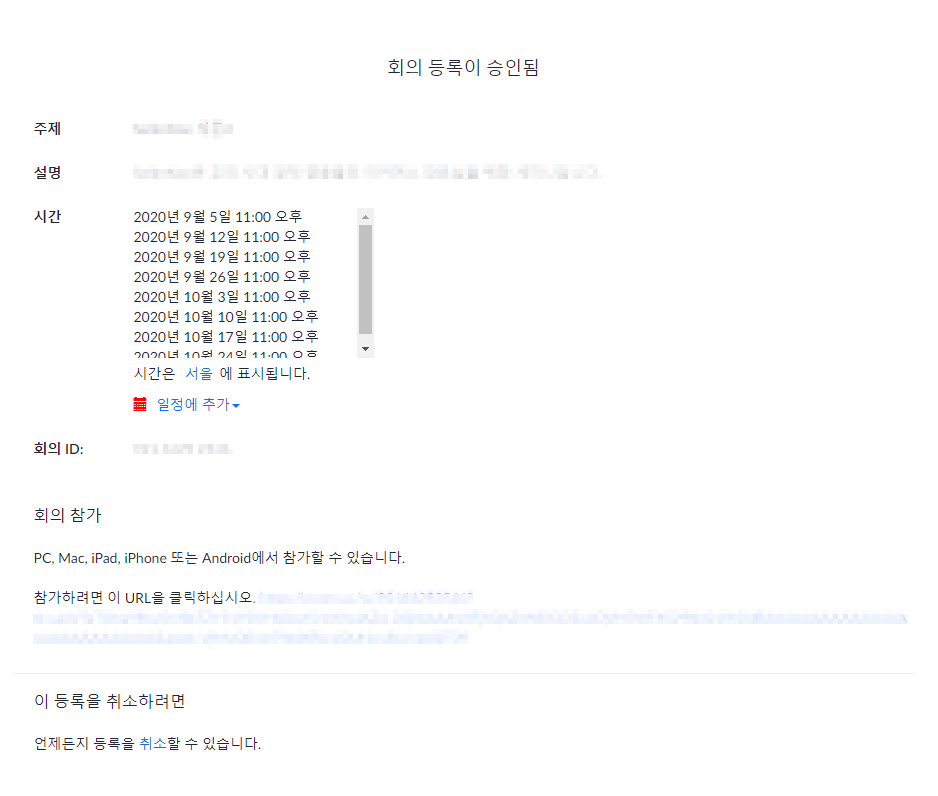
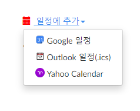
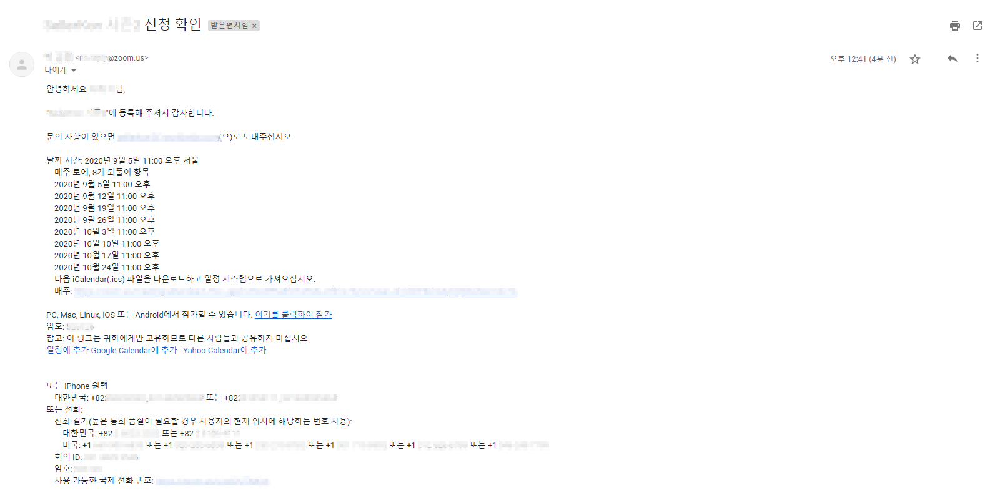
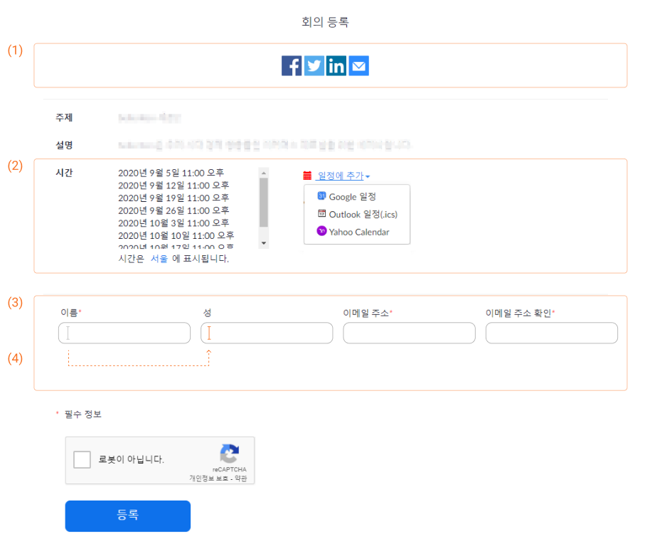

## Zoom 일정 등록

개인이 컨퍼런스 및 미팅을 메일로 안내 받고 신청한뒤 구글 일정에 등록하는 과정

<hr/>

### step 1
메일로 컨퍼런스 및 미팅 일정을 안내받고, 등록 가능한 **Zoom 버튼** 클릭  

`사용자 행동`  
```
1. click : Zoom 등록하기
```




<hr/>

### step 2
등록하기 버튼을 클릭하면 등록 새창으로 이동  

`사용자 행동`  
```
1. input : 이름, 성, 이메일, 이메일 확인
2. click : 등록
```
`안내 문구`
```
1. step 1 : 회의 등록
2. social : 페이스북, 트위터, 인크루트, 메일
3. 주제 : 컨퍼런스(or 미팅) 제목
4. 설명 : 컨퍼런스(or 미팅) 설명
5. 시간 : 컨퍼런스(or 미팅) 시간
6. 버튼 : 등록 버튼
```


<hr/>

### step 3
등록 완료된 다음 페이지 및  
일정에 추가 가능한 플랫폼  

`사용자 행동`  
```
1. click : 일정에 추가
2. click : 등록할 일정 클릭
```

`안내 문구`
```
1. step 2 : 회의 등록이 승인됨
2. 주제 : 컨퍼런스(or 미팅) 제목
3. 설명 : 컨퍼런스(or 미팅) 설명
4. 시간 : 컨퍼런스(or 미팅) 시간
5. 일정 추가
6. 회의 ID
7. 회의 참가 url
8. 등록 취소
```





<hr/>

### check
등록한 일정이 메일로 도착  

`안내 문구`
```
1. 인사말 (이름, 문의 메일 안내)
2. 시간
3. 회의 참가 URL
4. 연락처
```



<hr/>


## 느낀 점

**느낀 점은 최대한 간결하게 작성하려 합니다.**

### 1. UI
처음 안내받은 **메일**에는 **메일 형식로된 컨퍼런스 소개 페이지**가 디자인이 되어 있었고,  
zoom **등록하는 페이지**로 이동했을시 **기본 테이블 형식**으로만 안내가 되어있었습니다.

### 2. UX
사용자 행동 흐름은 전체 **step이 3가지**가 되고,  
페이지 안에 **입력**하고 **클릭**하는 횟수가 **3회** 이상을 넘지 않았습니다.

### 3. 개선 인사이트

**(1) social :**  
등록하는 과정 step2에 social 이 상단에 배치해있었지만  
step2는 input을 입력하는 페이지라서 step3에 **등록을 완료**하고 **공유하는 버튼**을 두면  
**등록하고 바로 공유하는 흐름**으로 이어지지 않았을까  

**(2) 일정 등록 :**  
등록 버튼을 클릭하기 이전에 추가할 일정 플랫폼을 **미리 정할 수** 있다면  
**클릭 횟수를 한 번 더 줄이고** step 2에서 마무리되지 않았을까  

**(3) width 조절 :**  
**이름과 성, 이메일**을 작성하는 input의 width가 많이 넓어서 조금 줄이고 **UI를 한 줄**로 만들고,  

**(4) focus out :**  
**입력시**에 커서 **포커스 아웃으로** (깜빡임 자동 넘김) 설정되어 있었으면 좋지 않았을까

**(5) 안내 문구 :**  
안내 **문구 타이포의 간격**이 매우 정돈되어 보이지 않아서  
간단한 안내라도 **간격에 맞게 UI를 배치**하면 한번에 보기에 좋지 않았을까

<hr/>

사용자가 Zoom으로 메일 초대 받고  
컨퍼런스 등록하는 UX를 간단히 살펴보았습니다.  

등록하는 흐름은 step을 많이 필요로 하지 않아서  
**3회 이상을 넘지 않았던 점이 좋았지만**  
간단한 step 이라도 몇 가지 아쉬운 점들이 개선된다면  

사용자가 등록하면서 일정 안내도 각인되고  
간편한 등록 과정이라도 신경써서 만들었구나 라는 생각이 들지 않았을까 합니다.


*(zoom에서 초대 메일을 보내는 과정은 추가하지 않았습니다.)*

