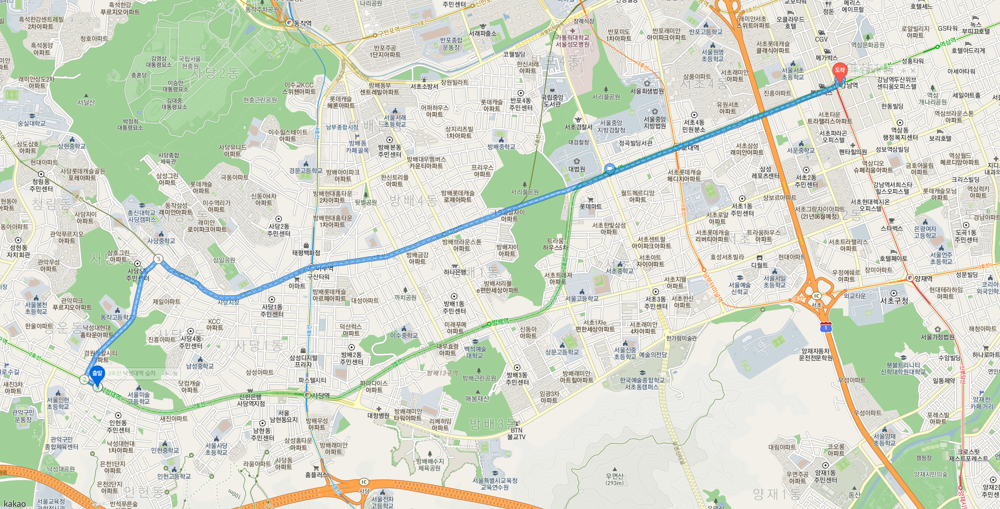
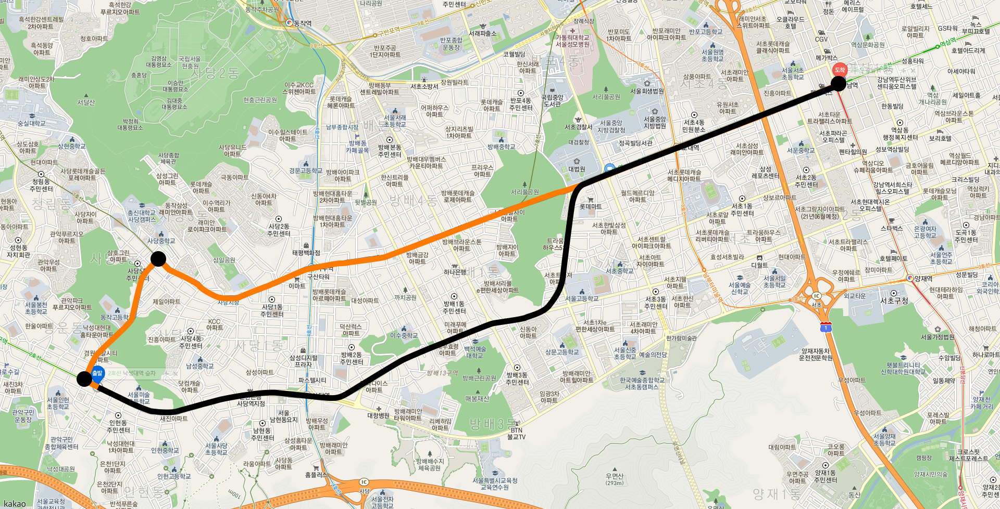
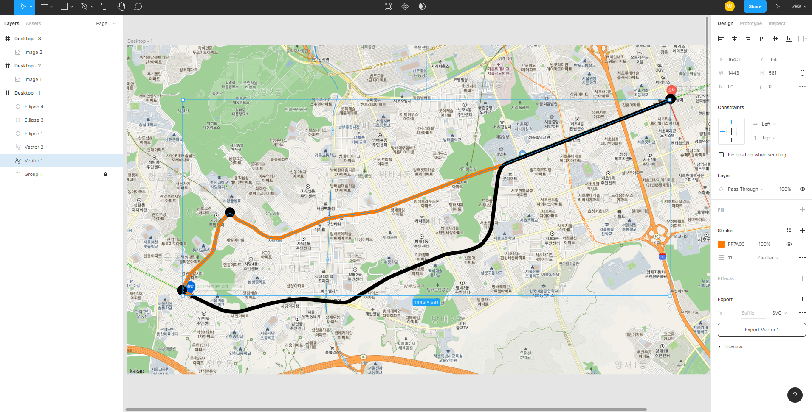
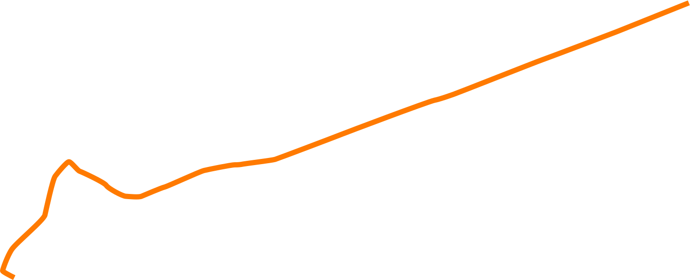

## intro 
### Experience from taobao

한국 쇼핑몰에서 택배를 주문하면 배송현황이 전부 텍스트로만 나와있어서  
택배의 버뮤다 삼각지대라고 불리는 옥천hub에 한번 들어가면  
언제 빠져나오는지 알 수 없는 경험을 하곤 했었죠.

중국에서 해외직구가 바로 가능한 알리익스프레스에서 주문하면 한국과 동일하게  
배송현황이 텍스트로 안내되어있어서  
배송시스템은 국내와 해외 전부 텍스트로만 안내하는구나 라고 생각했었는데

한국에 직접적인 배송을 안하는 중국 쇼핑몰인 <u>**타오바오**</u>를 이용해보니  
택배 상하차 뿐만 아니라 위치추적 등  
내 제품이 **현재 어느곳에 있는지** 맵으로 <u>**경로와 위치를 표기**</u>해서 보여주는 것을 보고

중국은 토지도 엄청 넓고 택배 물량도 어마어마할텐데  
<u>배송시스템 관리 하나는 정말 잘되어있구나</u> 라는 생각이 들었습니다.  

**단순히 배송현황을 텍스트로만 보여주는것보다 직접 맵기반으로된 경로를 보여주니**  
내 제품이 현재 어느곳에 위치해있고, 언제쯤이면 도착하겠구나 라는  
소비자의 궁금증을 바로 해소시켜줘서  
쇼핑몰 CS 문의가 줄어들거라는 생각이 들었습니다.

<hr/>

한국에도 맵기반 서비스인 **네비게이션**만 보더라도  
**맵기반**으로 **경로를 표기** 할 수 있도록 적용 **가능한 기술**이 있고

위치추적 할 수 있도록 물류시스템도 잘 갖춰져 있을텐데  
개인정보때문에 일반인에게는 공개를 못하는 것일수도 있다는 생각이 듭니다.

사실 얼마 전에 보았던 택배파업 내용중에 **택배분류를 배송기사가 직접 하는것**을 보고  
물류시스템이 안정화가 되려면 아직 시간이 더 필요하겠구나 라는 생각이 들었습니다.

<hr/>

### Delivery route

타오바오에서 택배를 하나 주문했을 뿐인데  
택배차의 경로를 표기해주는 서비스가 매우 인상깊게 남았습니다.

그래서 타오바오에서 직접 제품을 구매하여 경험했던 **택배차 경로**를  
**한번 표시해보자** 라고 생각하여, 직접 구현해보고 싶다는 생각에  
몇가지 라이브러리 들을 찾아보게 되었습니다.

<hr/>

### Scroll library

이전에는  
jquery에 [<u>**skrollr.js**</u>](https://github.com/Prinzhorn/skrollr) 라는 라이브러리를 사용하여  
[<u>**Parallax scrolling**</u>](http://prinzhorn.github.io/skrollr/) 을 구현하는 홈페이지를 많이 보았습니다.

GSAP에서 plugin에 있는 [<u>**scrollTrigger**</u>](https://greensock.com/scrolltrigger/) 를 사용하여 [<u>**구현한 예제**</u>](https://codepen.io/creativeocean/pen/zYrPrgd)를 보고  

제가 경험했던 맵기반 위치 추적 서비스는 아니지만  
단순히 스크롤만으로도 이렇게 경로를 보여주는것이 가능하구나 라는 생각에  
path drawing 으로 작업해보기로 했습니다.

먼저 여러 예제를 살펴보려 관련 자료를 찾아보았습니다.

<details><summary> └  📝 </summary>

[triangle](https://www.w3schools.com/howto/tryit.asp?filename=tryhow_js_svg_scrolldrawing)  
[flower](https://codepen.io/chriscoyier/full/YXgWam/)  
[mouse over](http://phrogz.net/svg/progressively-drawing-svg-path.html) / [(stackoverflow)](https://stackoverflow.com/questions/14275249/how-can-i-animate-a-progressive-drawing-of-svg-path/14282391#14282391)  
[line animation](https://codepen.io/AliKlein/pen/XERJNE)  
[gasp scroll magic](https://scrollmagic.io/examples/advanced/svg_drawing.html)
[Animate path on scroll](https://codepen.io/GreenSock/pen/rNOBLBV)

</details>

<hr/>

## Animate path on scroll

몇가지 스크롤 관련 라이브러리들을 한번 살펴보니  
공통점은 전부 스크롤을 하면서 인터랙션이 적용되어 있고  
차이점은  
1. 스크롤을 내리면서 애니메이션으로 svg 라인이 **그려지는 것**
2. 스크롤을 내리면서 svg 라인을 **그리는 것**

제가 작업하고자 하는 path drawing은  
2번 스크롤을 내리면서 svg 라인을 **그리는 것**과 일치하므로  
해당 예제인 [<u>**Animate path on scroll**</u>](https://codepen.io/GreenSock/pen/rNOBLBV) 을 참고하여 작업하기로 결정하였습니다.

<hr/>

### 무엇을 먼저 해야할까

svg 라인을 그리려면 먼저 svg가 필요하니 svg를 그렸습니다.

먼저 경로를 표기하고자 하는 map을 캡쳐하여 png로 저장하고  
Adobe illustrator, Adobe XD, Figma, Sketch 등 vector(벡터) 기반인 디자인 툴을 사용하여  
SVG를 그려서 저장하였습니다.

### map & svg

map의 축적은 1:250으로  
출발지 낙성대역에서 도착지 강남역으로 이동하는 경로를 표시하려 합니다.

먼저 카카오맵에서 검색하여 나온 경로는  
1. 초록색 : 대중교통 2호선 이용
2. 파란색 : 자동차 최단거리



<hr/>

저는 이렇게 주황색과 검정색으로 경로와 좌/우회전 포인트를 표시하려 합니다.



figma에서 vector line 하나를 선택하고 svg로 export를 해줍니다.



export한 svg 입니다.



```HTML
<svg width="1451" height="592" viewBox="0 0 1451 592" fill="none" xmlns="http://www.w3.org/2000/svg">
<path d="M30 587C21.8333 583 5.5 574.5 5.5 572.5C5.5 570 15.5 541 25 527C34.5 513 92 465.5 94.5 454.5C97 443.5 110.5 380 116 372.5C121.5 365 140.5 342 145 342C149.5 342 163 360.5 167.5 362C172 363.5 219.5 385.5 223.5 392C227.5 398.5 257 414.5 264.5 415C272 415.5 291.5 417.5 297.5 415C303.5 412.5 339.5 397 346 395.5C352.5 394 419 363 429 360.5C439 358 486.5 348.5 493.5 348.5C500.5 348.5 506 348 510.5 347C515 346 572 339 578.5 337C585 335 711 287 719.5 283.5C728 280 899.5 215 913.5 212C927.5 209 946 202 953.5 199.5C961 197 1127 131 1140 126.5C1153 122 1289.5 70 1297 67C1303 64.6 1400.5 25.3333 1448.5 6" stroke="#FF7A00" stroke-width="11"/>
</svg>
```
