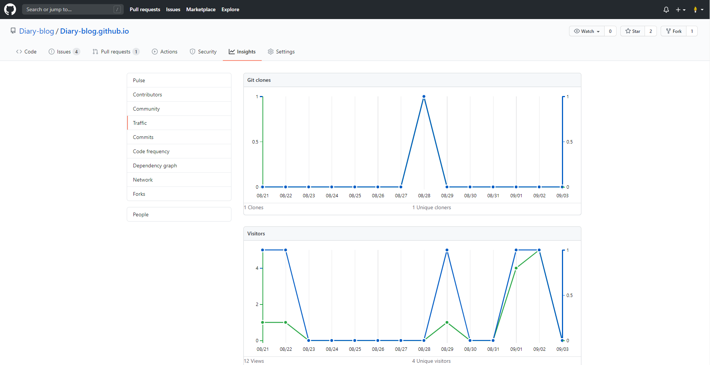
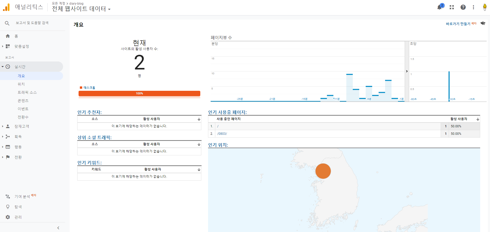

## Github repository traffic
Github page로 Gatsby blog를 배포하고  
깃헙 repo에서 traffic(clone, views, visitor)을 주 단위로 볼 수 있었습니다.  
이 블로그에 수집한 url 외에 포스팅을 계속 추가 할 예정이라서 GA를 추가하려 합니다.



<br/>

## gatsby-plugin-google-analytics

깃헙 페이지로 배포한 Gatsby blog에 GA(google analytics)를 추가하려면  
gatsby에서 제공하는 [**<u>gatsby-plugin-google-analytics</u>**](https://www.gatsbyjs.com/plugins/gatsby-plugin-google-analytics/) 를 install해서 plugin에 추가해서 설정하시면 됩니다.

**이 블로그에는 `gatsby-config.js` 외에**  
**module.exports plugin이 `config.js`에 *Optional*로 정리되어 있습니다.**

<br/>

## 1. GoogleAnalytics
[**<u>GA</u>**](https://analytics.google.com/)에 가입을 진행하면서 추가한 사이트에  
해당하는 [**<u>트래킹 id</u>**](https://support.google.com/analytics/answer/7372977)를 *Optional*에 입력해서 deploy하면
## 2. 활성화
바로 활성화 상태가 되는것을 볼 수 있습니다.



<br/>

## 3. 이 블로그에 GA가 설치되어있는 경로

*`package.json`*  
```
@gatsby-plugin-google-analytics
```

*`gatsby-config.js`*
```HTML
  {
    resolve: `gatsby-plugin-google-analytics`,
    options: {
      trackingId: googleAnalytics,
    },
  },
```

*`package-lock.json`*
```HTML
  "gatsby-plugin-google-analytics": {
    "version": "2.1.31",
    "resolved": "https://registry.npmjs.org/gatsby-plugin-google-analytics/-/gatsby-plugin-google-analytics-2.1.31.tgz",
    "integrity": "sha512-vwx2eB703Yatp1ZQ0lQDiAG3k9gyvDEENRmtp+myfadI8Sgtq+LA+3OYGLeT0MYdifUTW0Lhcp3qoIrng/41zg==",
    "requires": {
      "@babel/runtime": "^7.7.6"
    }
  },
```

*`config.js`*
```
  googleAnalytics: 'GA 트래킹 아이디'
```

<br/>
<br/>

## GA는 왜 추가하게 되었을까

처음에 블로그를 구축하고 아무것도 없는 상태로 배포할 때  
commit, push & deploy 하면서 [**<u>github traffic</u>**](https://github.com/Diary-blog/Diary-blog.github.io/graphs/traffic)에 **트래픽 그래프**를 볼 수 있었습니다.  

첫 배포 하고 관리한지 2주 정도 지났을 때,  
**Git clones**에 **clone과 unique cloner** 숫자가 몇백 이상으로 상승하는 것을 보고  
아무것도 없는 repo를 왜 클론하는 걸까 라는 의문이 생겨서 한두 달 정도를 살펴보았습니다.  

이 블로그를 다른 곳에 홍보한 것이 아니기에  
평소에 아무것도 하지 않았을 때에는 traffic이 증가하지 않는데  

commit을 자주 하는 날이나 push와 deploy를 몇 번 하는 날에는  
**배포 횟수가 traffic에 반영**이 되는 것 같았습니다.

그래프에 보여지는 숫자와 배포한 숫자가 동일하지는 않고  
항상 그래프 숫자가 더 많아서 매번 정확하게 측정하지는 못했습니다.  

정확하지 않은 트래픽 때문에 Google Analytics를 붙이기로 했습니다.  
clone 횟수는 GA에 반영되지 않겠지만  
tech 포스팅을 조금씩 작성하기로 해서 post를 관리하려 GA를 추가하였습니다.


