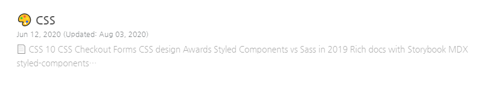
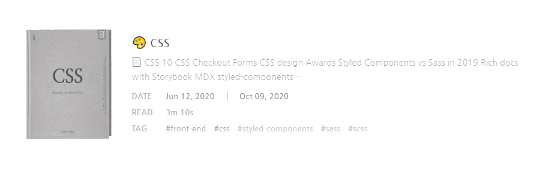

Diary-blog에  
Post list가 텍스트로만 되어있었고  
썸네일도 추가할 생각이 없었는데..  

도서 구매 사이트를 둘러보다가 문득..  
내 블로그 포스트 정보도 `서적 정보 안내 디자인`로 변경하면 좋을 것 같다는 생각에  
바로 적용해보았습니다.

## Before / after

### before

### after

## 변경 전 / 후 디자인

### 변경 전

### 변경 후

## Code 추가 및 수정

### components /pages  
index.tsx와 search.tsx 그리고 tags에  
read와 cover를 Graphql에 추가하여 포스팅을 새로 추가하면 읽어올 수 있습니다.

### components /PostList
index.tsx에서 사용하지 않아서 주석으로 해두었던 tag 영역을 활성화시키고,  
frontmatter에서 해당하는 tags, cover, read를 읽어온뒤  
mapPost에 넣어서 리스트가 추가될 때 map으로 반복해서 리스트가 출력됩니다.  

기존에 없던 썸네일을 추가하였기 때문에 이미지가 없을 시에 보여질 임시 thumnail을  
'이미지 제작중'으로 표시하여 빈 썸네일도 반복 출력해주었습니다.  
read를 새로 추가하였는데, 시간 기준을 잡기가 애매해서  
본문을 작성하면서 직접 몇 분 정도 걸리는지 측정하여 작성할 생각입니다.

마크업 구조를 새로운 디자인에 맞게 변경 후 해당 클래스에 scss를 수정하였습니다.

### 변경 후 인사이트

Gatsby blog를 커스텀해서 사용하는 개발자분들이 많이 계신데  
서적 정보 안내 같은 리스트는 못본거 같아서 바로 작업해보았습니다.

Markup 구조 수정하고, scss 수정하는 것보다  
썸네일에 사용될 book cover 디자인을 어떤식으로 작업할지 정하는게 오래걸렸습니다.

perspective view로 작업하면 사용자가 리스트를 내려서 보는데 시선이 자연스럽지 않아서  
정적인 front view로 cover를 디자인 하였습니다. 

링크 모음 페이지는 여러겹 쌓여있는 책이나, 한권 책 으로 표현할 예정이고,  
개별 포스팅은 Poster design 으로 디자인 할 예정입니다.

썸네일은 Post list 에만 나타나게 설정해서 post 안에는 추가하지 않았습니다.  
썸네일 size는 SEO를 고려하여 정사각형 비율로 작업할지 고민해보았는데  
Book에 맞게 height를 길게 작업해본뒤, 어떤식으로 검색에 이미지가 노출되는지  
체크해본 다음 이미지 비율을 나중에 수정하려 합니다.

개발자가 개인블로그를 운영하기 시작하면  
css 수정하는데 많은 시간이 들어간다는 글을 종종 봐왔습니다.  
css 수정하는것도 재밌고, 포스팅을 정성들여 작성하는것도 재밌는것 같습니다.  
블로그만 꾸미는데 집중하지 않고, 배움으로 얻은 지식을 작성해보려 합니다.  
포스팅하기 전에 조금 예쁘게 셋팅해두면 블로그에 정이 생기는것 같습니다.

### 깃헙 블로그를 운영하면서 제일 좋은점은
클립보드 캡쳐 이미지를 vscode에 직접 넣거나 깃헙 이슈에 넣어서  
이미지 호스팅을 따로 사용하지 않아도 되는 점이 제일 좋은 점 같습니다.  
이건 정말 최고 장점 입니다!! 

