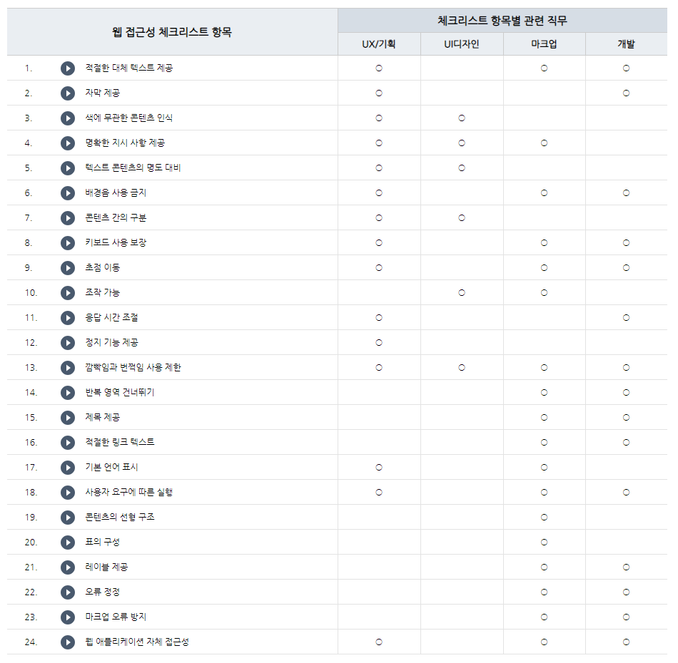
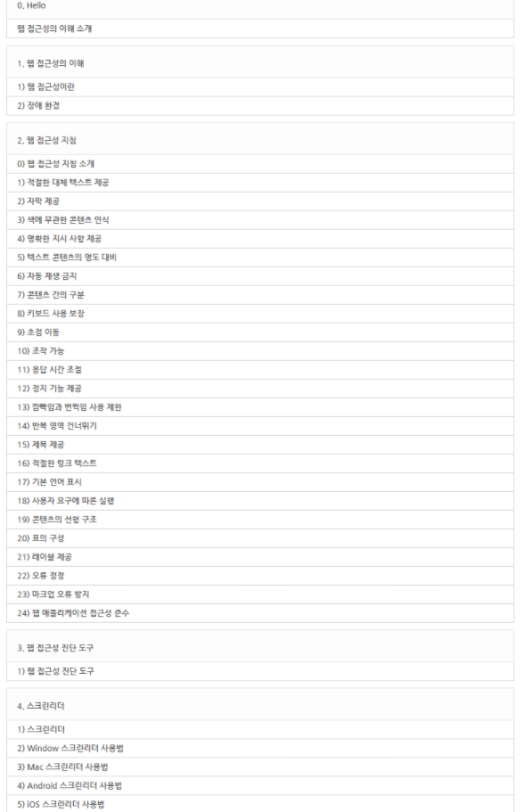

## 웹 표준 (web-standards)
- 목적 : 웹의 사용성 및 접근성 보장
- 준수 내용 : HTML, CSS 를 W3C규격 준수 (HTML, CSS, JS의 구조와 표현, 동작 분리 권고)

### [나무위키 웹표준 내용](https://namu.wiki/w/%EC%9B%B9%20%ED%91%9C%EC%A4%80)

### 웹 표준 문법 검사 (W3C Markup Validation)
- HTML5의 경우 (https://validator.w3.org/nu/)
- HTML5이외의 경우 (http://validator.w3.org/)
- W3C CSS Validation (http://jigsaw.w3.org/css-validator)
- 사용중인 브라우저가 웹 표준을 얼만큼 준수하는지 : (http://html5test.com)

## 웹 호환성 (cross-browsing)
- 목적 : 웹브라우저 버전, 종류와 관계없는 웹사이트 접근
- 준수 내용 : 웹 표준 준수를 통한 브라우저 호환성 확보 (HTML, CSS문법 준수, 동작, 레이아웃, 플러그인 호환성)

## 웹 접근성 (web-accessibility)
- 목적 : 인적, 환경적 요인에 제약없는 웹 정보 접근
- 준수 내용 : W3C 웹 접근성 이니셔티브(WAI) 한국형 웹 콘텐츠 접근성 지침2.0 (인식의 용이성, 운용의 용이성, 이해의 용이성, 견고성)

### [NULI 직군별 체크리스트](https://nuli.navercorp.com/education)

### [Edwith 웹 접근성 이해](https://www.edwith.org/web-accessibility/joinLectures/23540)

## 참고자료

- [행정기관 및 공공기관 정보시스템 구축․ 운영 지침(행정안전부고시 제1호)]()
- [전자정부서비스 호환성 준수지침(행정안전부고시 제2017-26호,2017.12.29)]()
- [전자정부 웹 호환성 준수지침(행정안전부고시 제2009-185호)]()
- [홈페이지 SW(웹)개발보안 가이드 (행정안전부, 한국인터넷진흥원 2012.11)]()
- [웹 응용프로그램 개발보안 가이드 (행정안전부 정부통합전산센터 2014.1)]()
- [한국형 웹 콘텐츠 접근성 지침(KWCAG 2.1)(한국정보통신기술협회)]()
- [웹 접근성 향상을 위한 국가표준기술가이드라인(한국정보화진흥원 2009.3.17.)](https://www.korea.kr/common/download.do?tblKey=EDN&fileId=195214)
- [웹 접근성 품질인증 심사가이드V1.2(한국정보화진흥원 2012.6.13.)]()
- [홈페이지 개인정보 노출방지 가이드라인(한국인터넷진흥원)]()
- [행정안전부 개인정보보호 지침(행정안전부 훈령 제19호, 2017.12.12.)]()
- [모바일 전자정부 사용자 인터페이스 설계 지침(행정안전부고시제2014-6호.2014.1.21.)]()
- [모바일 전자정부 서비스 관리 지침(행정안전부 예규 제49호, 2018.11.15.)]()
- [행정업무 모바일서비스 구축 가이드라인(행정안전부, 2013.8.13)]()
- [대국민 모바일서비스 구축 가이드라인(행정안전부, 2011.9.6)]()
- [공공기관의 데이터베이스 품질관리 지침(행정안전부 고지 제2015-26호, 2015.7.15.)]()
- [국가 정보보안 기본지침(국가정보원)]()
- [홈페이지 취약점 진단・제거 가이드(한국인터넷진흥원, 2013.12)]()
- [공유서비스(OpenAPI) 개발 가이드라인(행정안전부 2011.11)]()
- [공유서비스(OpenAPI) 기술표준 적용 가이드라인(행정안전부 2011.11)]()
- [소프트웨어 개발보안(시큐어 코딩) 가이드(행정안전부 2017.12.5)]()
- [행정‧공공기관 웹사이트 구축‧운영 가이드 (행정안전부 2017.10)]()
- [홈페이지 운영자를 위한 저작권 해설 (문화체육관광부)]()
- [2014년 홈페이지 개인정보 노출방지 가이드 라인 (행정안전부 2014.12)]()
- [공공기관의 데이터베이스 표준화 지침(행정안전부 2019.3.20.)]()
- [공공데이터 관리지침 (행정자치부고시 제2016-42호)]()

