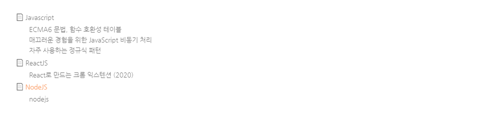

안녕하세요!  

이곳은 취미로 수집한 url을 저장하는 개인 블로그 입니다.  

몇가지 기능을 앞으로 계속 추가 할 예정 입니다.

방문해주셔서 감사합니다.

### 1. 읽었던 링크와 읽기 전 링크를 컬러로 구분

2. 링크를 클릭하지 않았을 때  

https://diary-blog.github.io/

3. 링크를 한번 클릭 했을 때  

https://diary-blog.github.io/

4. 우측에 작은 텍스트(toc)도 링크를 클릭했을때와 클릭하지 않았을때 컬러로 구분 가능합니다.

### 2. 주제에 해당하는 링크 설명 및 예제

1. 주제 밑에있는 이모지 해석  
제목 : 📄  / 메모 : 📝  / 링크 : 🔗  

2. 제목을 클릭하여 새창으로 바로 이동할 수 있습니다.  
[diary-blog 입니다](https://diary-blog.github.io)

3. 메모 를 클릭하여 요약정리를 볼 수 있습니다.  

 └ 📝 
  
- Gatsbyjs로 만들고 Github page로 배포한 개인 블로그 입니다.   

4. 링크 를 클릭하여 관련 링크를 볼 수 있습니다.  

 └ 🔗 

- [개인 블로그](https://diary-blog.github.io)

### 3. 기타 기능

1. 포스팅 내부 목차 및 이동
2. 다크모드, 필터, 검색, RSS, TOP, 공유하기(페이스북, 트위터)

