피그마, 일러스트, 포토샵에서 저장한 png와 jpg는  
base64 인코딩과 디코딩에서 파일사이즈가 미묘한 차이가 있습니다.

어떤 차이가 있는지 자세히 알아보겠습니다.

```
1. 처리
- 벡터기반 : 피그마(Figma), 일러스트(illustrator)
- 픽셀기반 : 포토샵(photoshop)

2. 용도
- UI툴 : 피그마(Figma)
- 그래픽툴 : 일러스트(illustrator), 포토샵(photoshop)
```

## Icon을 svg로 준비

이 글에서 테스트해볼 picture icon 입니다.  
피그마(Figma)에서 아이콘을 export하여 이미지를 준비하였습니다.
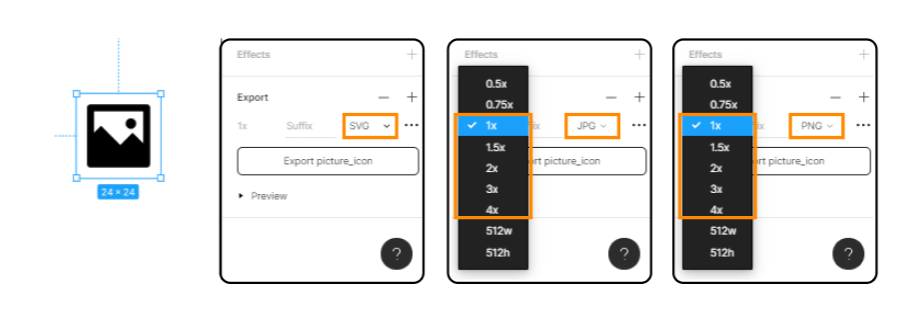

export 할 때  
svg는 벡터파일이라서 배수를 선택하는 항목은 없고,  
png, jpg는 1x 로 원본 사이즈 그대로인 24x24로 테스트 해보려 합니다.
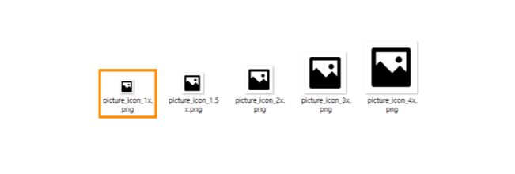

> 테스트 시작 전에 배수를 선택한 이유는  
> 이미지 사이즈에 따라 파일 사이즈가 달라지기 때문입니다.

<hr/>

### 1. 피그마에서 svg, png, jpg 저장

<u>피그마(Figma)</u>에서 SVG를 바로 export하면 아래 코드와 같이 나옵니다.
```html
<svg width="24" height="24" viewBox="0 0 24 24" fill="none" xmlns="http://www.w3.org/2000/svg">
  <path d="M5 11.1L7 9.1L12.5 14.6L16 11.1L19 14.1V5H5V11.1ZM4 3H20C20.2652 3 20.5196 3.10536 20.7071 3.29289C20.8946 3.48043 21 3.73478 21 4V20C21 20.2652 20.8946 20.5196 20.7071 20.7071C20.5196 20.8946 20.2652 21 20 21H4C3.73478 21 3.48043 20.8946 3.29289 20.7071C3.10536 20.5196 3 20.2652 3 20V4C3 3.73478 3.10536 3.48043 3.29289 3.29289C3.48043 3.10536 3.73478 3 4 3V3ZM15.5 10C15.1022 10 14.7206 9.84196 14.4393 9.56066C14.158 9.27936 14 8.89782 14 8.5C14 8.10218 14.158 7.72064 14.4393 7.43934C14.7206 7.15804 15.1022 7 15.5 7C15.8978 7 16.2794 7.15804 16.5607 7.43934C16.842 7.72064 17 8.10218 17 8.5C17 8.89782 16.842 9.27936 16.5607 9.56066C16.2794 9.84196 15.8978 10 15.5 10V10Z" fill="black"/>
</svg>
```

> svg, png, jpg로 저장한 이미지 사이즈가 작아서 자세히 비교하기 위해 확대해서 비교하겠습니다.  

원본인 SVG에서는 모서리가 둥글었는데, png와 jpg로 저장하면 모서리 라운드 처리가 안된것을 볼 수 있습니다.
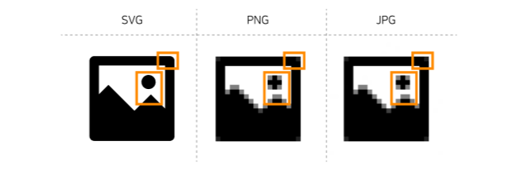

피그마에서 바로 저장한 png를 인코딩하면
```
iVBORw0KGgoAAAANSUhEUgAAABgAAAAYCAYAAADgdz34AAAACXBIWXMAAAsTAAALEwEAmpwYAAAAAXNSR0IArs4c6QAAAARnQU1BAACxjwv8YQUAAACESURBVHgB7ZSLCYAwDERPcfDbzFHsJlURS0n/xoJgHwSFXHPpFxg0sh1hlbH5BSdhYPEOru5SEjQSNDijMxoD4uqYOVFqD2qWyEbqBONzMyDy3VF8q7iPGsV/6/iiQAYTeorcY4OYCSM5lYFfiImc2uCMtULj6P5UfPom/9TAQI/BoIUdD91bjFg0XxMAAAAASUVORK5CYII=
```

피그마에서 바로 저장한 jpg를 인코딩하면
```
/9j/4AAQSkZJRgABAgEASABIAAD/2wBDAAEBAQEBAQEBAQEBAQEBAQEBAQEBAQEBAQEBAQEBAQEBAQEBAQEBAQEBAQEBAQEBAQEBAQEBAQEBAQEBAQEBAQH/2wBDAQEBAQEBAQEBAQEBAQEBAQEBAQEBAQEBAQEBAQEBAQEBAQEBAQEBAQEBAQEBAQEBAQEBAQEBAQEBAQEBAQEBAQH/wAARCAAYABgDAREAAhEBAxEB/8QAHwAAAQUBAQEBAQEAAAAAAAAAAAECAwQFBgcICQoL/8QAtRAAAgEDAwIEAwUFBAQAAAF9AQIDAAQRBRIhMUEGE1FhByJxFDKBkaEII0KxwRVS0fAkM2JyggkKFhcYGRolJicoKSo0NTY3ODk6Q0RFRkdISUpTVFVWV1hZWmNkZWZnaGlqc3R1dnd4eXqDhIWGh4iJipKTlJWWl5iZmqKjpKWmp6ipqrKztLW2t7i5usLDxMXGx8jJytLT1NXW19jZ2uHi4+Tl5ufo6erx8vP09fb3+Pn6/8QAHwEAAwEBAQEBAQEBAQAAAAAAAAECAwQFBgcICQoL/8QAtREAAgECBAQDBAcFBAQAAQJ3AAECAxEEBSExBhJBUQdhcRMiMoEIFEKRobHBCSMzUvAVYnLRChYkNOEl8RcYGRomJygpKjU2Nzg5OkNERUZHSElKU1RVVldYWVpjZGVmZ2hpanN0dXZ3eHl6goOEhYaHiImKkpOUlZaXmJmaoqOkpaanqKmqsrO0tba3uLm6wsPExcbHyMnK0tPU1dbX2Nna4uPk5ebn6Onq8vP09fb3+Pn6/9oADAMBAAIRAxEAPwD9/v21/wBtf/gqR/w9I8O/8E5/+Cc/h39gQTj9gTT/ANtfxb4t/bX0/wDaIMTRH9ojxL8C9V8O+HdV+BfiVXjkjdfB+p6fp+p+D5FmWTxLc3PiWAwaXpdwAcX4/wDiF/wcufCjwb4h+I3xS8cf8G6Pw1+HvhHT31bxX478f+Jv2+vBvg3wxpUckcUmp+IfFHiK907RNF09JZYo3vNSvra2WSSNGkDOoIB0n7CX7dv/AAUz17/gpnf/ALAn7fdh/wAE9Nb0vW/+Cej/ALdvw6+Iv7CSfH/UNF1TRdQ+P/hb4L+GrC/8S/GjxTcW+pWepW9x4q1100LwqbSS0Pha/sPFN1HdalpsIB/N7/wdO/tuftL/ALCn/BXrwN8Qf2V/iTqHwl+IXxK/4JYfDP4Q6z460K2tJPE2leDbz9s34y/EvUIPDd9eRXEekahqWt/DDw7p19frbzyTeHrnW9JCoupvNEAesa//AMHR/wCxT+1v/wAEgPjB8Lv2/wD4CW/xd/ak1LR/Dvw08Rfs0WaeLfDHwx/aE12G8t/EvhL4xWPjnwhfaTqnwy8L+HPEnhXTPFPjLTdJ8Q6Z4w8MeKbDSoPh/PcRavpV7pIB7v8A8ENP2/vg3/wUQ/4LH/Cz4kfBb4Wf8KO0n4Lf8EAdO/Zi8U/ByyE83hX4beKvhL+2t4Ekt/DHw/1O5kludY+H8HgnxL4MvPCl5eN/aNnp16uiasZNW0i+mlAPZP8Ag4X/AODej9sv/grL+2X8Lv2jf2cvij+zJ4M8H+DP2ZPCHwT1jR/jZ4v+KnhvxJL4k8N/FT4y+Op9T0yDwL8GviTpdzodzpfxJ0u1hmutUsL9b+w1BH0/7P8AZ7iYA/B3/iCp/wCCpv8A0Xz9gD/w6f7RX/0KtAH7xf8ABvR/wb0ftl/8Emv2y/ij+0b+0b8Uf2ZPGfg/xn+zJ4v+Cej6P8E/F/xU8SeJIvEniT4qfBrx1BqepweOvg18NtLttDttL+G2qWs01rql/ftf3+nomn/Z/tFxCAD/2Q==
```

저장한 png와 jpg 이미지를 base64로 인코딩한 후 다시 디코딩하면  
**파일 사이즈가 변하지 않는 것**을 볼 수 있습니다.

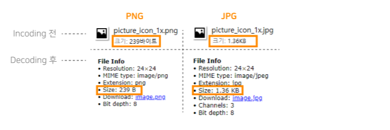


<hr/>

이번엔 피그마에서 저장한 **SVG** 파일을  
**일러스트**와 **포토샵**에서 열어서 각각 `PNG`와 `JPG`로 저장하겠습니다.

<hr/>

### 2-1. 일러스트에서 png 저장

<u>일러스트(illustrator)</u>에서 **'웹용으로 저장'** 하게되면  

> **PNG**로 저장할 때에는 `PNG-8`과 `PNG-24`를 선택하여 저장 할 수 있습니다.  
> **JPG**로 저장할 때에는 `저 중 고 매우높음 최대`를 선택해서 저장 할 수 있습니다.  
> 이미지 크기는 PNG와 JPG 둘 다 `없음` `아트최적화` `문자최적화` 세가지 옵션을 선택할 수 있습니다.

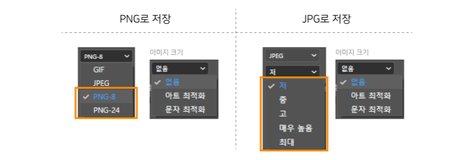

> `png-8`은 2x8 = 256 컬러가 제공되서 저용량에 적합하고  
> `png-24`는 2x24 = 16,777,216‬ 컬러와 알파값인 반투명이 제공되서 색상이 많은 이미지로 저장하기에 적합합니다.

- **PNG-8**로 옵션 세가지를 저장하면 아래 이미지와 같습니다.

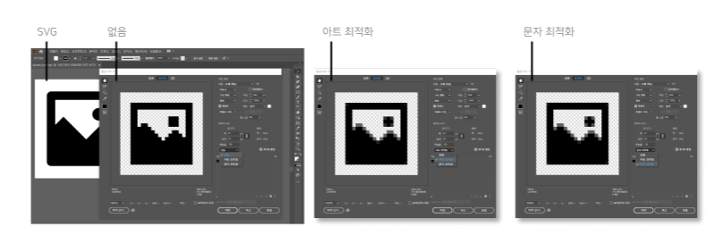

- **PNG-24**로 옵션 세가지를 저장하면 아래 이미지와 같습니다.

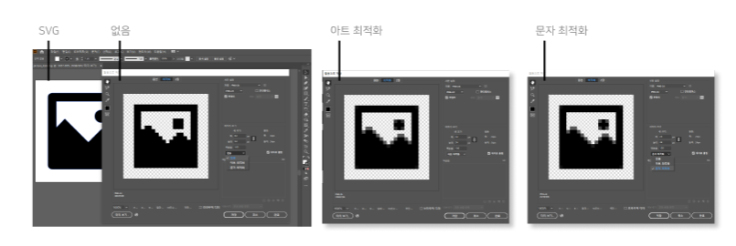

PNG-8과 PNG-24 저장은 둘 다 눈으로 보았을 때는 큰 차이가 없어보이지만 **파일 사이즈에 차이**가 있습니다.

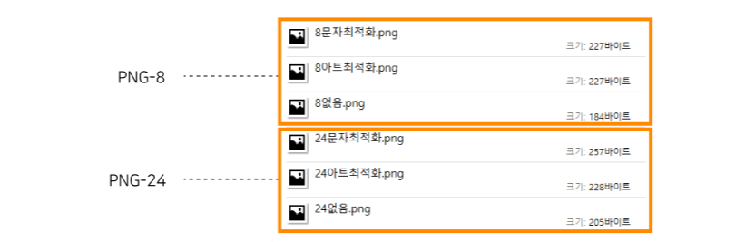

각각 저장한 PNG를 인코딩해서 base64로 바꾸면 아래와 같습니다.

```
// PNG-8로 저장
// 옵션 : 없음
iVBORw0KGgoAAAANSUhEUgAAABgAAAAYCAMAAADXqc3KAAAAGXRFWHRTb2Z0d2FyZQBBZG9iZSBJbWFnZVJlYWR5ccllPAAAAAZQTFRFAAAA////pdmf3QAAAAJ0Uk5T/wDltzBKAAAAOklEQVR42mJgxAEYyJJgwACEJdBMIUUCbAxREjA5dAmoSzDtQMhg0cEAY2JKMDAS7/PBKEGlxAAQYAClNwFOlngEfAAAAABJRU5ErkJggg==
// 옵션 : 아트 최적화
iVBORw0KGgoAAAANSUhEUgAAABgAAAAYCAMAAADXqc3KAAAAGXRFWHRTb2Z0d2FyZQBBZG9iZSBJbWFnZVJlYWR5ccllPAAAABJQTFRFAAAAYGBgMDAwEBAQICAg////pc+6nAAAAAZ0Uk5T//////8As7+kvwAAAFVJREFUeNq00usKABAMBeAzl/d/ZTOSdvlBnJTytckFNQiuIEMlT4DJAtXlBBKSD9J/ByK/gni4e/QM6aUKRKRUAy+RTAZQzMnDK/kP4UM9+gxNgAEAXjgGp9R6Z+sAAAAASUVORK5CYII=
// 옵션 : 문자 최적화
iVBORw0KGgoAAAANSUhEUgAAABgAAAAYCAMAAADXqc3KAAAAGXRFWHRTb2Z0d2FyZQBBZG9iZSBJbWFnZVJlYWR5ccllPAAAABJQTFRFAAAAX19fDw8PT09PHx8f////Lhlb2QAAAAZ0Uk5T//////8As7+kvwAAAFVJREFUeNq00usKABAMBeAzl/d/ZTOSdvlBnJTytckFNQiuIEElTYDJAtXlBDKyD9J/ByK/gni4e/QM6aUKRKRUAy+RTAZQzMnDK/kP4UM9+gxNgAEAX4gGp0+DDPMAAAAASUVORK5CYII=
```
```
// PNG-24로 저장
// 옵션 : 없음
iVBORw0KGgoAAAANSUhEUgAAABgAAAAYCAYAAADgdz34AAAAGXRFWHRTb2Z0d2FyZQBBZG9iZSBJbWFnZVJlYWR5ccllPAAAAG9JREFUeNrsVTkKACAMM8X/f7nqIIjUk5aCmEmX5jAqmDlYgoIxzAliuwGgkleOHT4OJAUnkBLwcXCqdubYr6ZFoUar4sp+WUsR7BaBbtux65JuK9i7VDnkOkgaOCIhjcv09mv6CfwJ8D/9FZIAAwBwpCZJwaYgtQAAAABJRU5ErkJggg==
// 옵션 : 아트 최적화
iVBORw0KGgoAAAANSUhEUgAAABgAAAAYCAYAAADgdz34AAAAGXRFWHRTb2Z0d2FyZQBBZG9iZSBJbWFnZVJlYWR5ccllPAAAAIZJREFUeNpiYBgFJIL3QPyfQvwe2UBGNAv+U8mhcHNZCCkgEWA4kInWYU6JBeehLj5PVFiheZGRxOBgxKUfnw/mQzEucAGNJjqS/kMNRmaTqp+gAnQ8n0hfkm0BNkuw+ZIiC5ANmo9DjmILQPg+EWroV1QM6pw8Qi34QAUzPzCMAlIAQIABAC0tXr3zn/P7AAAAAElFTkSuQmCC
// 옵션 : 문자 최적화
iVBORw0KGgoAAAANSUhEUgAAABgAAAAYCAYAAADgdz34AAAAGXRFWHRTb2Z0d2FyZQBBZG9iZSBJbWFnZVJlYWR5ccllPAAAAKNJREFUeNrsVG0OgCAIldb9z8AR6kYdQU9g8oONDD+a2qr1tjedAg/BAd57MxKTGYzhAoZKxAywdNRIK2OC7AEA+E5JA+/nksEVaAk+t8kh24UypjVrp/WgpkSyHGyv+U+ZAEjMaKzRWvVN+auh3EubHNnncJYQiImJgCjvWgROItorWwVkINTueggQt5LNraPi/eP6ewKuQ0yXHHZ/DzTsAgwAxM0svp+iU7gAAAAASUVORK5CYII=
```

인코딩된 PNG-8과 PNG-24 base64 코드를 다시 **디코딩** 해보겠습니다.

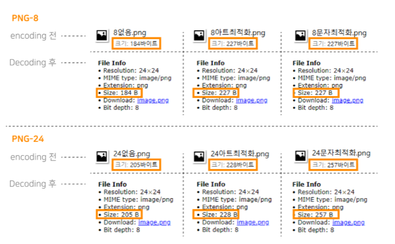

인코딩 전 파일과 디코딩된 후 PNG-8과 PNG-24 모두  
**파일 사이즈가 변하지 않는 것**을 볼 수 있습니다.

<hr/>

### 2-2. 일러스트에서 JPG로 저장

이번엔 똑같은 SVG 파일을 <u>일러스트(illustrator)</u> 에서 JPG로 저장해보겠습니다.  
JPG로 저장할 때 품질은 `저 중 고 매우높음 최대` 가 있습니다.  
> 품질을 선택하고 옵션 세가지를 같이 저장했을 때  
> 각각 어떤 이미지가 나오는지 확인해보겠습니다.  
> 
> 정확한 이미지 품질을 확인하기 위하여 배경을 그레이로 설정하였습니다.

`저`
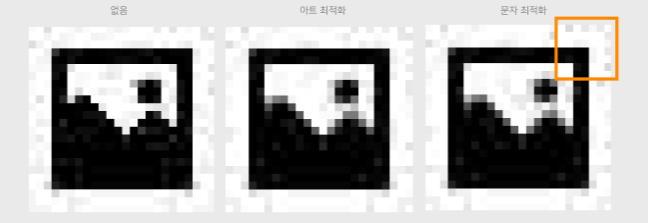

`중`
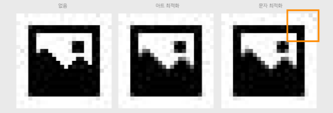

`고`
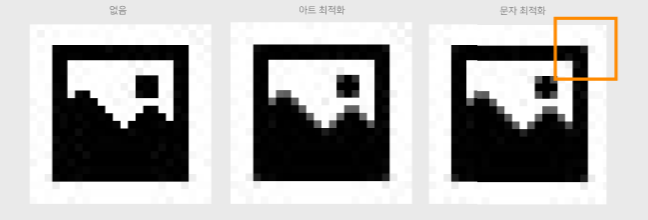

`매우높음`
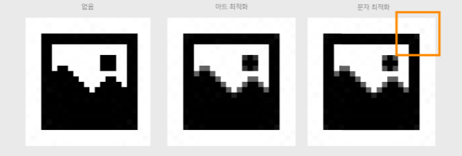

`최대`
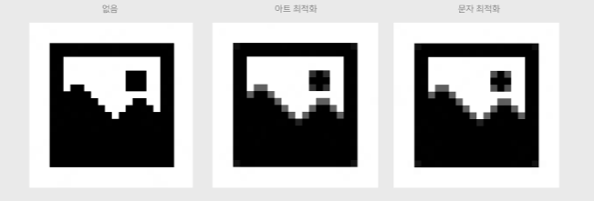

위에 확인한 JPG 이미지를 인코딩하면 아래와 같습니다.

```
// 품질 - 저 / 옵션 - 없음
/9j/4AAQSkZJRgABAgAAZABkAAD/7AARRHVja3kAAQAEAAAACgAA/+4AIUFkb2JlAGTAAAAAAQMAEAMCAwYAAAGRAAABvwAAAmD/2wCEABQQEBkSGScXFycyJh8mMi4mJiYmLj41NTU1NT5EQUFBQUFBREREREREREREREREREREREREREREREREREREREQBFRkZIBwgJhgYJjYmICY2RDYrKzZERERCNUJERERERERERERERERERERERERERERERERERERERERERERERERERP/CABEIABgAGAMBIgACEQEDEQH/xAB/AAEBAQEAAAAAAAAAAAAAAAAABQIEAQEAAAAAAAAAAAAAAAAAAAAAEAEAAgIDAQAAAAAAAAAAAAAEBQYCAwAgFBYRAAIBAgUCAgsAAAAAAAAAAAECESEDADESEwRBIvBRcYGRsTJCUpLSMxQSAQAAAAAAAAAAAAAAAAAAACD/2gAMAwEAAhEDEQAAALOIQvpQ6I4WAf/aAAgBAgABBQDp/9oACAEDAAEFAOn/2gAIAQEAAQUAa1vt27pfTjHyDM2W1e4rs7TqVH15+LnWGvIlEfFN5Xq8iLR//9oACAECAgY/AB//2gAIAQMCBj8AH//aAAgBAQEGPwAcPhi1+reJvavq0/L6umDcutxEUZsxuAe04/l5WyVNnfVrGqCNQAqT4pXCtYcoWsqpKmDGtjnmKgZe7D2OXb13qLFQr9Qx0wRBFQMzEQCdKsqaNvi7RXMdrjKaxEZ19OZW9ZZAoQJ3kzMseinzx8dr7m/HDXrzIVKFOwmZlT1UeWP/2Q==
// 품질 - 저 / 옵션 - 아트 최적화
/9j/4AAQSkZJRgABAgAAZABkAAD/7AARRHVja3kAAQAEAAAACgAA/+4AIUFkb2JlAGTAAAAAAQMAEAMCAwYAAAGSAAABvwAAAlP/2wCEABQQEBkSGScXFycyJh8mMi4mJiYmLj41NTU1NT5EQUFBQUFBREREREREREREREREREREREREREREREREREREREQBFRkZIBwgJhgYJjYmICY2RDYrKzZERERCNUJERERERERERERERERERERERERERERERERERERERERERERERERERP/CABEIABgAGAMBIgACEQEDEQH/xAB/AAEBAQEAAAAAAAAAAAAAAAAABQIDAQEAAAAAAAAAAAAAAAAAAAAAEAEAAgIDAQAAAAAAAAAAAAAEBQYCAwAgFBYRAAIABAQEBAcAAAAAAAAAAAECABESAyExQQRRYYET8JHBIjJCUpLSMxQSAQAAAAAAAAAAAAAAAAAAACD/2gAMAwEAAhEDEQAAALOImy0mDtHCwD//2gAIAQIAAQUA6f/aAAgBAwABBQDp/9oACAEBAAEFAGtb7du2Y04x8gzNlrbuG/O0nXHwL9bn2GvIlEfFN5Xq8iLR/9oACAECAgY/AB//2gAIAQMCBj8AH//aAAgBAQEGPwAbPZi1+rvE3qvqp+XppBe420VRmzG4AOsfy7rskGz31axVKVQAxJ8YYwr2GKM1hVJGcq2PpDWt2ld7BaMQr6hpjLLEeXJWtrQE2vaK6ClxlylKFvWWQKECe8kGYLHRTxj47X3N+MNevMhUoU9hJMyVOqjhH//Z
// 품질 - 저 / 옵션 - 문자 최적화
/9j/4AAQSkZJRgABAgAAZABkAAD/7AARRHVja3kAAQAEAAAACgAA/+4AIUFkb2JlAGTAAAAAAQMAEAMCAwYAAAGSAAABvwAAAlH/2wCEABQQEBkSGScXFycyJh8mMi4mJiYmLj41NTU1NT5EQUFBQUFBREREREREREREREREREREREREREREREREREREREQBFRkZIBwgJhgYJjYmICY2RDYrKzZERERCNUJERERERERERERERERERERERERERERERERERERERERERERERERERP/CABEIABgAGAMBIgACEQEDEQH/xAB/AAEBAQEAAAAAAAAAAAAAAAAABQIDAQEAAAAAAAAAAAAAAAAAAAAAEAEAAgIDAQAAAAAAAAAAAAAEAwYCBQAgFBYRAAIBAQYDBwUAAAAAAAAAAAECAwARITFBEgRRYRPwgaHBIjJSQpLSMxQSAQAAAAAAAAAAAAAAAAAAACD/2gAMAwEAAhEDEQAAALOYey0mDtHCwD//2gAIAQIAAQUA6f/aAAgBAwABBQDp/9oACAEBAAEFAGtb7ZJdxFiB7MmWtsw35Wk6gaHYRvfYa8jaI+KbyvV5GrR//9oACAECAgY/AB//2gAIAQMCBj8AH//aAAgBAQEGPwAbPZiL9XWJm1fLT9PdlReRtoqjFmMgAr+XddEgw9ZWh1fIKL2Pa6+leBijNAqkjGzWx8qaPdprmuXReFfMNaMML/DkrxroCbXplcgVcYcrLKWaFkChAnrJBtBY5KeNe+L7m/GmmmZCpQp6CSbSVOajhX//2Q==
// 품질 - 중 / 옵션 - 없음
/9j/4AAQSkZJRgABAgAAZABkAAD/7AARRHVja3kAAQAEAAAAHgAA/+4AIUFkb2JlAGTAAAAAAQMAEAMCAwYAAAGSAAABwwAAApr/2wCEABALCwsMCxAMDBAXDw0PFxsUEBAUGx8XFxcXFx8eFxoaGhoXHh4jJSclIx4vLzMzLy9AQEBAQEBAQEBAQEBAQEABEQ8PERMRFRISFRQRFBEUGhQWFhQaJhoaHBoaJjAjHh4eHiMwKy4nJycuKzU1MDA1NUBAP0BAQEBAQEBAQEBAQP/CABEIABgAGAMBIgACEQEDEQH/xAB+AAEAAwEAAAAAAAAAAAAAAAAAAwUGBAEBAAAAAAAAAAAAAAAAAAAAABAAAgICAwAAAAAAAAAAAAAABQYDBAAgFQcXEQACAQMCBAUFAQAAAAAAAAABAgMREgQAITEiFAVBcUITNFEyklPTFRIBAAAAAAAAAAAAAAAAAAAAIP/aAAwDAQACEQMRAAAA0EebGmUo6qEL4H//2gAIAQIAAQUA0//aAAgBAwABBQDT/9oACAEBAAEFACZM9z09h1rRCC5uU32Ffu0GGR8qX1pOLRFWFxTiZ4n5iexOTiYEn//aAAgBAgIGPwAf/9oACAEDAgY/AB//2gAIAQEBBj8AXtHaFxPiDLd8sSfsMRAMR8vDTT5MvZoYUpdJI2QiCpoKs1BxOv8AN7l0bxvh9bDNhe4ysrSLGvNI24O52H031G+FM+O8uCkbvGbXs96R6BhuN1HDy4amwu7Y3U55tQJzJFNQ3rK5jKlbSouUcTSlATbC8UPT9L2kYrRglkBimWlhYlrbSPu38N+JizMOWBI0gWIiVnVrleR/RG23Nr5GJ+cn8dS5mZLA8bwNEBEzs1zPG/rjXbl1/9k=
// 품질 - 중 / 옵션 - 아트 최적화
/9j/4AAQSkZJRgABAgAAZABkAAD/7AARRHVja3kAAQAEAAAAHgAA/+4AIUFkb2JlAGTAAAAAAQMAEAMCAwYAAAGRAAABwAAAAon/2wCEABALCwsMCxAMDBAXDw0PFxsUEBAUGx8XFxcXFx8eFxoaGhoXHh4jJSclIx4vLzMzLy9AQEBAQEBAQEBAQEBAQEABEQ8PERMRFRISFRQRFBEUGhQWFhQaJhoaHBoaJjAjHh4eHiMwKy4nJycuKzU1MDA1NUBAP0BAQEBAQEBAQEBAQP/CABEIABgAGAMBIgACEQEDEQH/xAB9AAEAAwEAAAAAAAAAAAAAAAAAAwUGBAEBAAAAAAAAAAAAAAAAAAAAABABAQEAAgMAAAAAAAAAAAAABQYDIAQAFRcRAAICAAUBBgcAAAAAAAAAAAECAwQAESESBRNBcSIyFDQxUWGSU9MVEgEAAAAAAAAAAAAAAAAAAAAg/9oADAMBAAIRAxEAAADQR52Q0CnHRQhfA//aAAgBAgABBQDh/9oACAEDAAEFAOH/2gAIAQEAAQUATTe99vvbdbIhdvRu+T7xtFpdmoTkmt11aOxjk3k/mL3kdHJgp//aAAgBAgIGPwAf/9oACAEDAgY/AB//2gAIAQEBBj8AXiOIWp7QW3e2JPyGIgGI93ZhprEnDQwp5pJGsIq5nLVmyGP5nJ+jdHp+silp9QqymRY18Uja56nQfLXEctGUwyy0UiaRfMF67voezVBiaty1fr3SFQ1xuWOYg7lk3IQVAK5kZ930hlrxdBa/Eis0OZKoY510UnMkbSPjiK5TlgSNIFiIlZ1bcru+Y2I2nix7ip98n6cS3LksDxvA0QETOzbmdHzO9F08OP/Z
// 품질 - 중 / 옵션 - 문자 최적화
/9j/4AAQSkZJRgABAgAAZABkAAD/7AARRHVja3kAAQAEAAAAHgAA/+4AIUFkb2JlAGTAAAAAAQMAEAMCAwYAAAGSAAABwgAAAof/2wCEABALCwsMCxAMDBAXDw0PFxsUEBAUGx8XFxcXFx8eFxoaGhoXHh4jJSclIx4vLzMzLy9AQEBAQEBAQEBAQEBAQEABEQ8PERMRFRISFRQRFBEUGhQWFhQaJhoaHBoaJjAjHh4eHiMwKy4nJycuKzU1MDA1NUBAP0BAQEBAQEBAQEBAQP/CABEIABgAGAMBIgACEQEDEQH/xAB+AAEAAwAAAAAAAAAAAAAAAAAAAwUGAQEAAAAAAAAAAAAAAAAAAAAAEAEBAAICAwAAAAAAAAAAAAAFBgMEACACFRcRAAMAAQICCAcBAAAAAAAAAAECAwQAIRIFEUFxIkITFDQxUWEyklPTFRIBAAAAAAAAAAAAAAAAAAAAIP/aAAwDAQACEQMRAAAA0EedkNAqBPQhfA//2gAIAQIAAQUA6f/aAAgBAwABBQDp/9oACAEBAAEFAE03vfZs9tr4iVm8jd8nvG0XneHb85Jr661HYxybyfzF7kdHJgp//9oACAECAgY/AB//2gAIAQMCBj8AH//aAAgBAQEGPwBeUcoXE9oMt3yxT9hkQDI9nVprZFOTSkm70o2QqqPhuzbDX+XzT0bI2H6yVcPzCCDRZr3qN2nYfLfU64NTGtcFJNRfuC+e77Hq3Qatjc2x/PzSFQ444lnYg8S04kIKgFekjp7PpGuPL04x+UjHaI3VGnddkJ3K8JHRqWZh1gk0gsiKs6txK7v4Ebbva9xifnT+Oq5mZWDzeDSAkzs3Ezo/jRdu7r//2Q==
// 품질 - 고 / 옵션 - 없음
/9j/4AAQSkZJRgABAgAAZABkAAD/7AARRHVja3kAAQAEAAAAPAAA/+4AJkFkb2JlAGTAAAAAAQMAFQQDBgoNAAAB4gAAAnoAAAL1AAADY//bAIQABgQEBAUEBgUFBgkGBQYJCwgGBggLDAoKCwoKDBAMDAwMDAwQDA4PEA8ODBMTFBQTExwbGxscHx8fHx8fHx8fHwEHBwcNDA0YEBAYGhURFRofHx8fHx8fHx8fHx8fHx8fHx8fHx8fHx8fHx8fHx8fHx8fHx8fHx8fHx8fHx8fHx8f/8IAEQgAGAAYAwERAAIRAQMRAf/EAJsAAAEFAAAAAAAAAAAAAAAAAAYAAgMEBQEBAAAAAAAAAAAAAAAAAAAAABAAAgICAwAAAAAAAAAAAAAABAUCBjADABUWEQACAQIEBQIHAAAAAAAAAAABAgMRBAAhEhMxQVEiFIEzkfFCUpLSBRIBAAAAAAAAAAAAAAAAAAAAMBMBAQACAgMBAQAAAAAAAAAAAREAITFBEDBRcfD/2gAMAwEAAhEDEQAAASoiHAaI0C6C4UH/2gAIAQEAAQUCNNadpt22TVBewZTZW0okZtO06CU1ePgY2sNeNYm+Kacr1eNXG//aAAgBAgABBQLD/9oACAEDAAEFAsP/2gAIAQICBj8CH//aAAgBAwIGPwIf/9oACAEBAQY/AhY2Ig9jeJm1/fp+nBklf+fGg4uxlA+Jx4l347K1v5CPb6qEatIzbCmCQxM9uFLLkabhPH0xJBew7t1kunMI/MOdNKUpmB8oyse1s2OyU4jtkHCudKdcJPA8aqsYTvJrWpPIHrj3YPyf9cPPO8bK0ZTsJrWoPMDpj//aAAgBAQMBPyHowD/owX+dZHgcp1hYBVmdgCNQdhESuj5vFHR702DZs8ZQJS4I0E6GjbJBca8wEoslp2D6/eVEFQDDrOTxQggqCadZyZ//2gAIAQIDAT8h9P8A/9oACAEDAwE/IfT/AP/aAAwDAQACEQMRAAAQAgAkn//aAAgBAQMBPxD++R4mWD974M4HRhGsIAK8uBU7cyK1B2Gxhz9bWpQr2rFNcKOmgBYpZjwzJDyd2gCnNT0hosZOpd/l6GsHf3Xjial3+Hqbwd/NZ//aAAgBAgMBPxD0/wD/2gAIAQMDAT8Q9P8A/9k=
// 품질 - 고 / 옵션 - 아트 최적화
/9j/4AAQSkZJRgABAgAAZABkAAD/7AARRHVja3kAAQAEAAAAPAAA/+4AJkFkb2JlAGTAAAAAAQMAFQQDBgoNAAAB3wAAAm4AAALgAAADR//bAIQABgQEBAUEBgUFBgkGBQYJCwgGBggLDAoKCwoKDBAMDAwMDAwQDA4PEA8ODBMTFBQTExwbGxscHx8fHx8fHx8fHwEHBwcNDA0YEBAYGhURFRofHx8fHx8fHx8fHx8fHx8fHx8fHx8fHx8fHx8fHx8fHx8fHx8fHx8fHx8fHx8fHx8f/8IAEQgAGAAYAwERAAIRAQMRAf/EAJgAAAMBAAAAAAAAAAAAAAAAAAMEBgIBAQAAAAAAAAAAAAAAAAAAAAAQAAICAgMAAAAAAAAAAAAAAAQFAwYwAgAVFhEAAgECBQIGAwAAAAAAAAAAAQIDAAQRMUESEyFRYZHBQlIzktIUEgEAAAAAAAAAAAAAAAAAAAAwEwEAAgICAwEBAAAAAAAAAAABESEAQTBREDFxYdH/2gAMAwEAAhEDEQAAAaoEbI8KNjRLlQf/2gAIAQEAAQUCNNadpJLZYtAD2WzK1GkiN9rQGSnQnxGt7DXjGJnimnK9XjFxn//aAAgBAgABBQLD/9oACAEDAAEFAsP/2gAIAQICBj8CH//aAAgBAwIGPwIf/9oACAEBAQY/AhY2Ig+jmJm3fLb7aLytYIgzZjKB51/Jd8BUwc6PBuww3bR1ale3fjd7YKWGeHIT6VJFexclx0UxdQr6hsRllUbRpxiKx4img2yDLwwpJ4HjVVjCEOSDiCToD3r7YPyf9aeed42VoygCEk4kg6gdq//aAAgBAQMBPyHXgH97BfzWeor+OatQF5v/AL+kbC5to6vGEfAwN1ZydAgEoPoKBkg/PyKvF9SomVkInOvgQCGcR4oevgQCGcRn/9oACAECAwE/IeH/2gAIAQMDAT8h4f/aAAwDAQACEQMRAAAQkAEkn//aAAgBAQMBPxCzl/T2MQe9+jCW+JwoC2Qgtz9B7lVCAP0BiinH4bDcZCak3k9WhFBLFYQz0cLWLFgaWsGU6ZScTztKJUKgb8cQ87SgVS4G8//aAAgBAgMBPxDh/9oACAEDAwE/EOH/2Q==
// 품질 - 고 / 옵션 - 문자 최적화
/9j/4AAQSkZJRgABAgAAZABkAAD/7AARRHVja3kAAQAEAAAAPAAA/+4AJkFkb2JlAGTAAAAAAQMAFQQDBgoNAAAB3wAAAm0AAALeAAADSv/bAIQABgQEBAUEBgUFBgkGBQYJCwgGBggLDAoKCwoKDBAMDAwMDAwQDA4PEA8ODBMTFBQTExwbGxscHx8fHx8fHx8fHwEHBwcNDA0YEBAYGhURFRofHx8fHx8fHx8fHx8fHx8fHx8fHx8fHx8fHx8fHx8fHx8fHx8fHx8fHx8fHx8fHx8f/8IAEQgAGAAYAwERAAIRAQMRAf/EAJgAAAMBAAAAAAAAAAAAAAAAAAMEBgIBAQAAAAAAAAAAAAAAAAAAAAAQAAICAgMAAAAAAAAAAAAAAAQFAwYwAgAVFhEAAgECBQIGAwAAAAAAAAAAAQIDAAQRMUESEyFRYZHBQlIzktIUEgEAAAAAAAAAAAAAAAAAAAAwEwEAAgICAwEBAAAAAAAAAAABESEAQVFxEDAxYdH/2gAMAwEAAhEDEQAAAaoEbI8KODJLlQf/2gAIAQEAAQUCNNadpJJZY9AD2WzK1GkiN9rSGSnQnxGuLDXjGJnimnK9XjFxn//aAAgBAgABBQLD/9oACAEDAAEFAsP/2gAIAQICBj8CH//aAAgBAwIGPwIf/9oACAEBAQY/AhY2Ig+jmJm3fLb7aLyNYIgzZjKB51/HecBBg50eDd8to6tSvbvxu9sFLDPDkJ9KkivYuS46KYuoV9Q2IyypHjTjEVjxFNAVkGXhhSTwPGqrGEIckHEEnQHvX2wfk/60887xsrRlAEJJxJB1A7V//9oACAEBAwE/IdGAfzsF9ay9P5i7UBmyn5iJsO2jGEdBgbqzkwBAJAfgEDJB6/IZcfXQjbZCJzj4VAhnEeKHj4VAhnEZ/9oACAECAwE/IfT/AP/aAAgBAwMBPyH0/wD/2gAMAwEAAhEDEQAAEJIAJJ//2gAIAQEDAT8Qv5f09jEHnfwwfswq1AW2GLcehuvnIREegvKqcfhsNxkJqTeUNeEwS5WEMx8OINUqsEkHkM0zE4nlWcSoVA344h5VnAqlwN5//9oACAECAwE/EPT/AP/aAAgBAwMBPxD0/wD/2Q==
// 품질 - 매우높음 / 옵션 - 없음
/9j/4AAQSkZJRgABAgAAZABkAAD/7AARRHVja3kAAQAEAAAAUAAA/+4AJkFkb2JlAGTAAAAAAQMAFQQDBgoNAAAB7AAAAtkAAANXAAADwP/bAIQAAgICAgICAgICAgMCAgIDBAMCAgMEBQQEBAQEBQYFBQUFBQUGBgcHCAcHBgkJCgoJCQwMDAwMDAwMDAwMDAwMDAEDAwMFBAUJBgYJDQsJCw0PDg4ODg8PDAwMDAwPDwwMDAwMDA8MDAwMDAwMDAwMDAwMDAwMDAwMDAwMDAwMDAwM/8IAEQgAGAAYAwERAAIRAQMRAf/EAJ4AAAIDAQAAAAAAAAAAAAAAAAYHAAQFCAEBAAAAAAAAAAAAAAAAAAAAABAAAgICAwAAAAAAAAAAAAAABQYDBzAEABYXEQABAwIEBAUFAQAAAAAAAAADAQIEEQUAITESIhMVBkFRcUIUMlOT0zQ1EgEAAAAAAAAAAAAAAAAAAAAwEwEAAgICAgMAAAAAAAAAAAABABEhMTBR8EEQYaH/2gAMAwEAAhEDEQAAAX8Z5YOaCBgFAhx8H//aAAgBAQABBQI0aae07W3ZOjAvsDJOyW0VIiWya0tEsm16fgPtlhV6abDXirTyva9NKZr/2gAIAQIAAQUCw//aAAgBAwABBQLD/9oACAECAgY/Ah//2gAIAQMCBj8CH//aAAgBAQEGPwIfbvbo7V/lJcSluKH++olRFEvp4eeeHypsntCHGFTmSDPmDY2q0SrnUTVcdEvfRzBNZ+qxJdq5zmua4zRs4yOzRc1yTyzxHJbJpYJZNlEEpgu2P2fJI+iOTNM2Jp6aYmW3uC29QvC8sSB4hgkUXe071ErVbtVqbmpqtKURV2RCAh/A6b2qlvJGRVcxFBJZTlq5Vdt2qn1Z+GeqxrjbpMIIQwmRnNkvI125pCP9g35ceP77V+U/6MSbjcZMIwTQnxmtjPI525xBv942ZcGP/9oACAEBAwE/IfPYSNtg/kJoEU4q6BYBbtqB39uk4kAfYZGxEqNeW/rr7ihTsRwRurW9pfzSSzc9fZUVlTshtNZOvcYWSAsB77x8cDXuMJJQWC99Yn//2gAIAQIDAT8h4f/aAAgBAwMBPyHh/9oADAMBAAIRAxEAABCSAAAf/9oACAEBAwE/EPPbzOfsAwfU3j5fd5FgMpDXkWVUMlFIGgg/byxc0ZEOFLGdv5vmJlo8DBjd8xHlFjDCwsnU1hxniiils0Us2GprDjPEFUbbotP/2gAIAQIDAT8Q4f/aAAgBAwMBPxDh/9k=
// 품질 - 매우높음 / 옵션 - 아트 최적화
/9j/4AAQSkZJRgABAgAAZABkAAD/7AARRHVja3kAAQAEAAAAUAAA/+4AJkFkb2JlAGTAAAAAAQMAFQQDBgoNAAAB7QAAAsUAAANDAAADsP/bAIQAAgICAgICAgICAgMCAgIDBAMCAgMEBQQEBAQEBQYFBQUFBQUGBgcHCAcHBgkJCgoJCQwMDAwMDAwMDAwMDAwMDAEDAwMFBAUJBgYJDQsJCw0PDg4ODg8PDAwMDAwPDwwMDAwMDA8MDAwMDAwMDAwMDAwMDAwMDAwMDAwMDAwMDAwM/8IAEQgAGAAYAwERAAIRAQMRAf/EAJ8AAAIDAAAAAAAAAAAAAAAAAAQHBQYIAQEAAAAAAAAAAAAAAAAAAAAAEAACAgIDAAAAAAAAAAAAAAAFBgQHMAMAFhcRAAEDAgQDBQkAAAAAAAAAAAIBAwQhBQAREgYiFBUxQVFxQmEyEzNTk9M0NRIBAAAAAAAAAAAAAAAAAAAAMBMBAAICAgIDAAAAAAAAAAAAAQARIUEwMVFxEGHR/9oADAMBAAIRAxEAAAF/gAQZvDixk8IcfB//2gAIAQEAAQUCNGmntMmVZMLQAPsu5ltU0SCN220Q5dPQz0Rgb7Cr0y2GfFWnle16ZUzP/9oACAECAAEFAsP/2gAIAQMAAQUCw//aAAgBAgIGPwIf/9oACAEDAgY/Ah//2gAIAQEBBj8Cb25txu1fykuLrtxR76ytKiK0vl3YOTMkbQiRmvmyHimAA50qRUx0K+9IdadtHVIsq1/GUSFXhbHicKudVonhXDD9rlFDfk2Rtg3w95A5pw6L3VBMS4W4Lfzl1JAaKAmoGpCouoXdYKiiiKOapn5eyI9Di8iMDaiQXIlVECZlDQFWqppVO3EW426VCZZZhBGIZJuCWoXHD9DZ048fv2r7r/4MSrjcZUJ5l6EcYRjG4RaicbP1thTgx//aAAgBAQMBPyHOA/SXtwfPPRAmgILIFwFqGWfYAEongB9gIwci9Yk3GwmrNy51hz84VYQbowYe6NzTim4LVem0uP2UYWCAMBvzj44H2UYSCgMFvxif/9oACAECAwE/IeH/2gAIAQMDAT8h4f/aAAwDAQACEQMRAAAQAgkgn//aAAgBAQMBPxDXgP8AX7/wLI06W+li0ZRah2x0Hrf/ANIRKWFpKnmqKvYoNkOoouyjcgyBC55PGb+QUP18MG7UJ+BDMcyoopbOilmw+BDMcygqjbei0//aAAgBAgMBPxDh/9oACAEDAwE/EOH/2Q==
// 품질 - 매우높음 / 옵션 - 문자 최적화
/9j/4AAQSkZJRgABAgAAZABkAAD/7AARRHVja3kAAQAEAAAAUAAA/+4AJkFkb2JlAGTAAAAAAQMAFQQDBgoNAAAB6gAAAr8AAAM9AAADqf/bAIQAAgICAgICAgICAgMCAgIDBAMCAgMEBQQEBAQEBQYFBQUFBQUGBgcHCAcHBgkJCgoJCQwMDAwMDAwMDAwMDAwMDAEDAwMFBAUJBgYJDQsJCw0PDg4ODg8PDAwMDAwPDwwMDAwMDA8MDAwMDAwMDAwMDAwMDAwMDAwMDAwMDAwMDAwM/8IAEQgAGAAYAwERAAIRAQMRAf/EAJwAAAIDAAAAAAAAAAAAAAAAAAQHBQYIAQEAAAAAAAAAAAAAAAAAAAAAEAACAgIDAAAAAAAAAAAAAAAFBgQHMAMAFhcRAAICAAQDBQkAAAAAAAAAAAIDAQQAIRIFEXEGQSJCFBVRYTITU5PTNDUSAQAAAAAAAAAAAAAAAAAAADATAQACAgMAAwAAAAAAAAAAAAERIQBBMDFREHHR/9oADAMBAAIRAxEAAAF/gIQZuDyxk6IcfB//2gAIAQEAAQUCNGmntMiTZUPSBPMu1ltU0SCN2y0g5dPQz8RhcLCr0y2GfFWnle16ZUzP/9oACAECAAEFAsP/2gAIAQMAAQUCw//aAAgBAgIGPwIf/9oACAEDAgY/Ah//2gAIAQEBBj8CX0504vav5Ubi1u4w760qmIlU8uzDLNux0hVrqza9pXAAeZFlGPQd+9IYtm0eqVrO1/OkZGXCoe80uc5R7M8Iftdoqb7OyLQbw+LR5ph5T2ZhGLdLqDb/ADm6lAqKhGoFWJidQt1Bw0xEjxmOPL3VH1KvkRodKxRZUjMQJNocgmc5HTMYq7jt1qklKaQViGybBLULGH4Fnl38fv7V91/4MWtx3G1Scl1I6wjWNhFqJiz8awy7mP/aAAgBAQMBPyG8B+kvbg+76MKkcHRYlhYxbj0Nq9UAIj9gOxlHIvSknskJqTeVCN9YQzLCDMdXEkcSMM0Gg5vTKTj9nGFggCg37XxwPs4wkFAUW/Kz/9oACAECAwE/IeH/2gAIAQMDAT8h4f/aAAwDAQACEQMRAAAQAgkgn//aAAgBAQMBPxDXgP8AH7/wLkNo0/cICIBC0Mo8kCSXqHJSQnCI5qi72KhrDqLCNV30juwiYwnJ3vlz5AbTMyE/CJmOZUUUsnRC5sPhEzHMoKo2XolP/9oACAECAwE/EOH/2gAIAQMDAT8Q4f/Z
// 품질 - 최대 / 옵션 - 없음
/9j/4AAQSkZJRgABAgAAZABkAAD/7AARRHVja3kAAQAEAAAAZAAA/+4AJkFkb2JlAGTAAAAAAQMAFQQDBgoNAAAB8AAAA2IAAAPXAAAENv/bAIQAAQEBAQEBAQEBAQEBAQEBAQEBAQEBAQEBAQEBAQEBAQEBAQEBAQEBAQEBAQICAgICAgICAgICAwMDAwMDAwMDAwEBAQEBAQECAQECAgIBAgIDAwMDAwMDAwMDAwMDAwMDAwMDAwMDAwMDAwMDAwMDAwMDAwMDAwMDAwMDAwMDAwMD/8IAEQgAGAAYAwERAAIRAQMRAf/EAJsAAAIDAQAAAAAAAAAAAAAAAAcIAAUGCQEBAAAAAAAAAAAAAAAAAAAAABAAAgICAwAAAAAAAAAAAAAABgcECDAFABcYEQABBAEDAgMIAwAAAAAAAAAEAQIDBQYSEwcAMSEUFTJSI3M1lRY2VtYIEgEAAAAAAAAAAAAAAAAAAAAwEwEAAgIDAQAAAAAAAAAAAAABADAQISARcYH/2gAMAwEAAhEDEQAAAX9M+WBzQIGAJ4iA95//2gAIAQEAAQUCNTVp9p7TbWR0cFfsBkz2TbQqIxNszLSaIsTdej2CftmwtejRsmnipp8r1Xo0Uxp//9oACAECAAEFAsP/2gAIAQMAAQUCw//aAAgBAgIGPwIf/9oACAEDAgY/Ah//2gAIAQEBBj8Cg4646gwD9AizUorNYsi/kRVFNBBNRFfIc1roPfVX+y3qe0urL/OFPWC7fmbG0MzyvBH3pox4d8suSIeLdIlaxupyanuRO69JhGbrxwaEbxwnIFTbcfrfEClikXwdQAqH25j4px54nyyfDiVrmrG5sndOq8nGbqwoi7LjCrqyzaudwZygrmN3ZOggOh0lh6y62FXOhex7mIrFXQ97XXGNcg45+Q5i/wBPrmhNeZW0WR7M7Tw8isCKcmvLrPTC6+Nxgg74vMzLGkCxwyyoJUEg03oP41wBDhxNdHNMSDHNSZjW7L6sgskqwkr5K8qFWoS908b9THPl070lZkWO2eMBBBYwFSyxXRtqOU4oe1ujnyRsBpbGJR1isWIiq9HakXw7Kv1/APumRf1XqzyLIrPGDQjcYNpYoqU21IKaURa0pzJJGHUtdEg6RVz0VUertSp4d1T/2gAIAQEDAT8hgfgd6ZJ5V4nclt4L2BDE1ebTKLXIAz38Fr3IEhlWxB+spjXhVQDd/hjmuiIMEZzcfVLvz44QKQwJ5j6pd+fHCBGMH//aAAgBAgMBPyGn/9oACAEDAwE/Iaf/2gAMAwEAAhEDEQAAEAAAJJ//2gAIAQEDAT8Qn/8A4eAAfT2XCjFsAokTRAxwLZLcoQM2Fr/w+HHcgO5Y11LtWJ3zp8bICkPcHIJopIgDuZuUVgmikiAO5m5R/9oACAECAwE/EKf/2gAIAQMDAT8Qp//Z
// 품질 - 최대 / 옵션 - 아트 최적화
/9j/4AAQSkZJRgABAgAAZABkAAD/7AARRHVja3kAAQAEAAAAZAAA/+4AJkFkb2JlAGTAAAAAAQMAFQQDBgoNAAAB8gAAA1MAAAPNAAAENP/bAIQAAQEBAQEBAQEBAQEBAQEBAQEBAQEBAQEBAQEBAQEBAQEBAQEBAQEBAQEBAQICAgICAgICAgICAwMDAwMDAwMDAwEBAQEBAQECAQECAgIBAgIDAwMDAwMDAwMDAwMDAwMDAwMDAwMDAwMDAwMDAwMDAwMDAwMDAwMDAwMDAwMDAwMD/8IAEQgAGAAYAwERAAIRAQMRAf/EAJ4AAAIDAAAAAAAAAAAAAAAAAAUIBgcJAQEAAAAAAAAAAAAAAAAAAAAAEAACAgIDAAAAAAAAAAAAAAAGBwUIMAQAFxgRAAEEAQIBCAsBAAAAAAAAAAQBAgMFBgASBxEhMSITIxUWMlJzFCQ1lTZW1ggXEgEAAAAAAAAAAAAAAAAAAAAwEwEAAgIDAQAAAAAAAAAAAAABABEwIRAxQXH/2gAMAwEAAhEDEQAAAX+AIRM3g6WMTsQ8fA//2gAIAQEAAQUCNTVpdpSUpZOF0QE+ZW4yrVGhKEN3atEHl6eQx7EMBv2Fr0Ztkz8VNPleq9GamM//2gAIAQIAAQUCw//aAAgBAwABBQLD/9oACAECAgY/Ah//2gAIAQMCBj8CH//aAAgBAQEGPwIfhzw5HwD7AjzUorNY8i/IiqKYceaiK9i5rXQ+v1+hNT2dxY/zjU1oqNcVYWReeggjNfIyJizllSRQQo+WRrU3OTlcqJryLnX+dFClcOvP1XaYD49OMQNPfCU4fxlwW6OaGaN0sndxbVb2apJ0poE7FrSenPsuFtZUznC8jSmBOzK5snsHm9KB8hFZGjnJzqzc3ocurel4g0HjOVyMDAloI1OBqshmimjMDunH10o01YOKUGyQiFkjJO0REi6r+7qDaeqWjioP5+hxQmpR8kwwJFNmdfshAInklIIB9xJhWN0irInLtcrlRXLWZHjlnjAQYWMB0ssV0ZajkqSPa3JzpI2g01lEsCxWTERVejtyLza+f4B9UyL9V1Z5HkdnjBoZuMGUsUVKZakEoSRa0xzZJGnU1bEkCRVr0VUertypza//2gAIAQEDAT8h34NP1dABPsJjaUOJE8KkAJtCOgNvkmu7VBSwzuGDTb6HaETAPhRbNKe8s2ajUkgvdQDZpRM+dkjz7nOAT0sn+dkjz7nOAT2n/9oACAECAwE/IcP/2gAIAQMDAT8hw//aAAwDAQACEQMRAAAQAAAkn//aAAgBAQMBPxDs55lsjCgXhE+naISfGoRCAhcCt8CTS49OrUT031MYuLlZaC89S9NpZYii3i2yAY37ANVaoU1z7zLZICDx1lCmufeZbJAE5//aAAgBAgMBPxDD/9oACAEDAwE/EMP/2Q==
// 품질 - 최대 / 옵션 - 문자 최적화
/9j/4AAQSkZJRgABAgAAZABkAAD/7AARRHVja3kAAQAEAAAAZAAA/+4AJkFkb2JlAGTAAAAAAQMAFQQDBgoNAAAB8AAAA04AAAPIAAAEMP/bAIQAAQEBAQEBAQEBAQEBAQEBAQEBAQEBAQEBAQEBAQEBAQEBAQEBAQEBAQEBAQICAgICAgICAgICAwMDAwMDAwMDAwEBAQEBAQECAQECAgIBAgIDAwMDAwMDAwMDAwMDAwMDAwMDAwMDAwMDAwMDAwMDAwMDAwMDAwMDAwMDAwMDAwMD/8IAEQgAGAAYAwERAAIRAQMRAf/EAJwAAAIDAAAAAAAAAAAAAAAAAAUIBgcJAQEAAAAAAAAAAAAAAAAAAAAAEAACAgIDAAAAAAAAAAAAAAAGBwUIMAQAFxgRAAEEAQIDBQgDAAAAAAAAAAQBAgMFBgASESEHMSIjFBUyUhNzNZUWCDZW1hIBAAAAAAAAAAAAAAAAAAAAMBMBAAIDAQEBAAAAAAAAAAAAAQARMCExQRBx/9oADAMBAAIRAxEAAAF/gGETNwPFjE6EPHwP/9oACAEBAAEFAjU1aXaUjJWVh9ICPWXtMu1RmShDd2bSB5cn0OfRLCcFha9GbZM/FTT5XqvRmpjP/9oACAECAAEFAsP/2gAIAQMAAQUCw//aAAgBAgIGPwIf/9oACAEDAgY/Ah//2gAIAQEBBj8CH6c9OR8A/gEealFZrHkX9iKophx5qIr5LmtdD7/f7E1PZW5/65VdcI1HlH2JWehBDMc5saPnKJfHBC1XvROLlTmulwPPE6dkjk9O/wA9rLPAvX5YJ4Jb8SnERS7gtzJYpWOlk8OLgqbFR/amgTsWtJ6c+y6W1lTOcLwaUwJ2ZXNk9g83tQPkIrI0c5Oas3N7HLq3puoGP+s5XJGLXS0DPOh1OQyxysLEunHV8o81ZAIUIySeJkjJPio1Iu67w6k+oqvQ46L9f4sVJqWOfIKCTT5oBshr5pXyTTAeRJhWNXqr047XKqt3LWZHjlnjAQYWMB0ssV0ZajkqSPa3JzpI2g01lEsCxWTERVejtyLy19fwD7pkX+V1Z5HkdnjBoZuMGUsUVKZakEoSRa0xzZJGnU1bEkCRVr0VUertypy1/9oACAEBAwE/Id+DT9XAAn7CYzOtX4l87CSOpPTzUG3+2lr4zvGD6b6HaETAEe39XBhZbQ2srTecsafcyaZo+dmv77nOAT0sn+dmv77nOAT2n//aAAgBAgMBPyHD/9oACAEDAwE/IcP/2gAMAwEAAhEDEQAAEAAJJJ//2gAIAQEDAT8Q6c+GkRhQLwifTipBZtqeTadQLiYkv9+ggFZovlKq4wcXKy0FAghAbUI3QlMFJFa7oEme8pKFJEu962SAg/OsoUkS73rZIAnP/9oACAECAwE/EMP/2gAIAQMDAT8Qw//Z
```

다시 디코딩 하면 인코딩 전 파일과 디코딩된 후 JPG 파일은  
**파일 사이즈가 변하지 않는 것**을 볼 수 있습니다.

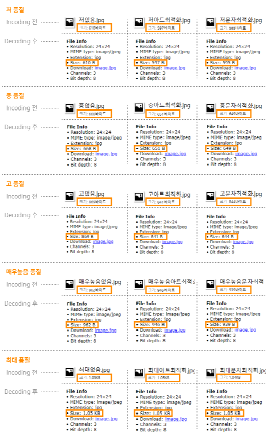

<hr/>

### 3-1. 포토샵에서 PNG로 저장

<u>포토샵(photoshop)</u>에서 svg를 오픈해서 '웹용으로 저장' 하기를 누르면 이런 옵션이 나옵니다.
> 포토샵도 일러스트와 마찬가지로 PNG-8과 PNG-24를 선택해서 저장할 수 있고  
> JPG로 저장할때에는 `저 표준 고 최고값 최대값` 으로 저장할 수 있습니다.  
> 다만 포토샵에서는 이미지크기 옵션을 따로 찾을 수 없었습니다.
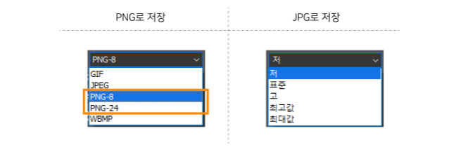

PNG로 저장하면 아래처럼 PNG-8과 PNG-24의 차이가 뚜렷합니다.
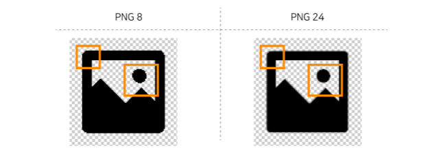

PNG-8과 PNG-24로 저장한 이미지를 인코딩 하면
```
// PNG-8
iVBORw0KGgoAAAANSUhEUgAAAGQAAABkCAMAAABHPGVmAAAAGXRFWHRTb2Z0d2FyZQBBZG9iZSBJbWFnZVJlYWR5ccllPAAAAyNpVFh0WE1MOmNvbS5hZG9iZS54bXAAAAAAADw/eHBhY2tldCBiZWdpbj0i77u/IiBpZD0iVzVNME1wQ2VoaUh6cmVTek5UY3prYzlkIj8+IDx4OnhtcG1ldGEgeG1sbnM6eD0iYWRvYmU6bnM6bWV0YS8iIHg6eG1wdGs9IkFkb2JlIFhNUCBDb3JlIDUuNi1jMTQ4IDc5LjE2NDAzNiwgMjAxOS8wOC8xMy0wMTowNjo1NyAgICAgICAgIj4gPHJkZjpSREYgeG1sbnM6cmRmPSJodHRwOi8vd3d3LnczLm9yZy8xOTk5LzAyLzIyLXJkZi1zeW50YXgtbnMjIj4gPHJkZjpEZXNjcmlwdGlvbiByZGY6YWJvdXQ9IiIgeG1sbnM6eG1wPSJodHRwOi8vbnMuYWRvYmUuY29tL3hhcC8xLjAvIiB4bWxuczp4bXBNTT0iaHR0cDovL25zLmFkb2JlLmNvbS94YXAvMS4wL21tLyIgeG1sbnM6c3RSZWY9Imh0dHA6Ly9ucy5hZG9iZS5jb20veGFwLzEuMC9zVHlwZS9SZXNvdXJjZVJlZiMiIHhtcDpDcmVhdG9yVG9vbD0iQWRvYmUgUGhvdG9zaG9wIDIxLjAgKFdpbmRvd3MpIiB4bXBNTTpJbnN0YW5jZUlEPSJ4bXAuaWlkOjJFMEQ1MEVBRTc1RDExRUJCNTkxOTYzOTcyNzE3MjlBIiB4bXBNTTpEb2N1bWVudElEPSJ4bXAuZGlkOjJFMEQ1MEVCRTc1RDExRUJCNTkxOTYzOTcyNzE3MjlBIj4gPHhtcE1NOkRlcml2ZWRGcm9tIHN0UmVmOmluc3RhbmNlSUQ9InhtcC5paWQ6MkUwRDUwRThFNzVEMTFFQkI1OTE5NjM5NzI3MTcyOUEiIHN0UmVmOmRvY3VtZW50SUQ9InhtcC5kaWQ6MkUwRDUwRTlFNzVEMTFFQkI1OTE5NjM5NzI3MTcyOUEiLz4gPC9yZGY6RGVzY3JpcHRpb24+IDwvcmRmOlJERj4gPC94OnhtcG1ldGE+IDw/eHBhY2tldCBlbmQ9InIiPz7F244SAAAABlBMVEUAAAAAAAClZ7nPAAAAAnRSTlP/AOW3MEoAAADUSURBVHja7NlBDoAwCETR8f6Xdm8aimWoqfmuiU9F0bG6NmwCAQEB6UVk2WJE6lDUYjwU9Rh7EIGciBQebhAQkOE+e5FBvR0ZDZEjkeE8BPkUuTzIRLPcXdNzMiCJK1d+4nP9qc0urY3kV0gQBGxIGDdMyCTU9CBKh7XSZ2p47C5EyRdw8YM77IELUarP5eiQGZH1fJJ4oxhCUBj6XUhc7UIUFrsQhbUuRGGpC9FC9xYi9svm8UcCBAQEBAQEBOR05OMlwD2LmSaGpXIQEJA/ILcAAwC3jBaa3q9ZBQAAAABJRU5ErkJggg==
// PNG-24
iVBORw0KGgoAAAANSUhEUgAAAGQAAABkCAYAAABw4pVUAAAAGXRFWHRTb2Z0d2FyZQBBZG9iZSBJbWFnZVJlYWR5ccllPAAAAyNpVFh0WE1MOmNvbS5hZG9iZS54bXAAAAAAADw/eHBhY2tldCBiZWdpbj0i77u/IiBpZD0iVzVNME1wQ2VoaUh6cmVTek5UY3prYzlkIj8+IDx4OnhtcG1ldGEgeG1sbnM6eD0iYWRvYmU6bnM6bWV0YS8iIHg6eG1wdGs9IkFkb2JlIFhNUCBDb3JlIDUuNi1jMTQ4IDc5LjE2NDAzNiwgMjAxOS8wOC8xMy0wMTowNjo1NyAgICAgICAgIj4gPHJkZjpSREYgeG1sbnM6cmRmPSJodHRwOi8vd3d3LnczLm9yZy8xOTk5LzAyLzIyLXJkZi1zeW50YXgtbnMjIj4gPHJkZjpEZXNjcmlwdGlvbiByZGY6YWJvdXQ9IiIgeG1sbnM6eG1wPSJodHRwOi8vbnMuYWRvYmUuY29tL3hhcC8xLjAvIiB4bWxuczp4bXBNTT0iaHR0cDovL25zLmFkb2JlLmNvbS94YXAvMS4wL21tLyIgeG1sbnM6c3RSZWY9Imh0dHA6Ly9ucy5hZG9iZS5jb20veGFwLzEuMC9zVHlwZS9SZXNvdXJjZVJlZiMiIHhtcDpDcmVhdG9yVG9vbD0iQWRvYmUgUGhvdG9zaG9wIDIxLjAgKFdpbmRvd3MpIiB4bXBNTTpJbnN0YW5jZUlEPSJ4bXAuaWlkOjQ0RkQyOEY2RTc1RDExRUI5QUJGODQ0QUE1QTYwMzY2IiB4bXBNTTpEb2N1bWVudElEPSJ4bXAuZGlkOjQ0RkQyOEY3RTc1RDExRUI5QUJGODQ0QUE1QTYwMzY2Ij4gPHhtcE1NOkRlcml2ZWRGcm9tIHN0UmVmOmluc3RhbmNlSUQ9InhtcC5paWQ6NDRGRDI4RjRFNzVEMTFFQjlBQkY4NDRBQTVBNjAzNjYiIHN0UmVmOmRvY3VtZW50SUQ9InhtcC5kaWQ6NDRGRDI4RjVFNzVEMTFFQjlBQkY4NDRBQTVBNjAzNjYiLz4gPC9yZGY6RGVzY3JpcHRpb24+IDwvcmRmOlJERj4gPC94OnhtcG1ldGE+IDw/eHBhY2tldCBlbmQ9InIiPz7aE26tAAACpUlEQVR42uzdj1HCMBiH4dRjADaAEeoGjMAIdQJlAtkANyhOoE6AGziCMAFsUJMznJwHNF9pkqZ9f3c5e14q8j2k/5I7sqqqFOlO7igBIAQQQAgggBBAACGAAEIAIZcyku6QZdlxc6pbodvEbhOltrrtdFvbbSV+Vmh2kDQbA7E3u9POtr2tkbi+mVRQjxAzGr50GzMgruag272u79b3OaQAwymmRvMQJ/UJtRaheAfhBM5lLyAEENLoxtD16ngg9asYIRyyCCCAEEAIIIAQQBwz063U7Vv9zV+82d9HvrORT1BtVP0ETZezqvnfDZTrU9q6Oiyl9R0NbGQsdXuq6VPYnw8csvxmqtuzY98i1uFrSCCPnvsDIkze4MQPSIcyBqRb2Q4JJMan70PY/3MoIKW9lwmNsla/a6Vc8zoEkNJeUuYRUAzGwrHvS6wREvJOvTzTL8YKyEJdXwa7lJSv7Tv1UCDllb4xUMb2jn1z0lZKvuYsSZDSoX+qa4VbB7kLdM5wuWnbKNYMewVxxQAlAIgUAxTPIMUN+8ZAGdvXzPsKcmtCohwxZl1A6fKzrBAo/0dG9JHS9YeLPlEuFT8qSgpPe32g1BU9Gkoqj9/bRHEtdhSUlOZD2kCRFjk4SmoTVLegNC1uUJQUZwyboNxa1GAoqU7hSlDaKmYQlJTn1F1Q2i6id5TUFzlcQ/FVPK8ofVh1cg7F9yf5+PcBcUAJdQL28kinT4ut85NPbZ7qm+jb6vc89TfAykVACCCAEEAAIYAAQgABhABCAAGEAAIIAQQQAgggBBACSG9BtpStWyA7yuacg3QHvjbPL0aQr80zL7Booj8wjEWTw3uTEXLcNCNlzkg5i/GuGn71qhiEcNkLCAGEAAIIAQQQAgggBBBASKT8CDAAv/GSng/bLB4AAAAASUVORK5CYII=
```

다시 디코딩 하면 파일 사이즈가 0.01 KB 달라졌습니다.
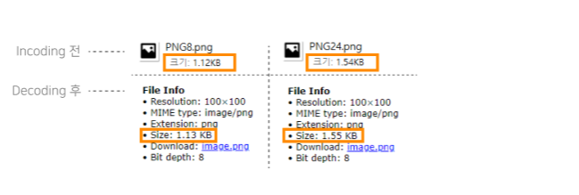

인코딩 전 파일과 디코딩된 후 `PNG-8`과 `PNG-24` 모두  
**파일 사이즈가 변하는 것**을 볼 수 있습니다.

<hr/>

### 3-2. 포토샵에서 JPG로 저장

<u>포토샵(photoshop)</u>에서 JPG로 각 품질을 저장하면 주황색 박스 부분에 노이즈가 달라진 점을 볼 수 있습니다.
> 이미지 사이즈가 작아서 확대하였습니다.

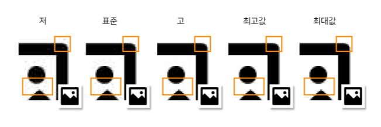

저장한 JPG 이미지를 인코딩하겠습니다.
```
// 품질 - 저
/9j/4QAYRXhpZgAASUkqAAgAAAAAAAAAAAAAAP/sABFEdWNreQABAAQAAAAKAAD/4QMsaHR0cDovL25zLmFkb2JlLmNvbS94YXAvMS4wLwA8P3hwYWNrZXQgYmVnaW49Iu+7vyIgaWQ9Ilc1TTBNcENlaGlIenJlU3pOVGN6a2M5ZCI/PiA8eDp4bXBtZXRhIHhtbG5zOng9ImFkb2JlOm5zOm1ldGEvIiB4OnhtcHRrPSJBZG9iZSBYTVAgQ29yZSA1LjYtYzE0OCA3OS4xNjQwMzYsIDIwMTkvMDgvMTMtMDE6MDY6NTcgICAgICAgICI+IDxyZGY6UkRGIHhtbG5zOnJkZj0iaHR0cDovL3d3dy53My5vcmcvMTk5OS8wMi8yMi1yZGYtc3ludGF4LW5zIyI+IDxyZGY6RGVzY3JpcHRpb24gcmRmOmFib3V0PSIiIHhtbG5zOnhtcD0iaHR0cDovL25zLmFkb2JlLmNvbS94YXAvMS4wLyIgeG1sbnM6eG1wTU09Imh0dHA6Ly9ucy5hZG9iZS5jb20veGFwLzEuMC9tbS8iIHhtbG5zOnN0UmVmPSJodHRwOi8vbnMuYWRvYmUuY29tL3hhcC8xLjAvc1R5cGUvUmVzb3VyY2VSZWYjIiB4bXA6Q3JlYXRvclRvb2w9IkFkb2JlIFBob3Rvc2hvcCAyMS4wIChXaW5kb3dzKSIgeG1wTU06SW5zdGFuY2VJRD0ieG1wLmlpZDo2Njc5Mjk1MkU3NUQxMUVCOTQ4N0IyQTUyQTM3MTFDRiIgeG1wTU06RG9jdW1lbnRJRD0ieG1wLmRpZDo2Njc5Mjk1M0U3NUQxMUVCOTQ4N0IyQTUyQTM3MTFDRiI+IDx4bXBNTTpEZXJpdmVkRnJvbSBzdFJlZjppbnN0YW5jZUlEPSJ4bXAuaWlkOjY2NzkyOTUwRTc1RDExRUI5NDg3QjJBNTJBMzcxMUNGIiBzdFJlZjpkb2N1bWVudElEPSJ4bXAuZGlkOjY2NzkyOTUxRTc1RDExRUI5NDg3QjJBNTJBMzcxMUNGIi8+IDwvcmRmOkRlc2NyaXB0aW9uPiA8L3JkZjpSREY+IDwveDp4bXBtZXRhPiA8P3hwYWNrZXQgZW5kPSJyIj8+/+4ADkFkb2JlAGTAAAAAAf/bAIQAFBAQGRIZJxcXJzImHyYyLiYmJiYuPjU1NTU1PkRBQUFBQUFERERERERERERERERERERERERERERERERERERERAEVGRkgHCAmGBgmNiYgJjZENisrNkREREI1QkRERERERERERERERERERERERERERERERERERERERERERERERERE/8AAEQgAZABkAwEiAAIRAQMRAf/EAHgAAQEBAQEBAQAAAAAAAAAAAAAGBwMEBQIBAQAAAAAAAAAAAAAAAAAAAAAQAAEDAQELCQgBBQEAAAAAAAABAgMEETFxsRIyklMUBQYWIWGhweFSctIzQVFCYrITczQj8JHRIkMVEQEAAAAAAAAAAAAAAAAAAAAA/9oADAMBAAIRAxEAPwCzAPBtXasWy4vuy2ratjWpdVQPeCP45j0C5/YOOWaBc/sAsAR/HLNAuf2DjlmgXP7ALAEfxyzQLn9g45ZoFz+wCwBH8cs0C5/YOOWaBc/sAsATFFvjBUytikjdHjLio621LV99wpwAAAEfvz6cF9/UWBH785EF9/UBL7L2XLtSVYYVajkar/8AdVsstRPYi+8+xwVW9+LOd5RuV+6/8TvqaaABn/BVb34s53lHBVb34s53lNAAGf8ABVb34s53lHBVb34s53lNAPn7S2xTbMaizuW12S1vK5QI/gqt78Wc7ynKo3QrKeJ8z3xq1jXPWxzrbGpb3Sw2Zt+k2k7EiVWvu4j0sXrTpPRtb9Ko/FJ9KgZZSevH424TYDH6T14/G3CbAAAAAj9+ciC+/qLAj9+ciC+/qA+fuV+6/wDE76mlxNWwQSMhkejZJMhq+3+ukzbYe1G7LlknVMZyxqxifMrm3ebkPDVVctXKs8zlc9y3f8Aa+CT3b3k1iykq1/kuMevxcy/Nhv3awAZ3vhHI2vxn5LmtxLyXenCaIcKqjhrGfbnYj2/N1e4DM9gMkfXw/attR6KvhTK6DRtrfpVH4pPpU57OgoIHSR0aMR7VskxeVUvrd7ec6bW/SqPxSfSoGWUnrx+NuE2Ax+k9ePxtwmwAAAAI/fnIgvv6iwI/fnIgvv6gIkAAEWwut295NYspKtf5LjHr8XMvzYb92FCLYBsxJ7ybyavbSUi/yXHvT4eZPmwX7nxuLKrVNX/65P3vbi+b5uvlJ5VtA9NFXTUMyTwrY5P7KnuUv/8A14tqbMnkj5HpFJjs9rVxV6Pcpm50hnkgVVjcqYzXMdztclioB+qT14/G3CbAY/SevH424TYAAAAEfvzkQX39RYEfvzkQX39QESAAAAAAAAAAO1J68fjbhNgMfpPXj8bcJsAAAACY3xopamCOSJqu+25cZG8q2L7egpwBj+qT6N+ao1SfRvzVNgAGP6pPo35qjVJ9G/NU2AAY/qk+jfmqNUn0b81TYABj+qT6N+ao1SfRvzVNgAGVbO2dUzVMbWxuymqqq1bES26pqoAAAAAAAAAAAAAAAAAAAAAAB//Z
// 품질 - 표준
/9j/4QAYRXhpZgAASUkqAAgAAAAAAAAAAAAAAP/sABFEdWNreQABAAQAAAAeAAD/4QMsaHR0cDovL25zLmFkb2JlLmNvbS94YXAvMS4wLwA8P3hwYWNrZXQgYmVnaW49Iu+7vyIgaWQ9Ilc1TTBNcENlaGlIenJlU3pOVGN6a2M5ZCI/PiA8eDp4bXBtZXRhIHhtbG5zOng9ImFkb2JlOm5zOm1ldGEvIiB4OnhtcHRrPSJBZG9iZSBYTVAgQ29yZSA1LjYtYzE0OCA3OS4xNjQwMzYsIDIwMTkvMDgvMTMtMDE6MDY6NTcgICAgICAgICI+IDxyZGY6UkRGIHhtbG5zOnJkZj0iaHR0cDovL3d3dy53My5vcmcvMTk5OS8wMi8yMi1yZGYtc3ludGF4LW5zIyI+IDxyZGY6RGVzY3JpcHRpb24gcmRmOmFib3V0PSIiIHhtbG5zOnhtcD0iaHR0cDovL25zLmFkb2JlLmNvbS94YXAvMS4wLyIgeG1sbnM6eG1wTU09Imh0dHA6Ly9ucy5hZG9iZS5jb20veGFwLzEuMC9tbS8iIHhtbG5zOnN0UmVmPSJodHRwOi8vbnMuYWRvYmUuY29tL3hhcC8xLjAvc1R5cGUvUmVzb3VyY2VSZWYjIiB4bXA6Q3JlYXRvclRvb2w9IkFkb2JlIFBob3Rvc2hvcCAyMS4wIChXaW5kb3dzKSIgeG1wTU06SW5zdGFuY2VJRD0ieG1wLmlpZDo3RENCRTc5OEU3NUQxMUVCQkUzMUJDQTQwMUMxRTc2NiIgeG1wTU06RG9jdW1lbnRJRD0ieG1wLmRpZDo3RENCRTc5OUU3NUQxMUVCQkUzMUJDQTQwMUMxRTc2NiI+IDx4bXBNTTpEZXJpdmVkRnJvbSBzdFJlZjppbnN0YW5jZUlEPSJ4bXAuaWlkOjdEQ0JFNzk2RTc1RDExRUJCRTMxQkNBNDAxQzFFNzY2IiBzdFJlZjpkb2N1bWVudElEPSJ4bXAuZGlkOjdEQ0JFNzk3RTc1RDExRUJCRTMxQkNBNDAxQzFFNzY2Ii8+IDwvcmRmOkRlc2NyaXB0aW9uPiA8L3JkZjpSREY+IDwveDp4bXBtZXRhPiA8P3hwYWNrZXQgZW5kPSJyIj8+/+4ADkFkb2JlAGTAAAAAAf/bAIQAEAsLCwwLEAwMEBcPDQ8XGxQQEBQbHxcXFxcXHx4XGhoaGhceHiMlJyUjHi8vMzMvL0BAQEBAQEBAQEBAQEBAQAERDw8RExEVEhIVFBEUERQaFBYWFBomGhocGhomMCMeHh4eIzArLicnJy4rNTUwMDU1QEA/QEBAQEBAQEBAQEBA/8AAEQgAZABkAwEiAAIRAQMRAf/EAIAAAQEBAAMBAQAAAAAAAAAAAAAHBgMEBQIIAQEAAAAAAAAAAAAAAAAAAAAAEAAABQEBCQwIBAcBAAAAAAAAAQIDBAURMUFREpM0VAYHIbHRInKy0hNzFVUXcZFSkrPTdDXBgkMUYYEyQmIzJEQRAQAAAAAAAAAAAAAAAAAAAAD/2gAMAwEAAhEDEQA/AKAADzK9XodBhlKlEpZrViNNIsxlqstv3sJgPTAYM9qUe9Tl2dqXQDzSj+HLypdABvAGD80o/hy8qXQDzSj+HLypdABvAGD80o/hy8qXQDzSj+HLypdABvAGD80o/hy8qXQDzSj+HLypdABvAGOpm0enzZjUV+MuN1yiQhzGJaSUo7CxtxNhDYgAAAAMHtSP/npxXsd3eQN4MHtSzenct3eQAxtCoUuvS1w4a20OIbN0zdNSU4qVJR/YlW7xh73ljXtIie+58kNmP36R9Iv4jIqACX+WNe0iJ77nyQ8sa9pET33PkioAAl/ljXtIie+58kPLGvaRE99z5IqA8utaxUuhtoVOcPHct6tlBYziiK6dm5uekBg/LGvaRE99z5I4Zmzutw4j8x1+KbcdtbqyStw1GltJrOy1ot3cG7omttHrjhsxVrbkERn1LySSsyK6acU1JP1jt6wfYan9I/8ADUAi9Pz+N2zfOIXgQen5/G7ZvnELwAAAAAwe1LN6dy3d5A3gwe1LN6dy3d5ADy9mP36R9Iv4jIosipwIspiHIfQ3IlGZMtqPdVZvYCtu3BJNVq6igy5M1SDdcVGU0yi8biltqLGPBYkx506oS6hLXNluG4+4dpqwYCTgIrwC7gMRqXroUwkUqqrslFxY8hX6uBCz9vAd/wBN3bgAlO0ZmSjWE3XSPqXWkdQd7FSViiL81vrFWHVn02BUmeonMIkN3SJZW2HhSd0v5AJDqk1Jd1jp5RrcdLyVrMrzaTtct/LaQrGsH2Gp/SP/AA1Dho0XV6I7Jj0dDKHmVEiSTZ4y0ndxVKO07Px/iObWD7DU/pH/AIagEXp+fxu2b5xC8CD0/P43bN84heAAAAAGD2pZvTuW7vIG8GD2pZvTuW7vIATsAAAIzI7S3DK4YpOpeuhTCRSqquyUXFjyFfq4ELP28B3/AE3ZsBGZHaW4ZXDAfoAYjXTXQoZLpVKXbKPiyJCf0sKEH7eE73pueB5gVfuXu/8A9f8AR++t4/VWYPb/AMvx3RlTMzO090zumA7lMqs2lTUTYbhpeSfGt3UrSd1KyvkYpxaww69qpUn2DxHkRHyfYM+M2rqletJ3jElHNHlyIpuHHcNs3W1suWXFNuFiqSfpIB9U/P43bN84heBB6fn8btm+cQvAAAAADB7Us3p3Ld3kDeDB7Us3p3Ld3kAJ2AAAAAAAAAAAAA7FPz+N2zfOIXgQen5/G7ZvnELwAAAAAx20emTJtPjPxWlPftlq6xCCNSiSsi41hXixRsQAQfu+foz2TVwB3fP0Z7Jq4BeAAQfu+foz2TVwB3fP0Z7Jq4BeAAQfu+foz2TVwB3fP0Z7Jq4BeAAQfu+foz2TVwB3fP0Z7Jq4BeAARSjUaqSapFbbiu/7UKUpSFElKSURmpRmW4RC1gAAAAAAAAAAAAAAAAAAAAAAAAAAAAP/2Q==
// 품질 - 고
/9j/4QAYRXhpZgAASUkqAAgAAAAAAAAAAAAAAP/sABFEdWNreQABAAQAAAA8AAD/4QMsaHR0cDovL25zLmFkb2JlLmNvbS94YXAvMS4wLwA8P3hwYWNrZXQgYmVnaW49Iu+7vyIgaWQ9Ilc1TTBNcENlaGlIenJlU3pOVGN6a2M5ZCI/PiA8eDp4bXBtZXRhIHhtbG5zOng9ImFkb2JlOm5zOm1ldGEvIiB4OnhtcHRrPSJBZG9iZSBYTVAgQ29yZSA1LjYtYzE0OCA3OS4xNjQwMzYsIDIwMTkvMDgvMTMtMDE6MDY6NTcgICAgICAgICI+IDxyZGY6UkRGIHhtbG5zOnJkZj0iaHR0cDovL3d3dy53My5vcmcvMTk5OS8wMi8yMi1yZGYtc3ludGF4LW5zIyI+IDxyZGY6RGVzY3JpcHRpb24gcmRmOmFib3V0PSIiIHhtbG5zOnhtcD0iaHR0cDovL25zLmFkb2JlLmNvbS94YXAvMS4wLyIgeG1sbnM6eG1wTU09Imh0dHA6Ly9ucy5hZG9iZS5jb20veGFwLzEuMC9tbS8iIHhtbG5zOnN0UmVmPSJodHRwOi8vbnMuYWRvYmUuY29tL3hhcC8xLjAvc1R5cGUvUmVzb3VyY2VSZWYjIiB4bXA6Q3JlYXRvclRvb2w9IkFkb2JlIFBob3Rvc2hvcCAyMS4wIChXaW5kb3dzKSIgeG1wTU06SW5zdGFuY2VJRD0ieG1wLmlpZDpCNjQ5NEE4MEU3NUQxMUVCOEU0MEZCNzIzNUUxMTg0QyIgeG1wTU06RG9jdW1lbnRJRD0ieG1wLmRpZDpCNjQ5NEE4MUU3NUQxMUVCOEU0MEZCNzIzNUUxMTg0QyI+IDx4bXBNTTpEZXJpdmVkRnJvbSBzdFJlZjppbnN0YW5jZUlEPSJ4bXAuaWlkOkI2NDk0QTdFRTc1RDExRUI4RTQwRkI3MjM1RTExODRDIiBzdFJlZjpkb2N1bWVudElEPSJ4bXAuZGlkOkI2NDk0QTdGRTc1RDExRUI4RTQwRkI3MjM1RTExODRDIi8+IDwvcmRmOkRlc2NyaXB0aW9uPiA8L3JkZjpSREY+IDwveDp4bXBtZXRhPiA8P3hwYWNrZXQgZW5kPSJyIj8+/+4ADkFkb2JlAGTAAAAAAf/bAIQABgQEBAUEBgUFBgkGBQYJCwgGBggLDAoKCwoKDBAMDAwMDAwQDA4PEA8ODBMTFBQTExwbGxscHx8fHx8fHx8fHwEHBwcNDA0YEBAYGhURFRofHx8fHx8fHx8fHx8fHx8fHx8fHx8fHx8fHx8fHx8fHx8fHx8fHx8fHx8fHx8fHx8f/8AAEQgAZABkAwERAAIRAQMRAf/EAIQAAQEAAgMBAQAAAAAAAAAAAAAIBQkBBgcEAwEBAAAAAAAAAAAAAAAAAAAAABAAAAUCAgQFEAgGAwAAAAAAAAECAwQFBhEHIRKUCEETVRYYMSIystJzs9N0tNQ1dTZWN2FxQlJyM0MVUYGRoWIUkyUXEQEAAAAAAAAAAAAAAAAAAAAA/9oADAMBAAIRAxEAPwCqQAAAAAAAAAAAAAAAAAB03NPNO3suLeTWKwlx9T7nEQoTGrxrruqasC1jIkpSRdcrg+sB4me/FScTwtKQZcBnMQR4f8IDjpx0r4Rf21HiQDpx0r4Rf21HiQDpx0r4Rf21HiQDpx0r4Rf21HiQDpx0r4Rf21HiQDpx0r4Rf21HiQDpx0r4Rf21HiQGesrfEtO4Lhh0eo0aTSP991MdiWbyH2kuOGSUcZgltSUmo8McDwAUCAAACYd+Iz/abSLHQciYZlwYkhkBPOV+V9fzHr8ih0OREjS40Rc1a5q3ENm2hxtoyI2m3la2s8XB/HSA9Q6FWafKtD2iZ6IAdCrNPlWh7RM9EAOhVmnyrQ9omeiAHQqzT5Voe0TPRADoVZp8q0PaJnogB0Ks0+VaHtEz0QBj7h3RMyaDQKnXJlSozkSlRH5shDL8o3FNx21OrJBKjJSajSnRiZfWA8ktP3po3l0bwyQGz8AAAEwb8fqq0e/ze0ZAdK3KvmnVfYcjzyIAtQAAAAB0vMnN6yMu4rDtxSllIlYnFgRkcbIcJPZKJOKSSkvvKURAMblpn5l7mFLXAoz78WqISbhU6e2lp5aE9kpGop1teHCRLx+gBnM2PlZeXsOpeZuANdVp+9NG8ujeGSA2fgAAAmDfj9VWj3+b2jIDpW5V806r7DkeeRAFc1e9bUo9bplDqdTYi1asKUmnRHFYLdNP9k4n1qdbDWVoLEwGbAAABDm+DAq7GbapcxKzgy4Mf9scPE0cW2RpcQk+oRpd1lGX+WPCA6bkJBrEzOC1U0ol8ezPafkLQR9bFaPWk6xl1EmzrJ/ngAuvNj5WXl7DqXmbgDXVafvTRvLo3hkgNn4AAAJg34/VVo9/m9oyA8QyPzQjZb1+s15yMcyU9SHodOj9RCpLkiOtPGqLSSEpaUo8NJ4YcIDqFz3ZX7nr8mvVqWuVU5S9dbxnhq4dilsi0ISgtCSLqAKt3cN49NdTGs28pJJraSJqlVV08ClkWhLLyj/X+6r7f4uyCkAABh7os+17qp/7fcVMYqcQj1kNvoxNCuprNrLBSFfSkyMB1/Lqh5R0afV6ZY0eAxUYDiWKyiKfGSEKMtYkOOLNThpI+DW1SURl2RGA+7Nj5WXl7DqXmbgDXVafvTRvLo3hkgNn4AAAJg34/VVo9/m9oyAkoAAcpUpKiUkzSpJ4pUWgyMuEgFh7uG8emupjWbeUkk1tJE1Sqq6eBSyLQll5R/r/AHVfb/F2QUgAm/eP3j00JMmzbNkkqtqI2qrVWjxKIR6FMsqL9f7yvsfi7EJbsq+bks25GLgoco2Z7JnxhKxU282o8VtPJx69C+H+pYGRGAtFObVu5kZFXhUacomKixQqgiqUtaiNyO4cN36tZtWHWL4foMjIgiO0/emjeXRvDJAbPwAAATBvx+qrR7/N7RkBJQAAAOUqUlRKSZpUk8UqLQZGXCQD2/pYX/8A+cc2Mf8AvfyOcmufH/6urhhq4fn8HG49TThr9cA8QUpSlGpRmpSjxUo9JmZ8JgOAH30iu1ejuSV02UuMc2K/Blkg9DsaS2bbrSyPQpKkq4eoeBlpIgH7Wn700by6N4ZIDZ+AAACYN+P1VaPf5vaMgJKAAAAAAAAAAGVtP3po3l0bwyQGz8AAAEwb8fqq0e/ze0ZASUAAAAAAAAAAMrafvTRvLo3hkgNn4AAAJ+3xLKuG4LTo1Ro8N2f+0SXjlsR0m44lp9CS4zUSRqNKVNljh1MQEg807p5GnbM93IBzTunkadsz3cgHNO6eRp2zPdyAc07p5GnbM93IBzTunkadsz3cgHNO6eRp2zPdyAc07p5GnbM93IBzTunkadsz3cgOyZdZdXtVr2osWLRZhGUxhx55xhxDTTSHEqW44tSSJKUkQDY2AAAAAAAAAAAAAAAAAAAAAAAAAAAAAAAAAAAAA//Z
// 품질 - 최고값
/9j/4QAYRXhpZgAASUkqAAgAAAAAAAAAAAAAAP/sABFEdWNreQABAAQAAABQAAD/4QMsaHR0cDovL25zLmFkb2JlLmNvbS94YXAvMS4wLwA8P3hwYWNrZXQgYmVnaW49Iu+7vyIgaWQ9Ilc1TTBNcENlaGlIenJlU3pOVGN6a2M5ZCI/PiA8eDp4bXBtZXRhIHhtbG5zOng9ImFkb2JlOm5zOm1ldGEvIiB4OnhtcHRrPSJBZG9iZSBYTVAgQ29yZSA1LjYtYzE0OCA3OS4xNjQwMzYsIDIwMTkvMDgvMTMtMDE6MDY6NTcgICAgICAgICI+IDxyZGY6UkRGIHhtbG5zOnJkZj0iaHR0cDovL3d3dy53My5vcmcvMTk5OS8wMi8yMi1yZGYtc3ludGF4LW5zIyI+IDxyZGY6RGVzY3JpcHRpb24gcmRmOmFib3V0PSIiIHhtbG5zOnhtcD0iaHR0cDovL25zLmFkb2JlLmNvbS94YXAvMS4wLyIgeG1sbnM6eG1wTU09Imh0dHA6Ly9ucy5hZG9iZS5jb20veGFwLzEuMC9tbS8iIHhtbG5zOnN0UmVmPSJodHRwOi8vbnMuYWRvYmUuY29tL3hhcC8xLjAvc1R5cGUvUmVzb3VyY2VSZWYjIiB4bXA6Q3JlYXRvclRvb2w9IkFkb2JlIFBob3Rvc2hvcCAyMS4wIChXaW5kb3dzKSIgeG1wTU06SW5zdGFuY2VJRD0ieG1wLmlpZDpCQUFDMTYzOUU3NUQxMUVCQjc2QUZGQTU2MTJCRTUxQSIgeG1wTU06RG9jdW1lbnRJRD0ieG1wLmRpZDpCQUFDMTYzQUU3NUQxMUVCQjc2QUZGQTU2MTJCRTUxQSI+IDx4bXBNTTpEZXJpdmVkRnJvbSBzdFJlZjppbnN0YW5jZUlEPSJ4bXAuaWlkOkJBQUMxNjM3RTc1RDExRUJCNzZBRkZBNTYxMkJFNTFBIiBzdFJlZjpkb2N1bWVudElEPSJ4bXAuZGlkOkJBQUMxNjM4RTc1RDExRUJCNzZBRkZBNTYxMkJFNTFBIi8+IDwvcmRmOkRlc2NyaXB0aW9uPiA8L3JkZjpSREY+IDwveDp4bXBtZXRhPiA8P3hwYWNrZXQgZW5kPSJyIj8+/+4ADkFkb2JlAGTAAAAAAf/bAIQAAgICAgICAgICAgMCAgIDBAMCAgMEBQQEBAQEBQYFBQUFBQUGBgcHCAcHBgkJCgoJCQwMDAwMDAwMDAwMDAwMDAEDAwMFBAUJBgYJDQsJCw0PDg4ODg8PDAwMDAwPDwwMDAwMDA8MDAwMDAwMDAwMDAwMDAwMDAwMDAwMDAwMDAwM/8AAEQgAZABkAwERAAIRAQMRAf/EAIAAAQACAwEBAAAAAAAAAAAAAAAJCgYHCAIFAQEAAAAAAAAAAAAAAAAAAAAAEAAABAQCAwgQBAcAAAAAAAAAAQIDBAUGBxEIIRIJIhPTtJXVFxkxIzOzFHW1NlZ2ljdXdzhYQTIVFlGBQjQ1JxgRAQAAAAAAAAAAAAAAAAAAAAD/2gAMAwEAAhEDEQA/AJ/AAAAAAAAAAAAAAAAAABzPmnzT29ym29YryvGI2auzWNKWUzTMsJs4uPizbU6ZEbqkpQ2hKTNazPc6CIjUaUmEXa9uLSZLUTeXebqQRnqKVUTCTMvwMyKAPA/5gPPXi0r9u019o2ObwDrxaV+3aa+0bHN4B14tK/btNfaNjm8A68Wlft2mvtGxzeAdeLSv27TX2jY5vAOvFpX7dpr7Rsc3gHXi0r9u019o2ObwG2rK7Ye01z7g01QVVW0nVuf3ZHsSuVVEuPYmUG3FxS0tMFFarUMttClqJJrIlaugz3OJkEwgAAAII9uKtZUnl3bJRkhU3qJSkY6DNLEARGZfxLEwEN2V/K/X2bOvpvbm3M3p+SzuS0/EVJFRVSREVDQqoWGioSDWhC4OEjFm4a4xBkRoIsCVuscCMO7+pUzT+n1quVZ5zGAdSpmn9PrVcqzzmMA6lTNP6fWq5VnnMYB1Kmaf0+tVyrPOYwDqVM0/p9arlWecxgHUqZp/T61XKs85jAYhcLZE5kra0DXFxp7W1tYuSUBT8zqScQsBMpw5FOwsqhXIx9DCHZM0hTikNGSCUtJGeGKiLSAjvtP707aetUm48yAvegAAAgh24vmrl28a1H3iXgOX9ip9U9ffKqa+XJGAs/AAAAAOY8yWbyyWVWVyqNupPolE0nxOKkFJShjwyaxiGtDjqGTW2hDaTPDXdWhJnoIzPQAwnLVn4y9ZpptE0zQM1mshrOHZXEt0XU8K3BR8RDtFi47Dmw/Ew7pILSpKHTWRbo0knSA2nmx+ljMt8qqy8hxgCmDaf3p209apNx5kBe9AAABBDtxfNXLt41qPvEvAcv7FT6p6++VU18uSMBYtq69VqqDrahrcVfXUqkFb3IdcZoynYt3VfjVNkfY0GlslqLe2zcNO+OdrRrL3IDaIAAAKq22DkFXy7Ns7PJ81EKpuoqWlJ0NFrNSmPBYRCmophtWGqk0RRurUgjxLfCUf5yAc0ZCZHWE9zgWCaopET+oS2rIGZzeIhyUe9SeEXvk1N1SfyoXCE42ZnoPW1fxwAWwc2P0sZlvlVWXkOMAUwbT+9O2nrVJuPMgL3oAAAIIduL5q5dvGtR94l4CLLI/mglmUqvrl3MipI5Uc6mVu4+nqMkxGaYd6bRc0lcQycW4RkpDKG4Zxa9XdK1SQWBq1iDnO5916+vFX07uZcGoome1hPYkoiJmS1GgmSQfamYZCcCZaZIiS2hGBJItACwNs4do83chuSWDv5O0tXEaSiCoCv41ZJTPkpLVbgY5xWgo0i0NuH3fsH27uwTYgADW10LPWvvTT/wC1rq0NKa5kaFm7DQkzYJxcO6ZapuwzydV1hZlo1m1JVhoxwAaey60RlHt/PbjUhlxlFIyuqqRjW5ZcuGkrhxMzhnlpJ1EPFRL63X1NpPEtUlmhLiVo0OIWkgyvNj9LGZb5VVl5DjAFMG0/vTtp61SbjzIC96AAACCHbi+auXbxrUfeJeArwgAD2244y42604pp1pRLadQZpUlSTxIyMtJGRgLJGzh2jzdyG5JYO/k7S1cRpKIKgK/jVklM+SktVuBjnFaCjSLQ24fd+wfbu7BNiAhO2j20ebtu3O7B2DnaXbiOpXBV/X8EslJkKVFquQMC4nQcaZaHHC7h2C7d3EIErK3yuPYG48pujbmeuS6pJc4fhiHjU5DTGGcUSn4SOa1i35p7DdEZ4keC0mlaUqILOjebW3mbTIrmRqulHUymqZTairWK7oR90lxcqi1yKMwMjwSbsO6aTNl4iIlERkZJWlaEhVstP707aetUm48yAvegAAAgh24vmrl28a1H3iXgK8IAAAPbbjjLjbrTimnWlEtp1BmlSVJPEjIy0kZGAlM62G//APzj0Pa/+yf8Z027+f6l+i73q6u96v8Aff0eFa2OputXfu2gIs3HHHnHHXXFOuuqNbrqzNSlKUeJmZnpMzMB4AZbSNd1dQb88iKRn0VI3KmkUypqoUw6sERspm8MuFjYR9BkaVocbWegy3KiStOC0pUQfStP707aetUm48yAvegAAAgh24vmrl28a1H3iXgK8IAAAAAAAAAAz+0/vTtp61SbjzIC96AAACCHbi+auXbxrUfeJeArwgAAAAAAAAADP7T+9O2nrVJuPMgL3oAAAIe9sPZW4Nz7TW0qqgqaj6s6OZ1HrqKVSthcVFtwcyYaT4UTDSVLUhtcMRLNJbnWxMtXEyCuN0T3T+GlVcjR3AgHRPdP4aVVyNHcCAdE90/hpVXI0dwIB0T3T+GlVcjR3AgHRPdP4aVVyNHcCAdE90/hpVXI0dwIB0T3T+GlVcjR3AgHRPdP4aVVyNHcCA3Vl2y7Xsri9lspNJrZVI2pupJZFzGYxcsi4aEg4SGi2nX4mJfdaShtttCTMzM9PYLFRkRhdTAAAAAAAAAAAAAAAAAAAAAAAAAAAAAAAAAAAAAf/9k=
// 품질 - 최대값
/9j/4QAYRXhpZgAASUkqAAgAAAAAAAAAAAAAAP/sABFEdWNreQABAAQAAABkAAD/4QMsaHR0cDovL25zLmFkb2JlLmNvbS94YXAvMS4wLwA8P3hwYWNrZXQgYmVnaW49Iu+7vyIgaWQ9Ilc1TTBNcENlaGlIenJlU3pOVGN6a2M5ZCI/PiA8eDp4bXBtZXRhIHhtbG5zOng9ImFkb2JlOm5zOm1ldGEvIiB4OnhtcHRrPSJBZG9iZSBYTVAgQ29yZSA1LjYtYzE0OCA3OS4xNjQwMzYsIDIwMTkvMDgvMTMtMDE6MDY6NTcgICAgICAgICI+IDxyZGY6UkRGIHhtbG5zOnJkZj0iaHR0cDovL3d3dy53My5vcmcvMTk5OS8wMi8yMi1yZGYtc3ludGF4LW5zIyI+IDxyZGY6RGVzY3JpcHRpb24gcmRmOmFib3V0PSIiIHhtbG5zOnhtcD0iaHR0cDovL25zLmFkb2JlLmNvbS94YXAvMS4wLyIgeG1sbnM6eG1wTU09Imh0dHA6Ly9ucy5hZG9iZS5jb20veGFwLzEuMC9tbS8iIHhtbG5zOnN0UmVmPSJodHRwOi8vbnMuYWRvYmUuY29tL3hhcC8xLjAvc1R5cGUvUmVzb3VyY2VSZWYjIiB4bXA6Q3JlYXRvclRvb2w9IkFkb2JlIFBob3Rvc2hvcCAyMS4wIChXaW5kb3dzKSIgeG1wTU06SW5zdGFuY2VJRD0ieG1wLmlpZDpCRTFBM0VBQ0U3NUQxMUVCOEY0NEE2NUI0NEVBNDRCRiIgeG1wTU06RG9jdW1lbnRJRD0ieG1wLmRpZDpCRTFBM0VBREU3NUQxMUVCOEY0NEE2NUI0NEVBNDRCRiI+IDx4bXBNTTpEZXJpdmVkRnJvbSBzdFJlZjppbnN0YW5jZUlEPSJ4bXAuaWlkOkJFMUEzRUFBRTc1RDExRUI4RjQ0QTY1QjQ0RUE0NEJGIiBzdFJlZjpkb2N1bWVudElEPSJ4bXAuZGlkOkJFMUEzRUFCRTc1RDExRUI4RjQ0QTY1QjQ0RUE0NEJGIi8+IDwvcmRmOkRlc2NyaXB0aW9uPiA8L3JkZjpSREY+IDwveDp4bXBtZXRhPiA8P3hwYWNrZXQgZW5kPSJyIj8+/+4ADkFkb2JlAGTAAAAAAf/bAIQAAQEBAQEBAQEBAQEBAQEBAQEBAQEBAQEBAQEBAQEBAQEBAQEBAQEBAQEBAQICAgICAgICAgICAwMDAwMDAwMDAwEBAQEBAQECAQECAgIBAgIDAwMDAwMDAwMDAwMDAwMDAwMDAwMDAwMDAwMDAwMDAwMDAwMDAwMDAwMDAwMDAwMD/8AAEQgAZABkAwERAAIRAQMRAf/EAH4AAQACAwEBAAAAAAAAAAAAAAAKCwcICQMGAQEAAAAAAAAAAAAAAAAAAAAAEAAABQQAAQQQBAMJAAAAAAACAwQGBwABBQgJd5cKGhESExQVttY3V7fXGDhYmFl4uNg5MRYXISIzJEQlNigZEQEAAAAAAAAAAAAAAAAAAAAA/9oADAMBAAIRAxEAPwCfxQKBQKBQKBQKBQKBQKBQKDmhxTeKbr1wm9ekM8TwhdDrVut0FsaNI0YxeNMdr8dpmNW5c4gg7LrUOOw7fw+OQiOyOROEMCUAywALOPOJJMCLsd04mJgmm2I4eEiGEWMHYkw7YltEGmFWFexYzSQRKoASYIHYuINjB2Df+ywr/wAbh59eLiv7dsgfUc3PZBQOvFxX9u2QPqObnsgoHXi4r+3bIH1HNz2QUDrxcV/btkD6jm57IKB14uK/t2yB9Rzc9kFA68XFf27ZA+o5ueyCgdeLiv7dsgfUc3PZBQba6VdMP1O2e2CjaBZV1pk7XT+q7uwjCa0iKH62pJZ+NdTnyKPDtwl5WT4Fl5XAYXI5VYFOYuJJXASCGAZwQkd1NJCYPQKBQQR+nEnGhibh4EWNMsQZImxJxhNhisUYaQ2olASaMu1+0EYSBQZYIr27IbDFa38b9kIb3C/4X8+8WWfXfrpro74fZb2ZcP5+a8plJrz70bjVUNVuPSP2Kux+PXMWP5Hy5rgNy8joTCijEJSYSYo8QjwjCWWaHd7qVPFN9PmgHOnsV+lWgdSp4pvp80A509iv0q0DqVPFN9PmgHOnsV+lWgdSp4pvp80A509iv0q0DqVPFN9PmgHOnsV+lWgdSp4pvp80A509iv0q0GH9heiKcSTWuApw2LfU26QZZkwDD8lzW8cW05Jnlc6sk1YrZeafThx7aQ5jWvBYhY4FmIwRxaIpUuRpjFIgBNPJBcRgQjw6n/FNrVy/w36xW5QXvNAoFBBD6cX5q+HbygbHeLkQUHMDoVP7ps+fgAlP8xWqtBZ90CgUCg5jcSPi8aScKxrtbNbUvzNFOl+hXnMKJo6wQXjKTvRYoQAZLLoMCZkMRisRgUZ5gSb5DLL8ciNUX7iUaM0IgWDCnDV4+HD24pjsyUZQG6n8w5mQY1dnE8MTo1sSy37n2/jAd0yWaapzadD4ZTmJxpPZNUpkWYOyCYgNzjU4CQ3MsG0vFi/ay4ln4ANyPy6yNQUwup/xTa1cv8N+sVuUF7zQKBQQQ+nF+avh28oGx3i5EFBzA6FT+6bPn4AJT/MVqrQWLUt7qaqwPNkHa5S/ObBYM3bILsjjoYjtwZayXOPJRjizf8PsFjR4UnLLyvB+LMyBqQGYyt7IUN1Cvsk2DaGgUCgqrOmDMGXm9xbFb4fibMGRvIkBxQKDcuqGoU4SzXaeOV4V5NvEqBF2SI1mIkkzKr1aEAxGFWzBKkdg2WF3EHNPgKMeYX1xgNBE0KFZqzhbWwrIfDvX4YlUK2Lh5pZAOWmg3LqU9u0Q4XKRiTlMacM4QSjbrgkf3hHBAILYDixftZcSz8AG5H5dZGoKYXU/4ptauX+G/WK3KC95oFAoIIfTi/NXw7eUDY7xciCgiy8D/igNnhLT3stsxlGQskZ5uXTR/Q5DLNCMaXA5aWnVMkDOjBGvbJkmlq8Wy8Pg2Pk1y0Se11KnvYCQm5RigJ5Qc59ntrp83Fnx67MbByHmn1MD6zQMxkXIoPGkLxBaQdrYTBNRAlEBK12y10oC0+MQo7FkIiCwhBbs9kVwsDOjh9I8T7IJ2ToPvw9iUuw6UlE2YCn1zLQEJ56TkAAlxUdyJlVQwlkzUSWEJWNyRorBdobWJOv4Z7UWWCbFQKDW3aDT7V/dOPrRbtTB0ezixyVQ8hjsU+cGUuVt/JmFd7mZdp59OJK42hmjE17lCWYtWkVXKFcFzO0Fe1w084dkIcJCAH3sbEPDjaOurXlSInNjmNsrjYyXjc0nNnLqkxWYxzWebvcWQzrxW4FIqAaWFKDIH4pFmEi1JcJWQSLCSgytxYv2suJZ+ADcj8usjUFMLqf8U2tXL/DfrFblBe80CgUEEPpxfmr4dvKBsd4uRBQV4dAoPZOoUI1BCtIeclVJTilCZSnNGQoTqCBhNJPIOKEEwk4kwNhBEG9hBFa17X7NBZIdHD6R4n2QTsnQffh7Epdh0pKJswFPrmWgITz0nIABLio7kTKqhhLJmoksISsbkjRWC7Q2sSdfwz2ossE2KghO9I86R4n1vTvbQfQd7Eqth1RK1sz7PrZWgPTwKnPANLlY7jvKpRiLOmo4sQislkihXC0g3uSTfwz2wsSECTSzeTY7QTY5p7Ra5vpY3JJbiw62ZIyJirJNqRW1klRClyMaR8P30R/NDTdHcA99FDMAoKUAKVpjk61OnUlBZ0kcWnXni0cCviRStFKolpym0+H1trip3gjK5MhW7YqdqvW6SrgGAdi0pjiYLiMSnG4POFElkriSxlGgTrk6tInCra1P+KbWrl/hv1itygveaBQKCCH04vzV8O3lA2O8XIgoK8OgUCg9k6hQjUEK0h5yVUlOKUJlKc0ZChOoIGE0k8g4oQTCTiTA2EEQb2EEVrXtfs0EpfrYO/v/AJx+573X/sj/AMF99vw6f/Un+i3gvvTvbwb3p58P9F/OffXfPeH+Z738Nf7rQRaFChQsUHq1Z5ypUqONUKVKg0Z6hQoPGI048840QjDjjjBXEIQr3EIV73vfs0HjQZaiKdZcgde+cjEb8zzGPkyKZJg+QS8OpsFE84olxqZFmP8AZDkxx4DkGXwubwmTHcIDixiSrCiFie5StMnOLD6XU/4ptauX+G/WK3KC95oFAoIIfTi/NXw7eUDY7xciCgrw6BQKBQKBQKBQZ/1P+KbWrl/hv1itygveaBQKCCH04vzV8O3lA2O8XIgoK8OgUCgUCgUCgUGf9T/im1q5f4b9YrcoL3mgUCgh8dMP0q2C2e1O1plWBY2d0r+7pJz9USI1mFhMi53VjWfJLawKezyJbmHRrMrkcLgMqyySVxicIxJALgnDB3AJppIVxvun7TfLVP8AzNyL5OUD3T9pvlqn/mbkXycoHun7TfLVP/M3Ivk5QPdP2m+Wqf8AmbkXycoHun7TfLVP/M3Ivk5QPdP2m+Wqf+ZuRfJyge6ftN8tU/8AM3Ivk5QPdP2m+Wqf+ZuRfJyg3T4dvDt3Ym/djWZnM7WaayDCJrjJxOJxOKMnq3WkzWk3XrhMu43Y7HHl8IkxeFweFxaQw0ww0ywzR2CSSEw8wssYXU1AoFAoFAoFAoFAoFAoFAoFAoFAoFAoFAoFAoFAoFAoP//Z
```

다시 디코딩하면 파일 사이즈가 0.01 KB 달라졌습니다.
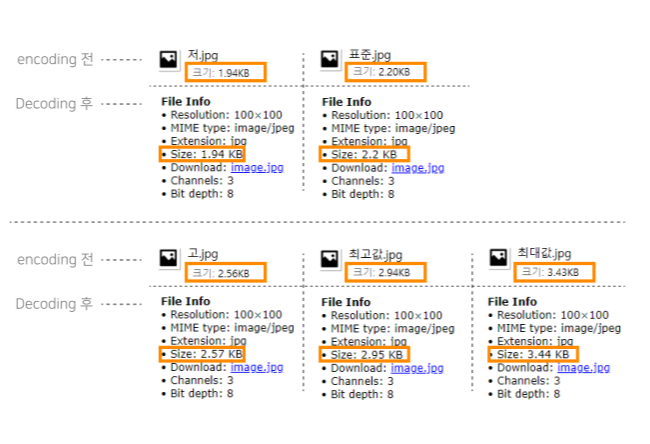

인코딩 전 파일과 디코딩된 후 `JPG` 파일은  
**파일 사이즈가 변하는 것**을 볼 수 있습니다.


<hr/>

### 4. 결과 정리

1. 픽셀기반인 피그마에서 svg, png, jpg 저장하고  
png와 jpg를 base64로 인코딩한 후 다시 디코딩하면  
**파일 사이즈가 변하지 않는 것**을 볼 수 있습니다.

2. SVG를 벡터기반인 `일러스트`에서 PNG-8, PNG-24, JPG로 저장하였을 때  
저장한 이미지를 base64로 인코딩한 후 다시 디코딩하면  
**파일 사이즈가 변하지 않는 것**을 볼 수 있습니다.

3. SVG를 픽셀기반인 `포토샵`에서 PNG-8, PNG-24, JPG로 저장하였을 때  
저장한 이미지를 base64로 인코딩한 후 다시 디코딩하면  
**파일 사이즈가 변하는 것**을 볼 수 있습니다.

> 위에 준비한 이미지는 SVG 파일을 갖고 테스트 하였습니다.  
> PNG와 JPG를 일러스트와 포토샵에서 저장하고  
> 인코딩한 후 다시 디코딩하였을때에도 차이가 있었습니다.  
> 본문이 길어지고 복잡해져서 내용은 추가하지 않았습니다.

