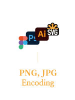

## Incoding base64 to png & jpg or svg

base64로 인코딩 할 때  
원본 이미지가 jpg와 png에 따라 결과 차이가 존재하는지 에 대해 

궁금증이 생겨서 직접 해보기로 했습니다.

## 아이콘 준비

제가 실험해볼 Picture icon 입니다.

아이콘 사이즈는 24 x 24 입니다.


Figma 에서는 canvas로 보여지기 때문에

웹에서 바로 base64를 열어볼 수 없어서

png 와 jpg 를 export 해서 살펴보기로 했습니다.


쉽게 변환해서 결과만 보기위해 구글에 png to base64 와 jpg to base64로 검색하여 사이트에서 직접 변환하였습니다.


## incoding

### png, jpg to base64 incoding

figma에서 export한 파일 사이즈 입니다.
> png는 239 B  
> jpg는 1.36KB

png는 [이곳](https://codebeautify.org/png-to-base64-converter) 에서 변환하였고


jpg 는 [이곳](https://onlinejpgtools.com/convert-jpg-to-base64) 에서 변환 하였습니다.


incoding 결과는 

*png*

> iVBORw0KGgoAAAANSUhEUgAAABgAAAAYCAYAAADgdz34AAAACXBIWXMAAAsTAAALEwEAmpwYAAAAAXNSR0IArs4c6QAAAARnQU1BAACxjwv8YQUAAACESURBVHgB7ZSLCYAwDERPcfDbzFHsJlURS0n/xoJgHwSFXHPpFxg0sh1hlbH5BSdhYPEOru5SEjQSNDijMxoD4uqYOVFqD2qWyEbqBONzMyDy3VF8q7iPGsV/6/iiQAYTeorcY4OYCSM5lYFfiImc2uCMtULj6P5UfPom/9TAQI/BoIUdD91bjFg0XxMAAAAASUVORK5CYII=


*jpg*

> /9j/4AAQSkZJRgABAgEASABIAAD/2wBDAAEBAQEBAQEBAQEBAQEBAQEBAQEBAQEBAQEBAQEBAQEBAQEBAQEBAQEBAQEBAQEBAQEBAQEBAQEBAQEBAQEBAQH/2wBDAQEBAQEBAQEBAQEBAQEBAQEBAQEBAQEBAQEBAQEBAQEBAQEBAQEBAQEBAQEBAQEBAQEBAQEBAQEBAQEBAQEBAQH/wAARCAAYABgDAREAAhEBAxEB/8QAHwAAAQUBAQEBAQEAAAAAAAAAAAECAwQFBgcICQoL/8QAtRAAAgEDAwIEAwUFBAQAAAF9AQIDAAQRBRIhMUEGE1FhByJxFDKBkaEII0KxwRVS0fAkM2JyggkKFhcYGRolJicoKSo0NTY3ODk6Q0RFRkdISUpTVFVWV1hZWmNkZWZnaGlqc3R1dnd4eXqDhIWGh4iJipKTlJWWl5iZmqKjpKWmp6ipqrKztLW2t7i5usLDxMXGx8jJytLT1NXW19jZ2uHi4+Tl5ufo6erx8vP09fb3+Pn6/8QAHwEAAwEBAQEBAQEBAQAAAAAAAAECAwQFBgcICQoL/8QAtREAAgECBAQDBAcFBAQAAQJ3AAECAxEEBSExBhJBUQdhcRMiMoEIFEKRobHBCSMzUvAVYnLRChYkNOEl8RcYGRomJygpKjU2Nzg5OkNERUZHSElKU1RVVldYWVpjZGVmZ2hpanN0dXZ3eHl6goOEhYaHiImKkpOUlZaXmJmaoqOkpaanqKmqsrO0tba3uLm6wsPExcbHyMnK0tPU1dbX2Nna4uPk5ebn6Onq8vP09fb3+Pn6/9oADAMBAAIRAxEAPwD9/v21/wBtf/gqR/w9I8O/8E5/+Cc/h39gQTj9gTT/ANtfxb4t/bX0/wDaIMTRH9ojxL8C9V8O+HdV+BfiVXjkjdfB+p6fp+p+D5FmWTxLc3PiWAwaXpdwAcX4/wDiF/wcufCjwb4h+I3xS8cf8G6Pw1+HvhHT31bxX478f+Jv2+vBvg3wxpUckcUmp+IfFHiK907RNF09JZYo3vNSvra2WSSNGkDOoIB0n7CX7dv/AAUz17/gpnf/ALAn7fdh/wAE9Nb0vW/+Cej/ALdvw6+Iv7CSfH/UNF1TRdQ+P/hb4L+GrC/8S/GjxTcW+pWepW9x4q1100LwqbSS0Pha/sPFN1HdalpsIB/N7/wdO/tuftL/ALCn/BXrwN8Qf2V/iTqHwl+IXxK/4JYfDP4Q6z460K2tJPE2leDbz9s34y/EvUIPDd9eRXEekahqWt/DDw7p19frbzyTeHrnW9JCoupvNEAesa//AMHR/wCxT+1v/wAEgPjB8Lv2/wD4CW/xd/ak1LR/Dvw08Rfs0WaeLfDHwx/aE12G8t/EvhL4xWPjnwhfaTqnwy8L+HPEnhXTPFPjLTdJ8Q6Z4w8MeKbDSoPh/PcRavpV7pIB7v8A8ENP2/vg3/wUQ/4LH/Cz4kfBb4Wf8KO0n4Lf8EAdO/Zi8U/ByyE83hX4beKvhL+2t4Ekt/DHw/1O5kludY+H8HgnxL4MvPCl5eN/aNnp16uiasZNW0i+mlAPZP8Ag4X/AODej9sv/grL+2X8Lv2jf2cvij+zJ4M8H+DP2ZPCHwT1jR/jZ4v+KnhvxJL4k8N/FT4y+Op9T0yDwL8GviTpdzodzpfxJ0u1hmutUsL9b+w1BH0/7P8AZ7iYA/B3/iCp/wCCpv8A0Xz9gD/w6f7RX/0KtAH7xf8ABvR/wb0ftl/8Emv2y/ij+0b+0b8Uf2ZPGfg/xn+zJ4v+Cej6P8E/F/xU8SeJIvEniT4qfBrx1BqepweOvg18NtLttDttL+G2qWs01rql/ftf3+nomn/Z/tFxCAD/2Q==


<hr/>

### SVG to png, jpg

이번엔 똑같은 아이콘을 figma에서 svg로 export해서 저장하였습니다.


저장한 `svg` 파일 사이즈는 806 B 입니다.


illustrator에서 저장한 svg 파일을 오픈하여  
`웹용으로 저장` 하기로 `png`를 저장하였습니다.


*일러스트에서 웹용으로 저장하기에는 옵션이 3가지가 있습니다.*

> 첫번째는 '없음' 으로 선택해서 저장하면 205 B 이고


> 두번째는 '아트최적화' 로 선택해서 저장하면 228 B 이고


> 세번째는 '문자최적화' 로 선택해서 저장하면 257 B 입니다.


처음에 `피그마`에서 바로 png로 export 할때는 239 B 였는데, svg로 export 한다음

`일러스트`로 열어서 png로 저장하니 똑같은 png 라도 파일 사이즈가 더 작아졌습니다.  
저장한 png 파일 사이즈는 228 B 입니다.


일러스트에서 `jpg`로 저장하는것도 옵션이 5가지가 있습니다.
품질이 몇퍼센트인지에 따라 이미지 상태를 볼 수 있습니다.

jpg로 저장 후 인코딩하였습니다.

> 저 품질10%
> 
```
/9j/4AAQSkZJRgABAgAAZABkAAD/7AARRHVja3kAAQAEAAAACgAA/+4AIUFkb2JlAGTAAAAAAQMAEAMCAwYAAAGSAAABvwAAAlH/2wCEABQQEBkSGScXFycyJh8mMi4mJiYmLj41NTU1NT5EQUFBQUFBREREREREREREREREREREREREREREREREREREREQBFRkZIBwgJhgYJjYmICY2RDYrKzZERERCNUJERERERERERERERERERERERERERERERERERERERERERERERERERP/CABEIABgAGAMBIgACEQEDEQH/xAB/AAEBAQEAAAAAAAAAAAAAAAAABQIDAQEAAAAAAAAAAAAAAAAAAAAAEAEAAgIDAQAAAAAAAAAAAAAEAwYCBQAgFBYRAAIBAQYDBwUAAAAAAAAAAAECAwARITFBEgRRYRPwgaHBIjJSQpLSMxQSAQAAAAAAAAAAAAAAAAAAACD/2gAMAwEAAhEDEQAAALOYey0mDtHCwD//2gAIAQIAAQUA6f/aAAgBAwABBQDp/9oACAEBAAEFAGtb7ZJdxFiB7MmWtsw35Wk6gaHYRvfYa8jaI+KbyvV5GrR//9oACAECAgY/AB//2gAIAQMCBj8AH//aAAgBAQEGPwAbPZiL9XWJm1fLT9PdlReRtoqjFmMgAr+XddEgw9ZWh1fIKL2Pa6+leBijNAqkjGzWx8qaPdprmuXReFfMNaMML/DkrxroCbXplcgVcYcrLKWaFkChAnrJBtBY5KeNe+L7m/GmmmZCpQp6CSbSVOajhX//2Q==
```
> 중 품질30%
> 
```
/9j/4AAQSkZJRgABAgAAZABkAAD/7AARRHVja3kAAQAEAAAAHgAA/+4AIUFkb2JlAGTAAAAAAQMAEAMCAwYAAAGSAAABwgAAAof/2wCEABALCwsMCxAMDBAXDw0PFxsUEBAUGx8XFxcXFx8eFxoaGhoXHh4jJSclIx4vLzMzLy9AQEBAQEBAQEBAQEBAQEABEQ8PERMRFRISFRQRFBEUGhQWFhQaJhoaHBoaJjAjHh4eHiMwKy4nJycuKzU1MDA1NUBAP0BAQEBAQEBAQEBAQP/CABEIABgAGAMBIgACEQEDEQH/xAB+AAEAAwAAAAAAAAAAAAAAAAAAAwUGAQEAAAAAAAAAAAAAAAAAAAAAEAEBAAICAwAAAAAAAAAAAAAFBgMEACACFRcRAAMAAQICCAcBAAAAAAAAAAECAwQAIRIFEUFxIkITFDQxUWEyklPTFRIBAAAAAAAAAAAAAAAAAAAAIP/aAAwDAQACEQMRAAAA0EedkNAqBPQhfA//2gAIAQIAAQUA6f/aAAgBAwABBQDp/9oACAEBAAEFAE03vfZs9tr4iVm8jd8nvG0XneHb85Jr661HYxybyfzF7kdHJgp//9oACAECAgY/AB//2gAIAQMCBj8AH//aAAgBAQEGPwBeUcoXE9oMt3yxT9hkQDI9nVprZFOTSkm70o2QqqPhuzbDX+XzT0bI2H6yVcPzCCDRZr3qN2nYfLfU64NTGtcFJNRfuC+e77Hq3Qatjc2x/PzSFQ444lnYg8S04kIKgFekjp7PpGuPL04x+UjHaI3VGnddkJ3K8JHRqWZh1gk0gsiKs6txK7v4Ebbva9xifnT+Oq5mZWDzeDSAkzs3Ezo/jRdu7r//2Q==
```
> 고 품질60%
> 
```
/9j/4AAQSkZJRgABAgAAZABkAAD/7AARRHVja3kAAQAEAAAAPAAA/+4AJkFkb2JlAGTAAAAAAQMAFQQDBgoNAAAB3wAAAm0AAALeAAADSv/bAIQABgQEBAUEBgUFBgkGBQYJCwgGBggLDAoKCwoKDBAMDAwMDAwQDA4PEA8ODBMTFBQTExwbGxscHx8fHx8fHx8fHwEHBwcNDA0YEBAYGhURFRofHx8fHx8fHx8fHx8fHx8fHx8fHx8fHx8fHx8fHx8fHx8fHx8fHx8fHx8fHx8fHx8f/8IAEQgAGAAYAwERAAIRAQMRAf/EAJgAAAMBAAAAAAAAAAAAAAAAAAMEBgIBAQAAAAAAAAAAAAAAAAAAAAAQAAICAgMAAAAAAAAAAAAAAAQFAwYwAgAVFhEAAgECBQIGAwAAAAAAAAAAAQIDAAQRMUESEyFRYZHBQlIzktIUEgEAAAAAAAAAAAAAAAAAAAAwEwEAAgICAwEBAAAAAAAAAAABESEAQVFxEDAxYdH/2gAMAwEAAhEDEQAAAaoEbI8KODJLlQf/2gAIAQEAAQUCNNadpJJZY9AD2WzK1GkiN9rSGSnQnxGuLDXjGJnimnK9XjFxn//aAAgBAgABBQLD/9oACAEDAAEFAsP/2gAIAQICBj8CH//aAAgBAwIGPwIf/9oACAEBAQY/AhY2Ig+jmJm3fLb7aLyNYIgzZjKB51/HecBBg50eDd8to6tSvbvxu9sFLDPDkJ9KkivYuS46KYuoV9Q2IyypHjTjEVjxFNAVkGXhhSTwPGqrGEIckHEEnQHvX2wfk/60887xsrRlAEJJxJB1A7V//9oACAEBAwE/IdGAfzsF9ay9P5i7UBmyn5iJsO2jGEdBgbqzkwBAJAfgEDJB6/IZcfXQjbZCJzj4VAhnEeKHj4VAhnEZ/9oACAECAwE/IfT/AP/aAAgBAwMBPyH0/wD/2gAMAwEAAhEDEQAAEJIAJJ//2gAIAQEDAT8Qv5f09jEHnfwwfswq1AW2GLcehuvnIREegvKqcfhsNxkJqTeUNeEwS5WEMx8OINUqsEkHkM0zE4nlWcSoVA344h5VnAqlwN5//9oACAECAwE/EPT/AP/aAAgBAwMBPxD0/wD/2Q==
```
> 매우높음 품질80%
> 
```
/9j/4AAQSkZJRgABAgAAZABkAAD/7AARRHVja3kAAQAEAAAAUAAA/+4AJkFkb2JlAGTAAAAAAQMAFQQDBgoNAAAB6gAAAr8AAAM9AAADqf/bAIQAAgICAgICAgICAgMCAgIDBAMCAgMEBQQEBAQEBQYFBQUFBQUGBgcHCAcHBgkJCgoJCQwMDAwMDAwMDAwMDAwMDAEDAwMFBAUJBgYJDQsJCw0PDg4ODg8PDAwMDAwPDwwMDAwMDA8MDAwMDAwMDAwMDAwMDAwMDAwMDAwMDAwMDAwM/8IAEQgAGAAYAwERAAIRAQMRAf/EAJwAAAIDAAAAAAAAAAAAAAAAAAQHBQYIAQEAAAAAAAAAAAAAAAAAAAAAEAACAgIDAAAAAAAAAAAAAAAFBgQHMAMAFhcRAAICAAQDBQkAAAAAAAAAAAIDAQQAIRIFEXEGQSJCFBVRYTITU5PTNDUSAQAAAAAAAAAAAAAAAAAAADATAQACAgMAAwAAAAAAAAAAAAERIQBBMDFREHHR/9oADAMBAAIRAxEAAAF/gIQZuDyxk6IcfB//2gAIAQEAAQUCNGmntMiTZUPSBPMu1ltU0SCN2y0g5dPQz8RhcLCr0y2GfFWnle16ZUzP/9oACAECAAEFAsP/2gAIAQMAAQUCw//aAAgBAgIGPwIf/9oACAEDAgY/Ah//2gAIAQEBBj8CX0504vav5Ubi1u4w760qmIlU8uzDLNux0hVrqza9pXAAeZFlGPQd+9IYtm0eqVrO1/OkZGXCoe80uc5R7M8Iftdoqb7OyLQbw+LR5ph5T2ZhGLdLqDb/ADm6lAqKhGoFWJidQt1Bw0xEjxmOPL3VH1KvkRodKxRZUjMQJNocgmc5HTMYq7jt1qklKaQViGybBLULGH4Fnl38fv7V91/4MWtx3G1Scl1I6wjWNhFqJiz8awy7mP/aAAgBAQMBPyG8B+kvbg+76MKkcHRYlhYxbj0Nq9UAIj9gOxlHIvSknskJqTeVCN9YQzLCDMdXEkcSMM0Gg5vTKTj9nGFggCg37XxwPs4wkFAUW/Kz/9oACAECAwE/IeH/2gAIAQMDAT8h4f/aAAwDAQACEQMRAAAQAgkgn//aAAgBAQMBPxDXgP8AH7/wLkNo0/cICIBC0Mo8kCSXqHJSQnCI5qi72KhrDqLCNV30juwiYwnJ3vlz5AbTMyE/CJmOZUUUsnRC5sPhEzHMoKo2XolP/9oACAECAwE/EOH/2gAIAQMDAT8Q4f/Z
```

> 최대 품질100%
> 
```
/9j/4AAQSkZJRgABAgAAZABkAAD/7AARRHVja3kAAQAEAAAAZAAA/+4AJkFkb2JlAGTAAAAAAQMAFQQDBgoNAAAB8AAAA04AAAPIAAAEMP/bAIQAAQEBAQEBAQEBAQEBAQEBAQEBAQEBAQEBAQEBAQEBAQEBAQEBAQEBAQEBAQICAgICAgICAgICAwMDAwMDAwMDAwEBAQEBAQECAQECAgIBAgIDAwMDAwMDAwMDAwMDAwMDAwMDAwMDAwMDAwMDAwMDAwMDAwMDAwMDAwMDAwMDAwMD/8IAEQgAGAAYAwERAAIRAQMRAf/EAJwAAAIDAAAAAAAAAAAAAAAAAAUIBgcJAQEAAAAAAAAAAAAAAAAAAAAAEAACAgIDAAAAAAAAAAAAAAAGBwUIMAQAFxgRAAEEAQIDBQgDAAAAAAAAAAQBAgMFBgASESEHMSIjFBUyUhNzNZUWCDZW1hIBAAAAAAAAAAAAAAAAAAAAMBMBAAIDAQEBAAAAAAAAAAAAAQARMCExQRBx/9oADAMBAAIRAxEAAAF/gGETNwPFjE6EPHwP/9oACAEBAAEFAjU1aXaUjJWVh9ICPWXtMu1RmShDd2bSB5cn0OfRLCcFha9GbZM/FTT5XqvRmpjP/9oACAECAAEFAsP/2gAIAQMAAQUCw//aAAgBAgIGPwIf/9oACAEDAgY/Ah//2gAIAQEBBj8CH6c9OR8A/gEealFZrHkX9iKophx5qIr5LmtdD7/f7E1PZW5/65VdcI1HlH2JWehBDMc5saPnKJfHBC1XvROLlTmulwPPE6dkjk9O/wA9rLPAvX5YJ4Jb8SnERS7gtzJYpWOlk8OLgqbFR/amgTsWtJ6c+y6W1lTOcLwaUwJ2ZXNk9g83tQPkIrI0c5Oas3N7HLq3puoGP+s5XJGLXS0DPOh1OQyxysLEunHV8o81ZAIUIySeJkjJPio1Iu67w6k+oqvQ46L9f4sVJqWOfIKCTT5oBshr5pXyTTAeRJhWNXqr047XKqt3LWZHjlnjAQYWMB0ssV0ZajkqSPa3JzpI2g01lEsCxWTERVejtyLy19fwD7pkX+V1Z5HkdnjBoZuMGUsUVKZakEoSRa0xzZJGnU1bEkCRVr0VUertypy1/9oACAEBAwE/Id+DT9XAAn7CYzOtX4l87CSOpPTzUG3+2lr4zvGD6b6HaETAEe39XBhZbQ2srTecsafcyaZo+dmv77nOAT0sn+dmv77nOAT2n//aAAgBAgMBPyHD/9oACAEDAwE/IcP/2gAMAwEAAhEDEQAAEAAJJJ//2gAIAQEDAT8Q6c+GkRhQLwifTipBZtqeTadQLiYkv9+ggFZovlKq4wcXKy0FAghAbUI3QlMFJFa7oEme8pKFJEu962SAg/OsoUkS73rZIAnP/9oACAECAwE/EMP/2gAIAQMDAT8Qw//Z
```


jpg로 저장하게되면 icon 사이즈가 24x24로 매우 작은 아이콘이라서 품질을 최대 100%하고 저장한다해도
`모서리 라운드 처리`가 안되고 `각진 처리`가 된 채로 jpg로 저장되는 것을 볼 수 있습니다.


확대한걸 축소해서 실제 모니터 화면에서 보는 아이콘 사이즈는 이렇게 작게 보입니다.


각각 저장한 파일 사이즈입니다.


<hr/>

이번엔 `포토샵`에서 svg를 열어서 웹용으로 저장으로 png를 저장하면


파일 사이즈는 1.54KB로 저장되었습니다.


포토샵에서 `jpg`를 저장해도 옵션이 5가지가 있습니다.
위에 일러스트와 마찬가지로 jpg와 인코딩을 같이 적었습니다.

> 저 품질 10%
> 
```
/9j/4QAYRXhpZgAASUkqAAgAAAAAAAAAAAAAAP/sABFEdWNreQABAAQAAAAKAAD/4QMsaHR0cDovL25zLmFkb2JlLmNvbS94YXAvMS4wLwA8P3hwYWNrZXQgYmVnaW49Iu+7vyIgaWQ9Ilc1TTBNcENlaGlIenJlU3pOVGN6a2M5ZCI/PiA8eDp4bXBtZXRhIHhtbG5zOng9ImFkb2JlOm5zOm1ldGEvIiB4OnhtcHRrPSJBZG9iZSBYTVAgQ29yZSA1LjYtYzE0OCA3OS4xNjQwMzYsIDIwMTkvMDgvMTMtMDE6MDY6NTcgICAgICAgICI+IDxyZGY6UkRGIHhtbG5zOnJkZj0iaHR0cDovL3d3dy53My5vcmcvMTk5OS8wMi8yMi1yZGYtc3ludGF4LW5zIyI+IDxyZGY6RGVzY3JpcHRpb24gcmRmOmFib3V0PSIiIHhtbG5zOnhtcD0iaHR0cDovL25zLmFkb2JlLmNvbS94YXAvMS4wLyIgeG1sbnM6eG1wTU09Imh0dHA6Ly9ucy5hZG9iZS5jb20veGFwLzEuMC9tbS8iIHhtbG5zOnN0UmVmPSJodHRwOi8vbnMuYWRvYmUuY29tL3hhcC8xLjAvc1R5cGUvUmVzb3VyY2VSZWYjIiB4bXA6Q3JlYXRvclRvb2w9IkFkb2JlIFBob3Rvc2hvcCAyMS4wIChXaW5kb3dzKSIgeG1wTU06SW5zdGFuY2VJRD0ieG1wLmlpZDowOUI4ODlFNkU2REMxMUVCOUM1NEY0MkRDMkQ0RjVDMyIgeG1wTU06RG9jdW1lbnRJRD0ieG1wLmRpZDowOUI4ODlFN0U2REMxMUVCOUM1NEY0MkRDMkQ0RjVDMyI+IDx4bXBNTTpEZXJpdmVkRnJvbSBzdFJlZjppbnN0YW5jZUlEPSJ4bXAuaWlkOjA5Qjg4OUU0RTZEQzExRUI5QzU0RjQyREMyRDRGNUMzIiBzdFJlZjpkb2N1bWVudElEPSJ4bXAuZGlkOjA5Qjg4OUU1RTZEQzExRUI5QzU0RjQyREMyRDRGNUMzIi8+IDwvcmRmOkRlc2NyaXB0aW9uPiA8L3JkZjpSREY+IDwveDp4bXBtZXRhPiA8P3hwYWNrZXQgZW5kPSJyIj8+/+4ADkFkb2JlAGTAAAAAAf/bAIQAFBAQGRIZJxcXJzImHyYyLiYmJiYuPjU1NTU1PkRBQUFBQUFERERERERERERERERERERERERERERERERERERERAEVGRkgHCAmGBgmNiYgJjZENisrNkREREI1QkRERERERERERERERERERERERERERERERERERERERERERERERERE/8AAEQgAGAAYAwEiAAIRAQMRAf/EAGcAAQEBAQAAAAAAAAAAAAAAAAAFAgMBAQAAAAAAAAAAAAAAAAAAAAAQAAIBAgMFBgcBAAAAAAAAAAECBAADERIFITFBEwZRYYEiUhTwkcFCktIzFhEBAAAAAAAAAAAAAAAAAAAAAP/aAAwDAQACEQMRAD8AszZs33ohwxa/lzib2b1Zft8OFYu3dYsqXuNEVRvZjcAHjUTqubehz1ewxRmsKpI34Z2P0rb9Ux5entalpnvbFybQr8Q2I3bto+XcFrT9QmPM9rK5JBs89WsZsMMwA2k/GzbSpmgz7c6erW1yBIvKK8Blcbu7DClB26h6ekapIW9ZZAoQJ5yQcQWPBT21H/xU312vyb9aUoLHT3T0jS5DXrzIVKFPISTiSp4qOylKUH//2Q==
```
> 표준 품질 30%
> 
```
/9j/4QAYRXhpZgAASUkqAAgAAAAAAAAAAAAAAP/sABFEdWNreQABAAQAAAAeAAD/4QMsaHR0cDovL25zLmFkb2JlLmNvbS94YXAvMS4wLwA8P3hwYWNrZXQgYmVnaW49Iu+7vyIgaWQ9Ilc1TTBNcENlaGlIenJlU3pOVGN6a2M5ZCI/PiA8eDp4bXBtZXRhIHhtbG5zOng9ImFkb2JlOm5zOm1ldGEvIiB4OnhtcHRrPSJBZG9iZSBYTVAgQ29yZSA1LjYtYzE0OCA3OS4xNjQwMzYsIDIwMTkvMDgvMTMtMDE6MDY6NTcgICAgICAgICI+IDxyZGY6UkRGIHhtbG5zOnJkZj0iaHR0cDovL3d3dy53My5vcmcvMTk5OS8wMi8yMi1yZGYtc3ludGF4LW5zIyI+IDxyZGY6RGVzY3JpcHRpb24gcmRmOmFib3V0PSIiIHhtbG5zOnhtcD0iaHR0cDovL25zLmFkb2JlLmNvbS94YXAvMS4wLyIgeG1sbnM6eG1wTU09Imh0dHA6Ly9ucy5hZG9iZS5jb20veGFwLzEuMC9tbS8iIHhtbG5zOnN0UmVmPSJodHRwOi8vbnMuYWRvYmUuY29tL3hhcC8xLjAvc1R5cGUvUmVzb3VyY2VSZWYjIiB4bXA6Q3JlYXRvclRvb2w9IkFkb2JlIFBob3Rvc2hvcCAyMS4wIChXaW5kb3dzKSIgeG1wTU06SW5zdGFuY2VJRD0ieG1wLmlpZDoxRERGRDQ4OUU2REMxMUVCOTQwOUIwMDEzRUMwQ0Q0MSIgeG1wTU06RG9jdW1lbnRJRD0ieG1wLmRpZDoxRERGRDQ4QUU2REMxMUVCOTQwOUIwMDEzRUMwQ0Q0MSI+IDx4bXBNTTpEZXJpdmVkRnJvbSBzdFJlZjppbnN0YW5jZUlEPSJ4bXAuaWlkOjFEREZENDg3RTZEQzExRUI5NDA5QjAwMTNFQzBDRDQxIiBzdFJlZjpkb2N1bWVudElEPSJ4bXAuZGlkOjFEREZENDg4RTZEQzExRUI5NDA5QjAwMTNFQzBDRDQxIi8+IDwvcmRmOkRlc2NyaXB0aW9uPiA8L3JkZjpSREY+IDwveDp4bXBtZXRhPiA8P3hwYWNrZXQgZW5kPSJyIj8+/+4ADkFkb2JlAGTAAAAAAf/bAIQAEAsLCwwLEAwMEBcPDQ8XGxQQEBQbHxcXFxcXHx4XGhoaGhceHiMlJyUjHi8vMzMvL0BAQEBAQEBAQEBAQEBAQAERDw8RExEVEhIVFBEUERQaFBYWFBomGhocGhomMCMeHh4eIzArLicnJy4rNTUwMDU1QEA/QEBAQEBAQEBAQEBA/8AAEQgAGAAYAwEiAAIRAQMRAf/EAGcAAQADAQAAAAAAAAAAAAAAAAADBQYEAQEAAAAAAAAAAAAAAAAAAAAAEAABAwIEAwYHAAAAAAAAAAACAQMFAAQRIRIGQSITMVFxMhQVYZJT0zRUFxEBAAAAAAAAAAAAAAAAAAAAAP/aAAwDAQACEQMRAD8A0EnJz3vwxEQNp+Il2Z3aOfUVpURWl8OFRvv72tmieuHIZlkPM44VwAjiuGZFglZ3f0nfRu4m3bF1WXXbEGicHzIPXM8l4ZglSOb7jZDbj1tLW/XvVQQW3TULbyouoXNQKiiiKOKpj4fANBES825N+2SfozA7P1jTtn1FEhVwWx5nCzxzXJO7OlU+05a3ldxsu27XQG3iUtiZxVRBW3xyFVxVU0qnbSg6N47Ok56TavLN1gGwYFpUdIxLUJmeKaALLmqh/mM9+xafO59mlKC+2ds6TgZN28vHWDbNgmkRojItRGB4rrAcuWlKUH//2Q==
```
> 고 품질 60%
> 
```
/9j/4QAYRXhpZgAASUkqAAgAAAAAAAAAAAAAAP/sABFEdWNreQABAAQAAAA8AAD/4QMsaHR0cDovL25zLmFkb2JlLmNvbS94YXAvMS4wLwA8P3hwYWNrZXQgYmVnaW49Iu+7vyIgaWQ9Ilc1TTBNcENlaGlIenJlU3pOVGN6a2M5ZCI/PiA8eDp4bXBtZXRhIHhtbG5zOng9ImFkb2JlOm5zOm1ldGEvIiB4OnhtcHRrPSJBZG9iZSBYTVAgQ29yZSA1LjYtYzE0OCA3OS4xNjQwMzYsIDIwMTkvMDgvMTMtMDE6MDY6NTcgICAgICAgICI+IDxyZGY6UkRGIHhtbG5zOnJkZj0iaHR0cDovL3d3dy53My5vcmcvMTk5OS8wMi8yMi1yZGYtc3ludGF4LW5zIyI+IDxyZGY6RGVzY3JpcHRpb24gcmRmOmFib3V0PSIiIHhtbG5zOnhtcD0iaHR0cDovL25zLmFkb2JlLmNvbS94YXAvMS4wLyIgeG1sbnM6eG1wTU09Imh0dHA6Ly9ucy5hZG9iZS5jb20veGFwLzEuMC9tbS8iIHhtbG5zOnN0UmVmPSJodHRwOi8vbnMuYWRvYmUuY29tL3hhcC8xLjAvc1R5cGUvUmVzb3VyY2VSZWYjIiB4bXA6Q3JlYXRvclRvb2w9IkFkb2JlIFBob3Rvc2hvcCAyMS4wIChXaW5kb3dzKSIgeG1wTU06SW5zdGFuY2VJRD0ieG1wLmlpZDozMTFGQTlBOUU2REMxMUVCODFDNkQ3RjI5MkM4RjcyNSIgeG1wTU06RG9jdW1lbnRJRD0ieG1wLmRpZDozMTFGQTlBQUU2REMxMUVCODFDNkQ3RjI5MkM4RjcyNSI+IDx4bXBNTTpEZXJpdmVkRnJvbSBzdFJlZjppbnN0YW5jZUlEPSJ4bXAuaWlkOjMxMUZBOUE3RTZEQzExRUI4MUM2RDdGMjkyQzhGNzI1IiBzdFJlZjpkb2N1bWVudElEPSJ4bXAuZGlkOjMxMUZBOUE4RTZEQzExRUI4MUM2RDdGMjkyQzhGNzI1Ii8+IDwvcmRmOkRlc2NyaXB0aW9uPiA8L3JkZjpSREY+IDwveDp4bXBtZXRhPiA8P3hwYWNrZXQgZW5kPSJyIj8+/+4ADkFkb2JlAGTAAAAAAf/bAIQABgQEBAUEBgUFBgkGBQYJCwgGBggLDAoKCwoKDBAMDAwMDAwQDA4PEA8ODBMTFBQTExwbGxscHx8fHx8fHx8fHwEHBwcNDA0YEBAYGhURFRofHx8fHx8fHx8fHx8fHx8fHx8fHx8fHx8fHx8fHx8fHx8fHx8fHx8fHx8fHx8fHx8f/8AAEQgAGAAYAwERAAIRAQMRAf/EAGsAAAMBAAAAAAAAAAAAAAAAAAQFBwMBAQAAAAAAAAAAAAAAAAAAAAAQAAEEAQIFAQIPAAAAAAAAAAMBAgQFBhEHACFBEggVMSJRMkJSchMjFFSU1FUWFxgRAQAAAAAAAAAAAAAAAAAAAAD/2gAMAwEAAhEDEQA/AKrm2bbp/wBpiwfBxUevobbs57tsv8W6K5jHRXfQVEVnw8/YnAC2dp5KVUEs+0l4BAgARFPLkktAhYjlRqK8j1a1urlROa8BrgOfblStyv4hl/oB456D1+DOoPvTxvG+UyOP7SQ9UcjkVzvdb81UdwEf8qs0yXE93YszHpr6+ZMxoEQskXIiCWxMZUY75Kq4LdVTpqnXgCpflHh2TbPWFVmlV6jkT2jjkqmqUMaY5rkIOSpQqxwmseNHPa1yLr8Xkvug32Fz2ozTd+vl1kFawdVgzak0BFc4YnxbEejRPcrnOH9W9narl16Lqqa8A08hvHnM9x8zhXlHNro0WNXDhEHNIcZFIM5iqqIIJm9vaZOvAS//ABVun+60f5iZ+k4CoePPjzme3GZzby8m10mLJriQhjhEOQiEIcJUVUKELe3tCvXgP//Z
```
> 최고값 품질 80%
> 
```
/9j/4QAYRXhpZgAASUkqAAgAAAAAAAAAAAAAAP/sABFEdWNreQABAAQAAABQAAD/4QMsaHR0cDovL25zLmFkb2JlLmNvbS94YXAvMS4wLwA8P3hwYWNrZXQgYmVnaW49Iu+7vyIgaWQ9Ilc1TTBNcENlaGlIenJlU3pOVGN6a2M5ZCI/PiA8eDp4bXBtZXRhIHhtbG5zOng9ImFkb2JlOm5zOm1ldGEvIiB4OnhtcHRrPSJBZG9iZSBYTVAgQ29yZSA1LjYtYzE0OCA3OS4xNjQwMzYsIDIwMTkvMDgvMTMtMDE6MDY6NTcgICAgICAgICI+IDxyZGY6UkRGIHhtbG5zOnJkZj0iaHR0cDovL3d3dy53My5vcmcvMTk5OS8wMi8yMi1yZGYtc3ludGF4LW5zIyI+IDxyZGY6RGVzY3JpcHRpb24gcmRmOmFib3V0PSIiIHhtbG5zOnhtcD0iaHR0cDovL25zLmFkb2JlLmNvbS94YXAvMS4wLyIgeG1sbnM6eG1wTU09Imh0dHA6Ly9ucy5hZG9iZS5jb20veGFwLzEuMC9tbS8iIHhtbG5zOnN0UmVmPSJodHRwOi8vbnMuYWRvYmUuY29tL3hhcC8xLjAvc1R5cGUvUmVzb3VyY2VSZWYjIiB4bXA6Q3JlYXRvclRvb2w9IkFkb2JlIFBob3Rvc2hvcCAyMS4wIChXaW5kb3dzKSIgeG1wTU06SW5zdGFuY2VJRD0ieG1wLmlpZDo0MDM4Qjc5OEU2REMxMUVCQUFEQUMxMjc0NjQzRURBMiIgeG1wTU06RG9jdW1lbnRJRD0ieG1wLmRpZDo0MDM4Qjc5OUU2REMxMUVCQUFEQUMxMjc0NjQzRURBMiI+IDx4bXBNTTpEZXJpdmVkRnJvbSBzdFJlZjppbnN0YW5jZUlEPSJ4bXAuaWlkOjQwMzhCNzk2RTZEQzExRUJBQURBQzEyNzQ2NDNFREEyIiBzdFJlZjpkb2N1bWVudElEPSJ4bXAuZGlkOjQwMzhCNzk3RTZEQzExRUJBQURBQzEyNzQ2NDNFREEyIi8+IDwvcmRmOkRlc2NyaXB0aW9uPiA8L3JkZjpSREY+IDwveDp4bXBtZXRhPiA8P3hwYWNrZXQgZW5kPSJyIj8+/+4ADkFkb2JlAGTAAAAAAf/bAIQAAgICAgICAgICAgMCAgIDBAMCAgMEBQQEBAQEBQYFBQUFBQUGBgcHCAcHBgkJCgoJCQwMDAwMDAwMDAwMDAwMDAEDAwMFBAUJBgYJDQsJCw0PDg4ODg8PDAwMDAwPDwwMDAwMDA8MDAwMDAwMDAwMDAwMDAwMDAwMDAwMDAwMDAwM/8AAEQgAGAAYAwERAAIRAQMRAf/EAGoAAAIDAAAAAAAAAAAAAAAAAAUIBgcJAQEAAAAAAAAAAAAAAAAAAAAAEAABBAIBAgMECwEAAAAAAAACAQMEBQYHCBEJABIiMRMVFyEyUiNzFCSV1VYYGREBAAAAAAAAAAAAAAAAAAAAAP/aAAwDAQACEQMRAD8Af7de6+Uv+pa/jnxzr9V+b5VtbHtbXY7V306fG36h1hh2of8AwSESZ+2qn9UfAAclyjuT4XRz8nzHIuIWJ43VCB2mQ3MvMYEGMLhi0CvSZBg2CEZiKeYk6qqJ7V8AR0Fv3kpc8lF0XvRNRWtXa6i+aeLZTqz4y/Gkxn7mPWRf1VnIIXAcEnXPu2uip7shcXqqeAze7qu6NlaQ5d0V7q3KJOHX2S6RrKGfeQegy24RZTYzzFh1UVWyJ2E2hEP0qHmH2EvgDtt3RdPbf4e5fhXILX65ltaS1DqpeAMlLg1ORPMuhKi2pTILjLkRtl6ODj7QOCfnQRa9Br7sLG4Gb6xDkDy/xC7w7FCweJgPFNnBbLEhNx6LBk02UxPI1DfeM3XWPy7zKgThKadfKakQqShPO4X29Nz8s9z4vsbXOUYXS01LhcPG5cTJJljGlFKjWNjMIwGHXTAVtQmAiKpovVC9PToqgh3/ABU5T/37VX7refwfgHx7enb03PxM3PlGxtjZRhd1TXWFzMbiRMbmWMmUMqTY10wTMZldDBG0CGaKqGq9VH09OqoH/9k=
```
> 최대값 품질 100%
> 
```
/9j/4QAYRXhpZgAASUkqAAgAAAAAAAAAAAAAAP/sABFEdWNreQABAAQAAABkAAD/4QMsaHR0cDovL25zLmFkb2JlLmNvbS94YXAvMS4wLwA8P3hwYWNrZXQgYmVnaW49Iu+7vyIgaWQ9Ilc1TTBNcENlaGlIenJlU3pOVGN6a2M5ZCI/PiA8eDp4bXBtZXRhIHhtbG5zOng9ImFkb2JlOm5zOm1ldGEvIiB4OnhtcHRrPSJBZG9iZSBYTVAgQ29yZSA1LjYtYzE0OCA3OS4xNjQwMzYsIDIwMTkvMDgvMTMtMDE6MDY6NTcgICAgICAgICI+IDxyZGY6UkRGIHhtbG5zOnJkZj0iaHR0cDovL3d3dy53My5vcmcvMTk5OS8wMi8yMi1yZGYtc3ludGF4LW5zIyI+IDxyZGY6RGVzY3JpcHRpb24gcmRmOmFib3V0PSIiIHhtbG5zOnhtcD0iaHR0cDovL25zLmFkb2JlLmNvbS94YXAvMS4wLyIgeG1sbnM6eG1wTU09Imh0dHA6Ly9ucy5hZG9iZS5jb20veGFwLzEuMC9tbS8iIHhtbG5zOnN0UmVmPSJodHRwOi8vbnMuYWRvYmUuY29tL3hhcC8xLjAvc1R5cGUvUmVzb3VyY2VSZWYjIiB4bXA6Q3JlYXRvclRvb2w9IkFkb2JlIFBob3Rvc2hvcCAyMS4wIChXaW5kb3dzKSIgeG1wTU06SW5zdGFuY2VJRD0ieG1wLmlpZDo0RDU5MjlGQ0U2REMxMUVCQTc2OEU2MEVCREVDQzZCOCIgeG1wTU06RG9jdW1lbnRJRD0ieG1wLmRpZDo0RDU5MjlGREU2REMxMUVCQTc2OEU2MEVCREVDQzZCOCI+IDx4bXBNTTpEZXJpdmVkRnJvbSBzdFJlZjppbnN0YW5jZUlEPSJ4bXAuaWlkOjRENTkyOUZBRTZEQzExRUJBNzY4RTYwRUJERUNDNkI4IiBzdFJlZjpkb2N1bWVudElEPSJ4bXAuZGlkOjRENTkyOUZCRTZEQzExRUJBNzY4RTYwRUJERUNDNkI4Ii8+IDwvcmRmOkRlc2NyaXB0aW9uPiA8L3JkZjpSREY+IDwveDp4bXBtZXRhPiA8P3hwYWNrZXQgZW5kPSJyIj8+/+4ADkFkb2JlAGTAAAAAAf/bAIQAAQEBAQEBAQEBAQEBAQEBAQEBAQEBAQEBAQEBAQEBAQEBAQEBAQEBAQEBAQICAgICAgICAgICAwMDAwMDAwMDAwEBAQEBAQECAQECAgIBAgIDAwMDAwMDAwMDAwMDAwMDAwMDAwMDAwMDAwMDAwMDAwMDAwMDAwMDAwMDAwMDAwMD/8AAEQgAGAAYAwERAAIRAQMRAf/EAGMAAAIDAAAAAAAAAAAAAAAAAAYJBwgKAQEAAAAAAAAAAAAAAAAAAAAAEAAABgMBAAEBCQEAAAAAAAACAwQFBgcBCAkKFBEAEhMWV5cY2BkaEQEAAAAAAAAAAAAAAAAAAAAA/9oADAMBAAIRAxEAPwB/m6263Uv/AFLj3OfnPHtAvv8A8Am3daVyvdZt2JyDIM7Eyii3iPR54ouUYyEQc4ZVKZMpZc4zjK0Y1uPoQRkAOy7Q9J9Lwd+s24rE849T1tFSUiiUWDZct31gkHjade4o2hCe/SyUODUws5K12cE6UoShQWExQeWWHORjCHIEWgu/XSmZdKRaLb0h50SuLSvnQHfqrbS0FFfb5G5HG3y+4hT8MCKZ3BL1bc9M703K3Vxxluahpz04288hwGEZxOAze+qrdDZXSLrrBJ1q1aD5T09srlpWVSPs5iuSU0rQwtVuXc9lLkcceBgGoYVjjIKybClCgj6GGoBKE2c/hqDMZA6lfqL082+4927S3QWgBXLtY4oYfAHagmw+cweqNhnhoeW+Zw66lM8rl3jL3WUdisrhqJxkTOhc0bgJxLIJa85SLB5bgsZwZ31qLoF19qKbU9VR1HtVB+ftn1RklSkrnN5jMFkVNbn1/wDAZoFIX1xdJDIYL+RZIynN6hyPNcigmiTKjVB5Bik4J39C3np3O6y7nVhsZrnZ+sULhkL1ih1KOzTdcxtWOSc6Txy1bnnSpxbksFpiyGo9hParIRlFmGrCVHyCTsZJwDABjBD/APxU9Tf180A/dPYr+qv2B8Hnp89O53Jrc6z9jNjLP1imkMmmsUxpRpaaUmNqyOTkyeR2rTE6SuLilnVMVu1EMJDVW6wowwpYco+QcTjBOQZGMAf/2Q==
```

각각 파일 사이즈는 아래와 같습니다.


<hr/>

혹시 변환해주는 다른 사이트에서는 사이즈가 어느정도 나오는지 궁금해서  
구글에 svg to png 를 검색해보았습니다.

[이곳](https://svgtopng.com/) 에서는 235 B 가 나오고


[이곳](https://ezgif.com/svg-to-png) 에서는 291 B 가 나왔습니다.


<hr/>

png 와 jpg 저장 사이즈에 대해 살펴보기 전에는

동일한 아이콘이더라도 figma 에서 svg 로 저장하는 것과, 일러스트에서 svg 로 저장하는 것이  

코드가 조금씩 차이가 있다는 것을 svg로 css 애니메이션을 만들면서 알았는데요.

이렇게 위에처럼 간단한 아이콘은 상관없지만 다른 svg 파일을 다룰때는  

피그마에서 svg로 저장할때가 훨씬 코드가 깔끔하고 수정하기 쉬웠습니다.

일러스트에서 svg로 저장하고 피그마에서 임포트 한다음 svg로 다시 저장해서 코드를 사용하던적도 있습니다.

일러스트와 피그마는 어떤식으로 SVG를 저장하는지 아래 적어두었습니다.


> 일러스트에서 svg를 ctrl + C로 복사해서 vscode에 그냥 붙여넣기하면 아래와 같이 보여집니다.
```html
<!-- Generator: Adobe Illustrator 24.0.0, SVG Export Plug-In  -->
<svg version="1.1" xmlns="http://www.w3.org/2000/svg" xmlns:xlink="http://www.w3.org/1999/xlink" x="0px" y="0px" width="18px"
	 height="18px" viewBox="0 0 18 18" style="enable-background:new 0 0 18 18;" xml:space="preserve">
<defs>
</defs>
<path d="M2,8.1l2-2l5.5,5.5L13,8.1l3,3V2H2V8.1z M1,0h16c0.3,0,0.5,0.1,0.7,0.3C17.9,0.5,18,0.7,18,1v16c0,0.3-0.1,0.5-0.3,0.7
	S17.3,18,17,18H1c-0.3,0-0.5-0.1-0.7-0.3C0.1,17.5,0,17.3,0,17V1c0-0.3,0.1-0.5,0.3-0.7C0.5,0.1,0.7,0,1,0L1,0z M12.5,7
	c-0.4,0-0.8-0.2-1.1-0.4C11.2,6.3,11,5.9,11,5.5s0.2-0.8,0.4-1.1C11.7,4.2,12.1,4,12.5,4s0.8,0.2,1.1,0.4S14,5.1,14,5.5
	s-0.2,0.8-0.4,1.1C13.3,6.8,12.9,7,12.5,7L12.5,7z"/>
</svg>
```

> 일러스트에서 svg를 파일로 저장한다음 열면 아래와 같이 보여집니다.
```html
<?xml version="1.0" encoding="utf-8"?>
<!-- Generator: Adobe Illustrator 24.0.0, SVG Export Plug-In . SVG Version: 6.00 Build 0)  -->
<svg version="1.1" id="레이어_1" xmlns="http://www.w3.org/2000/svg" xmlns:xlink="http://www.w3.org/1999/xlink" x="0px"
	 y="0px" viewBox="0 0 24 24" style="enable-background:new 0 0 24 24;" xml:space="preserve">
<path d="M5,11.1l2-2l5.5,5.5l3.5-3.5l3,3V5H5V11.1z M4,3h16c0.3,0,0.5,0.1,0.7,0.3C20.9,3.5,21,3.7,21,4v16c0,0.3-0.1,0.5-0.3,0.7
	S20.3,21,20,21H4c-0.3,0-0.5-0.1-0.7-0.3C3.1,20.5,3,20.3,3,20V4c0-0.3,0.1-0.5,0.3-0.7C3.5,3.1,3.7,3,4,3L4,3z M15.5,10
	c-0.4,0-0.8-0.2-1.1-0.4C14.2,9.3,14,8.9,14,8.5s0.2-0.8,0.4-1.1C14.7,7.2,15.1,7,15.5,7s0.8,0.2,1.1,0.4S17,8.1,17,8.5
	s-0.2,0.8-0.4,1.1C16.3,9.8,15.9,10,15.5,10L15.5,10z"/>
</svg>
```

> 피그마에서 저장한 svg파일을 열면 아래와 같습니다.
```html
<svg width="24" height="24" viewBox="0 0 24 24" fill="none" xmlns="http://www.w3.org/2000/svg">
<path d="M5 11.1L7 9.1L12.5 14.6L16 11.1L19 14.1V5H5V11.1ZM4 3H20C20.2652 3 20.5196 3.10536 20.7071 3.29289C20.8946 3.48043 21 3.73478 21 4V20C21 20.2652 20.8946 20.5196 20.7071 20.7071C20.5196 20.8946 20.2652 21 20 21H4C3.73478 21 3.48043 20.8946 3.29289 20.7071C3.10536 20.5196 3 20.2652 3 20V4C3 3.73478 3.10536 3.48043 3.29289 3.29289C3.48043 3.10536 3.73478 3 4 3V3ZM15.5 10C15.1022 10 14.7206 9.84196 14.4393 9.56066C14.158 9.27936 14 8.89782 14 8.5C14 8.10218 14.158 7.72064 14.4393 7.43934C14.7206 7.15804 15.1022 7 15.5 7C15.8978 7 16.2794 7.15804 16.5607 7.43934C16.842 7.72064 17 8.10218 17 8.5C17 8.89782 16.842 9.27936 16.5607 9.56066C16.2794 9.84196 15.8978 10 15.5 10V10Z" fill="black"/>
</svg>
```


## decoding

이제 저장하기는 몇가지 실험했으니 디코딩으로 파일사이즈 변환이 있는지 보겠습니다.

디코딩도 마찬가지로  
figma에서 export한 png 와 jpg 를 먼저 디코딩 하면

png 는 239B 로 인코딩할때 사이즈와 동일합니다. ([이곳](https://base64.guru/converter/decode/image/png)에서 변환하였습니다.)


jpg는 1.36KB 로 마찬가지로 인코딩 할때 사이즈와 동일합니다. ([이곳](https://base64.guru/converter/decode/file)에서 변환하였습니다.)


Figma에서 svg로 export 해서 `일러스트`에서 png로 저장한 파일을 인코딩하면

> iVBORw0KGgoAAAANSUhEUgAAABgAAAAYCAYAAADgdz34AAAAGXRFWHRTb2Z0d2FyZQBBZG9iZSBJbWFnZVJlYWR5ccllPAAAAIZJREFUeNpiYBgFJIL3QPyfQvwe2UBGNAv+U8mhcHNZCCkgEWA4kInWYU6JBeehLj5PVFiheZGRxOBgxKUfnw/mQzEucAGNJjqS/kMNRmaTqp+gAnQ8n0hfkm0BNkuw+ZIiC5ANmo9DjmILQPg+EWroV1QM6pw8Qi34QAUzPzCMAlIAQIABAC0tXr3zn/P7AAAAAElFTkSuQmCC


Figma에서 svg로 export 해서 `포토샵`에서 png로 저장한 파일을 인코딩하면

> iVBORw0KGgoAAAANSUhEUgAAAGQAAABkCAYAAABw4pVUAAAAGXRFWHRTb2Z0d2FyZQBBZG9iZSBJbWFnZVJlYWR5ccllPAAAAyNpVFh0WE1MOmNvbS5hZG9iZS54bXAAAAAAADw/eHBhY2tldCBiZWdpbj0i77u/IiBpZD0iVzVNME1wQ2VoaUh6cmVTek5UY3prYzlkIj8+IDx4OnhtcG1ldGEgeG1sbnM6eD0iYWRvYmU6bnM6bWV0YS8iIHg6eG1wdGs9IkFkb2JlIFhNUCBDb3JlIDUuNi1jMTQ4IDc5LjE2NDAzNiwgMjAxOS8wOC8xMy0wMTowNjo1NyAgICAgICAgIj4gPHJkZjpSREYgeG1sbnM6cmRmPSJodHRwOi8vd3d3LnczLm9yZy8xOTk5LzAyLzIyLXJkZi1zeW50YXgtbnMjIj4gPHJkZjpEZXNjcmlwdGlvbiByZGY6YWJvdXQ9IiIgeG1sbnM6eG1wPSJodHRwOi8vbnMuYWRvYmUuY29tL3hhcC8xLjAvIiB4bWxuczp4bXBNTT0iaHR0cDovL25zLmFkb2JlLmNvbS94YXAvMS4wL21tLyIgeG1sbnM6c3RSZWY9Imh0dHA6Ly9ucy5hZG9iZS5jb20veGFwLzEuMC9zVHlwZS9SZXNvdXJjZVJlZiMiIHhtcDpDcmVhdG9yVG9vbD0iQWRvYmUgUGhvdG9zaG9wIDIxLjAgKFdpbmRvd3MpIiB4bXBNTTpJbnN0YW5jZUlEPSJ4bXAuaWlkOkIxNkVFRTI1RTZDQzExRUI5QjU5QzhFMzBCMTc2QTYzIiB4bXBNTTpEb2N1bWVudElEPSJ4bXAuZGlkOkIxNkVFRTI2RTZDQzExRUI5QjU5QzhFMzBCMTc2QTYzIj4gPHhtcE1NOkRlcml2ZWRGcm9tIHN0UmVmOmluc3RhbmNlSUQ9InhtcC5paWQ6QjE2RUVFMjNFNkNDMTFFQjlCNTlDOEUzMEIxNzZBNjMiIHN0UmVmOmRvY3VtZW50SUQ9InhtcC5kaWQ6QjE2RUVFMjRFNkNDMTFFQjlCNTlDOEUzMEIxNzZBNjMiLz4gPC9yZGY6RGVzY3JpcHRpb24+IDwvcmRmOlJERj4gPC94OnhtcG1ldGE+IDw/eHBhY2tldCBlbmQ9InIiPz5KJ75JAAACpUlEQVR42uzdj1HCMBiH4dRjADaAEeoGjMAIdQJlAtkANyhOoE6AGziCMAFsUJMznJwHNF9pkqZ9f3c5e14q8j2k/5I7sqqqFOlO7igBIAQQQAgggBBAACGAAEIAIZcyku6QZdlxc6pbodvEbhOltrrtdFvbbSV+Vmh2kDQbA7E3u9POtr2tkbi+mVRQjxAzGr50GzMgruag272u79b3OaQAwymmRvMQJ/UJtRaheAfhBM5lLyAEENLoxtD16ngg9asYIRyyCCCAEEAIIIAQQBwz063U7Vv9zV+82d9HvrORT1BtVP0ETZezqvnfDZTrU9q6Oiyl9R0NbGQsdXuq6VPYnw8csvxmqtuzY98i1uFrSCCPnvsDIkze4MQPSIcyBqRb2Q4JJMan70PY/3MoIKW9lwmNsla/a6Vc8zoEkNJeUuYRUAzGwrHvS6wREvJOvTzTL8YKyEJdXwa7lJSv7Tv1UCDllb4xUMb2jn1z0lZKvuYsSZDSoX+qa4VbB7kLdM5wuWnbKNYMewVxxQAlAIgUAxTPIMUN+8ZAGdvXzPsKcmtCohwxZl1A6fKzrBAo/0dG9JHS9YeLPlEuFT8qSgpPe32g1BU9Gkoqj9/bRHEtdhSUlOZD2kCRFjk4SmoTVLegNC1uUJQUZwyboNxa1GAoqU7hSlDaKmYQlJTn1F1Q2i6id5TUFzlcQ/FVPK8ofVh1cg7F9yf5+PcBcUAJdQL28kinT4ut85NPbZ7qm+jb6vc89TfAykVACCCAEEAAIYAAQgABhABCAAGEAAIIAQQQAgggBBACSG9BtpStWyA7yuacg3QHvjbPL0aQr80zL7Booj8wjEWTw3uTEXLcNCNlzkg5i/GuGn71qhiEcNkLCAGEAAIIAQQQAgggBBBASKT8CDAAv/GSng/bLB4AAAAASUVORK5CYII=


다시 디코딩 하면
일러스트에서 인코딩하기 전 png 파일 사이즈와 동일하게 228 B 가 나오고


포토샵에서 인코딩하기 전에는 png 파일이 1.54KB 였는데 1.55 KB로 파일사이즈가 조금 더 켜졌습니다.


<hr/>

`일러스트`에서 인코딩하기 전 `jpg` 파일 사이즈와 `인코딩 후 디코딩` 하면
> 저 품질 595B -> 595B
> 
> 중 품질 649B -> 649B
> 
> 고 품질 844B -> 844B
> 
> 매우높음 품질 939B -> 939B
> 
> 최대 품질 1.04KB -> 1.05KB
> 

저, 중, 고, 매우높음 품질은 jpg 파일사이즈가 동일하지만  
최대 품질은 파일사이즈에 조금 차이가 생긴걸 볼 수 있습니다.

<hr/>

`포토샵`에서 인코딩하기 전 `jpg` 파일 사이즈와 `인코딩 후 디코딩` 하면
> 저 품질 1.29KB -> 1.3KB
> 
> 표준 품질 1.35KB -> 1.35KB
> 
> 고 품질 1.44KB -> 1.44KB
> 
> 최고값 품질 1.54KB -> 1.54KB
> 
> 최대값 품질 1.65KB -> 1.65KB
> 

표준, 고, 최고값, 최대값 품질은 파일사이즈가 동일하지만
저 품질에서 조금 차이가 생긴 걸 볼 수 있습니다.

<hr/>

`피그마`에서 인코딩하기 전 `jpg` 파일 사이즈와 `인코딩 후 디코딩` 하면
> 일러스트와 포토샵에서 품질을 선택하는 것과는 달리  
> 피그마에서는 품질 선택 없이 JPG로 바로 저장했습니다.
1.36KB -> 1.36KB


파일 사이즈에 변함이 없는 것을 볼 수 있습니다.


## 결론

위에 실험한 내용은

1. `벡터`기반인 피그마에서 png, jpg 로 저장해서 각각 인코딩

2. `벡터`기반인 피그마에서 svg로 저장하고  
`픽셀`기반인 포토샵에서 svg를 열어서 png로 저장  
`벡터`기반인 일러스트에서 svg를 열어서 png로 저장

3. `벡터기반`인 피그마와 일러스트에서 저장한 `png`를 인코딩하고 다시 디코딩 할 때 파일 사이즈에서 차이가 없지만  

`픽셀기반`인 포토샵에서 저장한 `png`를 인코딩하고 다시 디코딩하면 파일사이즈가 조금 더 커진다는 것을 알 수 있었습니다.

4. `벡터기반`인 피그마에서 jpg로 저장하고 인코딩한 후 다시 디코딩하면 파일사이즈에 변함이 없지만

`벡터기반`인 일러스트와 `픽셀기반`인 포토샵에서 저장한 `jpg`를 인코딩한 후 다시 디코딩하면 파일사이즈가 조금 더 커진다는 것을 볼 수 있었습니다.

(일러스트도 어떤 옵션으로 저장하는지에 따라 파일 사이즈에 차이가 있습니다.)

5. svg는 일러스트와 피그마에서 저장한 파일에 따라 코드 정리가 달라진다는 것을 볼 수 있습니다.

