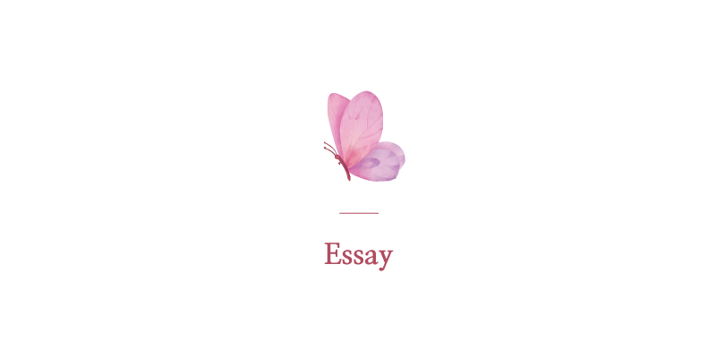

안녕하세요! 에세이 포스팅을 추가하였습니다.  

제가 살아가면서 느낀 감정들과 깨달은 내용 등 을 주변에 저와 가까운 지인분들에게만 공유했었는데요.  
저의 이야기를 다듬고 블로그에 오픈하여 다른 분들에게도 작은 도움이 되길 바라며 기록해두려 합니다.

## 📝 List
- [문제를 해결하는 프로덕트 디자인](#문제를-해결하는-프로덕트-디자인)
- [인생 성공하는 방법](#인생-성공하는-방법)
- [시야각을 넓혀간다는 건](#시야각을-넓혀간다는-건)
- [노동의 가치와 배움에 관하여](#노동의-가치와-배움에-관하여)
- [결론은 두가지 뿐](#결론은-두가지-뿐)
- [예쁘게 말하는 사람이 좋습니다](#예쁘게-말하는-사람이-좋습니다)
- [소시오패스에게 당하지 않으려면 어떻게 해야할까](#소시오패스에게-당하지-않으려면-어떻게-해야할까)
- [마음이 다쳤을때는 어떻게 해야할까](#마음이-다쳤을때는-어떻게-해야할까)

## 📝 Essay

 

### 결론은 두가지 뿐

 └  📝 

작년에 이어서 계속 글을 길게 자주 작성하였는데  
아무리 생각을 많이 하고 글을 길게 작성하여도  
결론은 두가지 뿐 같습니다.

1. 한다  
2. 안한다

### 문제를 해결하는 프로덕트 디자인

 └  📝 

> 얼마 전 '문제를 해결하는 프로덕트 디자인'이라는 디자이너 다섯분의 강의 홍보 문구를 보았습니다.
> 
> 예전부터 느낀 건, 왜 모든 강의나 세미나에 문제를 해결한다고 하는 사람들은
> 
> 왜 모두 프로덕트 디자이너 인걸까? 라는 생각이 듭니다.
> 
> 
> 문제를 해결하는 것은 프로덕트에만 존재하지 않는데
> 
> 마케팅 활용을 더 잘하는 서비스 쪽이 홍보워딩을 잘 써야 하니까 유독 눈에 보이는 것인지..
> 
> 
> 디자이너가 프로덕트에만 존재하는 것도 아니고
> 
> 프로덕트 디자이너만 문제 해결을 하는 사람도 아닌데..
> 
> 문제를 해결하는 사람들을 모두 프로덕트에만 한정 짓는 거 같아서 화가 납니다.
> 
> 
> 아이티가 아니어도 디자이너가 해결해야 할 문제는 많다고 생각합니다.
> 
> 
> 저는 이 워딩이 왜 이렇게 화가 나는지 모르겠습니다.
> 
> 디자인을 시작하려는 사람들이 이렇게 강조된 워딩을 보고
> 
> '문제를 해결하려면 프로덕트 디자인을 해야하는구나'라고
> 
> 그쪽으로만 생각을 돌리는 게 너무 싫습니다.
> 
> 
> 저는 디자이너 커리어 시작부터 현장에 더 많이 나가 있었어서
> 
> 문제를 해결하기 위해서는 현장에 답이 있고, 아이티가 있기 전에 사람이 있다고 생각합니다.
> 
> 
> 그게 거창하지 않고 '작은 것' 이라도 문제가 해결된 거라면
> 
> 가만히 있는 것보다는 한단계 더 개선을 향한 행동이라 생각합니다.
> 
> 
> 애초에 건축이나 인테리어 같은 경우는 '문제해결' 이라는 워딩을 강조하기 이전에
> 
> 이미 문제해결 자체가 베이스로 깔려있어야 설계가 가능합니다.
> 
> 
> 예전에 프로덕트 디자이너 오퍼를 받았을 때
> 
> 문제를 해결한 사례를 말하라는 것에 거창한 사례가 있어야 하는지 알고, 아무 말도 하지 못했습니다.
> 
> 문제해결이라는 것은 디자이너로 일하면서 모든 프로세스에 당연히 들어가는 거라 생각했기 때문에
> 
> 문제를 해결했다는 사례를 따로 챙겨둬야 하는지 몰랐습니다.
> 
> 문제라는 것은 해결이 되어도 예기치 못한 또 다른 문제가 생길 수 있기 때문에
> 
> 해결되었다고 자신 있게 말할 수도 없다고 생각합니다.
> 
> 
> 아무래도 서비스 쪽이 텍스트로 풀고, 말로 풀고, 워딩으로 푸는 것을 더 잘하니까
> 
> 문제를 해결하는 디자이너라는 문구를
> 
> 프로덕트 디자이너 쪽에서는 유독 많이 사용하는 것 같습니다.
> 
> 
> 만약 그 강의 홍보에 프로덕트 디자이너분들 뿐만 아니라
> 
> 여러 다양한 분야에 디자이너분들을 포함해서 문제를 해결한다는 워딩을 사용했다면
> 
> 이렇게까지 화가 나지 않았을 텐데,
> 
> 저는 '사람들이 편협한 생각을 갖도록 하는 것'을 굉장히 싫어하나봅니다.

### 인생 성공하는 방법

저에겐 많은 부를 축적하는 것은 성공 기준이 되지 않습니다.  
제가 생각하는 성공이란 간단합니다.  

1. 첫번째는
> 세상엔 정말 다양하고 전부 알지 못한 수법을 동원한 사기가 많습니다.  
> 살면서 사기당하지 않고 살아가는 것 만으로 인생 성공했다고 말할 수 있을 것 같습니다.

2. 두번째는
> 어려운 상황에 처한 사람을 돕는 일 입니다.  
> 도움을 주는 방법은 다양하게 있습니다.  
> 제가 공부를 하고, 부를 축적하기 위한 목적은  
> 그런 사람들을 돕기위한 것입니다.

3. 세번째는
> 본인의 행복을 위해 집중할 요인을 찾는 것 입니다.  
> 사람은 자기가 좋아하는 것에 몰입하고 집중할수록 생각과 감정이 안정적이게 됩니다.  
> 본인이 어떤 것에 행복을 느끼는지 알고 그것에 집중하여 몰입하다보면  
> 건강과 행복을 가질 수 있습니다.

세가지를 쉽고 간단하게 요약하자면
> 사기 안 당하고 사는 것과, 사람을 돕는 일과, 몰입을 통한 행복감을 갖는 것이  
> 인생 전체를 두고 볼 때 성공하는 방법이라 생각합니다.

### 시야각을 넓혀간다는 건

 └  📝 

저는 감사합니다 라는 말을 자주 사용합니다.  

하지만 전 그렇게 친절한 사람은 아닌거 같습니다. 항상 웃고 경청하고 있지만 아무것도 모르거나 둔한 사람도 아닙니다. 인간적인 면을 좋아하기 때문에 계산적인 사람도 아닙니다. 사람 일은 외부 요인에 의해 변수가 많다는걸 알고 있고 계산할 만큼 똑똑하지도 부지런하지도 않습니다. 

부정적이거나 불만을 가진 건 아니지만 뭐든 비판적인 생각부터 드는 것이 본능적으로 습관 되어 있습니다. 

다만 사기가 만연한 사회에서 살아남기 위해선 상대방이 나를 본인의 목적과 만족에 이용하려는 건지 사기에 이용하려는 건 아닌지 행동을 보고 의심하곤 합니다. 말은 믿지 않습니다. 어떤 행동을 하는지가 중요하다 생각합니다.

매사에 조심하게 되는 성격이라서 친목을 좋아하지 않습니다. 대신 자기 일에만 집중하는 사람을 가까이 하고 싶어 합니다. 그 사람이 어두운 면을 가진 사람이든 밝은 면을 가진 사람이든 상관없이 흔들리지 않으려 애쓰는 건 힘든 일인걸 알기 때문입니다.

.

2017년쯤 스스로를 보호하기 위해 지나치게 방어하거나 사람을 경계하던 적이 있었습니다. 그렇게 변해가는 제 자신이 너무 안타까워서 그 후로 되풀이되지 않는 방법을 계속 찾아왔습니다.

심리치료는 일시적입니다. 자신이 극복하고 찾아가야 합니다. 누구도 내인생을 대신 살아줄수 없습니다.

방법을 찾기위해 블로그와 SNS에 글을 쓰며 생각 정리를 하기 시작했고 글을 다듬으면서 어려보이는 말투를 고치려 노력해왔습니다.  

편견을 굉장히 싫어했지만 내가 나아지려면 어떤 것에 집중해야 하는지 어떤 사람을 만나야 하고 어떤 사람을 조심해야 하는지 판단하기 시작하였습니다.

저처럼 시간이 흐를수록 본인의 생각과 의견이 굳어지는 건 자연스러운 현상입니다. 

하지만 자기가 경험해봤기에 그게 전부라는 식으로 강조하거나 다른 사람의 의견을 경청하려 하지 않는다면 특정 정치 성향을 지나치게 지지하는 사람들과 다르지 않을 거라 생각합니다. 그렇게 사는것이 나쁘다는 것은 아닙니다.  

다만 개인 한명한명이 건강한 생각을 가지지 않고 편협한 생각을 갖는건 생각과 교육의 되물림을 통하여 속한 사회도 건강해지지 않는 부작용이 있습니다.

.

나이가 들어갈수록 사람이 가진 시야각이 보이는 거 같습니다.

### 노동의 가치와 배움에 관하여

 └  📝 

워렌버핏이 했던 말 중에 유명한 짤방이 있습니다.
> "잠자는 동안에도 돈이 들어오는 방법을 찾아내지 못한다면  
> 당신은 죽을때까지 일을 해야만 한다"

위 문구를 읽고 제가 드는 생각은 세가지 입니다.
> 1. 다양한 노동시장의 구조와 가치가 반영되어있지 않은 내용이다.  
> 2. 노동으로 힘들고 지친 사람들의 심리를 반영한 마케터가 좋아하는 자극적인 문구이다.
> 3. 사업을 운영하는 분들에겐 직원에게 월급을 챙겨주려면 어느정도 필요한 부분이다.

.

노동의 가치에 대하여 이야기 하기 전에 노동을 하기 위한 동기부여와 배움에 대한 내용은 매우 중요하다 생각합니다.

제가 어릴때부터 존경하던 Bob Ross 선생님께서는 이런 말씀을 하셨습니다.
> "그림을 평생그려도 다 배울 수 없습니다. 그림을 백만년 동안 그리시더라도 다음에 그리게 될 작품은 더 나아질 거라는 걸 아실테니까요. 훨씬 더 나아지겠죠. 아마도 이런 이유 때문에 저는 그림 그리는 일이 계속해서 신나는 것 같습니다. 전 제가 다음에 그릴 작품이 더 나을 거라는 걸 알기 때문에 제 다음 작품은 걸작품이 될 겁니다.
> 
> 제가 항상 학생들에게 해주는 말이 있어요. 만약 여러분의 그림 경력 전체를 두고 봤을 때 여러분 스스로가 만족할만한 작품을 그려내게 된다면 여러분은 그만두게 될 거라고 말이죠. 왜냐하면 더이상 갈 데가 없을테니까요. 그걸로 여러분의 커리어는 끝나게 되는겁니다.
> 
> 이점을 인간의 본성에 대입시켜 여러분을 위해 활용하신다면 여러분은 다시 돌아가 계속해서 그림을 그리고 또 그리고 싶어지실테고 그러면 여러분이 그리시는 작품들은 점점 나아지고 나아질 겁니다. 그러다보면 머지않아 여러분은 많이 성장해있겠죠.
> 
> 하지만 여러분은 절대로 만족하실 수 없으실겁니다.  
> 그치만 이건 좋은 현상입니다.

저는 종종 지금까지 제가 작업한 작업물 중에 만족하며 작업한 것이 무엇인지 질문을 듣곤 합니다. 그때마다 저는 제대로 대답을 못했는데요. 매 순간 최선을 다하며 작업하였지만 작업이 끝나고 나면 이게 최선이었을까 더 나아질 수 있었고 할 수 있는데 시간이 부족했던 걸까 내 능력이 부족했던 걸까 내가 더 노력했으면 나아지지 않았을까 하는 아쉬움이 항상 남아있습니다.

사회 초년생일 때는 제가 작업한 내용이 아주 멋있고 훌륭하게 느껴졌는데 시간이 흘러 계속 배우고 공부할수록 그런 자신감보다는 다른 기술을 새로 배움으로써 내가 가진 기술에서 더 다양한 퍼포먼스가 나온다는 걸 알고 난 뒤로는 새로 도전하거나 시도하기 위해 공부를 계속하게 되었습니다.  

내가 할 수 있는 것이 한 단계 더 나아가는 느낌이랄까요.

.

돈을 버는 건 중요하다 생각합니다. 돈이 너무 없으면 지금 당장 먹고 자는데도 힘든데 공부에 재미를 느낄 여유가 없으니까요. 돈을 많이 번다고 무리하게 돈을 쓰는 것도 문제지만 노동의 가치가 제대로 반영되지 않은 사회구조도 문제라 생각합니다.

이건 특정 나라만의 문제는 아닌 것 같습니다. 산업이 발전하고 지식의 중요성이 중요한 시대에서 계층의 불평등은 해소되기란 어려울 거라 생각합니다. 이건 이해관계가 얽히고 섥힌 정치와 경제 문제이기에 어느 특정한 한 부분으로 개선되기란 어려울 거라 생각합니다.

그렇기에 전 교육에 관심이 많습니다. 현재 시대에서 교육과 배움에는 연령과 계층이 존재하지 않으니까요. 배움을 통해 개인이 옳고그름을 판단하는 능력을 키우는 것이 중요하다 생각합니다.  

.

전 어릴 때 단순노동을 좋아하지 않았습니다. 그 이유는 발전이 없을거라는 생각 때문이었는데요. 다만 직업에 귀천은 없다고 생각하기에 단순 노동을 무시하진 않았습니다. 이런 생각은 어릴 적에 보았던 생활의 달인이라는 프로그램을 보고 난 뒤 생각이 달라졌습니다. 중요한 건 단순노동 속에서도 발전을 찾을 수 있고, 기술을 접목하여 새로운 퍼포먼스가 가능하도록 만드는 것인데 제가 경험하지 못했던 산업은 잘 몰랐기에 단면만 보았던 것 같습니다.

.

제가 생각하는 노동의 가치와 배움이란  
보상을 통해서만 얻는 것이 아니고 누가 찾아주는 것이 아닌  
본인의 행복을 위해 스스로 찾아가는 것이라 생각합니다.

### 예쁘게 말하는 사람이 좋습니다

 └  📝 

그동안 살면서 주위 사람들에게 평가 라는것을 신경쓰고 살아온적이 없었는데  
마음이 다치고나서 주위를 둘러보게 되었습니다.

제 주변은 저에게 좋은말만 해주는 사람이 아니라  
제가 힘을 낼수있도록 여러가지 조언이나 응원 메세지를 보내주시는 분들이  
정말 많이 계시다는 것을 알았습니다.

그리고 그분들은 모두 평소에도 마음을 예쁘게 쓰는 분들이었고  
말도 예쁘게 하시는 분들이라는걸 알았습니다.

제가 아무것도 하지 않았다면 저를 이렇게 좋게 생각해주지 않았을텐데  
저를 돌아보는 계기가 된 것 같습니다.

> - Dave : 에린님은 누가 뭐라하든 스스로가 옳다고 결정한 길을 가기때문에 그래서 좋습니다.
> - Yun : 에린님을 응원하는 사람들은 에린님이 잘하고 못하고를 떠나서 에린님이라서 좋아하는 겁니다. 에린님을 보고있으면 마음속에 자리잡고있는 열정이 살아납니다.
> - Ju : 용기내줘서 고맙습니다. 바로 지금 현재가 중요합니다.
> 
> - min : 개발하면서 예쁘다고 생각해본적이 한번도 없는데 작업하신 피드를 보니 너무 예쁩니다.
> - hyo : 인스타 포스팅에 이렇게 아기자기하고 정성스럽게 포스팅하기가 쉽지 않은데 한편의 컬랙션을 만들고 계셨군요. 하나하나 너무 예뻐서 약간 과장하면 이런걸 이 생전에 볼수 있다니(볼꼬집)하면서 감상했더랬죠. 프론트에 쓰인 기술적으로 봐도 이렇게도 만들수 있는건가 싶었어요. 응용력도 좋으십니다.

모두 저와 일하는 관계도 아니고, 아무런 조건도 없고, 저와 거래를 하지 않았는데도  
저를 좋아해주시는 마음 예쁜 분들을 만났다는 것에 감사함을 느끼고 있습니다.

좋은 분들을 알게된 순간을 기억하기 위해 기록해두려 합니다.  
항상 감사합니다.

### 소시오패스에게 당하지 않으려면 어떻게 해야할까

 └  📝 

소시오패스란 길게 정의할 것 없이  
상대방을 위하는 척 하지만 자신의 이익을 위해 상대방을 이용하는 사람입니다.  

특히 아래와 같이 본인이 없으면 상대방을 아무것도 못 하게 만들고  
무기력하게 만드는 사람을 소시오패스라고 생각합니다.  
소시오패스는 본인이 그런 사람이라는걸 모릅니다.

[소시오패스 징후 알아채기, 달아나기](https://ko.wikihow.com/%EC%86%8C%EC%8B%9C%EC%98%A4%ED%8C%A8%EC%8A%A4-%EA%B5%AC%EB%B3%84%EB%B0%A9%EB%B2%95)

 └  📝 

" 소시오패스는 사람들을 만나고 빨리 가까워지고 싶어합니다. 그렇기 때문에 당신에게 뒷걸음치거나 마음을 고쳐먹을 기회가 별로 없을 것입니다. 몇 주 안된 사이임에도 불구하고 당신에게 열과 성을 다하는 모습을 보게 될 것입니다. 또, 당신은 그들을 소울메이트라고 여길 수도 있습니다. 그들은 사람의 마음을 잘 읽고 당신이 듣고 싶어 하는 말만 하기 때문입니다. 소시오패스는 당신이 누군가와 가까이 지내고 싶은 욕구나 소망을 가지고 있다는 사실을 알게 되면 좋은 기회로 여겨 그 욕구나 소망에 꼭 맞는 가면을 쓸 것입니다. 결국에는 당신을 세상과 ‘공유’하지 않고 독점하고 싶어할 것입니다. "

이런 사람들의 특징 중에 하나는  
동물적인 감각이 뛰어나고 서열을 우선시합니다.

또한 상대방이 듣기 좋은 입바른 말을 잘해서  
대인관계가 좋아 보이고 정치를 굉장히 잘합니다.

소시오패스나 사기꾼이 아주 좋아하는 유형은 착한 아이 콤플렉스를 가진 사람들입니다.  
사람들에게 나쁜 소리를 못하고 다른 사람을 많이 생각하기 때문입니다.  
그럼 소시오패스에게 이용당하지 않으려면 스스로 일어서려면 무엇을 해야 할까요.

다른 사람이 자꾸 나를 마이크로 하게 컨트롤하려 한다면 싫다는 표현을 하고, 거부하시면 됩니다.  
나 자신에게 집중하고, 내가 좋아하는 것에 집중하고  
내가 어떤 감정이 드는지 자신을 살피는 시간을 가지는 것이 필요합니다.  
내가 원하지 않으면 다른 사람에게 나의 시간을 내어주지 않는것이 제일 중요하다고 생각합니다.

현재 내가 집중하는 것이  
사람인지 일인지 취미인지 공부인지 등등 무엇인지에 따라  
사람에게 이용당하거나 사기당할 확률이 높아지거나 낮아질 수 있습니다.

### 마음이 다쳤을때는 어떻게 해야할까

 └  📝 

주변 분들에게 가끔 제가 정말 누구보다도 열심히 살고  
다양한 분야에 공부도 많이 하는 거 같다는 얘기를 종종 듣습니다.

정작 저는 '내가 그 정도 노력하고 있나' 라는 생각이 들 정도로  
그냥 일상적인 삶의 일부분이 되어버린 듯 합니다. 

제 주변에 계신 분들은 이미 저보다 더 실력도 월등하고  
하루에 몇백 몇천씩 훨씬 잘 벌며 처세나 배울 점이 가득한 분들이 실제로 많이 계십니다.

그분들은 매일매일 수년 동안 잠도 줄이며 계속 공부합니다.  
그리고 일하고, 시도하고, 실패하는 것이 일상입니다.

그런 분들은 혼자만 열심히 하지 않고 다른 사람을 위해  
지식을 나누거나 도움을 주는 분들이 많이 계십니다.

저는 이런 제 주변 분들에게 좋은 영향을 계속 받는 것 같아서  
주변 분들에게 감사함을 느낍니다. 

그런 분들에게 받은 영향이 저를 움직일 수 있게 하고  
저 또한 다른 사람에게 도움을 줄 수 있게 되는 것 같습니다.

 

사람에게 마음을 다쳤거나 일상이 지칠수록  
내가 좋아하는 작은 것들을 생각하고

주변에 나에게 좋은 영향을 갖게해주시는 분들에게 집중하는 것이  
나 자신을 더 사랑해주고 아껴줄 수 있는 게 아닐까 생각합니다. 

[착한아이 콤플렉스](https://namu.wiki/w/%EC%B0%A9%ED%95%9C%EC%82%AC%EB%9E%8C%20%EC%A6%9D%ED%9B%84%EA%B5%B0)를 가진 사람이  
소시오패스를 만나거나 불합리적인 사회를 겪으면  

마음이 많이 지치고 힘들어지고 분노와 슬픔이라는 감정에 집중하게 되는데  
그럴수록 스스로에게 질문하고, 나 자신에 집중하며 목표를 다잡는 게 중요합니다. 

 

난 왜 이 일을 하는가? 이 일을 했을 때 내가 불행해지지는 않는가?  
난 왜 여기서 일하는가? 내가 이곳에서 하고자 하는 게 뭔가?  
내가 더 잘하려면 무엇을 해야 할까?

내 감정이 슬프거나 분노하게 되면 난 어떻게 해야 하지?  
내가 지금 다른 사람에게 감정을 낭비하는 것이 나에게 도움이 되는 것인가?  
나에게 좋은 영향을 주는 분들을 만나려면 무엇을 어떻게 해야 할까? 

내가 지금 보고, 듣고, 생각하는 것들이  
내가 보지 못한 것들에 비해 작은 일부분에 불과한 게 아닐까? 

내가 움직이려면 무엇부터 해야 할까?

###

> *🌸*  
> *제가 곧은 마음과 올바른 방향으로 생각을 가질 수 있도록*  
> *항상 도와주시는 Dave 님께 감사를 표합니다.*

