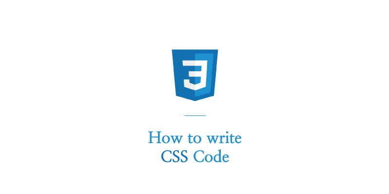

## 📍 How to write CSS Code

CSS 설계 방법

### 1. 특성에 따라 CSS 분류

> - 베이스 그룹  
> - 레이아웃 그룹
> 
> [1] reset  
> 전체 적용, 베이스
> 
> [2] layout  
> 헤더, 푸터  
> 작성 방법 : ly_
> 
> [3] block  
> 재사용 모듈  
> 작성 방법 : bl_
> 
> [4] element  
> 한 요소에 공통된 모듈  
> 작성 방법 : el

### 2. HTML과 스타일링을 느슨하게 결합

> 노드에 직접 스타일 자제  
> `
, 
, ` 은 자주 사용하는 것이므로 class를 꼭 붙이는걸 추천

### 3. 영향 범위를 넓히지 않습니다.

> 범위를 줄일 수 있는지 먼저 검토하는 것이 중요

### 4. 특정 콘텍스트에 지나치게 의존하지 않습니다.

> 위치, 상황, ID에 의존적이지 않고 어디서든 사용할 수 있도록 작성

### 5. 상세도를 지나치게 높이지 않습니다.

> ID 셀렉터에 직접 스타일을 지정하는건 덮어쓰기 어렵기 때문에 자제

### 6. 클래스 이름에서 영향범위를 유추할수 있게 합니다.

> - 자녀 요소에는 모듈이름을 붙입니다  
> - ex)  
> bl_module_title  
> bl_module_imageWrapper (카멜케이스)

### 7. 클래스 이름에서 형태, 기능, 역할을 유추할 수 있게 합니다.

> 구체성과 범용성의 균형  
> 웹페이지의 어느 위치에서든 사용가능한 모듈  
> media, Accordion, Slider 등 일반적인 호칭을 사용  
> 콘텍스트가 아니라 형태, 기능, 역할을 기반으로 이름을 짓습니다.

### 8. 확장하기 쉽고, 변경을 견딜 수 있도록 설계합니다.

> - 싱글 클래스 설계 (HTML: 간단, CSS: 복잡)  
> css 많은 코드가 중복되고 비대해집니다.  
> scss에서 mixin이나 extend를 사용합니다.  
> 모듈 확장에서 유연성이 낮아집니다.
>  
> - 멀티 클래스 설계 (HTML: 복잡, CSSL 간단)  
> 공통부분은 추출합니다. (el_btn은 버튼 모듈의 베이스)  
> 속성과 값은 완전 동일합니다.
>  
> - 모듈 리펙터링  
> 기존 클래스에 변경/추가/덮어쓰기  
> 영향받는 요소의 루트요소에 모디파이를 추가합니다.  
> 영향받는 요소만 모디파이를 추가합니다.

