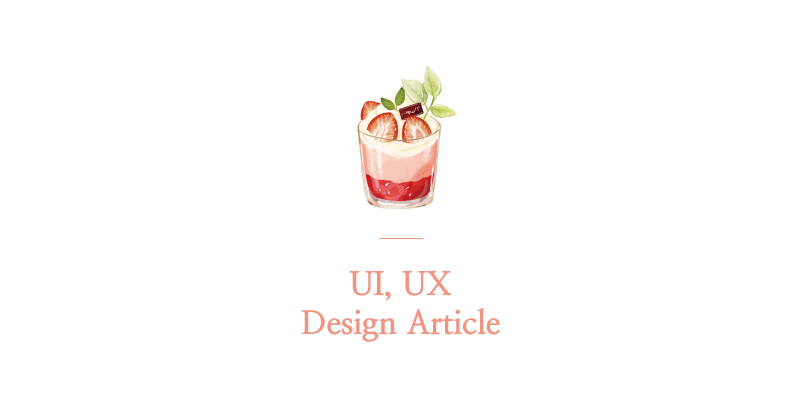

안녕하세요. 2021년 부터 UILAB 번역 활동을 참여하였습니다.  
UI, UX, 디자인 해외 아티클 관련 참여한 내용을 블로그에 따로 기록해두려 합니다.  
이곳에 앞으로 리스트를 계속 업데이트 할 예정 입니다.

## 📝 List

- [새로운 브랜드 아이덴티티를 개발하는 방법]
- [2021년 팝업 양식을 디자인하는 방법 (모범사례 + 예제)]
- [원격 UX 워크샵을 위한 33가지 활동]
- [쉐이프 디자인 (Shape Design)는 무엇일까요?]
- [이메일의 웹 글꼴에 대한 가이드]
- [스프린트 계획을 효율적으로 유지하는 방법]
- [와이어프레임 시작하기]

- [20가지 뛰어난 여백 디자인 예제와 모범 사례](#20가지-뛰어난-여백-디자인-예제와-모범-사례)
- [2021년 4월 모바일 인터랙션 디자인 TOP5](#2021년-4월-모바일-인터랙션-디자인-top5)
- [UX 디자인 가이드의 프로토타이핑 체크리스트](#ux-디자인-가이드의-프로토타이핑-체크리스트)
- [UX 디자이너가 킥오프 미팅에서 질문해야 할 26가지 질문](#ux-디자이너가-킥오프-미팅에서-질문해야-할-26가지-질문)
- [UI/UX 디자인을 즉시 개선하는데 도움이 되는 유용한 팁 3가지](#uiux-디자인을-즉시-개선하는데-도움이-되는-유용한-팁-3가지)
- [이커머스 UI 디자인 오늘 판매를 시작하는 12가지 팁](#이커머스-ui-디자인-오늘-판매를-시작하는-12가지-팁)

- [UX/UI 디자인의 아토믹 디자인과 모듈식 애플리케이션](#uxui-디자인의-아토믹-디자인과-모듈식-애플리케이션)
- [마이크로 인터랙션을 사용하여 UI / UX를 개선하는 방법](#마이크로-인터랙션을-사용하여-ui--ux를-개선하는-방법)
- [프리랜서 그래픽 디자이너를 위한 8가지 고객 확보 방법](#프리랜서-그래픽-디자이너를-위한-8가지-고객-확보-방법)
- [프로세스에 접근성 테스트 레이어를 적용하는 방법](#프로세스에-접근성-테스트-레이어를-적용하는-방법)
- [Google 머티리얼 디자인 가이드 라인의 10가지 핵심 사항](#google-머티리얼-디자인-가이드-라인의-10가지-핵심-사항)
- [2021년 모든 웹 디자이너에게 필요한 기술 TOP14](#2021년-모든-웹-디자이너에게-필요한-기술-top14)
- [디자인 시스템을 시작하는 방법](#디자인-시스템을-시작하는-방법)
- [Wish 디자인 시스템 색상이야기](#wish-디자인-시스템-색상이야기)
- [전환하는 랜딩 페이지의 10가지 요소](#전환하는-랜딩-페이지의-10가지-요소)
- [UX 디자이너를 위한 정보 아키텍처](#ux-디자이너를-위한-정보-아키텍처)
- [접근성을 고려한 디자인](#접근성을-고려한-디자인)
- [UX 디자인에서 정량적 연구를 최대한 활용하는 방법](#ux-디자인에서-정량적-연구를-최대한-활용하는-방법)
- [포트폴리오를 돋보이게 만드는 방법](#포트폴리오를-돋보이게-만드는-방법)
- [테이블(표)의 UX가 사용자의 복잡한 결정을 내리는데 도움되는 방법](#테이블표의-ux가-사용자의-복잡한-결정을-내리는데-도움되는-방법)

## 📝 Article

 

### 

 └  📝 

.  
.  
> 👇 더 자세한 내용은 아래 원문에서 확인해주세요.  

### 새로운 브랜드 아이덴티티를 개발하는 방법

 └  📝 

초기 아이덴티티 부터 최신 리브랜딩에 대한 생각에 이르기까지
Maze의 브랜드를 만들기 위해 겪은 과정을 공유합니다.

.

1. 회사 이름짓기

3년 전 회사를 설립했을 때, 저는 회사의 이름에 대해 많은 고민을 했습니다. 
우리는 회사의 성장에 따라 관련성을 유지할 수 있는 단순하고 추상적인 이름을 원했습니다.

사람들은 목표를 가지고 제품과 상호작용 하는데, 이러한 목표와 차별화되는 것을 만드는 게 UI/UX입니다.
우리는 디자이너들이 쉽게 테스트할 수 있도록 함으로써 UX를 더 잘 만들 수 있도록 돕고 싶었습니다. 
또한 우리가 원하는 방향으로 브랜드를 성장시킬 수 있을 정도로 기억과 발음이 쉽고 추상적이었습니다.

Maze라는 이름은 우리의 목표에 딱 들어맞았습니다.

.

2. 기초 쌓기

이제 우리가 이름을 갖게 되었으니
그다음 목표는 로고, 색상, 음색 등 모든 자산을 갖춘 완전한 시스템으로 변환하는 것이었습니다.

메이즈의 첫 브랜드 아이덴티티입니다.
당사의 첫 번째 브랜드 시스템은 다음과 같습니다.

- 로고를 위한 글리프(글자의 모양)
M이라는 글자를 나타내는 위에서 바라봤습니다.

- 음성 가이드라인
우리의 임무는 디자이너들이 테스트 할 수 있도록 하는 것이어서
우리는 그 톤이 장난스럽고 쉽게 접근하기를 원했습니다.

- 일러스트
우리 브랜드의 시각적 그림들은 장난감과 같은 형식으로 표현했고
그 안에서 움직이는 공은 인터페이스와 상호 작용 하였습니다.

.  
.  
> 👇 더 자세한 내용은 아래 원문에서 확인해주세요.  
https://maze.co/blog/building-the-maze-brand

### 브랜드의 UX를 향상시키기위한 스타일 가이드를 만드는 방법

 └  📝 

> UX와 UI의 세계에서 프로젝트를 시작할 때 항상 명심해야 할 것은 스타일 가이드입니다.
> 브랜드의 사용자 경험을 향상시키고 새로운 수준으로 끌어 올리는 데 도움이 됩니다.
> 
> 스타일 가이드는 일관된 디자인 시스템을 만드는 데 도움이 됩니다.
> 아이디어를 효과적으로 전달하고 훌륭한 콘텐츠를 만들 수 있습니다.
> 
> 생산성을 저해하지 않고 작업 시간을 절약 할 수 있으며
> 무엇보다도 가장 전문적인 시각으로 브랜드와 회사를 선보일 수 있습니다.
> 
> 스타일 가이드를 통해 얻을 수 있는 몇 가지 이점을 살펴보겠습니다.

.

1. 프론트 엔드 개발자
>  모든 중요한 정보와 데이터를 참조하여 CSS 및 HTML을 작성하고
>  색상에 대한 16 진수 코드를 쉽게 찾고, UI 구성 요소, SVG 파일을 재사용하고
>  필요한 다른 자산을 빠르게 찾아 추출 할 수 있습니다.

2. UX 디자이너
>  브랜드 스타일에 맞는 반응형 레이아웃을 제작할 수 있도록 도와줍니다.

3. 소셜 미디어 관리자
>  문서를 참조하여 동일한 서체, 색상 팔레트 및 그래픽 자산을 사용하여
>  일관된 소셜 미디어 피드를 만들 수 있습니다.

4. 크리에이티브 작가
>  브랜드의 특정 목소리 톤에 맞는 카피를 제작합니다.

.

> 프로젝트를 시작하기 전에 범위, 스타일, 시각적 방향 및 목소리 톤을 정의하는 스타일 가이드가 있으면 모든 팀원에게 매우 유익할 수 있습니다.
> 
> 또한 여러분이 구상한 최종 제품을 만들고 길을 잃지 않도록 안내하는 데 도움이 되는 참조 지점이 될 수도 있습니다.
> 
> UX/UI 스타일 가이드 문서는 마감일을 준수하고, 항상 높은 생산성을 유지하며 일반적으로 스트레스를 피하는 데 도움이 됩니다.

.

스타일 가이드 또는 브랜드 가이드 라인은 무엇입니까?

> 스타일 가이드는 브랜드 가이드 라인이 아닙니다.
> 스타일 가이드는 프로젝트를 시작할 때 최종 제품의 시각적 이미지 / 표현을 얻고
> 디자인 및 개발 프로세스, 즉 무엇을 예상할 수 있는 설명하는 데 도움이 됩니다.
> 
> 브랜드 가이드라인 북은 로고 타입 (기본 및 보조), 그래픽 요소, 패턴 및 아이콘과 같은
> 특정 브랜드 요소의 사용과 웹, 인쇄물 및 기타 미디어에서의 응용 프로그램을 지정하는 문서입니다.
> 또한 모든 브랜드 자산에 대한 최적의 애플리케이션 크기와 간격을 제안합니다.
> 
> 스타일 가이드의 규칙을 준수하고 제공된 것을 활용하면
> 다음 사항에 대해 걱정할 필요가 없습니다.
> 
> 타이포그래피 / 서체, 색상 팔레트, 아이콘, 이미지, UI 구성 요소
> HEX 코드, CMYK 및 RGB 값, 목소리 톤, 코드 문서

.

참고할 만한 스타일 가이드는
> - NASA 그래픽 표준 매뉴얼
> - Mailchimp의 스타일 가이드
> - Barnes & Noble의 UI 스타일 가이드 입니다.

.  
.  
> 👇 더 자세한 내용은 아래 원문에서 확인해주세요.  
https://www.uxpin.com/studio/blog/style-guide-ux/

### 2021년 팝업 양식을 디자인하는 방법 (모범사례 + 예제)

 └  📝 

> 팝업은 모든 기업이 가입자를 확보하거나 영업 기회를 창출하는 데 도움이 됩니다. 
> 하지만 만약 여러분이 적절한 계획을 세우지 않고 팝업을 띄운다면 방문자들은 페이지를 떠날 수도 있습니다. 
> 최악의 경우 계획되지 않은 팝업으로 인해 Google 위약금이 부과될 수 있습니다.
> 
> 그렇다면, 여러분의 팝업이 효과적이라고 결정하는 요인은 무엇일까요?
> 성가신 팝업이 되지 않는다는 걸 어떻게 아실 건가요.
> 
> 팝업 양식을 설계하기 위한 몇 가지 팁과 모범 사례를 소개합니다.

.

1. 단순하고 집중적인 상태

> 캠페인을 시작할 때마다 고객의 관점에서 생각해 보십시오.
> 만약 당신의 팝업이 혼란스럽거나, 서툴거나, 짜증난다고 느끼면, 그들은 떠날 것입니다. 
> 따라서 간단해야 합니다. 단순하고 포인트 팝업으로 만들어야 합니다.

.

2. 간단한 클릭 유도 방법

> 개인화된 CTA가 기본 CTA보다 약 202% 더 잘 변환된다는 것을 알고 계셨습니까?
> 방문자가 웹 사이트를 읽거나 탐색하는 동안 갑자기 팝업이 나타나면 활동을 방해받을 수 있습니다.
> 
> 당신은 단지 팝업을 통해 방문자의 이메일 주소를 얻고 가능한 한 빨리 사라지기를 원할뿐입니다.
> CTA는 짧은 시간 내에 버튼을 누르도록 권장해야 합니다. 

.

3. 팝업에 스토리를 추가

> 스토리를 추가하는 것은 단순히 팝업을 친구처럼 느끼게 하는 것을 의미합니다. 
> 팝업을 클릭할 가치가 있도록 할 수 있습니다. 
> 
> 만약 여러분이 목표 대상자에 대해 전혀 알지 못한다면
> 어떻게 팝업을 개인화 하시겠습니까
> 가장 좋은 방법 중 하나는 추천 소스를 활용하는 것입니다. 
> 
> 레퍼러 탐지 도구를 사용하여 특정 도메인에서 온 방문자를 식별합니다. 
> 이제 수집된 정보를 사용하여 팝업을 개인 설정합니다.

.  
.  
> 👇 더 자세한 내용은 아래 원문에서 확인해주세요.  
https://medium.com/@alice.jackson/how-to-design-popup-forms-in-2021-best-practices-examples-for-inspiration-c974b785a31a

### 원격 UX 워크샵을 위한 33가지 활동

 └  📝 

모든 사람이 시간을 할애할 가치가 있는 워크숍을 만드는 것이 핵심입니다.
워크숍이 왜 중요한지에 대한 목록으로 바로 들어가겠습니다.

- 아이스브레이커

> 아이스브레이커와 팀 구성 활동은 워크숍을 위해 모든 사람들을 따뜻하게 해주고
> 그들이 올바른 사고 방식을 갖도록 돕고, 긍정적인 에너지를 만들고,
> 팀 동료들과 공감대를 형성하며, 여러분의 일상적인 일에 맥락을 더하도록 도와줍니다.

- 대화의 시작

> 팀을 나눠서 두 가지 공통점을 발견하고
> 이 두 가지를 바탕으로 팀 이름을 생각해냅니다
> 
> 사람들이 서로를 잘 알지 못할 때
> 대화를 시작하면서 서로를 알아가기 위한 방법으로 도움이 됩니다.

.

- 화이트보드를 이용

> 온라인 화이트보드 도구에 한 사람당 2개의 사분면이 있는 보드를 설치하고 각 참가자는 사분면에 기입합니다.
> 맨 위에는, 휴대폰에서 무작위로 찍은 사진, 책상 위에 있는 사진 등, 카테고리의 사진을 넣을 것입니다.
> 맨 아래 사분면에, 그들은 특정한 질문에 대답할 것입니다.
> "최근에 배운 것이 무엇인가?" "첫 번째 직업이 무엇이었는가?" "마지막 식사는 무엇이었을 것인가?" 등등.
> 
> 사람들이 서로에 대해 좀 더 잘 알고
> 서로를 따뜻하게 해주기를 원할 때 사용합니다.

.

- 다른 언어로 소통

> 5개의 기호 (예 : 그림 이모티콘) 또는 그림으로  회사나 제품에 대해 설명해야 합니다.
> 각 참가자들은 다섯 개의 간단한 이미지를 그리거나 수집합니다. 
> 
> 그룹에 언어 또는 문화적 차이가있을 때 특히 유용합니다.
> 모든 사람이 그림으로 의사 소통 할 수 있습니다.
> 
> 이미지가 완벽할 필요는 없으며, 설명도 완벽하지 않다는 것을 반드시 설명하십시오.

.

- 거짓말 추측하기

> 각 구성원은 그룹에게 자신에 대한 세 가지 진술을 합니다.
> 다른 사람들은 세 가지 진술 중 어느 것이 거짓인지 추측해야 합니다.
> 
> 참가자들이 사전에 진술을 생각할 수 있도록 워크숍이 시작되기 전에 미리 조언을 제공하는 것이 좋습니다.
> 온라인 화이트보드 도구에서 투표 기능을 사용하여 대부분의 사람들이 어떤 진술이 거짓이라고 생각하는지 확인할 수 있습니다.

.

- 팀 구성 활동을 위한 아이디어 창출

> 사람들에게 그들이 가지고있는 버킷리스트
> 하나 또는 두 개의 큰 인생 목표를 공유하도록 요청하십시오.
> 
> 이미 서로에게 익숙한 그룹이 있지만
> 서로를 조금 더 알게되기를 원할때 적용합니다.
> 
> 이 질문을 사람들에게 미리 알려주는 것이 좋습니다.
> 이것은 향후 팀 구성 활동을 위한 아이디어를 창출하는 좋은 방법입니다.

.  
.  
> 👇 더 자세한 내용은 아래 원문에서 확인해주세요.  
https://uxtools.co/blog/33-activity-ideas-for-remote-ux-workshops/

### 쉐이프 디자인 (Shape Design)는 무엇일까요?

 └  📝 

이 글은 현대 일러스트레이션의 특정 스타일에서 사용된  
쉐이프 디자인(Shape design)에 대해 설명합니다.

도형 디자인은 그래픽 디자인 기법입니다.  
그래픽 일러스트레이션이나 손으로 그린 연필, 종이 등  
어떤 종류의 이미지 메이킹 작업에도 적용할 수 있습니다.

보다 유기적인 형태와 교차하는 기하학적 형태에 기초한  
형태 디자인은 눈을 즐겁게 하고 현대적인 이미지를 보여줍니다.

저는 쉐이프 디자인을  
보다 유기적인 형태와 함께 삼각형, 직사각형, S-커브 및 원 모양으로 많이 활용했습니다.

쉐이프 디자인이라는 용어를 사용할 때  
저는 그래픽 일러스트레이션이나 이미지에 일종의 기하학적 쉐이프를 도입하는 것에 대해 말하곤 합니다.

쉐이프 디자인을 파악하는 데 유용 할 수있는 예제를 알려드리겠습니다.

좋아하는 아티스트를 선택하고 그 아티스트에게서 흥미를 끄는 특정 모양을 찾아서 복제 할 수 있는 방법을 찾아보세요.

저는 제가 좋아하는 이미지들 중 하나인 구름들이 꽤 흥미롭다는 것을 알았습니다.
그리고 포토샵에서 그 모양을 만드는 방법을 알고 싶어졌습니다.

우리가 어떤 요소를 그리거나 묘사할 때, 보는 것보다 직접 만드는 것이 훨씬 더 잘 이해할 수 있습니다.

.  
.  
> 👇 더 자세한 내용은 아래 원문에서 확인해주세요.  
https://uxdesign.cc/what-is-this-shape-design-thing-83f41cb64c94

### 이메일의 웹 글꼴에 대한 가이드

 └  📝 

Arial 및 Trebuchet, Times 및 Georgia와 같은 웹 안전 글꼴은 대부분의 운영 체제에 설치됩니다.

따라서 이러한 "시스템 글꼴"은 이메일 클라이언트, 웹 메일 클라이언트, 앱 및 브라우저를 포함하여
해당 운영 체제의 모든 소프트웨어에 표시되므로 "웹 안전"으로 분류됩니다.

보편적으로 웹 안전 글꼴은 이를 사용하여 디자인하고 개발된 이메일은 받은 편지함에서 눈에 띈다는 것을 의미합니다.

받은 편지함에서 눈에 띄는 부분은 사용자 지정 글꼴이 들어오는 곳입니다.

안타깝게도 웹에 적합한 글꼴과 달리 웹 글꼴은 대부분의 이메일 클라이언트, 웹 메일 클라이언트 및 앱에 표시되지 않습니다.

하지만 그렇다고해서 이메일에 웹 글꼴을 사용하는 것을 막을 수는 없습니다.

웹 글꼴을 표시 할 이메일 클라이언트, 웹 메일 클라이언트 및 앱, 사용할 웹 글꼴 형식 웹 글꼴을 가져올 위치 및 이를 이메일에 구현하는 방법을 알아야 합니다.

.

웹 글꼴을 표시 할 이메일 클라이언트, 웹 메일 클라이언트 및 앱

웹 글꼴은 웹에 적합하지 않지만 표시 할 이메일 클라이언트, 웹 메일 클라이언트 및 앱을 알면 안전 할 수 있습니다.

대부분은 Apple 운영체제 에서 찾을 수 있습니다.
(macOS의 Microsoft Outlook 및 Thunderbird, macOS의 Mail, iOS의 Mail, iPadOS의 Mail)

글을 쓰는 시점에 Litmus의 이메일 클라이언트 시장 점유율 보고서에 따르면 전 세계 이메일의 50 % 이상이 이 소수의 이메일 클라이언트, 웹 메일 클라이언트 및 앱에서 열립니다.
따라서 웹 글꼴을 구현하는 데 시간과 노력을 투자하여 표시 할 가치가 있습니다.

그러나 웹 글꼴을 구현하기 전에 수신자가이를 표시 할 이메일 클라이언트, 웹 메일 클라이언트 및 앱을 사용하고 있는지 확인하십시오.

받는 사람의 50% 이상이 이를 사용하고 받는사람의 50% 미만이 이를 사용하는 것일 수 있습니다.

.

사용할 웹 글꼴 형식

이제 이메일에 웹 글꼴을 구현할 준비가 되었으므로 사용할 웹 글꼴 형식을 알아야합니다.
웹 글꼴은 다음과 같은 다양한 형식으로 제공됩니다.

1. TrueType 글꼴 (TTF)
2. OTF (Open Type Format)
3. EOT (Embedded OpenType)
4. 웹 오픈 글꼴 형식 글꼴 (WOFF)
5. 웹 오픈 글꼴 형식 글꼴2 (WOFF2)
6. 확장 가능한 벡터 그래픽 (SVG)
7. 이메일에는 WOFF(Web Open Font Format Font) 형식 만 표시됩니다.

.

웹 글꼴을 가져올 수 있는 위치입니다.
기본적으로 세 가지 옵션이 있습니다.

1. 무료: 다른 브랜드의 전자 메일에서 볼 수 있는 글꼴입니다.
2. 라이센스: 다른 브랜드의 전자 메일에서 볼 가능성이 낮은 글꼴입니다.
3. 다른 브랜드의 전자 메일에서 볼 수 없는 글꼴을 말합니다.

.

[1] Google Fonts
Google Fonts는 수백 개의 무료 오픈 소스 글꼴 제품군을 제공하고 있습니다.
따라서 이것이 많은 브랜드를 위한 Go-to-Font Foundry라는 것은 놀라운 일이 아닙니다.

따라서 전자 메일에서 동일한 "Google 글꼴"을 사용하는 브랜드를 많이 볼 수 있지만
웹 안전 글꼴을 사용하는 브랜드는 많지 않습니다.

Google 제품에 나타나는 Google 글꼴도 볼 수 있습니다.
Roboto는 Android 4.0 이후 부터 설치되어 있습니다.

.

[2] Envato Elements
저렴한 가격에 프리미엄 웹 글꼴을 찾고 있다면 Envato Elements를 확인하십시오. 저렴한 비용으로 방대한 글꼴 라이브러리에 액세스 할 수 있습니다. 전문적이고 상업적인 용도로도 사용이 허가되었습니다.

.

[3] Adobe Fonts
이전에 Typekit으로 알려진 Adobe Fonts는 수천 가지 글꼴을 제공하지만 이를 사용하려면 Creative Cloud 구독이 필요합니다. Baskerville 및 Futura와 같은 잘 알려진 이름과 Mrs Eaves XL 및 Fenwick과 같은 덜 알려진 이름이 포함됩니다.

다른 라이선스와 달리 Adobe Font 라이선스는 특정 달 내에 웹 페이지 또는 이메일에 글꼴이 업로드되는 횟수를 제한하지 않습니다.

.  
.  
> 👇 더 자세한 내용은 아래 원문에서 확인해주세요.  
https://webdesign.tutsplus.com/tutorials/web-fonts-for-email--cms-36847

### 스프린트 계획을 효율적으로 유지하는 방법

 └  📝 

빠르게 움직이는 프로젝트에서는 광범위한 스프린트 계획 회의를 위한 시간을 뽑는 것이 어려울 수 있습니다. 대규모 제품 개발 프로젝트 중 하나를 위해 프로세스를 최대한 효율적으로 유지하는 방법은 다음과 같습니다.

.

최근 제 마음에 떠오른 한 가지 요소는 스프린트 계획 회의에 얼마나 많은 시간을 할애해야 하는가 입니다. 

이를 실행하는 방법에는 여러 가지가 있습니다.
구조는 방법론, 팀 규모, 프로젝트에서 현재 위치 등에 따라 다릅니다.

우리 주변의 COVID-19 전염병이 계속해서 전 세계의 환경을 변화시키고 있기 때문에

우리는 점진적이고 중요한 제품을 지속적으로 업데이트 하고 있습니다. 

스프린트 계획 회의는 몇 시간 동안 지속될 수 있으며, 며칠 동안 지속될 수 있다는 이야기를 들었습니다. 

모든 사람들이 그들이 무엇을 해야 하는지 확실히 아는 것에 대한 기회 비용은 엄청나게 비쌀 수 있습니다.

올바른 방법으로 수행하면 눈에 띄는 생산성 저하없이 상당한 시간을 절약 할 수 있습니다.

방법은 다음과 같습니다.

.

스프린트 계획 준비

첫 번째 스프린트 계획 회의를 가질 준비가되면 제품 관리자로서 집중하고있는 기능 세트에 대해 최종 사용자가 수행 할 수있는 모든 작업을 거의 알고 있어야 합니다.

그 지점에 도달하는 것은 그 자체로 일련의 기사이지만 우리의 목적을 위해 개발자가 적절하게 검토 한 디자인을 승인했다고 가정 해 보겠습니다.

(일반적으로 여기에 도달하는 프로세스는 요구 사항 수집 → 디자인과 제품 및 개발자 협업 → 구성 요소 → 기능 정의입니다.)

스프린트 계획을 준비하는 첫 번째 단계는 모든 디자인을 사용자 스토리와 정의로 나누는 것입니다.

앱의 스크린 샷과 사용자 스토리로 작성된 허용 기준 목록입니다.

"테스트 사이트 관리자> 일정> 사용자가 일정을 볼 수 있음"스토리의 예입니다.

이 작업을 마치면 첫 번째 스프린트 계획 회의 (아래에서 자세히 설명)를 다음 목표에 집중할 수 있습니다.

이 기능 세트 내의 모든 것이 최종 사용자를 위해 어떻게 작동해야하는지에 대한 공유 된 이해 구축
첫 스프린트에서 팀이 자신있게 달성할 수 있는 것을 알아냅니다.

이 시점에서 그룹의 모든 사람은 구성 요소를 검토하고 특정 제안 된 동작의 뉘앙스에 대해 개발자와 공동 작업을 했으므로 적어도 기능 세트에 어느 정도 익숙해질 것입니다.

.  
.  
> 👇 더 자세한 내용은 아래 원문에서 확인해주세요.  
https://www.viget.com/articles/how-to-keep-sprint-planning-efficient/

### 와이어프레임 시작하기

 └  📝 

와이어프레임은 웹 사이트의 뼈대이며 콘텐츠 구조와 흐름을 보여줍니다.

빠른 스케치부터 레이아웃 설계까지 다양한 수준의 와이어 프레임이 있습니다.  
디자인을 완성하기 전에 컨텐츠와 구조에 맞춰 조정해야 합니다.

처음 웹 사이트를 만들거나 간단한 랜딩 페이지를 디자인 할 때  
디자인 프로그램으로 바로 디자인을 시작하고 싶을 것입니다.

와이어 프레임이 무엇인지, 왜 중요한지 자세히 알아보고,  
웹 디자인을 위한 다른 와이어 프레임 예제에서 배우고,  
처음으로 와이어프레임을 만드는 경우 자신만의 와이어 프레임을 만드는 방법을 알아 보겠습니다.

.

와이어프레임이란 무엇입니까?  
와이어프레임은 웹 디자인 프로젝트의 시작 단계에서 생성됩니다.

영감을 수집하거나 조사한 후 고객과 비즈니스 목표를 일치시키고 그 정보를 와이어프레임으로 변환합니다.  
이러한 와이어프레임은 클라이언트에게 전달하는 방법을 나타내는 지도가 됩니다.

.

와이어프레임에 무엇을 포함해야 합니까?  
스케치로 시작하는지 아니면 높은 충실도의 와이어 프레임을 작업하는지 여부에 따라 포함된 요소의 상세도가 결정됩니다.

예를 들어, 스케치나 레이아웃 설계 단계에서는  
박스를 사용하여 페이지를 분할하고 헤드라인과 본문 사본의 위치를 나타내는 선을 사용합니다.  
박스에 음영을 넣거나 X 표시로 그림이나 사진을 나타낼 수 있습니다.

높은 충실도의 모의 실행에서는 Lorem Ipsum 텍스트를 포함시켜서  
실제로 타이포그래피의 크기와 위치를 표시할 수 있습니다.

다양한 회색 음영을 사용하여 다양한 유형의 콘텐츠를 표시할 수 있으며  
특정 요소를 강조 표시하는데 도움이 되는 색을 하나 추가할 수 있습니다.

.  
.  
> 👇 더 자세한 내용은 아래 원문에서 확인해주세요.  
https://uxplanet.org/getting-started-with-wireframing-8bf5eedd2d30

### 20가지 뛰어난 여백 디자인 예제와 모범 사례

 └  📝 

> 20가지 여백 디자인이  
> 웹 사이트의 콘텐츠를 어떻게 형성하고 영감을 주는지 예제를 통해 알아보세요.
> 
> 물리적 콘텐츠와 가상 콘텐츠로 가득 찬 세상에서 우리는 종종 공간의 중요한  역할을 잊어 버립니다.

> 일반적으로 내거티브 공간으로 알려진 여백은
> 웹 사이트의 UI 레이아웃에서 중요합니다.
> 
> 웹 사이트의 중요한 콘텐츠를 돋보이게 만들기 위해
> 여백을 조작하는 방법에 대한 20가지 영감을 주는 예시를 살펴봅니다.
> 
> 또한 nothingness를 최대한 활용하는 방법에 대한 몇 가지 모범 사례를  살펴보도록 하겠습니다.

.

<u>[1] 웹 사이트에서 공백 디자인이 왜 중요할까요?</u>

1. 여백 디자인은
> UI에 더 높은 수준의 정교함과 명성을 제공하는 것 외에도 사용자 기반 이점도 있습니다. 사용자에게 미리 이해할 수 있는 양의 콘텐츠를 제공하여 먼저 표시 할 콘텐츠의 우선 순위를 지정하고 강조할 콘텐츠의 양을 지정하면 도움이 됩니다.

2. 여백 디자인은
> 웹 사이트의 가독성과 스캔 가능성을 향상시킵니다.
> 또한 읽기 이해력을 20% 향상시킵니다.

3. 여백 디자인은
> 불필요한 세부 정보를 제거하고 정보를 쉽게 이해할 수있는 덩어리로 나누어
> 사용자의 눈에 쉽게 콘텐츠를 렌더링합니다.
> 즉, 사용자에게 부과되는 인지 부하의 양을 줄여 이탈률을 낮춥니다.

.

> 어떤 방식으로 적용해도 공백 디자인 고려할 가치가 있는 기술입니다.
> 
> 공간을 비워 두는 것이 쉽지 않다면
> 웹 디자인의 모든 것과 마찬가지로 연습 없이는 어려울 것입니다.
> 여백 디자인에서 최고의 위치를 정할 수 있는 몇가지 권장 사항 입니다.

.

<u>[2] 웹 사이트에 여백 디자인 사용 (모범 사례)</u>

1. 여백 디자인을 위한 와이어 프레임 만들기

> 디자인에서 최적의 여백 공간 사용을 결정하려면 먼저 웹 사이트 디자인을 와이어 프레임으로 연결하는 것을 잊지 마세요.
> 
> 웹 사이트 와이어 프레임을 사용하면 여백 디자인을 정돈하고 각 요소 주변의  정확한 간격과 패딩의 정확한 양을 결정할 수 있습니다.
> 
> 웹 사이트 디자인의 신뢰성이 더 높아지기 전에 다른 간격을 시도할 수 있는 매개 변수를 사용하면 웹 사이트 디자인의 신뢰도를 높일 수 있습니다.

.

2. 사용자의 눈을 안내

> 여백 디자인을 사용하여 사용자의 눈을 안내하세요.
> 
> 페이지의 콘텐츠를 페이지에서 15개 이하로 구성하면 됩니다.
> 이제 해당 15개 포인트 에 대한 우선 순위를 정하기 만하면 됩니다.
> 
> 예를 들어 1번 포인트는 로고, 2번은 내비게이션 바,
> 3번은 히어로 이미지, 4번은 텍스트 단락 등이 될 수 있습니다.
> 
> 다음으로 이 콘텐츠를 배치 할 때 매크로 공백이 있을 위치를 결정해야 합니다. 
> 즉, 화면에서 각 콘텐츠 또는 요소 그룹을 배치하는 위치입니다.
> 
> 매크로 공백은 각 요소 또는 요소 그룹을 둘러싼 공간입니다.
> 반면, 마이크로 공백은 그룹의 다른 요소를 둘러싸는 공간 또는 텍스트의 단락, 선과 문자 사이의 간격입니다.

.

3. 근접성의 게슈탈트 원리

> Gestalt 근접성 원칙은 사용자가 밀접하게 관련된 요소를 유사한 속성을 갖도록 연관시킨다는 것을 유지합니다. 이 원칙을 잘 적용하려면 관련 요소를 긴밀하게 그룹화 해야합니다.
> 
> 양식 디자인을 예로 들어보겠습니다. 예를 들어 이름과 주소와 같은 개인 정보를 하나의 그룹으로 그룹화하고 약간 더 여백으로 구분한 다음 신용 카드 세부 정보 아래에 다른 필드 그룹으로 이어질 수 있습니다.

.

4. 공백 디자인의 텍스트

> 단락의 컬럼 너비와 마진이 너무 넓지 않은지 확인합니다. 즉, UI의 양쪽에 충분한 양의 가로 공간을 포함해야 합니다. 이렇게 하면 단락의 가독성이 향상되고 텍스트가 눈에 더 편해집니다. 마진 크기를 줄이려면 단락 당 하나의 아이디어를 포함해보세요.

.  
.  
> 👇 더 자세한 내용은 아래 원문에서 확인해주세요.  
https://www.justinmind.com/blog/white-space-design/

### 2021년 4월 모바일 인터랙션 디자인 TOP5

 └  📝 

> 전세계 디자이너들은 COVID 이후의 삶에 대한 희망을 주기 위해
> 새롭고 혁신적인 모바일 상호 작용 설계를 제작하기 위한 기술을 사용하고  있습니다.
> 
> 창의력을 발휘할 수 있는 다섯 가지 흥미로운 디자인을 모았습니다. 

.

<u>[1] 렌터카 모바일 앱</u>

> Alex는 액체 움직임과 회전하는 이미지를 통해
> 경험을 한 차원 더 끌어 올렸습니다.
> 
> 시작 화면에는
> 차량, 렌트 기간 및 비용이 표시된 카드를
> 쉽게 볼 수 있는 최소한의 정보가 제공됩니다.
> 
> 그 아래에는 픽업 장소를 알려주는 지도가 있습니다.
> 
> 화면 상단에서 아래로 드래그하면
> 자동차 이미지가 회전하고 상단 토글이 만들어져
> 자동차 사양과 사용자 프로필 사이를 전환합니다.
> 
> 이런 액체 움직임이 매우 신선한 영향을 줍니다.

.

<u>[2] 애완동물 입양 앱</u>

> 이 앱을 통해 고양이를 입양하는 과정을 더욱 쉽게 만들어줍니다. 
> 
> 먼저 사용자가 자신의 위치를 입력합니다.
> 그런 다음 근처에 고양이가 등장하는 카드가 제공됩니다.
> 
> 그들은 자신의 지역에있는 고양이를 스와이프하거나 탭하여
> 특정 고양이 정보에 대해 더 많이 읽거나
> 
> 또는 계속 아래로 스크롤하여
> 고양이 액세서리를 구경할 수 있습니다. 
> 
> 고양이를 탭하면
> 사진, 나이, 체중, 번식, 주인과 대화 할 수있는 기능이 포함 된 전체 화면이 > 표시됩니다.
> 
> 아직 고양이를 키울 준비가되지 않은 경우에도
> 이 모바일 상호 작용 디자인은
> 앞으로 데려올 고양이를 보는 재미있는 방법이 될 수 있습니다.

.

<u>[3] 3D 전환 카드</u>

> 운동을 추적하는 것은 피트니스 요법을 일관성있게 유지하는 좋은 방법입니다.
> 이 앱 개념은 체중 목표, 완료해야하는 운동, 운동량과 기간에 대해 매우  세분화합니다.
> 
> 이 모바일 상호 작용 설계는 모든 필수 건강 정보를 한 곳에 저장하는데  효과적입니다.
> 
> 디자인 장인 정신에 관해서는 팝업 섹션을 가장 높이 평가하고 있습니다. 
> 
> 예를 들어 오른쪽 상단 모서리에있는 화재 아이콘을 누르면
> 최근 운동 메뉴가 겹쳐서 스크롤됩니다.
> 
> 레이어는 이 피트니스 앱에서 콘텐츠, 옵션 및 메트릭의 여러 섹션에 접근하는 새로운 방법입니다.

.
. 
> 👇 더 자세한 내용은 아래 원문에서 확인해주세요.  
https://protoio.medium.com/top-5-mobile-interaction-designs-of-april-2021-83c3f5e43581

### UX 디자인 가이드의 프로토타이핑 체크리스트

 └  📝 

> 이 세상은 아이디어로 가득 차 있습니다. 그들 중 일부는 훌륭하고 일부는 그렇지 않습니다. 추구할 가치가 있는 아이디어와 그러한 아이디어의 실행 가능성을 확인하는 것이 이 기사에 대한 내용입니다.

.

<u>[1] 프로토타이핑이란 무엇입니까?</u>

> 프로토타입은 몇 가지 의미와 함축성이 있는 단어입니다.
> 하지만, 이 단어의 사용 맥락은 종종 비슷합니다.
> 
> 전체 디자인 프로세스의 관점에서 볼 때 프로토타이핑은
> 해결하려는 문제에 대한 솔루션을 검증하기 위한
> 디자인적 사고의 네 번째 단계입니다.
> 
> 디자인적 사고는 기본적으로 문제를 식별하고
> 이에 대한 최상의 솔루션을 찾는 반복적인 프로세스입니다.
> 디자인 사고는 종종 혁신을위한 프레임워크로 설명되기도 합니다.

.

<u>[2] 왜 프로토타입인가요?</u>

> 프로토타입은 개념이나 프로세스를 테스트하기 위해 만들어진 것의 초기 버전입니다.
> 
> 프로토타이핑의 가치는 빠르고, 저렴하며, 코딩이 필요하지 않다는 것입니다. 또한 이러한 방식으로 가정을 검증하고 사용자가 편리하게 사용할 수 있는 솔루션으로 솔루션을 세분화할 수 있습니다. 프로토타이핑은 거의 항상 사용 편의성이 떨어지고 흐름이 혼란스러우며 숙련된 설계자가 매우 싫어합니다.
> 
> 프로토타이핑의 또 다른 적용 분야는 잠재 고객이나 투자자에게 제시할 수 있는 > 실질적인 결과물을 개발하는 것입니다. 이렇게 하면 초기 제품 설계 및 사용자 > 흐름을 통해 비전을 보다 잘 표현하고 프레젠테이션 자료를 향상시킬 수 있습니다.

.

<u>[3] 프로토타이핑의 종류</u>

> 프로토타입은 대개 여러 번 반복해서 개선되므로 리소스를 불량 솔루션에 투자하지 않습니다. 만약 여러분의 솔루션이 형편없다는 것을 깨닫는다면, 세련된 디자인보다는 거친 낙서의 단계에서 그것이 일어난다면 더 좋을 것입니다. 그것은 디자인 사고 과정에 널리 퍼져 있는 철학입니다.

.

<u>[4] Low-fidelity 프로토타입</u>

> Low-fidelity 프로토타이핑은 높은 수준의 디자인 비전을
> 유형적이고 테스트 가능한 것으로 전환하는 방법입니다.
> 
> 그것은 흑백일 가능성이 높고 브랜딩 요소도 없습니다.
> 많은 입력 필드가 lorem ipsum 같이 더미 텍스트로 채워집니다.
> 
> 그러나 Low-fidelity 상관없이 모든 프로토타입의 주요 특성은
> 상호 작용성 입니다.

.

<u>[5] High-fi 프로토타입</u>

> 대략적인 프로토타입이 정밀 검사와 초기 피드백을 거친다면 이제 더 구체화해야 > 할 때입니다. UI&UX 프로세스 측면에서 볼 때, 낮은 충실도에서 높은 충실도의 > 진화는 다음과 같습니다.
> 
> 와이어 프레임은 종종 프로토타입의 구성 요소이기 때문에
> 여러분에게 유용 할 것이라고 생각했습니다.
> 
> Low-fidelity 프로토타입과 달리
> High-fi는 상세하고 사실적인 인터페이스 요소를 특징으로 합니다.
> 
> 모든 콘텐츠는 실제 콘텐츠이거나 실행 버전에 표시될 콘텐츠와 유사합니다.
> 또한, 상호 작용과 애니메이션은 코딩된 앱에 매우 가깝습니다.

.

<u>[6] Figma에서 만든 인터랙티브 프로토타입</u>

> 이제 프로토타입이 무엇인지, 어떤 종류의 프로토타입이 있는지에 대한 아이디어를 얻었으니, 프로토타입을 만드는 과정을 살펴보겠습니다.
> 
> 여러 화면을 연결하여 프로토타입을 만들기 전에 분명히 몇 가지 설계가 필요합니다. 이것들은 다듬을 필요가 없습니다.
> 
> 초기 단계에는 대충 스케치해도 충분합니다.
> 그러나 설계의 픽셀 하나를 배치하기 전에 먼저 전체 환경을 매핑해야 합니다.
> 가장 좋은 방법 중 하나는 정보 아키텍처를 고안하는 것입니다.

.  
.  
> 👇 더 자세한 내용은 아래 원문에서 확인해주세요.  
https://adamfard.com/blog/prototyping

### UX 디자이너가 킥오프 미팅에서 질문해야 할 26가지 질문

 └  📝 

UX 디자이너가 킥오프 미팅에서 질문해야 할 26가지 질문이 있습니다.  
다음 질문을 사용하여 올바른 방향으로 다음 프로젝트를 시작하십시오.

> Product Designers 툴킷의 비밀 무기는 질문입니다.
> 
> 특히 프로젝트의 시작점에서 중요한 부분은  
> 주어진 과제와 현재를 완전히 이해하고 사용성에 대해 고려하는 것이 중요합니다.
> 
> 사람들은 종종 프로젝트 시작 미팅 중에 질문을 하지 않으려고 합니다.  
> 잘못된 질문이거나 충분한 질문이 되지 않을까 두려워서 그랬다는 것을 알고  있습니다.
> 
> 팀이 올바른 사람들로 구성되어 있다면 서열에 관계없이 어리석은 질문은  없습니다.  
> 
> 저는 그 질문을 카테고리로 구성했습니다.
> 어떤 질문이 어떤 순간에 가장 적절한지 판단하시면 됩니다.

.

<u>[1] 목적 및 목표</u>

> 가장 분명하게 물어봐야 할 질문은 프로젝트의 목적과 목표에 관한 것입니다.
> 
> 이를 통해 팀은 프로젝트와 사용 가능한 시간을 이해할 수 있지만
> 설계자로서 함정, 선호하는 결과 및 이전의 시도
> 또는 관련 연구를 이해하는 것도 중요합니다.
> 
> - 목적은 무엇입니까?
> - 왜 우리는 그것에 집중하고 있나요?
> - 프로젝트 또는 작업의 목적은 무엇입니까?
> - 그 결과를 가지고 어떤 결정을 내리려고 하시나요?
> - 이 도전이 시도된 적이 있습니까?
> - 이 프로젝트가 실패하는 원인은 무엇입니까?
> - 우리에게 시간이 얼마나 있어요?

.

<u>[2] 성공을 측정</u>

> 팀에게 목표를 부여하고 프로젝트가 진행되었는지 여부를 확인하는 것은  
> 팀, 프로세스 및 궁극적으로는 프로젝트의 성공을 이해하는데 중요합니다.
> 
> 디자이너가 이러한 질문을 하는 것은  
> 그들이 연구와 탐험에 더 잘 집중할 수 있도록 도와줄 것입니다.
> 
> 예를 들어 A/B 테스트에 대한 목표를 제공하고  
> 솔루션이 진행을 활성화하거나 방해하는지 파악합니다.
> 
> - 성공을 어떻게 정의할 건가요?
> - 당신에게 이상적인 결과는 무엇입니까?
> - 어떤 KPI에 영향을 미치기를 원합니까?
> - 우리는 무엇을 성취하고자 하는 것일까요?
> - KPI의 현재 평균은 얼마입니까?

.

<u>[3] 고객</u>

> 디자이너로서 비즈니스 목표와 사용자 간의 균형을 맞추는 것이 우리의 일입니다. 
> 사용자를 옹호하고 공감과 연구를 통해 최고의 제품 경험을 제공합니다.
> 
> 사용자 및 사용자 문제에 대한 팀의 가정을 파악함으로써
> 프로젝트를 보다 효과적으로 추진할 수 있습니다.
> 
> 또한 디자인은 우수한 접근성, 사용성 및 사용자 요구를 통해
> 사용자에게 더 나은 서비스를 제공할 수 있습니다.
> 
> - 사용자/고객은 누구입니까?
> - 우리는 어떤 문제를 해결하고 있나요?
> - 신규 고객을 찾고 있습니까, 기존 고객을 찾고 있습니까? 혹은 둘 다 입니까?
> - 우리는 여러 문화를 고려해야 하나요?

.
. 
> 👇 더 자세한 내용은 아래 원문에서 확인해주세요.  
https://uxdesign.cc/26-questions-ux-designers-need-to-ask-during-a-kick-off-meeting-e4095e5febaa

### UI/UX 디자인을 즉시 개선하는데 도움이 되는 유용한 팁 3가지

 └  📝 

UI/UX 마이크로 팁  
UI/UX 디자인을 즉시 개선하는데 도움이 되는 유용한 팁 3가지

> 효율적이고 액세스 가능하며 아름다운 UI를 만들 때  
> 최소한의 조정만으로 디자인을 개선 할 수 있습니다.
> 
> 자세히 살펴 보겠습니다.

.

<u>[1] 좀 더 비공식적인 어조로 말하고 싶으면 모두 소문자로 바꿔보세요.</u>

> 1. 하나는 더 무거운 글꼴 두께와 대문자를 사용하는 텍스트이고  
> 2. 다른 하나는 더 가벼운 글꼴 두께를 사용하고 대문자는 사용하지 않습니다.
> 
> 글꼴 두께를 두껍게 사용한 대문자는 너무 형식적으로 나타날 수 있습니다.  
> 글꼴 두께를 얇게 선택하고 모두 소문자로 작성해보세요.
> 
> 이렇게 하면 특정 프로젝트를 수행할 때 보다  
> 비공식적이고 접근하기 쉬운 메시지를 제공 할 수 있습니다.

.

<u>[2] 무게, 크기 및 색상을 사용하여 유형 내 계층을 나타냅니다.</u>

> 하나는 일치하지 않는 텍스트 스타일이고  
> 다른 하나는 정확한 두께, 색상 및 크기를 가진 텍스트 스타일입니다.
> 
> 활자로 작업 할 때 요소들을 모두 강조시킬 필요는 없습니다.  
> 하지만, 그들은 균형 잡힌 계층구조를 갖추어야 합니다.
> 
> 두께, 크기 및 색상을 사용하여 미세하게 조정하기만 하면 됩니다.  
> 이를 통해 사용자는 가장 중요한 요소를 스캔하고 찾을 수 있으므로  
> 프로세스에서 혼란을 방지할 수 있습니다.

.

<u>[3] 어두운 텍스트에 밝은 텍스트는 가독성을 높이기 위해 글꼴을 두껍게 설정합니다.</u>

> 하나는 밝은 글꼴 두께로 어두운 배경에 흰색 텍스트 블록이 있고  
> 다른 하나는 글꼴 두께가 약간 더 두껍습니다.
> 
> 밝은 배경에 어두운 텍스트를 설정할 때  
> 때로는 더 얇은 글꼴 두께를 선택할 수 있습니다.  
> 그 반대의 경우는 밝은 텍스트 > 어두운 배경 으로 선택 가능합니다.
> 
> 특히 긴 형식의 사본의 경우 글꼴 두께를 약간 늘려야 합니다.  
> 최고의 가독성을 목표로 하고 사용자의 눈에 무리가 가지 않도록 합니다.

.
. 
> 👇 더 자세한 내용은 아래 원문에서 확인해주세요.  
https://uxdesign.cc/ui-ux-micro-tips-volume-three-d12709017d20

### 이커머스 UI 디자인 오늘 판매를 시작하는 12가지 팁

 └  📝 

전자 상거래 UI 디자인은
> 제품 판매라는 하나의 특정 목표를 지향하기 때문에 특정한 문제를 제기합니다. 
> 방문자를 해당 목적지로 유도하는 것은 간단한 랜딩 페이지보다 더 복잡합니다.
> 
> 고객은 다양한 방식으로 검색 엔진에서 직접 또는 제품 카테고리,  
> 탐색 메뉴, 관련 제품 또는 필터 기능을 통해 제품 페이지에 도착할 수 있습니다.
> 
> 또한 필요한 단계 (색상, 크기 등)에 맞게  
> 제품을 맞춤 설정하는 것부터 결제하기 (장바구니를 버리지 않은 경우),  
> 결제 정보를 입력하고 확인 페이지에 도달하는 것까지 더 많은 단계가 포함됩니다.
> 
> 이 게시물에서는 고객이 최상의 경험을 보유하고 판매를 완료할 수 있도록 > E-Commerce UI 설계의 모범 사례와 이를 최대한 활용할 수 있는 방법을 > 살펴봅니다.

.

<u>[1] 사이트 탐색을 최적화 합니다.</u>

> 탐색 메뉴는 모든 웹 사이트에서 가장 중심적인 디자인 요소 중 하나입니다.   
> 사용자가 사이트를 둘러보기 위해 이 사이트에 의존 할 가능성이 높으며  
> 다양한 방법으로 사용자 정의 할 수 있습니다.  

.

<u>[2] 가장 중요한 질문에 대답</u>

> 사이트 탐색에 대한 방문자의 몇 가지 기본 요구 사항이 있습니다.  
> 방문자가 생각할 가장 중요한 몇 가지 질문을 한눈에 볼수 있도록 대답해줘야 합니다.
> 
> - 어떤 브랜드 또는 회사와 교류하고 있습니까?
> - 이 가게는 무엇을 파나요?
> - 사이트를 어떻게 탐색 할 수 있습니까?
> - 현재 어느 페이지에 있습니까?
> - 찾고있는 제품을 어떻게 찾습니까?
> 
> 고객이 잘 알지 못하더라도 고객은 의식적으로 또는 무의식적으로  
> 이러한 질문 중 하나 이상을 대답하려고 할 것입니다.  
> 
> 따라서 첫 번째 단계는 방문자에게 필요한 것이 무엇인지,  
> 사이트 탐색이 이를 해결하는데 어떻게 도움이 되는지 생각하는 것입니다.

.

<u>[3] 탐색 메뉴 계층 구조를 간단하게 유지</u>

> 사람들에게 온라인 상점의 내비게이션 메뉴를 제공 할 때  
> 가능한 한 빨리 목적지에 도착할 수 있는지 확인하십시오.
> 
> 너무 많은 하위 메뉴와 하위 메뉴를 피해주세요.
> 명확한 표지판을 설치하고 가장 중요한 카테고리에 직접 액세스하여  
> 이동 중에 클릭하는 시간과 노력을 줄여주세요.
> 
> - 평면 탐색 계층 예
> 다양한 색상, 이미지, 글꼴 변형 등으로  
> 판매, 선물 또는 신상품과 같은 특정 메뉴 항목은
> 고객이 적극적으로 찾는 것이기에 강조해도 좋습니다.
> 
> 미국 쇼핑객의 92%는 구매하기 전에 상품을 검색하므로  
> 상품을 찾을 수 있는 곳을 알려 주면 많은 도움이 될 것입니다.
> 
> 웹과 마찬가지로 모바일 메뉴에도 적용됩니다.

.
. 
> 👇 더 자세한 내용은 아래 원문에서 확인해주세요.  
https://torquemag.io/2021/05/ecommere-ui-design/

### UX/UI 디자인의 아토믹 디자인과 모듈식 애플리케이션

 └  📝 

<u>1. ​​아토믹 디자인 및 모듈식 사고</u>

아토믹 디자인의 개념은  
디지털 화면을위한 간단한 모듈식 디자인 시스템 입니다.

단일 요소 (원자)를 사용하여 전체 화면(인터랙티브 화면)을 구성합니다.  
이 시스템은 화학에서 차용되었습니다.

- 화학에서 원자는  
> 다른 원자와 결합하여 분자를 형성 한 다음 결합하여  
> 유기체를 형성하는 가장 작은 단위 입니다.  
> 각 원자는 그 속성에 의해 형성된 특정 모양을 가지고 있습니다.

- UI에서 단일 원자는  
> 정사각형 직사각형, 원, 삼각형 또는  
> 둥근 모서리 직사각형과 같은 고유 한 벡터 모양 요소입니다.

- UI 디자인에서 우리는  
> 한 번에 하나의 원자를 가져와 버튼, 레이블,  
> 텍스트 필드 등과 같은 고유 한 속성을 할당합니다.

- 하나의 원자 = 하나의 UI 요소 = 하나의 빌딩 블록  
> 이것은 하나의 UI 기능을 수행하는 하나의 원자 기호를 보여줍니다.  
> 특정 기호는 모든 UI 기능에 할당 할 수 있습니다.

- 단일 요소를 사용하여 처음부터 인터페이스를 생성하면  
> 설계 프로세스 초기에 세부 사항을 검증 할 수 있습니다.
> 결합 된 요소 또는 원자 구조는 단순하게 유지할 수 있습니다.

- 화학에서 원자는 결합하여 분자를 형성합니다.  
> 분자를 형성하려면 원자는 더 큰 목적을 위해 단결해야 합니다.
> 이것은 화면 요소에 대해서도 마찬가지 입니다.  
> 따라서 요소가 결합되어 명확한 UI 단위 기능을 형성합니다.

- 모듈식 설계 프로세스에서는  
> 요소가 결합되어 명확한 UI 단위 기능을 형성합니다.

- UI 단위는 세 가지 요소로 명확하게 정의됩니다.  
> 사용되는 원자 / 원소의 수는 분자 / UI 단위의 기능

- 분자에서 유기체로  
> 원자 (단일 요소)가 결합하여 분자 (UI 단위)를 형성 한 다음  
> 유기체 (인터페이스 패턴)로 진화합니다.

- 유기체는  
> 화면의 특정 부분을 차지하는 단일 요소 / 원자와 UI 단위를 결합하여 형성됩니다.

- UI 단위의 조합은
> 사용자의 상호 작용 또는 화면에서의 상호 작용 의도를 공식화 합니다.
> 
> UI 단위는 요소 (원자)로 구성되므로  
> 유기체는 반복 패턴 또는 고유 한 단일 공식으로 많은 개별 요소를 포함 할 수 있습니다.

- 반복 패턴의 유기체  
> 하나의 UI 단위의 반복 패턴의 예입니다.  
> 이 유기체는 9개의 UI 단위로 구성된 반복 패턴으로 구성됩니다.  
> 사용자는 인터페이스 기능을 쉽게 이해할 수 있습니다 (숫자 터치).

- 패턴에서 템플릿까지   
> 특정 분자 구조를 가진 유기체가 확립 되었으므로 템플릿 디자인은 다음과 같습니다.
> 
> 왼쪽에는 반복되는 패턴으로 유기체에서 결합되는 분자의 원자 구조가 있습니다.  
> 오른쪽에는 작업이 구현되는 동안 사용자 인터페이스가 표시됩니다.  
> 반복 패턴은 깔끔하고 구조화 된 템플릿을 허용합니다.
> 
> 고유한 구성 유기체가 이 화면 인터페이스의 템플릿을 형성합니다.  
> 10 자리 숫자 표시와 같은 특정 기준이 충족 될 때까지 사용자 경로 전체에서 일관성을 유지합니다.  
> 그래서 우리는 UI 단위와 요소를 기반으로 명확한 유기체 구조의 인터랙티브 스크린을 만들었습니다.

.
. 
> 👇 더 자세한 내용은 아래 원문에서 확인해주세요.  
https://evaschicker2012.medium.com/atomic-design-and-its-modular-application-in-ux-ui-design-7d9712741e73

### 마이크로 인터랙션을 사용하여 UI / UX를 개선하는 방법

 └  📝 

마이크로 인터랙션을 사용하여 UI / UX를 개선하는 방법 

간단한 마이크로 인터랙션은 디지털 상호 작용과 활동에서 계속해서 중요한 역할을 합니다.  
마이크로 인터랙션이 없다면 앱의 정교한 사용자 경험은 이제 불가능해 보입니다.

마이크로 인터랙션은 앱 개발자와 디지털 전략가에게 날이 갈수록 중요해지고 있습니다.

마이크로 인터랙션의 중요성과  
디자인 요소의 체계에서 효과적으로 사용하는 방법을 설명하기 전에  
먼저 핵심 개념과 구성 요소를 설명하는 것으로 시작하겠습니다.

.

<u>1. 마이크로 인터랙션의 정의 및 유형</u>

> 마이크로 인터랙션은 디자인 요소와 사용자 간의 상호 작용을 촉진하는 짧은 시간을 의미합니다.
> 
> 잘 디자인된 마이크로 인터랙션은  
> 디자인 중심의 혁신과 창의적인 요소를 통해 사용자 경험을 향상시키는 데 도움이 됩니다.
> 
> 반면에 잘못 디자인된 마이크로 인터랙션은 사용자 경험을 훼손하고 손상시킬 뿐입니다.  
> 마이크로 인터랙션에 대한 또 다른 잘 알려진 정의는 이를 적절한 관점에 둡니다.
> 
> 이에 따르면 마이크로 인터랙션은 사용자 경험을 개선하는 데 결정적인 역할을 하지만  
> 별도로 알아차리지 못하는 상호 작용 유형입니다.
> 
> 소셜 플랫폼의 ‘좋아요' 버튼부터 페이지 새로 고침을 위한 일반적인 당김 버튼까지  
> 모두 무의식적인 디자인 요소로 남아 있지만 더 나은 사용자 경험을 제공하는 데 실패하지 않는 것 같습니다.
> 
> 좋아요, 댓글, 공유 버튼이 없는 Facebook 게시물을 생각해보세요.
> 
> 우리는 그것이 없을때에 비로소 그들의 가치를 의식하고  
> 마이크로 인터랙션의 중요성을 즉시 깨닫게 됩니다.

.

<u>2. 마이크로 인터랙션에는 아래에 언급된 4가지가 있습니다.</u>

> - 트리거 :  
> 트리거는 마이크로 인터랙션을 시작합니다.  
> 마이크로 인터랙션 트리거는 시스템 또는 사용자가 시작할 수 있습니다.  
> 첫 번째의 경우 소프트웨어 앱은 특정 상호 작용과 매개 변수를 기반으로 작업을 시작합니다.  
> 두 번째의 경우 사용자는 소프트웨어 앱과의 상호 작용으로 이어지는 조치를 취합니다.
> 
> - 규칙 :  
> 리 설정된 기준과 매개 변수를 기준으로 마이크로 인터랙션의 트리거를 결정하는 규칙이 있어야 합니다.
> 
> - 피드백 : 마이크로 인터랙션이 발생할 때 특정 피드백을 통해  
> 사용자에게 어떤 일이 일어나고 있는지 알려주는 것은 시스템의 책임입니다.
> 
> - 루프 및 모드 :  
> 루프 및 모드는 사전 설정된 교호작용의 후유증과 편차를 결정합니다.  
> 예를 들어 "새로 고침"버튼을 사용하면 페이지가 다시 로드됩니다.
> 
> 로드에 실패하면 사용자는  
> '네트워크 오류' 혹은 '느린 연결' 등 대체 메시지를 볼 수 있습니다.

.
. 
> 👇더 자세한 내용은 아래 원문에서 확인해주세요.  
https://capturly.medium.com/how-to-use-micro-interactions-to-improve-the-ui-ux-d11a553cb347

### 프리랜서 그래픽 디자이너를 위한 8가지 고객 확보 방법

 └  📝 

제안서를 보내는 방법부터 필수적인 관계 구축 전략에 이르기까지  
더 많은 프리랜서 고객을 확보 할 수있는 방법은 많이 있습니다.
보다 일관된 작업을 수행하는데 도움이 되는 8가지 강력한 전략 소개하겠습니다.

> 1. 자신의 가치를 명확히 하세요.
> 2. 추천을 요청하세요.
> 3. 포트폴리오가 최상의 상태인지 확인합니다.
> 4. 가치있는 콘텐츠를 만듭니다.
> 5. 상황을 최신 상태로 유지합니다.
> 6. 네트워크, 네트워크, 네트워크 입니다.
> 7. 사회적 증거를 사용하세요.
> 8. 후속 조치의 힘을 과소평가하지 마십시오.

.

<u>1. 자신의 가치를 명확히 하세요.</u>

> 잠재 고객에 대한 귀하의 가치는 경쟁 업체와 차별화되는 요소입니다.
> 제공하는 가치를 명확하게 전달할 수 있으면
> 더 많은 프리랜서 고객을 확보 할 수있는 가능성이 높아집니다.
> 
> 자신에게 가장 먼저 물어볼 것은 당신의 가치가 실제로 무엇인지 입니다.
> 다음 질문으로 시작하십시오.
> 
> 과거 고객이 고객을 위해 한 프로젝트에서 어떤 결과를 얻었습니까?
> 나에게 독특한 경험이 있습니까?
> 다른 그래픽 디자이너가 제공하지 않는 것은 무엇입니까?
> 예를 들어 특정 산업 (예 : 의료, 핀 테크, 라이프 스타일 등)에서 일한 경험이 있는 경우
> 해당 산업의 고객에게 더 많은 가치를 부여 할 수 있습니다.
> 고객의 요구를 더 잘 이해할 수 있기 때문입니다.
> 
> 귀하의 가치가 무엇인지 고려한 다음
> 가장 명확하게 전달할 수있는 방법을 결정하십시오.
> 
> 이는 과거 프로젝트의 특정 결과를 포함하여 디자인 포트폴리오에 상을 표시하거나
> 프레젠테이션 및 제안에서 경험을 활용하는 것입니다.

.

<u>2. 추천을 요청하세요.</u>

> 행복한 고객이 있으면 추천이나 추천을 요청하십시오.
> 항상 새로운 고객과 대화 할 수 있다는 점을 알리고 그들의 추천에 감사를 표합니다.
> 
> 당신이 제공하는 정확한 서비스에 따라  
> 공식 추천 프로그램이나 제휴 프로그램을 설정할 수도 있습니다.
> 
> 처음에는 고객이 잠재적 경쟁 업체를 추천하고 싶어하지 않는 것처럼 보일 수 있지만
> 대부분의 기업은 모든 종류의 공급 업체 및 기타 조직과 협력 관계를 맺고 있다는 점을 기억하세요.
> 
> 경쟁 업체에 귀하의 서비스를 사용하라고 지시하지는 않지만
> 공급 업체 또는 기타 비즈니스 연락처를 귀하에게 추천 할 수 있습니다.
> 
> 비즈니스 관계를 개발할 때 좋은 추천을 제공하는 것은 가치가 있습니다.
> “처음에 일자리를 찾는 것은 어렵지만 일단 찾으면 눈덩이 효과가 발생합니다.
> 
> 당신의 고객은 놀라운 일을하는 다른 사람들과 친구입니다.
> 당신이 그들을 올바르게 대하고, 좋은 일을하고, 그들에게 당신을 추천 해달라고 요청한다면
> 그들은 보통 그렇게 할 것입니다.

.

<u>3. 포트폴리오가 최상의 상태인지 확인합니다.</u>

> 그래픽 디자인 포트폴리오는 신규 고객 유치에있어 가장 귀중한 자산 중 하나입니다.
> 
> 최고의 작품을 보여주고 각 프로젝트를 설명하는 시간을 가지십시오.
> 프로젝트에서 귀하의 역할이 무엇인지, 디자인 문제가 무엇인지, 어떻게 해결했는지 이야기 하십시오.
> 
> 귀하의 포트폴리오를 광범위하게 공유하십시오.
> 새 프로젝트를 정기적으로 추가합니다.
> (하지만 작업하는 모든 프로젝트를 추가 할 필요는 없으며 가장 좋은 예 일 뿐입니다).
> 
> 포트폴리오에 소비하는 시간은 잠재 고객과의 신뢰 구축에 큰 도움이 됩니다.

.
.
> 👇 더 자세한 내용은 아래 원문에서 확인해주세요.  
https://dribbble.com/stories/2021/04/14/win-more-freelance-graphic-design-clients

### 프로세스에 접근성 테스트 레이어를 적용하는 방법

 └  📝 

프로세스에 접근성 테스트 레이어를 적용하는 방법

접근성 전문가인 Kate Kalcevich와 Mike Gifford는  
디지털 제품 라이프사이클의 다양한 단계에서 다양한 도구와  
접근 방식을 사용하여 접근성 문제를 조기에 해결하는  
"계층화 된 접근성 테스트"를 소개합니다.

.

웹 사이트 또는 앱을 만들 때 액세스 가능성 테스트는  
빌드한 내용이 모든 사용자에게 작동하는지 확인하는 데 매우 중요합니다. 

여기에는 장애가 있는 사용자 및 일시적이고 상황적인 제한이 있는 사용자도 포함됩니다.

디지털 제품 라이프사이클의 여러 단계에서 다양한 툴과 접근 방식을 사용하여  
접근성 테스트를 "계층화"하는 방법을 공유하여 접근성 문제를 조기에 해결할 수 있습니다.  

또한 접근성을 테스트하기 위해 레이어드 방식으로 접근하면  
사이트의 사용성이 향상되어 고객 기반이 향상되고 고객 서비스 문의가 줄어듭니다.

.

Mike는 개발 초기 기술 각도에서 접근성 테스트를 살펴보고  
라이브 사이트에서 규정 준수 여부를 검사하는 반면

Kate는 사용자 경험에 초점을 맞춥니다.  
우리 둘 다 제품 개발 수명 주기 동안 여러 유형의 접근성 테스트를 결합하는 것이  
전반적인 제품 접근성을 향상시키는 강력한 방법이라는 것을 깨달았습니다.

우리가 배운 몇 가지를 공유하겠습니다.

.

<u>대부분의 조직은 세 가지 주요 방법으로 접근성을 접근합니다.</u>

> 1.
> 코드 및/또는 사용자 인터페이스를 확인하는 도구를 실행합니다.  
> 소프트웨어를 사용하여 여러 접근성 문제를 한 번에 자동으로 테스트하기 때문에  
> 이를 "자동 테스트"라고 합니다.

> 2.
> 평소와 다른 방식으로 컴퓨터를 사용합니다.  
> 예를 들어 마우스를 사용하지 않거나  
> 브라우저를 200%로 확대/축소하거나  
> Windows 고대비 모드로 전환하여 사용할 수 있습니다.
> 
> 흰색, 노란색, 녹색 및 파란색의 고대비 색상이 어떻게 변하는지 보여주는 Microsoft의 이미지 입니다.  
> 고대비 모드에서는 고대비 색상을 사용자 지정할 특정 색 사각형을 선택해야 합니다.

> 3.
> 보조 기술과 장애가있는 사용자를 사용하여 사용성 문제를 확인합니다.  
> 사람이 접근성 문제를 평가해야하기 때문에 이를 종종 "수동 테스트" 라고 합니다.

너무 많은 조직들이 사이트를 검증하기 위해  
단일 접근성 솔루션에 전적으로 의존하고 있습니다.

어떤 도구나 프로세스도 조직에서 가능한 한  
많은 수의 사람들의 요구를 실제로 충족시키고 있다는 확신을 줄 수 없습니다.

.
.
> 👇 더 자세한 내용은 아래 원문에서 확인해주세요.  
https://www.smashingmagazine.com/2021/04/bake-layers-accessibility-testing-process/

### Google 머티리얼 디자인 가이드 라인의 10가지 핵심 사항

 └  📝 

Google의 디자인 시스템 문서의 UI 및 UX 권장 사항입니다.

Google은 기술 분야에서 가장 크고 가장 영향력있는 업체 중 하나이므로  
그들의 디자인 시스템이 디지털 제품 디자인 방식에 엄청난 영향을 미치는 이유는 당연합니다.

머티리얼 디자인 가이드 라인은  
모든 디자이너가 iOS 또는 Android 용으로 디자인하든 관계없이  
따라야 할 가치있는 원칙을 설명합니다.

이 글에서는 머티리얼의 가이드 라인을 검토하면서 찾은 주요 내용을 공유하고  
그 규칙과 방법을 가장 잘 실행하는 방법에 대해 설명하겠습니다.

머티리얼 가이드 라인에 나와있는 모범 사례를 검토하고  
제품에 적용 할 때 모범 사례에 대한 저의 경험과 팁을 공유하겠습니다.

.
 
<u>[1] 머티리얼 제스처 지침</u>

1. 제스처를 전달하기 위한 기호 및 애니메이션

> 1-1 다른 조건이 없는 경우 아이콘은 제스처를 수행할 수 있음을 명확하게 나타냅니다.
> 
> The Design of Everyday Things에서 인간 중심 디자인의 아버지로 알려진 Don Norman은  
> 일상 디자인에서 어떤 행동이 가능하고 어떻게 해야 하는지 나타내는 모든 것으로 기호를 정의합니다.
> 
> 디지털 제품을 디자인 할 때 우리는 항상 기호를 명시 적으로 표현할 필요는 없으며  
> "더 보기 위해 좌회전"과 같은 것들을 말할 필요가 없습니다.
> 
> 아이콘, 높은 용기 또는 색상과 같은 간단한 요소는  
> 다양한 제스처와 동작을 지시하는 표시자 역할을 할 수 있습니다.

> 1-2 사용자가 제스처를 제안하기 위해 상호 작용하기 전에 요소에 애니메이션을 적용합니다.
> 
> 미니멀리스트적 외모를 갖추려면  
> 애니메이션을 사용하여 사용자가 수행할 수 있는 작업을 나타낼 수 있습니다.
> 
> 빠른 애니메이션을 표시하여 요소와 상호 작용하는 방법을 보여줄 수 있습니다.  
> 이 방법은 계산된 방식으로 사용해야 하지만  
> 적절하게 사용하면 인터페이스를 크게 간소화하고 경험도 개선할 수 있습니다.

.

2. 애니메이션 아이콘

> 애니메이션은 아이콘이 수행하는 작업을  
> 세련미와 즐거움을 더하는 방식으로 반영합니다.

> 2-1 전환은 두 가지 시각적 상태간에 애니메이션 아이콘을 연결합니다.  
> 두 아이콘 사이의 전환은 서로 연결되어 있음을 나타냅니다.  
> 아이콘 전환 추가는 두 작업 간의 관계를 나타냅니다.
> 
> 예제 1) 재생 / 일시 중지 버튼 애니메이션입니다.
> 
> 재생을 클릭하면 아이콘이 일시 중지 버튼으로 바뀌고 그 반대의 경우도 마찬가지 입니다.  
> 이 변경은 두 작업 간의 관계를 미묘하지만 직관적인 방식으로 나타냅니다.
> 
> 예제 2) 장바구니에 담기 상호 작용이나 기능이 비활성화되어 있음을 표시하는 것과 같은  
> 더 복잡한 경험에 미묘한 애니메이션을 어떻게 사용할 수 있는지 상상해보십시오.
> 
> 아이콘 간에 애니메이션을 만드는 데 너무 많은 시간이 소요될 필요도 없습니다.  
> Adobe XD에서는 자동 애니메이트 및 페이드 아이콘의  
> 불투명도를 안팎으로 사용하여 유사한 효과를 얻을 수 있습니다.
> 
> 애니메이션 아이콘 전환은 선호하는 강조 수준에 따라 단순하거나 복잡한 모션을 사용할 수 있습니다.  
> 눈에 띄지 않는 아이콘은 단순한 공유 모션을 사용합니다.

> 2-2 앱의 중요한 부분인 아이콘은 복잡한 모션으로 강조 할 수 있습니다.
> 
> 요소와 아이콘이 지속적으로 애니메이션되는 경우 사용자를 압도 할 위험이 있습니다.  
> 애니메이션 남용은 강조를 약화시키므로 복잡한 애니메이션을 조금 더 적게 사용해야 합니다.

.

<u>3. 머티리얼 컬러 팔레트 생성기</u>

> 머터리얼 팔레트 생성기는  
> 입력한 모든 색상에 대한 팔레트를 생성하는 데 사용할 수 있습니다.
> 
> 색조, 채도 및 밝기는 사용 가능하고  
> 심미적으로 만족스러운 팔레트를 만드는 알고리즘에 의해 조정됩니다.
> 
> 처음부터 색상 팔레트를 만드는 것은  
> Material 's Palette Generator (페이지 하단 근처에 위치)와 같은 도구를 사용하는 것보다 지루하고  
> 값을 직접 계산해야하기 때문에 덜 효과적일 수 있습니다.
> 
> 생성된 색상은 이미 접근성 표준을 충족하므로  
> WCAG 지침에 따라 팔레트를 확인해야하는 번거로움이 없습니다.
> 
> 그래도 Stark와 같은 플러그인으로 디자인을 다시 확인해야 합니다.

.
.
> 👇 더 자세한 내용은 아래 원문에서 확인해주세요.  
https://uxdesign.cc/10-key-takeaways-from-googles-material-design-guidelines-3b0867f0465a

### 2021년 모든 웹 디자이너에게 필요한 기술 TOP14

 └  📝 

2020년에는 지금까지보다 더 많은 사람들이 원격으로 작업하면서  
디자이너의 작업 방식을 크게 변화시켰습니다. 

2021년에 성공적인 웹 디자이너가 되기 위해 필요한 기술이 많이 있습니다.

웹 디자인 직업을 찾거나 웹 디자인 분야에서 경력을 쌓고 싶으면  
필요한 스킬의 체크리스트를 아래에서 찾을 수 있습니다.

> 1. UI 및 비주얼 디자인  
> 2. 디자인 원칙(원리)  
> 3. 기본 HTML 및 CSS 기술  
> 4. UX 지식  
> 5. 반응 형 디자인  
> 6. 컨텐츠 관리 시스템 (CMS)  
> 7. 디자인 소프트웨어  
> 8. 온라인 마케팅
> 9. 색상 이론
> 10. 타이포그래피
> 11. 프로젝트 관리
> 12. 시간 관리
> 13. 창의적 사고
> 14. 커뮤니케이션 및 협업

.

<u>웹 디자이너는</u>

> 다양한 웹 사이트와 웹 페이지를 만들고 때로는 코딩 할 책임이 있습니다.  
> 주요 역할은 색상, 타이포그래피, 레이아웃, 그래픽 및 시각적 계층과 같은 요소를 결합하여  
> 웹 사이트의 시각적 모양을 결정하는 일을 합니다.
> 
> 종종 서로 다른 클라이언트 및 브랜드와 협력해서 만들고  
> 그들이 원하는 메시지를 전달하기 위해 다른 고객들과 브랜드들과 협력할 것입니다.

.

<u>1. UI 및 시각 디자인</u>

> 웹 디자이너가 2021 년에 성공하기 위해 필요한 가장 기본적인 기술은  
> 강력한 사용자 인터페이스 (UI)와 시각적 디자인 기술입니다.
> 
> "좋은"디자인을 만드는 기본 사항을 배우는 것이 중요하지만  
> 연습, 시행 착오, 다른 디자인 분석을 통해 가장 많이 배울 수 있습니다.

.

<u>2. 디자인 원칙</u>

> 디자인의 원칙은 시각적으로 매력적인 디자인을 만드는 데 중요한 열쇠입니다.  
> 일반적으로 조화, 균형, 반복, 강조, 정렬, 대비, 비율, 움직임 및 부정적인 공간을 포함합니다.
> 
> 이러한 원칙이 상호 작용하는 방식과 사용자에게 미치는 영향을 이해하는 것은  
> 사용자가 사용하기 좋아하는 디자인을 만드는 데 중요합니다.
> 
> 또한 디자이너에게 요소를 시작하고 결합하는 방법을 안내하여  
> 디자인 프로세스를 단순화하고 간소화 할 수 있기 때문에 중요합니다.

.

<u>3. 기본 HTML 및 CSS 기술</u>

> 모든 디자이너가 HTML 및 CSS로 직접 작업하는 것은 아니지만  
> 작동 방식을 잘 이해하는 것이 중요합니다.
> 
> HTML과 CSS를 사용하는 방법을 안다면  
> 그들이 할 수있는 것의 한계를 이해하고 실제로 작동하고 존재하도록  
> 적절하게 코딩 할 수있는 웹 디자인을 만들수 있을 것입니다.

.

<u>4. UX 지식</u>

> 사용자 경험 (UX)은 특별하고 효과적인 웹 사이트를 디자인하는데 있어 가장 중요한 부분 중 하나입니다.  
> 대규모 프로젝트에는 전담 UX 전문가 (디자이너이든 연구원이든)가있을 수 있지만  
> 소규모 프로젝트에서는 웹 디자이너가 UX 디자이너 역할도 할 수 있습니다.

.

<u>5. 반응 형 디자인</u>

> 전 세계 대다수의 사람들이 이제 모바일 장치에서 인터넷에 액세스하기 때문에  
> 반응형 디자인이 그 어느 때보다 중요합니다.
> 
> 다양한 화면 크기에 맞게 디자인하는 방법을 이해하는 것이 중요합니다.  
> 별도의 데스크톱 및 모바일 버전의 사이트를 만드는 것이 옵션이지만
> 
> 반응 형 디자인은 소형 스마트 폰에서 태블릿, 노트북 및 데스크톱 화면에 이르기까지  
> 시장에 나와있는 다양한 화면 크기를보다 쉽게 보완 할 수 있습니다.

.

<u>6. 콘텐츠 관리 시스템 (CMS)</u>

> 대부분의 최신 웹 사이트는 콘텐츠 관리 시스템 (CMS) 위에 구축됩니다.  
> WordPress가 가장 인기가 있지만 수백 개의 CMS가 있습니다.
> 
> 그것들을 모두 사용하는 방법을 배울 필요는 없지만  
> 작동 방식과 기능에 대한 기본 사항을 배우고  
> 가장 인기있는 것을 능숙하게 익히는 것이 좋은 출발점 입니다.

.
. 
> 👇 더 자세한 내용은 아래 원문에서 확인해주세요.  
https://dribbble.com/stories/2021/04/06/web-designer-skills

### 디자인 시스템을 시작하는 방법

 └  📝 

저는 현재 Microsoft에서 Fluent Design System 및 Teams Component Library에서 일하고 있습니다.  
이전에 저는 EagleView에서 일했고 그들의 첫 디자인 시스템을 디자인하는 것을 도왔습니다.  

저는 항상 글로벌 스타일, 규칙 및 지침을 사용하여  
체계적으로 디자인에 접근하는 것을 좋아했습니다.

다음은 디자인 시스템에서의 저의 여정과 경력에 대한 간략한 설명입니다.  
디자인 과정에서 내 경험이 유용하게 사용되기를 바랍니다.

.

<u>첫 디자인 시스템을 만들때 이야기 입니다.</u>

> 그들은 다양한 단계와, 다양한 플랫폼(네이티브 및 웹)에  
> 각각 다른 디지털 제품 20개 이상인 제품을 가지고 있었습니다.
> 
> 리더십, 디자인 및 엔지니어링 팀은 다음과 같은 문제를 식별하기 위해  
> 디자인 시스템이 필요하다는데 합의했습니다.
> 
> 디자이너들은 신제품을 위한 일회성 UI를 만드는데 수 많은 시간을 보냈습니다.  
> 엔지니어링 스프린트는 동일한 구성 요소를 반복적으로 개발하여 정체되었습니다.
> 
> 사용자는 플랫폼(네이티브 및 웹)과 애플리케이션 전반에 걸쳐  
> 응집력이 부족하여 불편하고 혼란스러운 경험을 하게 되었습니다.
> 
> 상황을 어떻게 보는지에 따라 좀 더 어려운 상황을 만들기 위해  
> 디자인 시스템이 React로 구축되어야 한다는 요구 사항이 하나만 주어졌습니다. 

.

<u>‍1. 모르는 것부터 시작</u>

> 저는 실전 문제 해결을 통해 가장 잘 배웁니다.  
> 저는 디자인 시스템에 대해 단순히 제가 알지 못하는 많은 것들이 있다는 것을 깨달았습니다.  
> 하지만 어떻게 해결할 수 있을지는 분명하지 않았습니다.
> 
> 그래서 저는 유튜브에 "디자인 시스템"을 검색하고  
> 흥미로워 보이는 첫 번째 비디오를 클릭했습니다.
> 
> 저는 열린 마음으로 제 연구에 접근했고  
> 스펀지처럼 최대한 많은 지식을 흡수했습니다.

.
‍
<u>2. 원칙과 우선 순위를 먼저 정의</u>

> 디자인 시스템 전문가이자 아토믹 디자인 방법론의 창안자인 브래드 프로스트는  
> 
> 새로운 디자인 시스템을 어떤 아토믹이 팀과 회사에 가장 중요한지를 정의하는 것이  
> 얼마나 중요한지에 대해 말했습니다.  
> 주요 이해 관계자와 몇 가지 원칙과 우선 순위에 합의하는 것이 중요합니다.

.

<u>3. 성공 지표를 정의</u>

> 디자인 시스템의 성공을 측정하는 방법에는 여러 가지가 있습니다.
> 
> EagleView에서는 총체적으로 스프린트 속도를 50% 이상 높이고  
> 디자인, 엔지니어링 및 제품 간의 공유 언어를 구축하여 설계 시간을 최대한 단축하고   
> 협업 생산성을 향상하고자 했습니다.
>  
> 마지막 두 가지 메트릭은 다소 모호하며 KPI에 대해 보다 세분화하려는 경우  
> 다음 두 가지 문서를 참조하는 것이 좋습니다.
> ‍ 
> 1) 디자인 시스템을 사용하여 35시간을 절약하는 방법 | Marcin Fuja  
> 2) 당신은 버튼이 쉽다고 생각했다. | Nathan Curtis
> ‍ 
> "Design System을 사용하면  
> 설계, 개발 및 테스트에 필요한 시간의 50% 이상을 제거할 수 있을 뿐 아니라  
> 일관성을 보장하고 팀에게 중요한 것, 즉 품질과 혁신에 집중할 수 있는 더 많은 시간을 제공할 수 있습니다.

.
. 
> 👇 더 자세한 내용은 아래 원문에서 확인해주세요.  
> https://www.designsystemsforfigma.com/blog/how-to-start-on-design-systems

### Wish 디자인 시스템 색상이야기

 └  📝 

Wish 디자인 시스템 색상 이야기
  
2021 년 겨울, 저는 Wish에서 제품 디자인 인턴이 될 기회를 가졌습니다.  
이것은 Wish 디자인 컬러 시스템의 이야기입니다.

Wish에는 고유하지만 관련 제품에 초점을 맞춘 여러 멋진 팀이 있습니다.  
핵심 애플리케이션 팀이 있고, 판매자 애플리케이션인  
Wish Local 및 Wish Wholesale 팀도 있습니다. 

각 팀에서 자체 색상 팔레트를 사용하고 있음을 발견했습니다.  
Figma 파일에는 매우 유사한 수백 개의 연결되지 않은 색상이 있습니다.

일관성 있고 일관된 시스템을 만들기 위해  
디자인 시스템의 모든 색상을 통합하려면 어떻게 해야 할까요?

.

<u>1 단계 : 검토</u>

1-1
> 우리가 가장 먼저 한 일은 모든 색상을 검토하는 것이 었습니다.  
> 우리는 Figma 파일을 살펴보고 우리가 사용하고있는 색상을 가져와 한 곳에 두었습니다.

1-2
> 또한 여러 화면에서 색상을 사용하는 방법도 살펴 보았습니다.  
> 여기에는 밝은 색상과 어두운 색상의 비율과 색조 수가 포함되었습니다.

.

<u>2 단계 : 설계 원칙</u>

시작하기 전에 디자인 선택을 안내하는 3가지 디자인 원칙을 생각해 냈습니다.  
우리가 목표를 달성 할 수 있도록 목표를 이해하는 것이 중요했습니다.

2-1 접근성  
> 접근성에 대한 지침이 있고 이러한 색상의 텍스트에 대한 권장 사항이  
> WCAG에서 제공하는 최소 4.5 대비를 따르는 지 확인합니다.

2-2 쉬운 채택  
> 채택 과정을 최대한 매끄럽게 만들기 위해  
> 현재 존재하는 것과 거의 일치하지만 약간의 조정이있는 색상을 제안하고자합니다.

2-3 체계적  
> 우리는 모호함을 줄이기 위해  
> 완전히 객관적인 색상을 사용하는 방법에 대한 시스템을 만들고 싶습니다.

.

<u>3 단계 : 유사점 찾기</u>

3-1 여기에서 이러한 색상의 색상 매트릭스를 만들어서  
> 어떻게 다른지 그리고 어떻게 일관된 색상 스케일을 만들 수 있는지 이해했습니다.  
> 또한 올바른 색상을 선택하는데 도움이 되었습니다.

3-2 각 시스템의 색상을 비교하여 일치하는 방식을 찾았습니다.  
> Wish 소비자의 Dark Orange는 Orange 4와 비슷했고  
> 판매자 시스템의 Dark Orange는 Orange 2와 동일했습니다.
> 
> 이것은 색상을 너무 다르게 만들지 않고  
> 모든 앱에서 사용할 수있는 일관된 스케일을 만드는 데 도움이 되었습니다.

.
. 
> 👇 더 자세한 내용은 아래 원문에서 확인해주세요.  
https://bootcamp.uxdesign.cc/a-wish-design-system-color-story-ef2c38de97e

### 전환하는 랜딩 페이지의 10가지 요소

 └  📝 

전환하는 랜딩 페이지의 10가지 요소

랜딩 페이지는 성공적인 마케팅 캠페인의 중심이며  
특정 문제에 대한 특정 솔루션을 가진 특정 고객을 대상으로 할 수 있습니다.

사용자가 여러 페이지에 방문하기 때문에 랜딩 페이지가 무엇인지 혼동하기 쉽습니다.  
랜딩 페이지는 특정 유형의 고객에게만 제공되는 페이지를 의미합니다.

실제로 개별 사용자별로 고유 한 랜딩 페이지를 만들 수 있다면 멋질 것입니다.
홈페이지가 랜딩 페이지라고 생각할 수 있지만, 그렇지 않습니다.

.

사용자는 직접 검색 또는 백링크를 통해  
다양한 방법으로 랜딩 페이지에 도달합니다.  

> 1. 이메일 링크
> 2. 소셜 미디어
> 3. PPC(Pay Per Click 클릭당 지불) 광고를 통해 액세스하는 경우가 대부분입니다.

.

다음은 성공적으로 변환된 것으로 입증된 랜딩 페이지의 10가지 요소입니다.

.

1. 단일 클릭 유도
> 제품 또는 서비스를 발전시키는 방법을 알고 있어야 합니다.
> 무료 체험판을 신청하는 건가요?
> 그들이 당신의 뉴스레터를 구독하고 있나요?
> 그들은 제품을 사고 있나요?
> 그들이 당신에게 연락하고 있나요?
> 당신이 그들이 원하는 것이 무엇이든, 분명히 하세요.
> 
> UX의 Hick-Hyman 법칙에 따르면  
> 사용자에게 더 많은 선택권을 줄수록 선택의 가능성은 낮아집니다.
> 반대로 선택의 폭이 줄어들수록 앞으로 나아갈 가능성도 커집니다.
> 
> 사용자에게 한 가지 선택권을 부여해주세요.  

.

2. 양식을 단순하게 유지합니다.  
> 랜딩 페이지에 잠재 고객의 정보가 필요한 경우가 많습니다.  
> 계정을 만들거나 평가판을 만들거나 뉴스레터에 가입하는 것일 수 있습니다.
> 
> 잠재 고객이 평가판에 등록하는 경우 반드시 전자 메일 주소를 요청하십시오.  
> (휴대폰 번호, 어머니의 이름, 주소, 생일 등 불필요한 요소들은 필요하지 않습니다.)
> 
> 목적이 무엇이든 형태를 매우 단순하게 유지하십시오. 
> 이것은 가능한 한 적은 수의 필드를 의미합니다.
> 
> 불필요한 요소들을 정말로 원한다면  
> 사용자가 이미 적응한 상태에서 온 보딩 프로세스의 일부로  
> 나중에 입력 할 수있는 옵션을 제공하면 됩니다.
> 
> 방문 페이지에는 표시하지 않습니다.

.

3. 헤드라인을 장식하세요.
> 잠재 고객이 랜딩 페이지에서 가장 먼저 보는 것은 헤드 라인이므로 중요하게 생각하십시오.
> 
> 보통 6개의 단어만 있으면 충분합니다.  
> 당신의 목표는 잠재 고객이 헤드 라인을 읽도록 충분히 짧게 유지하는 것입니다.
> 
> 더 많은 정보를 사용하여 설명을 명확히해야하는 경우가 많습니다.  
> 먼저 그들의 주의를 끌어서 관심을 사로 잡은 후 부제목으로 설명해주세요.
> 
> 헤드 라인의 목표는 2 ~ 3 초 내에 제품 또는 서비스를 설명하는 것입니다.

.

4. 가치 제안을 중심으로 컨텐츠를 집중시키십시오.
> 귀사의 제품 또는 서비스가 돋보이는 이유는 무엇입니까?  
> 경쟁사보다 더 나은 점은 무엇일까요?  
> 확실하지 않다면 해당 분야의 회사를 점검해주세요.
> 
> 잠재적 고객의 입장에서 생각해야 하기 때문에 가치 제안을 만드는 것은  
> 비즈니스가 직면 한 가장 어려운 과제 중 하나 일 수 있습니다.
> 
> 하지만 당신이 이것을 제대로 이해한다면 그것은 당신의 마케팅을 책임질 것입니다.
> 기능이 아닌 제품 또는 서비스 내에서 이점을 찾아야합니다.
> 
> 가치 제안은 사실에 근거해 뒷받침될 때 가장 좋습니다.

.
. 
> 👇 더 자세한 내용은 아래 원문에서 확인해주세요.  
https://www.webdesignerdepot.com/2021/04/10-elements-of-landing-pages-that-convert/

### UX 디자이너를 위한 정보 아키텍처

 └  📝 

UX 설계자를 위한 정보 아키텍처
기본 문서화 및 더 나은 설계에 대한 가이드

디자인 팀이 제품 전체 아키텍처를 생각하지 않으면  
많은 프로젝트가, 제대로 진행되지 않고, 이해 관계자의 승인을 받지 못하며,   
사용자도 제품을 이해하지 못합니다.

이것은 여러분이 무언가를 만들기 시작하기 전에  
수개월을 IA 문서작성에 소비해야 한다는 것이 아니라

> 1. 그것이 어떻게 작용할지  
> 2. 콘텐츠가 어떻게 연결될 것인지  
> 3. 모든 것이 어디에 적합한지에 대한  
> 기본적인 생각을 갖는 것 입니다.

.

정보 아키텍처의 정의는
> 1. 연구, 이해 및 문서화를 위해 수행하는 모든 것
> 2. 제품 컨텐츠가 서로 연결되는 방식
> 3. 사용자가 탐색하는 방법 입니다.

대규모 웹사이트나 특히 정부 프로젝트에서 문제를 자주 접하게 되는데  
많은 전문가가 필요할 만큼 큰 문제가 발생합니다.  
하지만 전문가를 고용할 수 있는 프로젝트가 진행되기를 기다릴 필요는 없습니다.

IA 전문가가 아니더라도 UX Designer가  
작성할 수 있는 다양한 IA 문서가 있습니다.

IA 문서작성은 문제 공간을 파악한 후  
화면 설계를 시작하기 전에 IA를 문서화해야 합니다.

사용자 중심 설계 프로세스의 예는
> 1. "정의" 단계에서 IA를 찾는 화살표가 있습니다.
> 2. "이해" 단계에서 요구사항을 수집하는데 도움되는 자료로 사용했지만

모든 IA 문서의 최종 버전은 화면이 생성되기 전에
IA 문서의 최종 버전에 동의해야 합니다.

그 이유를 알아보려면 계속 읽어보십시오.

.
. 
> 👇 더 자세한 내용은 아래 원문에서 확인해주세요.  
https://blog.prototypr.io/information-architecture-for-ux-designers-da38008234fd

### 접근성을 고려한 디자인

 └  📝 

1.  
<u>포괄적인 웹 사이트 경험을 만들기위한 7가지 팁</u>
  
디지털 환경을 위한 설계에서 접근성은 점점 중요해지고 있습니다.  
웹 사이트가 접근성 기준에 맞지 않으면 기업이 소송을 제기할 수 있다는 사실을 알고 계셨습니까.

만약 디자인을 처음 접했다면, 여러분이 상상할 수 있는 어떤 곳에서든  
웹사이트를 디자인하고 만들 수 있다고 생각할지도 모릅니다.

기술적으로는 그렇습니다만, 사용자 경험처럼 고려해야 할 중요한 요소가 있습니다.  
가장 중요한 것은 접근성을 염두에 두고 설계하는것 입니다.

접근성을 위한 디자인이란 정확히 무엇을 의미할까요?  
이 문서에서는 웹 접근성이 무엇인지와  
ADA 준수 규칙을 따르고 있는지 확인하는데 도움이 되는 몇 가지 유용한 도구와  
처음부터 접근성을 염두에두고 디자인하는 방법에 대해 자세히 알아보겠습니다.

.

2.  
<u>웹 접근성이란 무엇입니까?</u>

웹 접근성이란(Web accessibility) 시각, 운동, 청각, 언어 또는 인지 장애가있는 개인을 포함하여  
다양한 사람들이 사용할 수있는 웹 사이트, 도구 및 기술을 설계하고 개발하는 것을 말합니다.

특히, 이는 사람들이 장애와 상관없이 웹 사이트를 이해하고 탐색하고  
상호 작용할 수있는 방식으로 웹 사이트를 설계하는 것을 의미합니다.

웹 사이트가 올바르게 설계되고 개발되면  
모든 사용자는 동일한 동일한 정보 및 기능에 액세스할 수 있습니다.

웹 사이트를 액세스 가능하게 만드는 것은  
모든 장애를 고려하고 있다는 것을 의미합니다.

웹 접근성은 장애가 없는 사람들에게도 도움이 됩니다.

예를 들어
> - 화면이 작은 스마트 폰을 사용하는 사람들
> - 노화로 인해 시력이 떨어지기 시작하는 노인
> - 팔이 부러진 것과 같은 일시적인 장애가있는 사람들
> - 느린 인터넷 연결을 사용하거나 대역폭에 대한 액세스가 제한된 사람들입니다.

우리가 더 나은 접근성을 위해 웹 사이트를 디자인하면  
전 세계 모든 사람이 우리 사이트에서 공유하는 정보에 더 쉽게 접근 할 수 있습니다.

3.
<u>ADA 란 무엇입니까?</u>

ADA는 미국 장애인 법 (Americans with Disabilities Act)을 의미합니다.  
웹 접근성과 관련하여 ADA의 가장 관련성이 높은 섹션은 Title II 및 Title III입니다.

> - Title II는  
주 및 지방 정부와 정부 기관이 자격을 갖춘 장애인에게 프로그램, 서비스 또는  
활동에 대한 동등한 접근 권한을 제공하기 위해 연방 기금을 받도록 요구하고 있습니다.

> - Title III는  
“음식점, 호텔, 영화관, 박물관, 병원과 같은 공공 편의 시설의 장애 기반 차별”을 금지합니다.

ADA가 웹 접근성을 명확하게 다루지는 않지만  
웹 사이트와 앱은 종종 비즈니스의 일부로 간주되기 때문에  
비즈니스 웹 사이트가 접근성을 통과하지 못하면 소송이 발생할 수 있습니다.

4.
<u>웹 사이트를 어떻게 접근 가능하게 만드나요?</u>

ADA 웹 사이트 준수는 기본적으로 웹 사이트가 WCAG 2.1 AA 표준을 준수하는지 확인하는 것입니다.

> - ADA는
귀하가 장애인을 차별하지 않도록 법적 측면을 다룹니다.

> - WCAG는
웹 콘텐츠 접근성 지침을 나타냅니다.  
지침은 WAI (Web Accessibility Initiative)에 따라 W3C (World Wide Web Consortium)에서 게시합니다.

간단히 말해서 W3C는 웹을 보다 균일하게 하고 더 잘 실행하기위한 표준을 작성합니다.  
우리 모두가 동일한 접근성 지침을 사용한다면, 모든 사람이 인터넷을 더 쉽게 사용할 수 있습니다.

WCAG에는 다양한 버전 (1.0, 2.0, 2.1)과 적합성 수준 (A, AA, AAA)이 있습니다. 

다음은 각 규정 준수 수준에 필요한 사항입니다.

.
. 
> 👇 더 자세한 내용은 아래 원문에서 확인해주세요.  
https://uxplanet.org/designing-with-accessibility-in-mind-f25a3f70b8c0

### UX 디자인에서 정량적 연구를 최대한 활용하는 방법

 └  📝 

UX 디자인에서 정량적 연구를 한다는건  
수치와 통계에 익숙하지 않다면 심오한 내용처럼 보일 수 있습니다.  

여러분의 디자인이 더 나아지기 위해서는 어떻게 그것들을 사용할 수 있고,  
사용자를 볼 수 있는지 가장 좋은 점을 생각해 보세요.

지난 12개월 동안 숫자와 그래프는 우리 삶의 큰 부분이 되었습니다.

여러분의 지역에는 얼마나 많은 코로나19 환자가 있습니까? 백신의 효능은 무엇입니까?  
우리가 "정상"으로 돌아가기 전에 예방접종을 해야 하는 인구는 몇 퍼센트가 있습니까?

역학자와 의료 산업의 다른 연구원들은 오랫동안 질병의 확산, 발생 가능한 원인 및  
위험 요인을 식별하기 위해 인구로부터 수집된 데이터를 사용해 왔으며,  
의료 발전을 위한 대체 치료 과정을 테스트했습니다.  

본문 상단의 이미지는 통계 및 데이터 시각화의 초기 사용법 중 하나를 나타냅니다.

플로렌스 나이팅게일은  병사들의 사망률을 줄이는데 도움이 되는  
'병원의 더 나은 위생 상태'를 주장하기 위해 Rose Diagram이라 불리는 그림을 그렸습니다.

UX 디자이너도 데이터를 활용하여  
사용자 행동을 연구하고, 패턴을 식별하며, 문제를 진단하고,  
대체 솔루션을 테스트하여 최종 사용자의 경험을 개선할 수 있습니다.

디지털 애플리케이션으로 시간을 보내는 시간이 늘어남에 따라  
우리 생활의 거의 모든 측면을 윤리적으로, 즉 허가를 받아 추적 할 수 있게 되었습니다.

설정을 활성화했거나 특정 애플리케이션을 휴대폰에 설치한 경우, 사용자가 생성할 수 있는  
데이터 양, 즉 몇 단계를 수행한 시간, 화면을 살펴본 시간 및 사용한 앱 등  
하루 중 대부분을 사용한 애플리케이션 등을 이미 알고 있습니다.

데이터는 어디에나 있습니다. 데이터 작업을 막 시작한 경우  
Google Analytics를 처음 열면 복잡해 보일 수 있습니다.

인앱 분석은 하나의 데이터 소스일 뿐입니다.  
디자인 프로세스에 도움이 되는 다양한 정량적 연구 방법을 마음대로 사용할 수 있습니다.

정량적 연구란 무엇이며, 어떻게 하면 더 나은 디자인에 도움이 될 수 있을까요?

정량적 연구는 연구자들이 사람들의 태도와 행동에 대한 이론을  
수치와 통계적 증거를 기반으로 사람들의 태도와 행동에 대한  
이론을 탐색하고 테스트하는데 사용하는 방법론 입니다.

인터뷰와 같은 UX 연구 방법을 사용하면 5-10명의 참가자와 각각 몇 분씩 대화를 나눈 다음  
데이터를 분석하는데 더 많은 시간을 할애할 수 있습니다.

정량적 조사를 통해 최대 30명의 참가자로 시작하여  
수백 명 또는 수천 명의 참가자의 표본 크기로 작업할 수 있습니다.  
이렇게 큰 표본 크기는 편향 가능성을 줄이는 데 도움이 됩니다. 

정량적 연구는 대개 온라인에서 이루어지기 때문에  
실행, 복제, 데이터 수집 및 분석을 하는 것이 오프라인보다 더 빠릅니다.

설문 조사, 트리 테스트, 첫 클릭 테스트 및 A/B 테스트는  
설계 프로세스에 정보를 제공하기 위해  
구체적인 수치적 통찰력을 얻을 수 있는 정량적 연구 기술 중 일부입니다.

<u>다음과 같은 작업을 수행하여 사용자 행동을 분석하여 개선의 기회를 식별합니다.</u>

예제)

1.
> 대부분의 사용자가 로그인 직후  
다른 화면으로 이동하는 것으로 분석될 경우
이를 시작점으로 사용하여 더 나은 랜딩 페이지를 설계하여  
사용자가 작업을 더 효율적으로 완료할 수 있습니다.  
설계 결정에 대한 신뢰도가 높아지도록 가정을 검증(또는 무효화)합니다.

2.
> 관련 기능을 탐색할 수 없기 때문에  
앱에서 작업을 완료하는 데 어려움을 겪는다고 가정해 보겠습니다.
트리 테스트를 수행하여 가정을 검증하고  
새 탐색 구조가 사용자에게 더 쉬운지 여부를 결정할 수 있습니다.
질적 연구 결과를 지원하여 비즈니스 이해 관계자가 설계 결정에 투자하도록 설득합니다.

3.
> 사용적합성 연구를 수행한 결과,  
어떤 가격 계획이 자신에게 가장 적합한지 결정하기 위해  
사람들이 고군분투하고 있다는 사실을 상상해 보십시오.
데이터를 사용하여  
다양한 가격 모델 및 레이아웃을 테스트하고 결과를 지원할 수 있습니다.  
가격 페이지의 도움말 아이콘을 통해  
고객 지원에 보낸 전자 메일의 수 또는 가격 페이지에 도착한 후  
조치를 취하지 않는 사람의 수를 확인하여 의견을 뒷받침할 수 있습니다.

4.
> 사용자가 새 기능을 사용하는지 여부 또는 새 기능으로 인해  
다른 기능을 사용하는 방법이 변경되었는지 혹은  
어떻게 변경되었는지를 분석할 수 있습니다.

.
. 
> 👇 더 자세한 내용은 아래 원문에서 확인해주세요.  
https://uxplanet.org/how-to-make-the-most-of-quantitative-research-in-ux-design-5a116f4261

### 포트폴리오를 돋보이게 만드는 방법

 └  📝 

시각적 디자인에서 데이터 분석 및 사용자 연구에 이르기까지  
디자인 기술의 범위가 점점 증가하고 있습니다.  
그리고 디자인 포트폴리오와 포트폴리오 사례 연구도 증가하고 있습니다.

동일한 사례 연구가 있는 포트폴리오 수천 개가 만들어지면서  
더 많은 디자이너에게 눈에 덜 띄는 방법을 가르치기 위해 부트캠프가 등장합니다.

부트캠프는 여러분의 기술로 개성을 나타나게 하는 것이 불가능하기 때문에  
포트폴리오를 작업하는 분들에게는 좋은 방법이 아닙니다.  
고용주 또한 동일한 포트폴리오를 구별하는 것이 어렵기 때문에 좋지 않습니다.

후보자가 특정 기술을 보유하고 있는지 여부에 대한 답변에  
도움이 되지 않는 포트폴리오를 만들고 검토하는 데 몇 시간이 낭비됩니다.

.

우리는 왜 이런 포트폴리오들이 존재하는지 잊어버리고  
완성만을 최종 목표로 여기기 시작합니다.

고용관리자들은 그들이 그것을 요구해야 한다고 생각하고  
후보자들은 그것을 보여줘야 한다고 믿습니다.

이러한 악순환에서 벗어나기 위해서는  
현재의 일반적인 사례 연구 내용을 살펴보고

프로젝트에 참여한 기술과 전문 지식을  
더 잘 제시할 수 있는 방법을 마련해야 합니다.

다음은 일반적인 사례 연구와 여러분이 누구인지와  
여러분의 독특한 기술을 보여주는 방법을 보여줍니다.

.

[1] 저의 과정입니다.
> 1-1 무엇을 보여주어야 하나요?  
여러분은 책을 많이 읽고 디자인 과정이 종이 위에서  
"어떻게" 보여야 하는지 알고 있을 것입니다.  
> 1-2 고유한 맥락에서 작업을 어떻게 계획했습니까?  
사용자에 대해 배우고, 사용자의 요구와 미션을 수행하는 과정에서  
다양한 장애물을 어떻게 극복했는지 들려주세요.  
> 1-3 어떻게 하면 더 나아질까요?  
모두 생략하거나 자신의 이야기를 해주세요.

.

[2] 창문에 포스트잇이 붙여있다면
> 2-1 그건 무엇을 보여주는 것일까요?  
특정 솔루션에 뛰어들기 전에 광범위한 아이디어를 파악하고 고려할 수 있습니다.  
프로세스에 팀 및 이해 관계자를 참여시킬 수 있는 능력입니다.  
2-2 어떻게 하면 더 나아질까요?  
위 사항에 대해 이야기를 해주세요.

.

[3] 페르소나
> 3-1 대부분의 경우  
두세명의 사용자와 대화한 후 일반화할 수 있으며  
성별과 같은 제품 특성과는 무관하게 합성할 수 있습니다.  
3-2 이게 뭘 보여줄까요?  
사용자를 배려하고 사용자, 수행해야 할 작업 및 요구 사항에 대해 배웠습니다.  
팀에서도 사용자를 배려하도록 만들 수 있었습니다.  
그리고 위의 모든 것이 제품 결정에 어떻게 영향을 미쳤는지 어떻게 알수 있을까요.  
3-3 어떻게 하면 더 나아질까요?  
사용자를 이해하는 과정은 페르소나를 만드는 것으로 제한될 필요가 없으며  
수행해야 할 작업에 대한 이해나 행동 원형을 만드는 것과 같은 많은 다른 접근 방식들이 있습니다.  
만약 당신이 당신의 업무와 성별, 관계 상태 그리고 나이와 같은 속성들을  
당신의 제품과 당신의 사용자의 행동을 예측할 수 있다면 좋습니다.
그렇지 않은 경우엔  
사용한 방법, 배운 내용 및 설계에 어떤 영향을 미쳤는지 보여줍니다.

.
. 
> 👇 더 자세한 내용은 아래 원문에서 확인해주세요.  
https://bootcamp.uxdesign.cc/how-to-make-your-portfolio-stand-out-5a044bc4c091

###  테이블(표)의 UX가 사용자의 복잡한 결정을 내리는데 도움되는 방법

 └  📝 

모든 엔터프라이즈 앱의 중심에는 테이블이 있습니다.  
사람들이 Excel, Google Sheets에서 만드는 모든 "대시 보드"를 생각해보십시오.  
하나의 큰 테이블입니다. 테이블은 모든 제품 또는 플랫폼에서 매우 중요한 부분입니다.  
그러나 모든 테이블이 동일하게 생성되는 것은 아닙니다.  

1.
<u>좋은 테이블(표)를 사용하면 정보를 쉽게 정렬하고 요약 할 수 있습니다.</u>  

> 1-1 가장 중요한 작업은  
쉽게 액세스 할 수 있지만 화면을 복잡하게 만들지 않는 작업입니다.  
데이터를 정말 쉽게 조작 할 수 있기 때문에, 사용자는 복잡한 작업을 수행 할 수 있습니다.

> 1-2 잘못된 테이블은  
가능한 모든 데이터와 작업을 미리 보여 주려고합니다.  
열과 행을 해석하려면 집중해야하고 사용자에게 제공되는 엄청난 양으로 인해
테이블의 정보가 함께 흐려지기 시작합니다.  
아무도 나쁜 테이블을 설계하려고하지 않았습니다만
제작 과정에서 너무 많은 절충안이 만들어졌고, 상호 작용이 간과되었습니다.

2.
<u>먼저, 잠재적인 '문제'를 식별하는 방법은</u>  

> 2-1 제품 소유자 또는 주요 이해 관계자와 함께 자리를 잡고  
> 2-2 테이블 사용과 관련된 요구 사항과 컨텍스트를 파악하는 것입니다.

3.
<u>작업중인 테이블에 대해 답변 할 수있는 몇 가지 주요 질문은 다음과 같습니다.</u>

> 3-1 우리는 어떤 유형의 데이터를 다루고 있습니까?  
정보가 날짜 및 금액과 같은 짧은 숫자 문자열과 텍스트, 링크 및 파일의 단락과 같은  
보다 복잡한 데이터 인 경우 선택하는 상호 작용 및 디자인은 다양합니다.

> 3-2 이 테이블로해야 할 일은 무엇입니까?  
예를 들어, 사용자가 중요한 정보를 빠르게 스캔 할 수 있는지 또는  
값을 비교하는지 여부를 아는 것도 디자인 결정에 영향을줍니다.

> 3-3 이 테이블은 정보제공용입니까 아니면 실행 가능한가요?  
예를 들어, 데이터 해석이 우선이라면 '보기 옵션'이 매우 강조됩니다.  
반면에 행동을 취하는 것이 우선이라면  
실행 가능한 필드를 정렬하고 상호 작용을 강조하는 것이 강조됩니다.  

> 3-4 테이블을 보는 모든 이해 관계자는 누구입니까?  
사람마다보기 요구 사항이 다르며 정보의 우선 순위를 다르게 지정할 수도 있습니다.  
결국에는 어떤 디자인, 스타일 및 상호 작용을 선택해야하는지 결정하고  
훨씬 쉽게 디자인 결정을 내릴 수있는 허용 기준이 있습니다.

4.
<u>다섯가지 모범 사례</u>

>저는 디자이너로 일하면서 많은 테이블을 디자인했으며  
저와 제가 함께 작업하는 개발자에게  
놀라운 결과를 제공하는데 도움이되는 몇 가지 검증 된 원칙이 있습니다.

> 4-1 좋은 디자인은 단순한 UI가 아니라 사용자 편의에 관한 것입니다.  
본질적으로 많은 두뇌 능력이 필요한 기능을 다룰 때 다음 모범 사례가 실제로 도움이 될 수 있습니다.

> 4-2 인터페이스 자체만큼이나 테이블에서 일어나는 일에주의를 기울이십시오  
표의 텍스트 및 숫자 정렬 문제를 해결함으로써 얻을 수있는 빠른 성과에 놀랄 것입니다.  
사람들이 텍스트 값과 숫자 값을 스캔하는 방법을 이해하면  
테이블에 들어가는 내용이 훌륭한 디자인과 구현을 방해하지 않는지 확인할 수 있습니다.

> 4-3 텍스트 정렬은 표에서 까다로울 수 있지만 매우 가능합니다.  
예를 들어 경험상 텍스트는 왼쪽으로 정렬해야하고  
(왼쪽에서 오른쪽으로 이동하는 언어를 읽는 사람들에게 가장 편안함)  
양적 숫자 값은 오른쪽으로 정렬해야합니다.  
(날짜 등은 왼쪽 정렬 할 수 있습니다.  표의 첫 번째 열)

.
. 
> 👇 더 자세한 내용은 아래 원문에서 확인해주세요.  
https://bootcamp.uxdesign.cc/making-tables-work-how-good-ux-helps-users-make-complex-decisions-f8694600d571

