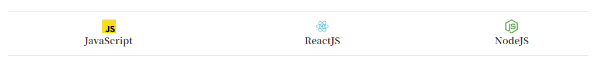

안녕하세요 😊  

이곳은 취미로 수집한 url을 저장하는 개인 블로그 입니다.  

글을 읽는데 불편하지 않길 바라는 마음에

몇가지 기능을 추가하였습니다.

<br/>

### 1. 읽었던 링크와 읽지 않았던 링크를 컬러로 구분

2. 링크를 클릭하지 않았을 때
<p style="color: #f87325">https://diary-blog.github.io/</p>

3. 링크를 한번 클릭 했을 때
<p style="color: #333">https://diary-blog.github.io/</p>

4. toc도 링크를 클릭했을때와 클릭하지 않았을때 텍스트 컬러로 구분 가능합니다.


<br>

### 2. 주제에 해당하는 링크 설명

1. 주제 앞에 이모지(📄) 가 적혀있습니다.
ex) 📄 ReactJS

2. 제목을 클릭하여 새창으로 바로 이동할 수 있습니다.
ex) [diary-blog 입니다](https://diary-blog.github.io)

3. 요약 을 클릭하여 해당 링크의 요약정리를 볼 수 있습니다. <details><summary> 요약 </summary>
Gatsbyjs로 만들고 Github page로 배포한 개인 블로그 입니다.
</details>

4. view 를 클릭하여 제목에 해당하는 페이지를 미리 볼 수 있습니다.  <details><summary> view </summary>
<iframe src="https://diary-blog.github.io/"></iframe>
</details>

```
view 제공 안되는 사이트 : Youtube, Github, uxdesign, openads, medium, GeekNews
```

### 3. 기타 기능

1. 포스팅 내부 목차


2. 다크모드, 필터, 검색, RSS, TOP, 공유하기(페이스북, 트위터)


