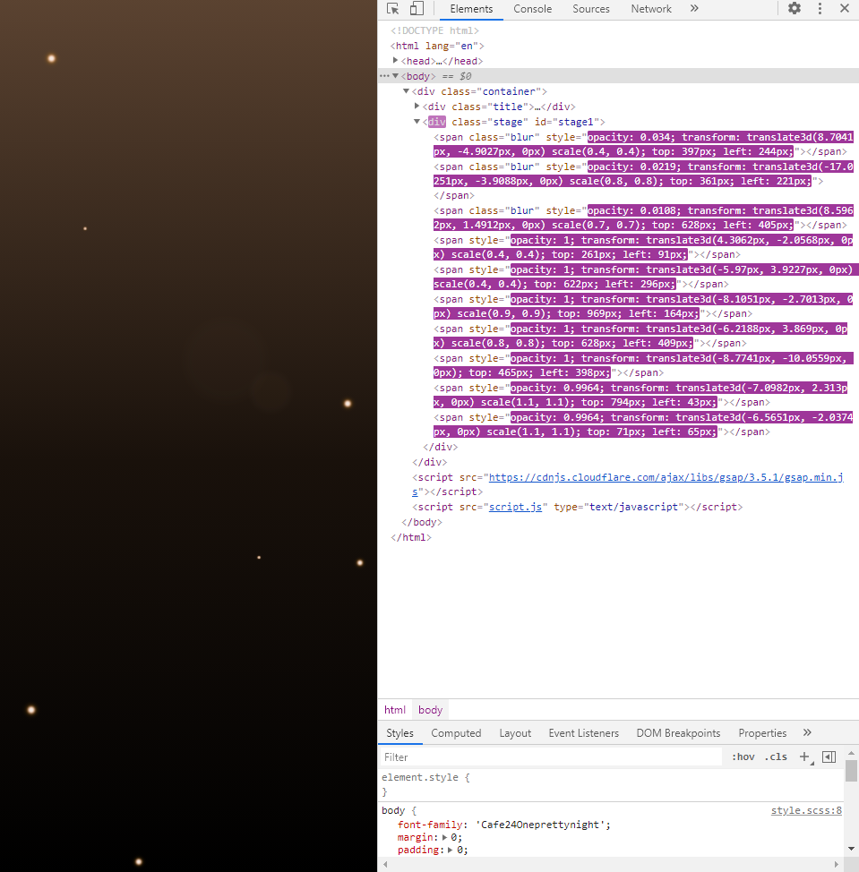
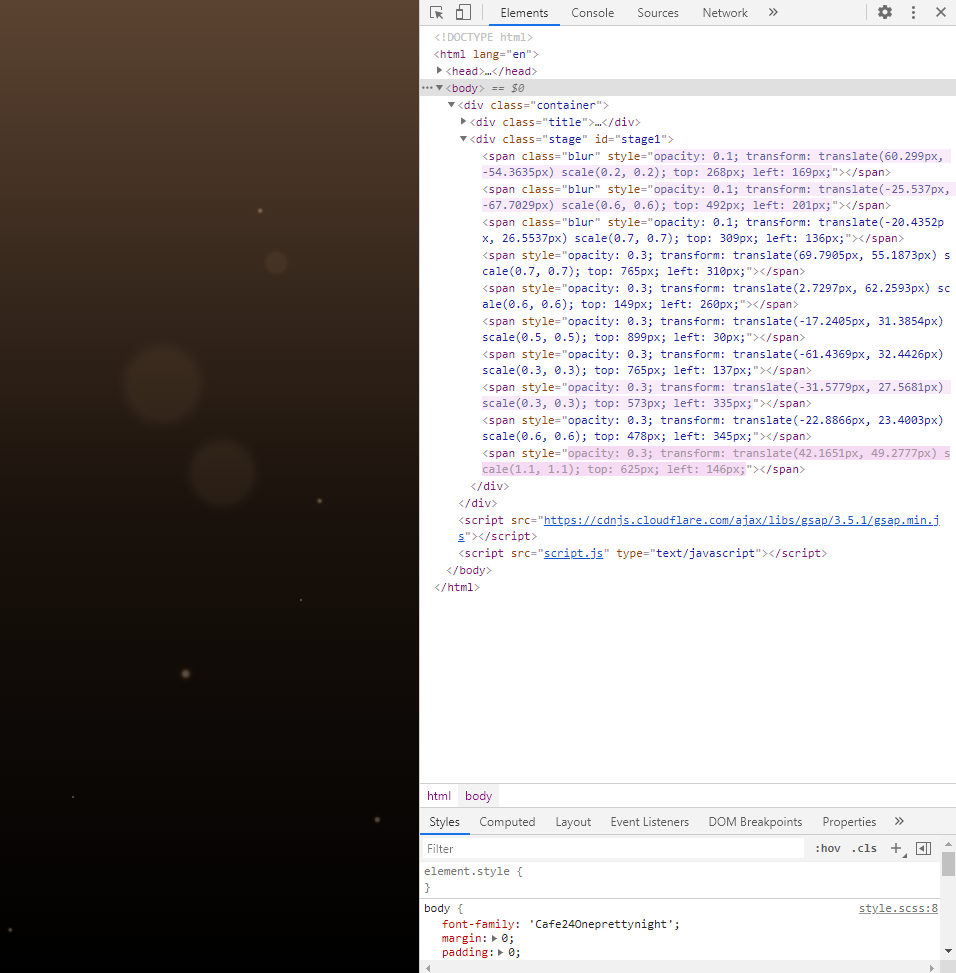
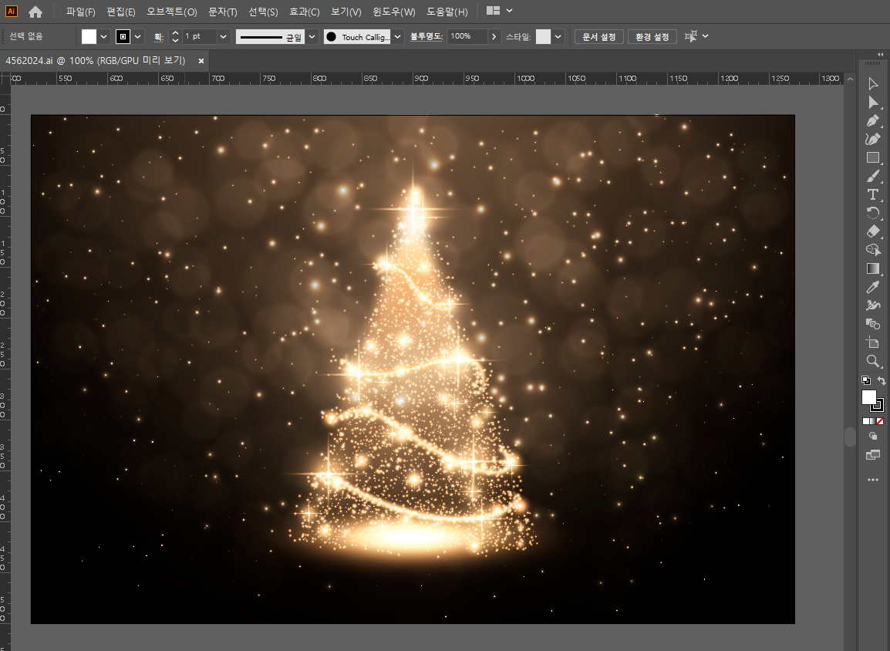
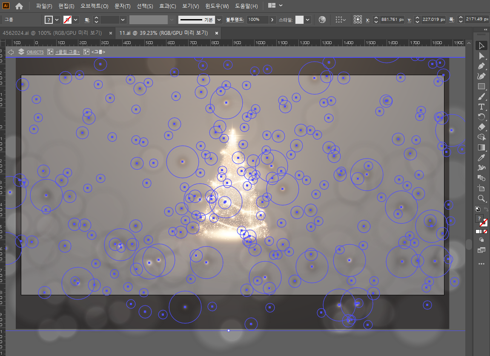
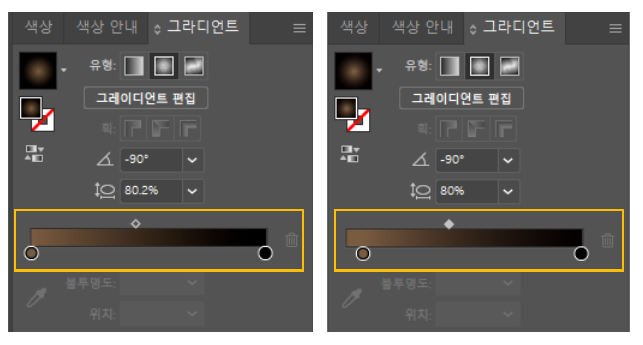
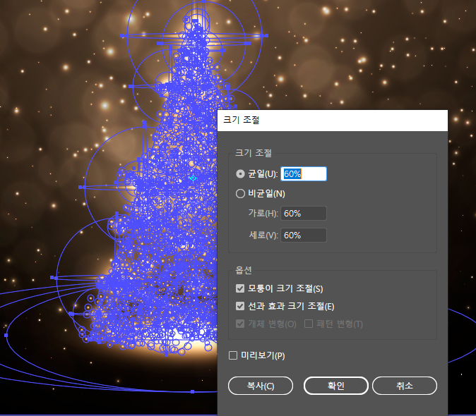
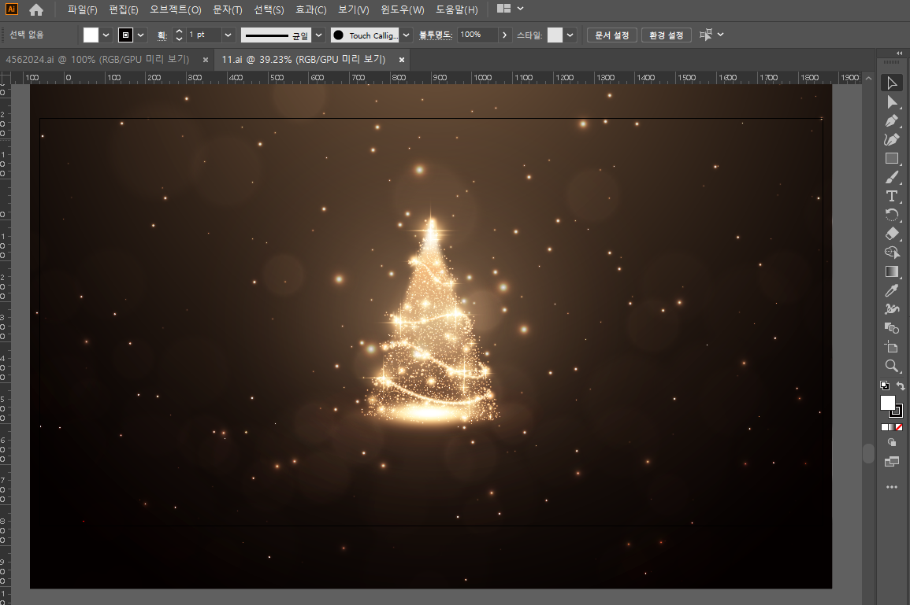
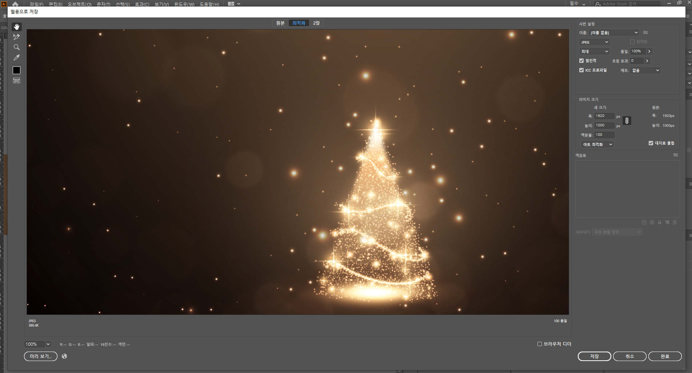

## 작업 할 이미지 선정

이미지를 검색하다가 눈부시도록 예쁜 이미지를 발견!


아... 너무 예쁘다아... ☆ 움직이면 얼마나 더 예쁠까?  
이거 웹으로 만들어보고싶다!! 해서 작업 바로 시작!

근데 이 불빛을 전부 웹으로 그려내면.. 잘못 만들면 브라우저 뻗을텐데..  
캔버스는 안쓸거고... 음.. 그럼 트리는 이미지로 넣고  

JS로 불빛만 반짝반짝하면서 반딧불처럼 움직이게 만들어보자!

***

## [1] 일단 디렉토리부터 생성

index.html  
style.scss  
script.js  

*(scss는 VScode에서 Extension을 이용하여*
*Live Sass Compiler로 컴파일해서 css 파일을 생성해줍니다.)*

***

## [2] 불빛을 빛나면서 움직이게 만들어봅시다.


### [1] [HTML](https://github.com/fe-w/interaction/blob/main/ui/12-Glow-light/index.html)

```html
<!-- index.html -->

<!-- [1] 스타일시트 연결 -->
<link rel="stylesheet" href="style.css">

<!-- [2] 인덱스 타이틀 작성 -->
<title>Glow light</title>

<!-- [3] 바디에 그림그릴 div 만들어놓고 간단한 문구도 추가 -->
<div class="container">
  <div class="title">
    <p>Happy Christmas!</p>
    <p>행복한 연말 보내세요!</p>
  </div>
  <!-- [3-1] stage 클래스 밑에 span 태그를 생성해서 불빛을 만들 예정 -->
  <div class="stage" id="stage1"></div>
</div>

<!-- [4] 좋아하는 자바스크립트 라이브러리 GSAP CDN 추가하고 -->
<script src="https://cdnjs.cloudflare.com/ajax/libs/gsap/3.5.1/gsap.min.js"></script>

<!-- [5] 애니메이션을 만들 스크립트도 추가 -->
<script src="script.js" type="text/javascript"></script>
```


### [2] CSS [(SCSS)](https://github.com/fe-w/interaction/blob/main/ui/12-Glow-light/style.scss)

```css
/* scss */
/* 스압을 줄이기 위해 한줄로 작성하였습니다 */

/* [1] 폰트는 상업용 무료폰트 사이트인 '눈누' 에서
    '카페24고운밤' 폰트를 사용하였습니다. (폰트 너무예뻐♥) */
@font-face {
  font-family: 'Cafe24Oneprettynight';
  src: url('https://cdn.jsdelivr.net/gh/projectnoonnu/noonfonts_twelve@1.1/Cafe24Oneprettynight.woff') format('woff');
  font-weight: normal; font-style: normal;
}

/* [2] 바디에 기본 스타일 및 폰트 적용해주기
    (백그라운드에 이미지를 적용할 예정이지만
    이미지 로딩이 느릴걸 예상해서 기본 그라디언트 배경을 적용해줌) */
body {
  font-family: 'Cafe24Oneprettynight'; margin: 0; padding: 0;
  background: linear-gradient(180deg, #5b4331 0%, #19110b 53%, #000000 100%);
}

/* [3] 이제 불빛 그림그리기~ */
/* 텍스트와 불빛을 감싸는 부모 container에 전체화면 스타일 적용 */
.container {
  position: relative; width: 100%; height: 100vh;

  /* [3-1] 브라우저에서 title 클래스 위치 잡기 */
  .title {
    width: 100%; height: 100%;
    display: flex; justify-content: center; align-items: flex-end;

    /* [3-1-1] <p>태그에 빛나는 라이팅 효과 주기*/
    p {
      position: absolute; height: 150px; z-index: 1;
      color: #fff; font-size: 4rem;
      text-shadow: 0 0 5px #fefce5, 0 0 10px #fffef3,
                   0 0 15px #fee2a2, 0 0 20px #f0c780, 0 0 30px #fef7cc,
                   0 0 40px #ff9f00, 0 0 55px #ff9700, 0 0 75px #fec379,
                   2px 2px 2px rgba(142, 139, 116, 0), 2px 2px 2px;
    }
    /* [3-1-2] 두번째 p 태그인
               <p>행복한 연말 보내세요!</p> 부분에 스타일 적용
               폰트사이즈가 4rem으로 너무 크기 때문에
               간격을 -3px 줄여서 한글 가독성 좋게 만듬 */
    p:nth-of-type(2) {
      height: 70px; letter-spacing: -3px;
    }
  }

  /* [4] stage 클래스에 불빛 만들어주기 */
  /* [4-1] 불빛 백그라운드에 트리 이미지 적용해줌
           이미지 사이즈 상관없이 이미지를 브라우저 전체 적용하고
           center로 포지션 잡아두면 브라우저 크기가 줄어들었을때
           그대로 중앙 정렬이 유지됨 */
  .stage {
    background-image: url('./img/1.jpg');
    background-size: cover;
    background-position: center;

    /*[4-2] 부모인 container 클래스 안에서 중앙 정렬하고
            불빛이 브라우저 밖을 넘어가면 보이지 않도록 적용 */
    position: absolute; overflow: hidden;
    margin: auto; left: 0; right: 0; top: 0; bottom: 0;

    /* [4-3] 반짝반짝 불빛 컬러 적용 */
    span {
      position: absolute;
      /* 작은 불빛 사이즈 */
      width:  1px; height: 1px;
      /* 작은 불빛 컬러를 3단계로 주광색, 주백색, 전구색 으로 적용해서
         불빛이 자연스럽게 빛나도록 쉐도우 적용 */
      box-shadow: 0 0 0 2px #fff, 0 0 0 3px #ffb68b, 0 0 5px 3px #ff9d00;
      /* 불빛은 기본 사각형으로 생겨서 radius로 원형을 만들어줌 */
      border-radius: 50%;
      /* 작은 불빛 블러 */
      filter: blur(1px);
      /* 큰 불빛 컬러
        (작은 불빛은 그라디언트 쉐도우가 불빛의 width와 height의
         크기보다 크기 때문에 백그라운드 컬러가 안보임)*/
      background-color: rgb(175, 133, 93);
    }
    /* [4-4] 큰 불빛 스타일 적용 */
    .blur {
      /* 큰 불빛 사이즈 */
      width:  100px; height: 100px;
      /* 큰 불빛 블러 */
      filter: blur(7px);
    }
  }
}
```


### [3] [JS](https://github.com/fe-w/interaction/blob/main/ui/12-Glow-light/script.js)

```js
/* script.js */

/*
전체 불빛(작은 불빛 + 큰 불빛) 갯수를 count 변수에 담음
큰 불빛 갯수를 blurCount 변수에 담음
html에서 stage class 선택해서 stage 변수에 담음
*/
const count     = 350;  
const blurCount = 150;
const stage = document.querySelector(".stage");

/*
- for문(반복문)으로 count 숫자보다 작을 시 makeLight() 함수 실행
- 첫 시작 후 10 * i (count 보다 작은 수)만큼 밀리초(ms)가 지나야 실행됨
- JS 내장함수인 setTimeout에 화살표함수를 적용하여
  함수를 파라미터로 전달하여 한번 실행 후 종료
*/
for (let i = 0; i < count; i++) {
  setTimeout(() => {
    makeLight(i);
  }, 10 * i);
}

/*
- for문안에서 makeLight() 함수가 한번 종료되면 다시 실행이 안되어서
  반복해서 실행시키려 timer 변수로 감싸고 반복 실행인 setInterval 적용
- 실행 시 설정해준 시간(초) 뒤에 count 보다 미만인 갯수에
  makeLight() 함수가 한번 실행되고
  setInterval로 주어진 시간(초)동안 반복해서 실행
*/
const timer = setInterval(() => {
  for (let i = 0; i < count; i++) {
    setTimeout(() => {
      /*
      makeLight() 함수를 setinterval로 반복 실행 시
      실행과 동시에 생성한 span tag를 함수가 종료될때 html에서 삭제해줘야
      span tag가 반복적으로 계속 무한으로 생성되지 않음
      */
      const removespan = document.querySelector("span");
      removespan.parentNode.removeChild(removespan);
      // 삭제와 동시에 함수가 실행되면서 html에 span tag 생성됨
      makeLight(i);
    }, 10 * i);
  }
  /* timer에서 생성된 불빛들은 시작시 5초 뒤에 나타남*/
  /* 위에 변수에 담지 않은 for문으로 불빛을 먼저 보여주고
     for문에 setTimeout이 종료될때쯤 timer변수 지연시간이 끝나서 불빛이 나타나고
     종료되면 span tag를 삭제하고 다시 생성하면서 무한 반복됨
  */
}, 5000);


// makeLlight() 함수로 큰 별, 작은 별 만들기
function makeLight(i) {
  /*
  [1] 불빛을 먼저 생성
      함수 실행 시 span tag 생성하고
      if문(조건문)으로 큰 불빛(blurCount)에 넣어준 숫자보다 작으면
      span tag에 blur class 추가함
      stage 클래스 하위에 span 태그 연결
  */
  let span = document.createElement("span");
  if (i < blurCount) {
    span.classList.add("blur");
  }
  stage.appendChild(span);

  /*
  [2] 불빛 애니메이션 설정
      불빛에 애니메이션 주기 전에 기본 셋팅 설정
      가로 위치 랜덤, 세로 위치 랜덤
      크기 스케일 값으로 랜덤
      투명값을 0으로 먼저 안보이게 설정
  */
  gsap.set(span, {
    left: gsap.utils.random(0, stage.offsetWidth),
    top: gsap.utils.random(0, stage.offsetHeight),
    scale: gsap.utils.random(0.2, 1.2, 0.1),
    opacity: 0
  });

  // [3] 애니메이션 효과를 적용할 타임라인 생성
  let tl = gsap.timeline({
    paused: true,          // 자기 자신을 가리킴
    onComplate: () => {    // onComplate 함수를 하나 만들어서
                           // 익명함수로 식별자를 값으로 전달
      span.remove();       // span tag 삭제
      makeLight(i);        // makeLight() 함수 실행
    }
  })

  /*
  [4] if문(조건문)으로 큰 불빛, 작은 불빛 만들어서
      불빛이 움직이고, 사라지게 만들기
  */
  if (i < blurCount) {
    /*
    [4-1] 큰 불빛 생성
          큰 불빛 투명도
          지속 시간 (초)
    */
    tl.to(span, {
      opacity: gsap.utils.random(0.1, 0),
      duration: .8
    })
    /*
    [4-2] 불빛 움직임
          큰 불빛 x, y축 움직임 (80px 안에서 랜덤값을 생성하여 움직임)
          불빛 유지 지속시간 (나타났다가 자연스럽게 사라짐)
          애니메이션 스타일 (기본스타일 Power0.easeNone)
          사라지는 시간 (초)
    */
    tl.to(span, {
      y: gsap.utils.random(-80, 80),
      x: gsap.utils.random(-80, 80),
      duration: gsap.utils.random(4, 2, 2),
      ease: Power0.easeNone
    }, -0.3)
    /*
    [4-3] 불빛 사라짐
          투명값 0으로 설정
          .8(초) 동안 자연스럽게 나타남
          마지막에 적용된 애니메이션(여기서는 duration: .8)의
          마지막 종료전에 0.8초 추가 (딜레이를 주어서 자연스럽게 사라짐)
    */
    tl.to(span, {
      opacity: 0,
      duration: .8
    }, ">-0.8")
                  
    // [4-4] 불빛 애니메이션 실행
    tl.play();

  // else 로 불빛 하나 더 생성
  } else {
    /*
    [4-5] 작은 불빛 생성
          작은 불빛 투명도를 낮추지 않게 적용해야 빛이남
          지속 시간 (초)
    */
    tl.to(span, {
      opacity: gsap.utils.random(1, 1),
      duration: .3
    })
    /*
    [4-6] 불빛 움직임
          작은 불빛 x, y축 움직임
          (지정한 픽셀 안에서 랜덤값을 생성하여 움직임)
          지속시간을 조금 길게 적용하고
          사라지는 시간을 짧게 적용해서 반짝이게 만듬
    */
    tl.to(span, {
      x: gsap.utils.random(-100, 100),
      y: gsap.utils.random(-100, 100),
      duration: gsap.utils.random(4, 2, 5),
      ease: Power0.easeNone
    }, -0.3)
    /*
    [4-7] 불빛 사라짐
          여기서 opacity를 .3으로 준 이유는
          작은 불빛이 사라지면서 정지되게 만들기 위함
          0으로 주게되면 갑자기 뿅 하고 사라져서
          0.1초 사이에 새로 나타나는 불빛하고 자연스럽게 이어지지 않음
    */
    tl.to(span, {
      opacity:  .3,
      duration: .3
    }, ">-0.3")
    // [4-8] 불빛 애니메이션 실행
    tl.play();
  }
}
```

### [4] 불빛이 잘 나오는지 확인하기

전체 불빛 갯수를 갯수를 10개로 설정하고  
큰 불빛의 갯수를 3개로 설정해서  
일단 span tag가 생성되고 삭제되고 반복되는지 먼저 체크

```js
const count     = 10;  
const blurCount = 3;
```

blur 클래스가 적용된 span tag는 3개로 나오고  
나머지 span tag 7개는 작은 불빛으로 나옵니다.



적용해둔 timer 변수가 5초로 되어있어서  
5초동안 transform 이 적용되서 불빛이 자연스럽게 움직이고 사라집니다.



setTimeout으로 한번 실행이 종료되서 불빛이 사라지면  
timer 변수가 비동기로 실행되어 5초가 지날때 span tag를 삭제하고  
makeLight() 함수를 실행시켜 span tag가 생성되면서  
불빛들이 transform이 적용되어 움직입니다.

setInterval로 timer 변수가 종료되는 시점에 계속 나타났다 사라졌다를 반복되어 실행됩니다.  

.

간단하게 불빛 갯수 10개로 테스트하였으니 다시 원래 갯수로 수정해둡니다.  

DOM이 변경되는 동시에 애니메이션이 적용되어있어서 렉이 너무 심하면  
count 숫자를 조금 낮춰서 적용하시면 됩니다.

저는 반짝반짝 눈부시게 만들기 위하여  
전체 불빛 갯수를 350개로 적용해주었습니다.

```js
const count     = 350;
const blurCount = 150;
```

***

이제 HTML, CSS, JS를 작업하고  
브라우저에서 잘 동작하는것도 확인하였으니

## [3] 백그라운드에 적용 될 이미지 다듬어서 저장해봅시다.

이미지에 불빛이 너무 많아서 열심히 코딩해서 만든 불빛은 잘 안보일듯하니  
벡터 파일을 열어서 이미지를 조금 수정할 예정입니다.  

별로 어렵지 않아서 쉽게 따라하실 수 있습니다.

```css
/* 일러스트 벡터 파일을 온라인 컨텐츠 마켓에서 다운받아서 오픈하면
작업 전에 먼저 확인해야 할 부분이 있습니다.

[1] 온라인 + 인쇄
작업하시는 이미지가 온라인용으로만 사용하지 않고 출력/인쇄가 필요하다면
파일명 옆에 색상이 CMYK로 되어있는걸 꼭 확인해주셔야합니다.

[2] 온라인에서만 사용
출력/인쇄가 필요하지 않고, 개인적으로 웹에서만 사용하는용도 정도면
컬러모드가 RGB인 상태로 작업하시면 됩니다.
만약 웹에서만 사용하고 싶은데 벡터파일이 CMYK로 되어있으면 RGB로 변환하면 되는데
변환 했을 시에 컬러나 적용 효과가 많이 달라질수 있으니
RGB로 작업된 다른 파일을 다운받으시길 추천드립니다.
하지만 그 해당 파일을 꼭 사용해야 한다면
컬러와 효과를 직접 보정하시면 되지만 그러면 손이 많이가게됩니다.

* CMYK <-> RGB 변환 방법 : 파일 -> 문서 색상 모드 -> CMYK, RGB색상 선택 */
```

### [1] 원본 이미지 수정

- 수정 전 원본 화면



일러스트 사용이 익숙하지 않은 분들은  
불빛을 하나씩 마우스로 선택해서 지워야하는것처럼 느껴지실텐데요

이런 벡터는 보통 레이어가 그룹별로 묶여있기 때문에  
불빛을 더블클릭하고 해당 그룹안에 들어가서  
불빛 몇개를 묶음으로 선택해서 delete하면 레이어별로 금방 삭제가 가능합니다!  



불빛을 전부 다 지우면 이미지에 트리 하나만 있기에 허전하니  
불빛 몇개정도 정적으로 빛나보이도록 남겨둡니다.

### [2] 백그라운드 그라디언트 조절
윈도우 메뉴에서 그라디언트를 열어서  
range에서 왼쪽 컬러를 우측으로 조금 이동하여  
전체 배경을 살짝 밝게 조절해줍니다.  

- 그라디언트 조절 전(좌) / 후(우)




### [3] 트리 사이즈를 조금 작게 조절
트리 오브젝트를 선택하고, 단축키 S를 누르고 enter를 누르면  
스케일(Scale) 조절 창이 나옵니다.  
트리 스케일을 60% 축소하여 배경 중앙에 적절히 배치해주면 됩니다.




- 불빛 지우고, 컬러 조금 수정하고, 크기 줄인 후 수정본 화면




이제 해당 아트보드를 선택하고 윈도우 기준으로  
단축키 ctrl + alt + shift + S 를 눌러서  

- 웹용으로 저장하기 화면



웹용으로 이미지를 저장하면  
background-image: url(이미지)도 준비 완료!

***

이제 HTML, CSS, JS, 이미지 모두 준비되었습니다!

***

## [4] 완성된 브라우저 화면

큰 불빛은 눈부시게 표현하고,  
작은 불빛은 반짝반짝 반딧불 처럼 빛나게 표현한 결과 입니다.

쨔쨘~☆


컬러랑 불빛을 살짝 보정했더니 원본 이미지 보다 훨씬 예쁘죠!! 헷~ 

🎄 Happy Christmas! 행복한 연말 보내세요! 🥰

***

<u>인생에 한번뿐인 나의 2020년을 반짝반짝 예쁘게 마무리해봅니다. ✨</u>

***

## [5] 전체 코드

- 본문에서 만든 코드 :  
https://github.com/fe-w/interaction/tree/main/ui/11-20/12-Glow-light

- 더 많은 자료 보기 :  
https://github.com/fe-w/interaction


***

## [6] 참고자료

- [setTimeout과 setInterval을 이용한 호출 스케줄링](https://ko.javascript.info/settimeout-setinterval)

- [자바스크립트 개발자라면 알아야 할 33가지 개념 #10 스케쥴링: setTimeout 과 setInterval](https://velog.io/@jakeseo_me/%EC%9E%90%EB%B0%94%EC%8A%A4%ED%81%AC%EB%A6%BD%ED%8A%B8-%EA%B0%9C%EB%B0%9C%EC%9E%90%EB%9D%BC%EB%A9%B4-%EC%95%8C%EC%95%84%EC%95%BC-%ED%95%A0-33%EA%B0%80%EC%A7%80-%EA%B0%9C%EB%85%90-10-%EC%8A%A4%EC%BC%80%EC%A5%B4%EB%A7%81-setTimeout-%EA%B3%BC-setInterval-y6juukjsey)

- [Javascript - HTML 엘리먼트 가져오기, 삭제하기, 이동하기](https://goeun-woo.github.io/javascript/2018/08/04/Javascript-001-ElemControl.html)

- [GSAP Timeline .to()](https://greensock.com/docs/v3/GSAP/Timeline/to())

- [GSAP Tween](https://greensock.com/docs/v3/GSAP/Tween)

- [한글 웹 폰트 - 카페24 고운밤](https://noonnu.cc/font_page/342)

- [Abstract golden christmas tree Free Vector](https://www.freepik.com/free-vector/abstract-golden-christmas-tree_10806748.htm)
