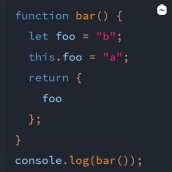

안녕하세요!  
자바스크립트 문제 풀이 앱인 [Enki](https://www.enki.com/)를 이용하여  
매일매일 문제풀이 코스를 진행하고 있는 중입니다.  

하지만 문제를 풀고 답만 맞출 뿐 문제에 대한 답이 <u>왜 이런 결과가 나오게 되었는지</u>  
답에 대한 해석이 따로 적혀있지 않아서 제가 풀어서 해석한 내용을 기록하고자 합니다.

대부분 기초적인 내용이지만 블로그에 따로 기록하는 이유는  
<u>사용되는 용어와 의미 전달을 명확하게</u> 하는것을 연습하기 위해서 입니다.  

잘못된 해석이 있다면 댓글로 말씀해주시면 감사하겠습니다 :)

\+  

앱에서 계속 문제를 풀다보니 풀수있는 문제가 제한적이라서  
7월 부터 leetCode로 바꿔서 작성하려 합니다.


<hr />

## JS object 1

`Q. What will be logged by the following snippet`    
1. `'b'`  
2. `{foo: 'b'}`  
3. `{foo: 'a'}`  
4. `'a'`



*[풀이 영상 보러가기 (1m 26s)](https://www.instagram.com/p/CO5S8WKg3X_/)*

<br style="margin-bottom: 50px"> </br>

`풀이`

<u>1</u>  
let 키워드로 선언한 변수는 값이 변경될 수 있습니다.  
만약 foo의 값을 변경하고 싶다면  
bar 함수의 스코프 안에서 foo = "c" 값을 넣어주면 됩니다.
```js
function bar() {
  let foo = "b";
  this.foo = "a";
  foo = "c"
  return { foo };
}
console.log(bar()) // { foo: "c" }
```

<u>2</u>  
this가 가리키는 것이 전역변수인지 지역변수인지를 먼저 알아야 합니다.  

일반 함수 내부에서 this를 호출했으므로  
여기서 this는 전역 객체인 window를 가리킵니다.  
따라서 this.foo는 window.foo를 가리킵니다.

let으로 선언된 foo와 this의 foo는  
서로 다른 메모리 주소에 저장된 값을 가리키는 변수이므로  
서로 다른 변수입니다.

<u>3</u>  
> (이부분 설명 정정했습니다.)  
> 영상에 잘못 설명한 부분이 있습니다.  
> 콘솔에 함수를 호출했을때 변수와 값을 리턴하는건데  
> 키 밸류 라고 적은 부분을 정정합니다.

return { foo }; 는 객체 리터럴 안에 foo 변수를 담아 리턴합니다.  
객체(Object)는 키key와 value로 구성되어 있습니다.

bar() 함수 스코프 안에 선언된 foo 라는 변수가  
프로퍼티로 추가된 객체{ 변수 : 값 }이 최종 리턴으로 내보내집니다.

<u>4. etc</u>  
만약 변수를 출력하지 않고 값인 'b' 만 출력하고 싶다면  
객체 리터럴인 { } 에 담지 않고 return foo; 로 리턴하면 됩니다.  
그럼 bar() 함수를 호출했을때 'b' 가 출력됩니다.

그리고 전역스코프에서 console.log( foo );를 실행하면  
여기서의 foo는 함수안에 선언된 지역 변수인 foo가 아니라  
전역변수인 window.foo 이므로 'a'가 출력됩니다.

window.foo 인 'a'가 bar() 함수의 아규먼트로 들어가더라도  
실제 함수 bar는 파라미터를 갖고있지 않으므로  
아규먼트로 넘겨진 foo는 무시됩니다.

그럼 원래대로 return foo;가 실행됩니다.  
여기서의 foo는 마찬가지로 지역변수인 foo, 즉 'b' 입니다.

<u>5. etc</u>  
만약 {foo: 'a'}를 출력하고 싶다면  
this.foo를 this.foo1로 바꿔서 return에 foo1을 리턴하면  
객체에 foo1이 담겨서 리턴됩니다.

여기서 foo1은 지역스코프에서 찾아지지 않기 때문에  
전역 스코프까지 찾아가서 window.foo1을 참조했다고 볼 수 있습니다.

<br/>

`정답`  
`2. {foo: 'b'}`

<hr>

## 


