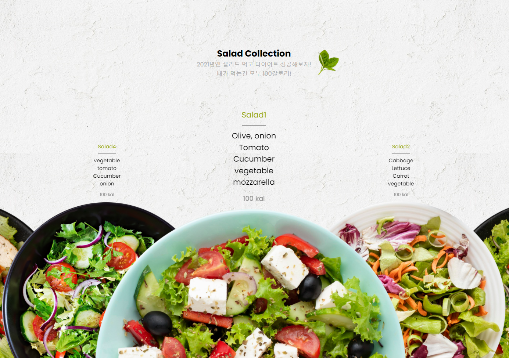
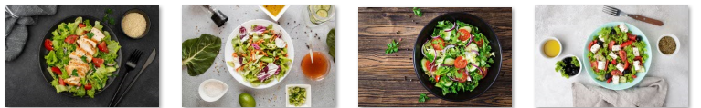
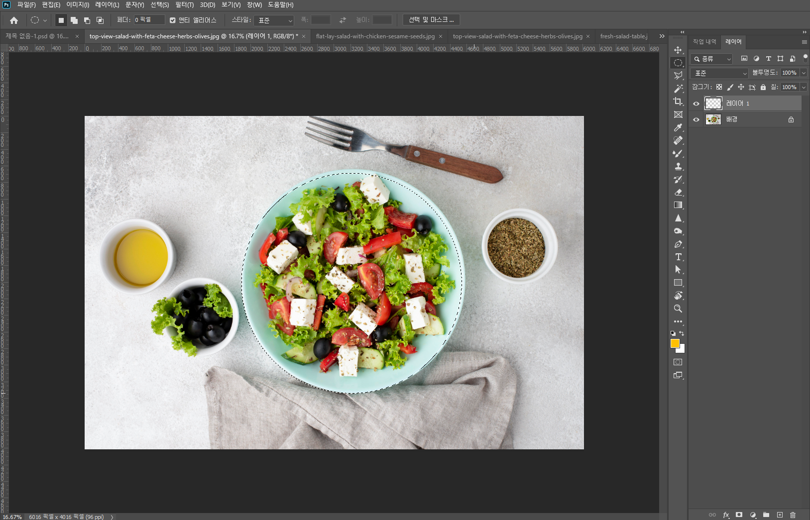
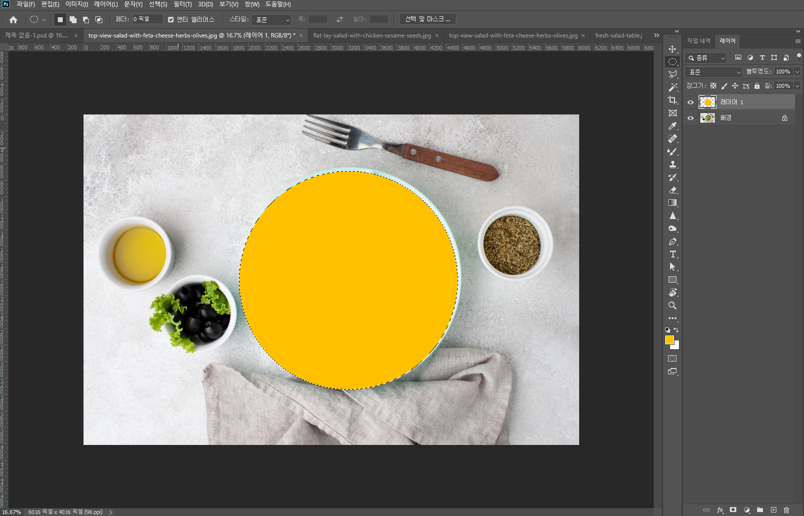
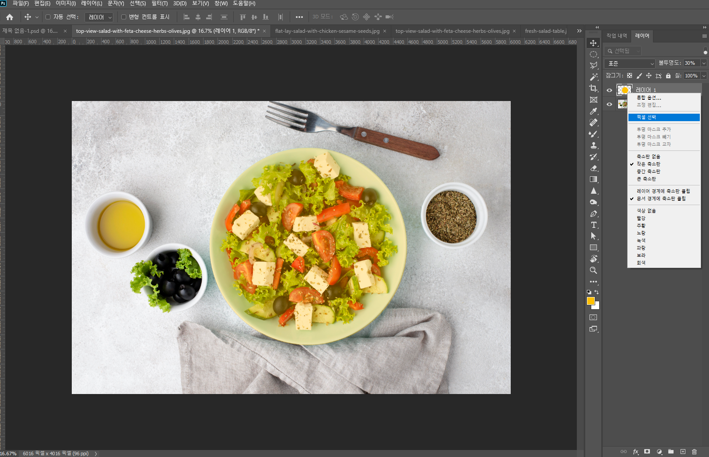
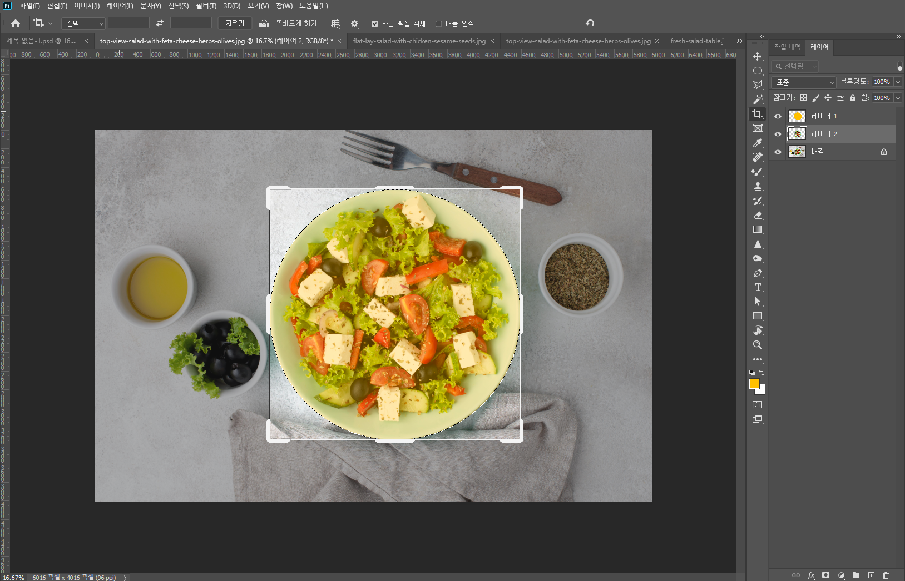
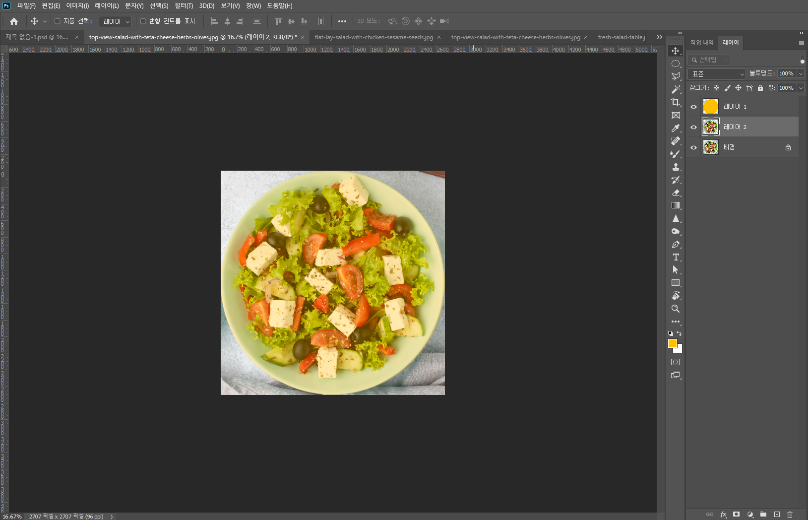
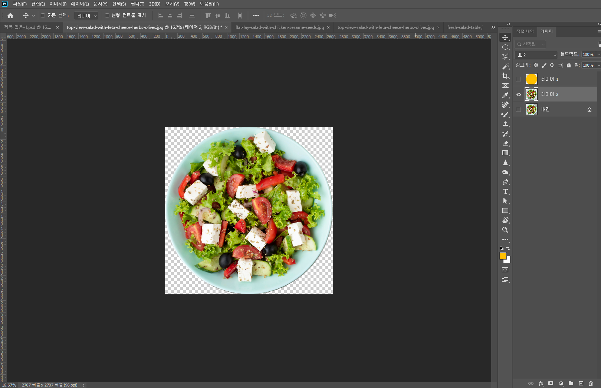
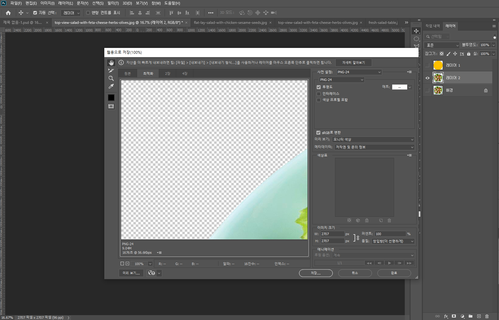
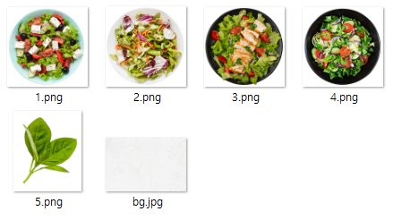

Swiper 3D Coverflow Effect 를 참고하여 슬라이드를 제작하려합니다.  

주석을 천천히 읽다보면 만드는 방법은 정말 쉽고 누구나 따라하실 수 있습니다! :)


## [1] 샐러드 캐러셀 만들고 채식과 친해지자!


### [1] [HTML](https://github.com/gr-p/interaction/blob/main/ui/3-1-Salad/index.html)

```html
<!-- index.html -->

<!-- [1] 내가만들 스타일시트 연결
         swiper 스타일시트도 같이 연결하고
         인덱스 타이틀 작성 -->
<link rel="stylesheet" href="https://unpkg.com/swiper/swiper-bundle.css">
<link rel="stylesheet" href="style.css">
<title>Salad carousel</title>

<!-- [2] 샐러드 타이틀 작성하고
         상큼한 민트잎 하나 추가~ -->
<div class="title">
  <h2>Salad Collection</h2>
  <p>2021년엔 샐러드 먹고 다이어트 성공해보자! <br /> 내가 먹는건 모두 100칼로리!</p>
  
</div>

<!-- [3] 슬라이드를 배치할 섹션 작성 
         슬라이드 안에 내용을 수정하고싶다면
         swiper-slide class 자식부분에 내용을 추가로 넣으면 됩니다.
         전 메뉴판을 menu 클래스에 넣고 a tag에 샐러드 이미지를 넣어서
         이미지를 클릭하면 해당 샐러드 정보로 이동하도록 만드려합니다.
         샐러드는 총 4가지 종류로 준비하였습니다.
-->
<section>
  <div class="slider">
    <div class="swiper-container">
      <div class="swiper-wrapper">
        <div class="swiper-slide">
          <div class="menu">
            <p>Salad1</p>
            <p>Olive, onion</p>
            <p>Tomato</p>
            <p>Cucumber</p>
            <p>vegetable</p>
            <p>mozzarella</p>
            <p class="kcal">100 kal</p>
          </div>
          <a href="#">
            
          </a>
        </div>
        <div class="swiper-slide">
          <div class="menu">
            <p>Salad2</p>
            <p>Cabbage</p>
            <p>Lettuce</p>
            <p>Carrot</p>
            <p>vegetable</p>
            <p class="kcal">100 kal</p>
          </div>
          <a href="#">
            
          </a>
        </div>
        <div class="swiper-slide">
          <div class="menu">
            <p>Salad3</p>
            <p>Lettuce</p>
            <p>tomato</p>
            <p>vegetable</p>
            <p>chicken breast</p>
            <p class="kcal">100 kal</p>
          </div>
          <a href="#">
            
          </a>
        </div>
        <div class="swiper-slide">
          <div class="menu">
            <p>Salad4</p>
            <p>vegetable</p>
            <p>tomato</p>
            <p>Cucumber</p>
            <p>onion</p>
            <p class="kcal">100 kal</p>
          </div>
          <a href="#">
            
          </a>
        </div>
      </div>
    </div>
  </div>
</section>

<!-- [4] 모바일에서 터치 잘되는 swiper 슬라이드 CDN 추가하고
         슬라이드 옵션 적용할 스크립트 추가하면 기본 html 작성 완료! -->
<script src="https://unpkg.com/swiper/swiper-bundle.js"></script>
<script src="./script.js" type="text/javascript"></script>
```


### [2] CSS [(SCSS)](https://github.com/gr-p/interaction/blob/main/ui/3-1-Salad/style.scss)

```css
/* style.scss */
/* 스압을 줄이기 위해 한줄로 작성하였습니다 */


/* break point를 break-m 변수로 지정 */
$break-m: 768px;

/*
폰트는 google font에서 동글동글한 Poppins 폰트를 사용하였습니다.
샐러드가 동그란 접시에 담겨있고
슬라이드가 무한 loop로 계속 이동되고
좌우 에서 중앙으로 슬라이드가 배치될때 스케일이 조금 커지는 느낌을
그대로 전달하기 위해서 동글동글한 폰트로 적용하였습니다.
적용하고나니 잘어울립니다!
*/
@import url("https://fonts.googleapis.com/css2?family=Poppins:wght@200;300;400;500;600;700;800;900&display=swap");


/* [1] reset css가 따로 없는 상태에서
       전체화면에 적용하기위해 브라우저의 기본 스타일값 초기화 */
* {
  margin: 0; padding: 0; box-sizing: border-box;
}

/* [2] body에 폰트 추가하고
   백그라운드에 벽지 이미지를 적용해줍니다. */
body {
  font-family: 'Poppins', sans-serif;
  background: url('./img/bg.jpg'); overflow: hidden;
  background-size: cover;
}

/* [3] 샐러드 타이틀, 부제 설명, 민트잎 중앙으로 위치 잡기 */
.title {
  width: 100%; height: 35vh;
  /* 슬라이드를 메인으로 둘거라서 텍스트만 있는
     타이틀의 포지션은 absolute로 슬라이드보다 아래 레이어로 적용 */
  position: absolute;
  
  /* 텍스트 세로로 중앙 정렬 */
  display: flex; flex-direction: column;
  justify-content: center; align-items: center;
  text-align: center;

  /* 부제 설명은 그레이컬러로 적용
     (타이틀의 컬러는 기본으로 #000이 적용되어 있습니다.) */
  p {
    color: #adadad;
  }
  /* 민트잎 위치 배치하기
     타이틀의 포지션이 absolute 라서
     민트의 부모는 title이 아닌 body를 기준으로 배치됩니다. */
  .leaf {
    width: 70px;
    position: absolute;
    left: 400px; right: 0px; top: 0; bottom: 0; margin: auto;
    /* 반응형으로 화면이 작아지면 민트잎을 안보이게 숨겨두었습니다. */
    @media screen and (max-width: $break-m) {
      display: none;
    }
  }
}

/* [4] 슬라이드에 스타일을 적용해봅시다. */
section {
  /* 섹션에 전체화면을 기본을 주고
     슬라이드를 중앙 아래로 배치합니다. */
  width: 100%; height: 100vh;
  display: flex; justify-content: center;
  align-items: flex-end;

  /* [4-1] 슬라이드 */
  .slider {
    /* 슬라이드의 사이즈를 section에 맞게 배치하고,
       slider안에 컨텐츠는 아래로(bottom) 배치해줍니다. */
    width: 100%; height: 100%;
    display: flex; justify-content: flex-end;

    .swiper-container {
      /* 전체 슬라이드의 가로 폭은 100%로 슬라이드를 모두 보여줍니다.
         margin-bottom 으로 아래를 기준으로 슬라이드를 -100px으로 내려줍니다. */
      width: 100%;
      margin-bottom: -100px;

      /* 슬라이드 한개당 가로 사이즈는 400px로 주고 */
      .swiper-slide {
        width: 400px;
        position: relative;

        /* 메뉴 텍스트와 이미지를
           세로로 가운데 정렬로 배치해줍니다. */
        display: flex; flex-direction: column;
        justify-content: center;
        text-align: center;

        /* [4-1-1] 메뉴 텍스트 스타일 적용 */
        .menu {
          /* 메뉴의 높이는 <p></p> 텍스트에 따라서
             높이가 달라지기에 auto로 주었습니다. */
          height: auto;

          /* 텍스트를 세로로 배치하고 중앙으로 정렬해줍니다. */
          display: flex; flex-direction: column;
          align-items: center;

          /* 텍스트의 사이즈를 지정해줍니다.
             (반응형시 더 작은 폰트사이즈로 적용)*/
          p {
            font-size: 0.875rem;
            @media screen and (max-width: $break-m) {
              font-size: 0.625rem;
            }
          }
          /* 제목이 되는 첫번째 텍스트에 컬러와 line 스타일을 정해주었습니다.
             현재는 제목 텍스트 길이에 맞게 라인의 길이가 지정되어있습니다.
             만약 라인의 width를 원하는 길이대로 주고 싶다면 border-bottom 말고
             가상요소 속성인 ::before로 스타일을 적용하는것을 추천합니다.
             예를들어 p:nth-of-type(1)::before {} 으로 주거나
             직접 제목 클래스를 지정해줘서 (ex: .menu-title)
             .menu-title::before {} 으로 작성하시면 됩니다.
             */
          p:nth-of-type(1) {
            /* 메뉴 제목 컬러를 지정해주않으면 기본은 #000 입니다. */
            color: #9ba91f;
            height: auto;
            /* 텍스트와 라인의 빈 공간 */
            padding-bottom: 8px;
            /* 라인과 아래 텍스트의 빈 공간 */
            margin-bottom:  8px;
            /* 라인 컬러 지정 */
            border-bottom: 1px solid #898989;
          }
          /* 칼로리 텍스트를 메뉴 텍스트와 차별을 주기 위하여
             컬러를 변경하고, 폰트사이즈를 조금 줄인다음
             간격을 조금 띄워서 배치해주었습니다. */
          .kcal {
            color: #898989;
            margin-top: 10px;
            font-size: 0.75rem;
          }
        }

        /* [4-1-2] 샐러드 이미지 스타일 적용 */
        .salad-img {
          width: 100%;
          height: 150px;
          /* 미디어쿼리로 브라우저가 줄어들시 break point를 주어서
             이미지 사이즈를 줄여주었습니다. */
          @media screen and (max-width: $break-m) {
            height: 50px;
          }
          /* 샐러드를 이미지는 부모인 .swiper-slide 보다 가로 길이가 크기 때문에
             position을 absolute로 주고 좌측 -100px만큼 이미지를 조금 이동하고,
             이미지 사이즈는 해상도가 높아서 가로세로 사이즈를 600으로 고정시켰습니다. */
          a {
            img {
              position: absolute; right: -100px;
              width: 600px; height: 600px;

              /* 모바일에서는 이미지의 가로 고정픽셀을 해제하고
                 100%로 주어서 샐러드가 화면에 맞춰서 잘나오게 해줍니다. */
              @media screen and (max-width: $break-m) {
                right: 0px;
                width: 100%; height: auto;
              } 
            }
          }
        }
      }
    }
    /* 가운데 보이는 슬라이드를 양쪽에 있는 슬라이드보다
        강조되어 보이도록 스케일을 1.5로 적용해주었습니다. */
    .swiper-slide-active {
      transform: scale(1.5)!important;
    }
  }
}
```


### [3] [JS](https://github.com/gr-p/interaction/blob/main/ui/3-1-Salad/script.js)

```js
/* script.js */

var swiper = new Swiper('.swiper-container', {
  effect: 'coverflow',   // swiper 3D의 이펙트 이름은 coverflow 입니다.
  grabCursor: true,      // 슬라이드 위에 마우스를 올리면 커서모양이 grab 모양으로 바뀝니다.
  centeredSlides: true,  // 첫번째 슬라이드를 가운데 정렬로 적용합니다.
  slidesPerView: 'auto', // 중앙에 있는 슬라이드를 제외한 좌/우 슬라이드 갯수를 설정합니다.

  // 기본적으로 swiper 3D에 적용되어있는 속성을 지정해줍니다.
  coverflowEffect: {
    rotate: 0,           // 중앙에 있는 이미지를 제와한 양쪽에 슬라이드 회전 각도 입니다.
                         // rotate 속성을 0 으로 주어서 각도가 회전하지 않도록 합니다.
    stretch: 0,          // 슬라이드 간에 거리
    depth: 0,            // 숫자가 커지면 중앙을 point로 잡고 perspective로 원근법이 적용됩니다.
    modifier: 1,         // 중앙에 있는 active된 슬라이드의 이미지가 맨 위 레이어처럼 보입니다.
    slideShadows: false, // 기본적으로 적용되어있는 shadow 그라데이션을 false로 해제해줍니다.
  },
  // 슬라이드가 끝나는 지점에 다시 첫번째 슬라이드가 나오도록 loop를 true로 적용해주었습니다.
  loop: true,
});
```

***

### [4] 샐러드 이미지

이제 html, css, js 슬라이드를 적용했으니  
포토샵으로 간단하게 샐러드만 누끼를 따서 샐러드 4종을 준비해봅시다!

- 준비한 샐러드 4종 이미지 (참고자료에 링크가 있습니다.)




먼저 레이어를 하나 추가하고, 원형 툴을 선택한다음  
이미지에서 마우스를 왼쪽을 클릭하고, 키보드에서 shift 키를 누를 상태에서  
왼쪽에서 오른쪽으로 드래그하면서 원형을 그려줍니다.
    


원형을 색칠하기 위해서 단축키 alt + backspace나 ctrl + backspace 를 눌러줍니다.



ctrl + D 로 원형 선택을 해제해주고  
키보드 숫자키 1~0 중에 하나를 누르면 10~100% 안에서 opacity가 적용됩니다.  
저는 3을 눌러서 30%를 적용해주었습니다.


이제 원형의 모양을 접시에 맞춰봅시다.  

ctrl + T 를 눌러서 마우스로 끝점 부분을 조절해서  
어느정도 원형이 접시에 맞춰졌다고 생각하면 enter를 누르시면 됩니다.


그 다음 원형의 픽셀을 선택해줍니다.  
레이어 이미지에 마우스 오른쪽을 누르면 픽셀 선택 메뉴가 나옵니다.  
(픽셀선택 단축키는 ctrl + 레이어 이미지 마우스 왼쪽으로 클릭)



픽셀이 선택되어있는 상태에서 배경 레이어를 클릭해서 선택하고


alt + J 를 누르면 배경에있는 이미지가 복사되면서 레이어가 새로 생성됩니다.


다시 레이어의 픽셀을 선택하고나서 c 를 누르면  
이미지 사이즈대로 컷팅 할 수 있습니다.



이상태에서 엔터를 누르면 이미지가 원형 픽셀에 맞게 잘립니다.



이제 복사한 샐러드접시 레이어만 제외하고  

레이어 1 과 배경의 레이어 옆에 눈 표시를 해제해서  
레이어를 화면에서 안보이게 해놓은다음



ctrl + alt + shift + S 를 눌러서  
웹용으로 저장하기로 png나 jpg를 선택하여 저장합니다.



이렇게 나머지 샐러드도 똑같이 누끼를 따주면 이미지 준비 완료!  
단축키 몇개만으로 포토샵으로 누끼따는거 정말 쉽죠!!



이제 html, css, js, 샐러드 이미지 파일 모두 준비되었습니다!

***

## [3] 완성된 브라우저 화면


이렇게 간단하게 샐러드 메뉴 슬라이드 만들어서  
샐러드와 친해져서 다이어트 성공하길 바랄게요~☆

***

## [4] 전체 코드

https://github.com/gr-p/interaction/tree/main/ui/3-1-Salad

***

## [5] 참고자료

[- Poppins font](https://fonts.google.com/specimen/Poppins)

[- SwiperJS](https://swiperjs.com/)

[- Swiper 3D Coverflow Effect](https://github.com/nolimits4web/Swiper/blob/master/demos/240-effect-coverflow.html)

[- Swiper 커버플로우 효과 (Coverflow Effect)](https://ktsmemo.cafe24.com/s/SwiperJS/363)

[- 본문에 사용된 샐러드 이미지 파일](https://github.com/gr-p/interaction/tree/main/ui/3-1-Salad/img)

[- 1번 샐러드 이미지](https://www.freepik.com/free-photo/top-view-salad-with-feta-cheese-herbs-olives_10413237.htm#position=6)

[- 2번 샐러드 이미지](https://www.freepik.com/premium-photo/fresh-salad-table_7765426.htm#position=3)

[- 3번 샐러드 이미지](https://www.freepik.com/free-photo/flat-lay-salad-with-chicken-sesame-seeds_10414044.htm#position=5)

[- 4번 샐러드 이미지](https://www.freepik.com/free-photo/salad-from-tomatoes-cucumber-red-onions-lettuce-leaves-healthy-summer-vitamin-menu-vegan-vegetable-food-vegetarian-dinner-table-top-view-flat-lay_6713750.htm#position=1)

[- 백그라운드에 사용된 이미지](https://www.freepik.com/premium-photo/white-background-texture_8664336.htm#page=5&query=white+texture&position=1)


