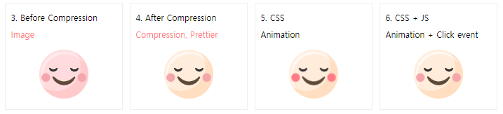
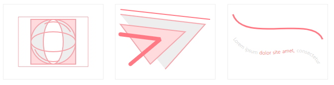
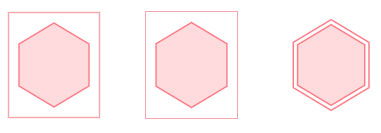
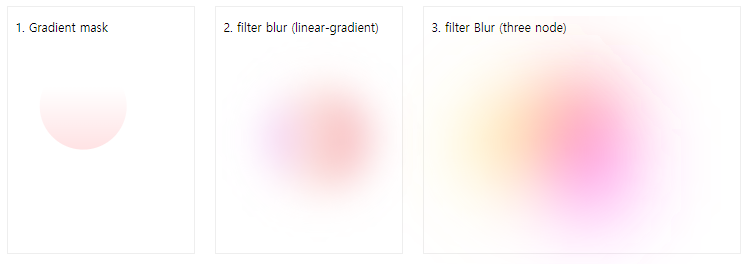
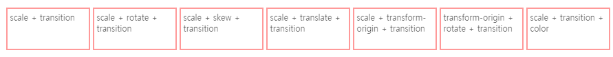
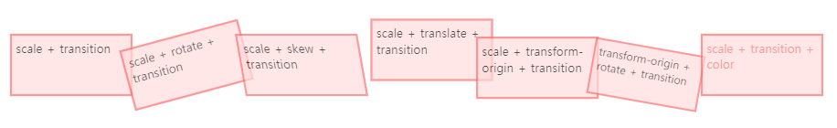
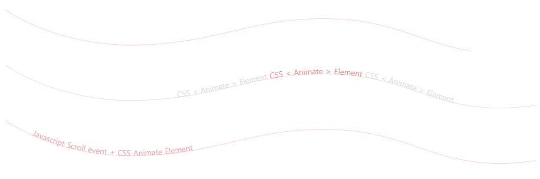
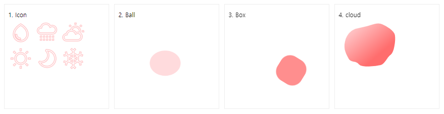

안녕하세요!  
SVG 기본 베이직부터 애니메이션을 간단히 정리하였습니다.  
> (IE 브라우저는 지원하지 않는 요소가 있습니다.)

기본 svg만 작성하였습니다.  
<u>scss는 조금 다듬어서 작성할 예정 입니다.</u>

<hr/>

## SVG Tutorials

### Basic


1. You can put 'style' and 'script' in svg, or you can subtract it separately.

2. Add '<![CDATA]>' when an error occurs in the xml parser when putting in svg.



3. Before Compression
```html
<svg class="svg1" viewBox="0 0 170.47 170.47">
  <defs>
    <style>
      .cls-1{fill:#ffdbdd;}
      .cls-2{fill:#ffcacc;}
      .cls-3{fill:#ffebec;}
      .cls-4{fill:#5e4939;}
      .cls-5{fill:#303030;}
      .cls-6{fill:#f5a6ac;}
    </style>
  </defs>
  <g>
    <g id="Object">
      <circle class="cls-1" cx="85.24" cy="85.24" r="85.24" transform="translate(-35.31 85.24) rotate(-45)"/>
      <path class="cls-2" d="M129.83,12.49A85.25,85.25,0,0,1,13.41,131.05,85.24,85.24,0,1,0,129.83,12.49Z"/>
      <path class="cls-3" d="M11.58,94.23A79.13,79.13,0,0,1,153.45,46,79.14,79.14,0,1,0,22.1,133.67,78.75,78.75,0,0,1,11.58,94.23Z"/>
      <path class="cls-4" d="M50.3,94a2.82,2.82,0,0,0-4.58,3.07,42.72,42.72,0,0,0,79,.78,2.81,2.81,0,0,0-4.54-3.1C107.72,106.87,81.24,124.08,50.3,94Z"/>
      <path class="cls-5" d="M107.24,66.59a15.8,15.8,0,0,0,29.21.29,2.54,2.54,0,0,0-4.11-2.81c-4.73,4.59-12.2,8.27-21-.25a2.55,2.55,0,0,0-1.77-.73,2.58,2.58,0,0,0-1.42.44A2.53,2.53,0,0,0,107.24,66.59Z"/>
      <path class="cls-5" d="M34,66.59a15.79,15.79,0,0,0,29.2.29,2.54,2.54,0,0,0-4.1-2.81c-4.73,4.59-12.21,8.27-21-.25a2.55,2.55,0,0,0-1.77-.73,2.58,2.58,0,0,0-1.42.44A2.52,2.52,0,0,0,34,66.59Z"/>
      <circle class="cls-6" cx="22.57" cy="97.1" r="14.88"/>
      <circle class="cls-6" cx="147.9" cy="97.1" r="14.88"/>
    </g>
  </g>
</svg>
```


4. After Compression
```html
<svg class="svg1" viewBox="0 0 170.47 170.47">
  <defs>
    <style>
      .cls-5{fill:#303030}
      .cls-6{fill:#f5a6ac}
    </style>
  </defs>
  <g>
    <g id="Object">
      <circle cx="85.24" cy="85.24" r="85.24" transform="rotate(-45 85.239 85.243)" fill="#ffecdb"/>
      <path d="M129.83 12.49A85.25 85.25 0 0113.41 131.05 85.24 85.24 0 10129.83 12.49z" fill="#ffdec1"/>
      <path d="M11.58 94.23A79.13 79.13 0 01153.45 46 79.14 79.14 0 1022.1 133.67a78.75 78.75 0 01-10.52-39.44z" fill="#fff8f2"/>
      <path d="M50.3 94a2.82 2.82 0 00-4.58 3.07 42.72 42.72 0 0079 .78 2.81 2.81 0 00-4.54-3.1c-12.46 12.12-38.94 29.33-69.88-.75z" fill="#5e4939"/>
      <path class="cls-5" d="M107.24 66.59a15.8 15.8 0 0029.21.29 2.54 2.54 0 00-4.11-2.81c-4.73 4.59-12.2 8.27-21-.25a2.55 2.55 0 00-1.77-.73 2.58 2.58 0 00-1.42.44 2.53 2.53 0 00-.91 3.06zM34 66.59a15.79 15.79 0 0029.2.29 2.54 2.54 0 00-4.1-2.81c-4.73 4.59-12.21 8.27-21-.25a2.55 2.55 0 00-1.77-.73 2.58 2.58 0 00-1.42.44 2.52 2.52 0 00-.91 3.06z"/>
      <circle class="cls-6" cx="22.57" cy="97.1" r="14.88"/>
      <circle class="cls-6" cx="147.9" cy="97.1" r="14.88"/>
    </g>
  </g>
</svg>
```

5. CSS animation
```html
<svg class="svg1 svg-ani" viewBox="0 0 170.47 170.47">
  <defs>
    <style>
      .cls-5{fill:#303030}
      .cls-6{fill:#f5a6ac}
      .svg-ani .cls-6 {
        animation: ani 1s infinite alternate;
        transform-origin: 50% 50%;
      }
      @keyframes ani {
        0% {transform: scale(0.9);}
        100% {transform: scale(1); fill: #ff7a85;}
      }
    </style>
  </defs>
  <g>
    <g id="Object">
      <circle cx="85.24" cy="85.24" r="85.24" transform="rotate(-45 85.239 85.243)" fill="#ffecdb"/>
      <path d="M129.83 12.49A85.25 85.25 0 0113.41 131.05 85.24 85.24 0 10129.83 12.49z" fill="#ffdec1"/>
      <path d="M11.58 94.23A79.13 79.13 0 01153.45 46 79.14 79.14 0 1022.1 133.67a78.75 78.75 0 01-10.52-39.44z" fill="#fff8f2"/>
      <path d="M50.3 94a2.82 2.82 0 00-4.58 3.07 42.72 42.72 0 0079 .78 2.81 2.81 0 00-4.54-3.1c-12.46 12.12-38.94 29.33-69.88-.75z" fill="#5e4939"/>
      <path class="cls-5" d="M107.24 66.59a15.8 15.8 0 0029.21.29 2.54 2.54 0 00-4.11-2.81c-4.73 4.59-12.2 8.27-21-.25a2.55 2.55 0 00-1.77-.73 2.58 2.58 0 00-1.42.44 2.53 2.53 0 00-.91 3.06zM34 66.59a15.79 15.79 0 0029.2.29 2.54 2.54 0 00-4.1-2.81c-4.73 4.59-12.21 8.27-21-.25a2.55 2.55 0 00-1.77-.73 2.58 2.58 0 00-1.42.44 2.52 2.52 0 00-.91 3.06z"/>
      <circle class="cls-6" cx="22.57" cy="97.1" r="14.88"/>
      <circle class="cls-6" cx="147.9" cy="97.1" r="14.88"/>
    </g>
  </g>
</svg>
```

6. CSS + JS (Animation + Click event)
```html
<svg class="svg1 svg-ani-js" viewBox="0 0 170.47 170.47">
  <defs>
    <style>
      .cls-5{fill:#303030}
      .cls-6{fill:#f5a6ac}
      .svg-ani-js { cursor: pointer;}
      .ani-on .cls-6 {
        animation: ani 1s infinite alternate;
        transform-origin: 50% 50%;
      }
      @keyframes ani {
        0% {transform: scale(0.9);}
        100% {transform: scale(1); fill: #ff7a85;}
      }
    </style>
    <script>
      const El = document.querySelector('.svg-ani-js');
      El.addEventListener('click', function () {
        this.classList.toggle('ani-on');
      });
    </script>
  </defs>
  <g>
    <g id="Object">
      <circle cx="85.24" cy="85.24" r="85.24" transform="rotate(-45 85.239 85.243)" fill="#ffecdb"/>
      <path d="M129.83 12.49A85.25 85.25 0 0113.41 131.05 85.24 85.24 0 10129.83 12.49z" fill="#ffdec1"/>
      <path d="M11.58 94.23A79.13 79.13 0 01153.45 46 79.14 79.14 0 1022.1 133.67a78.75 78.75 0 01-10.52-39.44z" fill="#fff8f2"/>
      <path d="M50.3 94a2.82 2.82 0 00-4.58 3.07 42.72 42.72 0 0079 .78 2.81 2.81 0 00-4.54-3.1c-12.46 12.12-38.94 29.33-69.88-.75z" fill="#5e4939"/>
      <path class="cls-5" d="M107.24 66.59a15.8 15.8 0 0029.21.29 2.54 2.54 0 00-4.11-2.81c-4.73 4.59-12.2 8.27-21-.25a2.55 2.55 0 00-1.77-.73 2.58 2.58 0 00-1.42.44 2.53 2.53 0 00-.91 3.06zM34 66.59a15.79 15.79 0 0029.2.29 2.54 2.54 0 00-4.1-2.81c-4.73 4.59-12.21 8.27-21-.25a2.55 2.55 0 00-1.77-.73 2.58 2.58 0 00-1.42.44 2.52 2.52 0 00-.91 3.06z"/>
      <circle class="cls-6" cx="22.57" cy="97.1" r="14.88"/>
      <circle class="cls-6" cx="147.9" cy="97.1" r="14.88"/>
    </g>
  </g>
</svg>
```

<hr/>

### Shape(Basic)


1. Rectangle, Square, Circle, Ellipase
```html
<svg>
  <rect x="55" y="30" width="90" height="90" fill="#ffdbdd" stroke="#f5a6ac" stroke-width="2"></rect>
  <rect x="30" y="25" width="140" height="100" stroke-dasharray="1" fill="none" stroke="#f5a6ac" stroke-width="2"></rect>
  <circle cx="100" cy="75" r="45" fill="#eee" stroke="#f5a6ac" stroke-width="2"></circle>
  <ellipse cx="100" cy="75" rx="20" ry="45" fill="white" stroke="#f5a6ac" stroke-width="2"></ellipse>
  <ellipse cx="100" cy="75" rx="45" ry="20" fill="none" stroke="#f5a6ac" stroke-width="2"></ellipse>
  <circle cx="100" cy="75" r="40" stroke-dashoffset="70" stroke-dasharray="60" fill="none" stroke="#f5a6ac" stroke-width="2"></circle>
</svg>
```

2. Line, Ployline(round, bevel), Polygon
```html
<svg>
  <line x1="10" x2="190" y1="10" y2="30" stroke="#ff7a85" stroke-width="2"></line>
  <polyline points="10 20, 180 40, 100 130" stroke="#f5a6ac" stroke-width="2" fill="#eee"></polyline>
  <polygon points="10 40, 140 55, 70 120" stroke="#f5a6ac" stroke-width="2" fill="#ffdbdd"></polygon>
  <polyline points="10 60, 90 70, 30 120" stroke-linecap="round" stroke-linejoin="bevel" stroke="#ff7a85" stroke-width="8" fill="none"></polyline>
</svg>
```

3. Curve, textPath, tspan
```html
<svg class="curve">
  <style>
    tspan {fill: #ff7a85;}
  </style>
  <path d="M 10 20 C 30 80, 170 20, 190 70" stroke="#ff7a85" stroke-width="3" fill="none"></path>
  <defs>
    <path id="ct" d="M 10 70 C 60 140, 150 60, 180 120" stroke="#ff7a85" stroke-width="3" fill="none"></path>
  </defs>
  <text>
    <textPath href="#ct" fill="#ddd" font-size="10">
      Lorem ipsum <tspan>dolor site amet,</tspan> consectetur adipisicing elit. Sapiente, ratione incidunt quas cum hic ea doloribus sunt quasi maxime sint. Placeat tenetur ab dicta labore enim at eveniet dolores? Est.
    </textPath>
  </text>
</svg>
```

<hr/>

### Shape(Double border)



1. Outline
```html
<svg width="100" height="140" viewBox="-10 0 10 100" class="css-outline">
  <polygon id="bs1" class="css-outline-polygon" overflow="visible" points="-5 20, 20 35, 20 65, -5 80, -30 65, -30 35z" fill="#ffdbdd" stroke="#ff7a85" />
</svg>
```

2. Box-shadow
```html
<svg width="85" height="100" viewBox="45 40 60 20" overflow="visible" class="css-boxshadow">
  <polygon id="bs2" class="css-boxshadow" overflow="visible" points="75 20, 50 35, 50 65, 75 80, 100 65, 100 35z" fill="#ffdbdd" stroke="#ff7a85" />
</svg>
```

3. Re Use
```html
<svg width="100" height="100" viewBox="-45 15 70 70" overflow="visible" class="reuse">
  <defs>
    <polygon id="polygon" points="-5 20, 20 35, 20 65, -5 80, -30 65, -30 35z" />
  </defs>
  <g>
    <use href="#polygon" fill="#ffdbdd" stroke="#ff7a85" stroke-width="4" />
    <use href="#polygon" fill="none" stroke="#fff" stroke-width="2" />
  </g>
</svg>
```

<hr/>

### Effect(Filter, Gradient, Mask)



1. Gradient mask
```html
<svg viewBox="3 3 43 40" class="clip-mask">
  <linearGradient id="gradient" x2="0" y2="1">
    <stop offset="0%" stop-color="black"/>
    <stop offset="100%" stop-color="white"/>
  </linearGradient>
  <mask id="mask">
    <rect x="0" y="15" width="100" height="20" fill="url(#gradient)" />
  </mask>
  <circle cx="20" cy="20" r="11" fill="#ffdbdd" mask="url(#mask)" />	
</svg>
```

2. filter blur (linear-gradient)
```html
<svg style="position: absolute; width: 0; height: 0;">
  <filter id="goo">
    <feGaussianBlur in="SourceGraphic" stdDeviation="20" />
  </filter>
</svg>
<div class="hooks-main1">
  <div></div>
</div>
```

3. filter Blur (three node)
```html
<svg style="position: absolute; width: 0; height: 0;">
  <filter id="goo2">
    <feGaussianBlur in="SourceGraphic" stdDeviation="40" />
  </filter>
</svg>
<div class="hooks-main2">
  <div></div>
  <div></div>
  <div></div>
</div>
```

<hr/>

### Transform(Hover)





```html
<ul>
  <li class="scale">scale + transition</li>
  <li class="rotate">scale + rotate + transition</li>
  <li class="skew">scale + skew + transition</li>
  <li class="translate">scale + translate + transition</li>
  <li class="transform-origin">scale + transform-origin + transition</li>
  <li class="transform-origin-rotate">transform-origin + rotate + transition</li>
  <li class="color">scale + transition + color</li>
</ul>
```

<hr/>

### Animation (Path, Scroll event)



1. Path
```html
<svg width="100%" height="90px" viewBox="0 0 1098.72 89.55">
  <style>
    .move-stroke {
      stroke: #ffcacc;
      stroke-width: 1px;
      stroke-linejoin: round;
      stroke-linecap: round;
      stroke-dasharray: 1200;
      stroke-dashoffset: 1200;
      animation-name: move-line;
      animation-duration: 5s;
      animation-iteration-count: infinite;
    }
    @keyframes move-line {
      0%   { stroke-dashoffset: 1200; }
      50%   { stroke-dashoffset: 0; }
      100% { stroke-dashoffset: 1200; }
    }
  </style>
  <path class="move-stroke" fill="transparent" stroke="#000" d="M0.17,0.23c0,0,105.85,77.7,276.46,73.2s243.8-61.37,408.77-54.05c172.09,7.64,213.4,92.34,413.28,64.19"></path>
</svg>
```

2. Path to Text animation
```html
<svg width="100%" height="90px" viewBox="0 0 1098.72 89.55">
  <path id="textMove" fill="transparent" stroke="#ddd" d="M0.17,0.23c0,0,105.85,77.7,276.46,73.2s243.8-61.37,408.77-54.05c172.09,7.64,213.4,92.34,413.28,64.19"></path>
  <defs>
    <path id="textMove" fill="transparent" stroke="#ddd" d="M0.17,0.23c0,0,105.85,77.7,276.46,73.2s243.8-61.37,408.77-54.05c172.09,7.64,213.4,92.34,413.28,64.19"></path>
  </defs>
  <text>
    <textPath href="#textMove" fill="#ddd" font-size="16">
      CSS < Animate > Element <tspan>CSS < Animate > Element</tspan> CSS < Animate > Element.
      <animate
        attributeName="startOffset"
        from="0%" to="100%"
        begin="0s" dur="6s"
        repeatCount="indefinite"
        keyTimes="0;1"
        calcMode="spline"
        keySplines="0.5 0.1 .22 0.5"/>
    </textPath>
  </text>
</svg>
```

3. Scroll event
```html
<svg width="100%" height="90px" viewBox="0 0 1098.72 89.55">
  <path id="curves" fill="transparent" stroke="#ffcacc" d="M0.17,0.23c0,0,105.85,77.7,276.46,73.2s243.8-61.37,408.77-54.05c172.09,7.64,213.4,92.34,413.28,64.19"></path>
  <text>
      <textPath
        xlink:href="#curves"
        alignment-baseline="top"
        startOffset="1200px"
        fill="#f5a6ac"
        id="text-path"
      >Javascript Scroll event + CSS Animate Element</textPath>
  </text>
</svg>
```

<hr/>

### Animation (Shape)

1. How to position : position or translate

2. Animate : color, transform(scale, rotate), translate, ,from/to(position) stroke, path shape, Gradient



1. Icon
```html
<svg x="0px" y="0px" width="48px" height="48px" viewBox="0 0 32 32" >
  <style>
    .icon-stroke {
      fill: none;
      stroke: #ffcacc;
      stroke-width: 1px;
      stroke-dasharray: 1000;
      stroke-dashoffset: 1000;
      animation: icon-line 5s infinite alternate;
    }
    @keyframes icon-line {
      0%   {stroke-dashoffset: 1000; }
      50%  {stroke-dashoffset:    0; }
      100% {stroke-dashoffset: 1000; }
  }
</style>
  <path class="icon-stroke" d="M16,23v2c-3.86,0-7-3.14-7-7h2C11,20.757,13.243,23,16,23z M26,18c0,5.523-4.477,10-10,10  S6,23.523,6,18C6,9.031,16,4,16,4S26,9.031,26,18z M24,18c0-6.169-5.733-10.304-7.996-11.695C13.742,7.704,8,11.862,8,18  c0,4.411,3.589,8,8,8S24,22.411,24,18z" />
</svg>
<svg x="0px" y="0px" viewBox="0 0 32 32" >
  <path class="icon-stroke" d="M23,6c-0.753,0-1.501,0.148-2.207,0.432C19.424,4.319,17.052,3,14.5,3  c-3.235,0-6.043,2.034-7.079,5.033C4.936,8.321,3,10.439,3,13c0,2.757,2.243,5,5,5h15c3.309,0,6-2.691,6-6S26.309,6,23,6z M23,16H8  c-1.654,0-3-1.346-3-3s1.346-3,2.956-3.001l1.006,0.052L9.15,9.245C9.734,6.746,11.934,5,14.5,5c2.123,0,4.078,1.248,4.979,3.179  l0.476,1.018l0.956-0.59C21.563,8.204,22.266,8,23,8c2.206,0,4,1.794,4,4S25.206,16,23,16z M7,20h2v2H7V20z M7,24h2v2H7V24z M11,20  h2v2h-2V20z M11,24h2v2h-2V24z M15,20h2v2h-2V20z M15,24h2v2h-2V24z M19,20h2v2h-2V20z M19,24h2v2h-2V24z M23,20h2v2h-2V20z M23,24  h2v2h-2V24z" />
</svg>
<svg y="0px" viewBox="0 0 32 32" xml:space="preserve">
  <path class="icon-stroke" d="M25.623,16.228C25.861,15.527,26,14.781,26,14c0-3.86-3.14-7-7-7   c-3.202,0-5.904,2.163-6.733,5.103c-2.7,0.443-4.945,2.319-5.847,4.93C3.936,17.321,2,19.439,2,22c0,2.757,2.243,5,5,5h15   c3.309,0,6-2.691,6-6C28,19.053,27.064,17.325,25.623,16.228z M19,9c2.757,0,5,2.243,5,5c0,0.446-0.068,0.874-0.18,1.284   C23.246,15.101,22.635,15,22,15c-0.753,0-1.501,0.148-2.207,0.432c-1.205-1.859-3.187-3.102-5.385-3.374   C15.168,10.266,16.934,9,19,9z M22,25H7c-1.654,0-3-1.346-3-3s1.346-3,2.956-3.001l1.006,0.052l0.188-0.806   C8.734,15.746,10.934,14,13.5,14c2.123,0,4.078,1.248,4.979,3.179l0.476,1.018l0.956-0.59C20.563,17.204,21.266,17,22,17   c2.206,0,4,1.794,4,4S24.206,25,22,25z M20,5h-2V3h2V5z M30,13v2h-2v-2H30z M26.071,8.343l-1.414-1.414l1.414-1.414l1.414,1.414   L26.071,8.343z M11.929,8.343l-1.414-1.414l1.414-1.414l1.414,1.414L11.929,8.343z" />
</svg>
<br/>
<svg x="0px" y="0px" viewBox="0 0 32 32" xml:space="preserve">
  <path class="icon-stroke" d="M16,8c-4.411,0-8,3.589-8,8s3.589,8,8,8s8-3.589,8-8S20.411,8,16,8z M16,22  c-3.309,0-6-2.691-6-6s2.691-6,6-6s6,2.691,6,6S19.309,22,16,22z M15,26h2v3h-2V26z M17,6h-2V3h2V6z M29,15v2h-3v-2H29z M3,15h3v2H3  V15z M23.778,22.364l2.121,2.121l-1.414,1.414l-2.121-2.121L23.778,22.364z M8.222,9.636L6.101,7.515L7.515,6.1l2.121,2.121  L8.222,9.636z M24.485,6.1l1.414,1.414l-2.121,2.121l-1.414-1.414L24.485,6.1z M8.222,22.364l1.414,1.414l-2.121,2.121l-1.414-1.414  L8.222,22.364z" />
</svg>
<svg x="0px" y="0px" viewBox="0 0 32 32" xml:space="preserve">
  <path class="icon-stroke" d="M27.577,12.912c-1.401-5.23-6.164-8.884-11.58-8.884c-0.48,0-0.966,0.029-1.442,0.087  L14.004,5.85c1.146,1.037,1.963,2.37,2.361,3.854c1.142,4.261-1.396,8.657-5.657,9.798c-1.482,0.398-3.052,0.357-4.518-0.118  l-1.228,1.344c1.888,4.429,6.214,7.291,11.021,7.291h0.001c1.043,0,2.089-0.138,3.106-0.411c3.096-0.83,5.684-2.815,7.286-5.591  C27.981,19.242,28.407,16.008,27.577,12.912z M24.646,21.018c-1.336,2.313-3.492,3.968-6.072,4.659  c-0.849,0.228-1.72,0.343-2.589,0.343h-0.001c-3.312,0-6.35-1.631-8.191-4.282c1.15,0.101,2.313-0.002,3.433-0.303  c5.326-1.427,8.498-6.921,7.071-12.248c-0.301-1.125-0.794-2.178-1.453-3.123c4.155,0.353,7.707,3.282,8.802,7.365  C26.337,16.01,25.981,18.705,24.646,21.018z" />
</svg>
<svg x="0px" y="0px" viewBox="0 0 32 32" xml:space="preserve">
  <path class="icon-stroke" d="M28.099,19.043l-3.297,0.883l-1.873-1.082l0.002-5.692l1.872-1.081l3.297,0.883l0.518-1.932  l-2.732-0.732l0.732-2.732l-1.932-0.518l-0.883,3.297l-1.873,1.082L17,8.576V6.414L19.414,4L18,2.586l-2,2l-2-2L12.586,4L15,6.414  v2.162l-4.928,2.846l-1.873-1.082L7.315,7.043L5.383,7.561l0.732,2.732l-2.732,0.732l0.518,1.932l3.297-0.883l1.874,1.082v5.69  l-1.874,1.082l-3.297-0.883l-0.518,1.932l2.732,0.732l-0.732,2.732l1.932,0.518l0.883-3.297l1.873-1.082L15,23.424v2.162L12.586,28  L14,29.414l2-2l2,2L19.414,28L17,25.586v-2.162l4.928-2.846l1.873,1.082l0.883,3.297l1.932-0.518l-0.732-2.732l2.732-0.732  L28.099,19.043z M20.929,17.691L18,16l2.93-1.691L20.929,17.691z M19.928,12.577L17,14.268v-3.382L19.928,12.577z M15,10.886v3.382  l-2.928-1.691L15,10.886z M11.072,14.31L14,16l-2.928,1.69V14.31z M12.072,19.423L15,17.732v3.382L12.072,19.423z M17,21.114v-3.382  l2.928,1.691L17,21.114z" />
</svg>
```

2. Ball
```html
<svg class="ball" viewBox="0 0 100 100">
  <circle cx="50" cy="50" r="25" fill="#ffdbdd"></circle>
</svg>
```

3. Box
```html
<div class="color"></div>
```

4. Cloud
```html
<div class="wrapper">
  <svg viewBox="-40 -20 700 350" x="0px" y="0px">
    <linearGradient id="morphing" x1="70%" x2="0%" y1="70%" y2="0%">
      <stop offset="0%"   stop-color="#ff6d6d" stop-opacity="1"></stop>
      <stop offset="100%" stop-color="#ffdbdd" stop-opacity="1"></stop>
    </linearGradient>
    <path fill="url(#morphing)">
      <animate  repeatCount="indefinite" attributeName="d" dur="5s"
        values="M357.665 98.604C350.465 67.404 310.999 20.7705 281.665 9.60387C245.69 -6.89613 172.665 1.10406 147.165 9.60406C121.665 18.1041 102.665 52.6042 81.6653 60.1042C60.6653 67.6042 18.6653 73.6042 5.16533 132.604C-8.33467 191.604 6.60713 236.579 27.1652 263.104C42.6656 283.104 92.8471 267.215 124.165 282.104C154.665 296.604 174.768 318.143 251.164 303.104C314.664 290.604 299.165 224.104 324.165 197.604C342.119 178.573 366.665 137.604 357.665 98.604Z;

        M372 78.5C364.8 47.3 304.333 17.1666 275 5.99996C239.025 -10.5 204.5 14 179 22.5C153.5 31 99 24.5 78 32C57 39.5 17 73 3.50005 132C-9.99995 191 19 227 33 257.5C47 288 84.5 273 99 304.5C113.5 336 249.5 310 268.5 304.5C287.5 299 319 251 342.5 239.5C366 228 381 117.5 372 78.5Z;
        
        M357.665 98.604C350.465 67.404 310.999 20.7705 281.665 9.60387C245.69 -6.89613 172.665 1.10406 147.165 9.60406C121.665 18.1041 102.665 52.6042 81.6653 60.1042C60.6653 67.6042 18.6653 73.6042 5.16533 132.604C-8.33467 191.604 6.60713 236.579 27.1652 263.104C42.6656 283.104 92.8471 267.215 124.165 282.104C154.665 296.604 174.768 318.143 251.164 303.104C314.664 290.604 299.165 224.104 324.165 197.604C342.119 178.573 366.665 137.604 357.665 98.604Z
        "/>
    </path>
  </svg>
</div>
```

<hr/>

## 전체보기

이곳에서 전체 내용을 확인하실 수 있습니다.

https://fe-w.github.io/svg-basic/