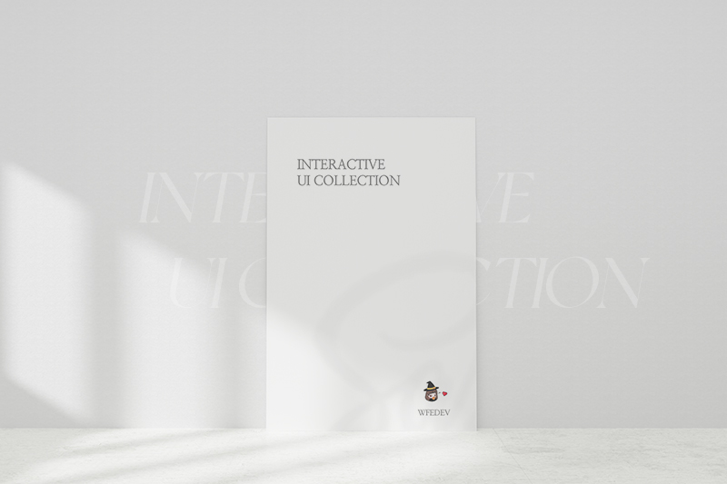

***

## 🎁 Interactive UI collection

[1] Using
- HTML5, SCSS, Vanila JavaScript

[2] Library (css, js)
- o : GSAP, Swiper, Splitting
- x : Bootstrap, Jquery

[3] Just UI prototype only
- Fixed viewport
- Responsive not working
- I hate IE 🙅

***

***

### [🌸 Flower](https://github.com/gr-p/interaction/tree/main/ui/1-10/2-Flower)

https://user-images.githubusercontent.com/54713067/103440171-c3d86700-4c86-11eb-8b40-f911175b64a1.mp4

### [♨️ Humidifier](https://github.com/gr-p/interaction/tree/main/ui/1-10/1-1-Humidifier)

https://user-images.githubusercontent.com/54713067/103440206-0c902000-4c87-11eb-9fbc-7ad136474df5.mp4

<!-- ### [☕ Tea](https://github.com/gr-p/interaction/tree/main/ui/1-10/1-Tea)

 -->

### [❄️ Snow](https://github.com/gr-p/interaction/tree/main/ui/1-10/6-Snow)

https://user-images.githubusercontent.com/54713067/103440229-347f8380-4c87-11eb-9ad3-7642ce1988e5.mp4

### [☁️ Cloud](https://github.com/gr-p/interaction/tree/main/ui/1-10/4-Cloud)

https://user-images.githubusercontent.com/54713067/103440267-5973f680-4c87-11eb-9996-c2d821baed7c.mp4

### 🥗 Salad
- [Original Code](https://github.com/gr-p/interaction/tree/main/ui/1-10/3-1-Salad)  
- [Let's learn how to make this example!](https://diary-blog.github.io/salad-carousel-slide/)

https://user-images.githubusercontent.com/54713067/103440293-950ec080-4c87-11eb-810b-46f44e1c2137.mp4

<!-- ### [🍬 Candy](https://github.com/gr-p/interaction/tree/main/ui/1-10/3-Candy)
 -->

### [🎨 Pantone](https://github.com/gr-p/interaction/tree/main/ui/1-10/7-Pantone)

https://user-images.githubusercontent.com/54713067/103440371-372ea880-4c88-11eb-94f6-c55595834e1b.mp4

### [🧨 Firework](https://github.com/gr-p/interaction/tree/main/ui/1-10/9-Firework)

https://user-images.githubusercontent.com/54713067/103954911-8729d580-5188-11eb-98ea-bd1dd7dcae79.mp4

### [📇 Sliding Card](https://github.com/gr-p/interaction/tree/main/ui/1-10/8-Sliding-card)

https://user-images.githubusercontent.com/54713067/103440141-88d63380-4c86-11eb-9f8e-397c3cd1cb88.mp4

### [🚗 Car parallax](https://github.com/gr-p/interaction/tree/main/ui/1-10/5-1-Car-parallax)

https://user-images.githubusercontent.com/54713067/103440090-30069b00-4c86-11eb-82fe-5d01cb2b168a.mp4

<!-- ### [🍦 Icecream](https://github.com/gr-p/interaction/tree/main/ui/1-10/5-Icecream)
 -->

### ✉️ Envelope
- [Original Code](https://github.com/gr-p/interaction/tree/main/ui/1-10/10-Envelope)  

https://user-images.githubusercontent.com/54713067/103439103-891e0100-4c7d-11eb-941f-2e7ada8fb264.mp4

### ✨ Glow light
- [Original Code](https://github.com/gr-p/interaction/tree/main/ui/11-20/12-Glow-light)  
- [Let's learn how to make this example!](https://diary-blog.github.io/glow-light/)

https://user-images.githubusercontent.com/54713067/103955168-133bfd00-5189-11eb-9652-2537fae6fee6.mp4

### [🔥 Hover & Spinner](https://github.com/gr-p/interaction/tree/main/ui/11-20/11-Spinner-effect)

https://user-images.githubusercontent.com/54713067/103955229-31096200-5189-11eb-9eda-cb285894d8b7.mp4

### [➡️ Text cross](https://github.com/gr-p/interaction/tree/main/ui/11-20/13-text-cross)

https://user-images.githubusercontent.com/54713067/103955302-54341180-5189-11eb-94a1-a0001de5922c.mp4

### [🎨 Color Mix blend](https://github.com/gr-p/interaction/tree/main/ui/11-20/14-Diagonal)

https://user-images.githubusercontent.com/54713067/103955419-91989f00-5189-11eb-882a-c6f71f0b6392.mp4

### [🌼 Flower cursor](https://github.com/gr-p/interaction/tree/main/ui/11-20/15-Flower-cursor)

https://user-images.githubusercontent.com/54713067/103955556-e2a89300-5189-11eb-893b-31b48b8252d4.mp4

### [📑 Signup](https://github.com/gr-p/interaction/tree/main/ui/11-20/16-Signup)

https://user-images.githubusercontent.com/54713067/103447496-687e9700-4ccf-11eb-9a98-1ee87ee68726.mp4

### [🎁 Cosmetics](https://github.com/gr-p/interaction/tree/main/ui/11-20/17-Cosmetics)

https://user-images.githubusercontent.com/54713067/103468484-caf19900-4d9c-11eb-8abb-e3dec221436d.mp4

### [◻️ Text Typing](https://github.com/gr-p/interaction/tree/main/ui/11-20/18-Typing)

https://user-images.githubusercontent.com/54713067/103489970-f091a780-4e5b-11eb-8750-75b44d3a7905.mp4

### [🌊 Water](https://github.com/gr-p/interaction/tree/main/ui/11-20/19-Water)

https://user-images.githubusercontent.com/54713067/103493966-cbab2d80-4e77-11eb-88aa-1f9336212626.mp4

***

**If these project were useful, please star★ this repo!**

<u>*https://github.com/gr-p/interaction*</u>

